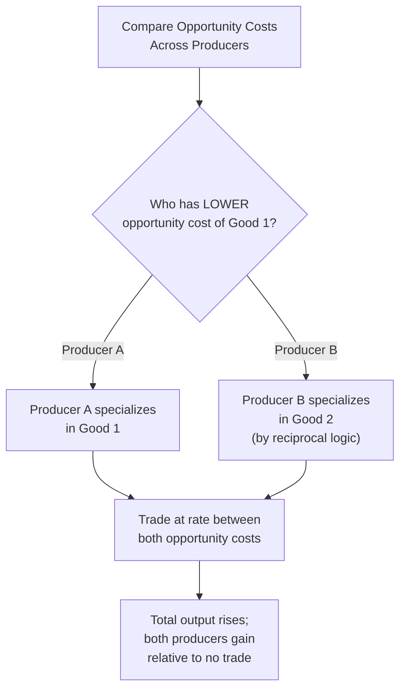

## Absolute and Comparative Advantage

### Definition and Scope

Absolute and comparative advantage are the two foundational concepts explaining why individuals, firms, and nations specialize in producing certain goods and engage in trade rather than attempting to produce everything they consume. These concepts extend the opportunity-cost logic of the Production Possibilities Frontier to a multi-producer setting, explaining the conditions under which specialization and exchange generate mutual gains.

- **Absolute advantage**: The ability to produce a good using fewer resources (or produce more output from the same resources) than another producer.
- **Comparative advantage**: The ability to produce a good at a *lower opportunity cost* than another producer.

The distinction between these two concepts — first rigorously articulated by David Ricardo in the early 19th century, building on Adam Smith's earlier concept of absolute advantage — is one of the most important and counterintuitive results in economics: gains from trade can arise even when one party is *worse* at producing everything.

### Absolute Advantage

**Definition**: A producer (individual, firm, or nation) has an absolute advantage in producing a good if it can produce that good using fewer inputs, or produce a greater quantity of output from the same inputs, than another producer.

**Illustrative example**: Consider two countries, each able to allocate a fixed amount of labor (say, 10 hours) to producing either wheat or cloth.

| Country | Wheat (units/hour) | Cloth (units/hour) |
| --- | --- | --- |
| Country X | 4 | 2 |
| Country Y | 1 | 1 |

Country X can produce more wheat *and* more cloth per hour than Country Y. Country X therefore has an **absolute advantage** in both goods.

**Limitation of absolute advantage as a trade rationale**: Adam Smith's original insight — that trade is beneficial when each party has an absolute advantage in a different good — cannot explain why trade would still be mutually beneficial in the scenario above, where Country X is absolutely more productive at everything. This limitation motivated the development of comparative advantage.

### Comparative Advantage

**Definition**: A producer has a comparative advantage in producing a good if it can produce that good at a lower opportunity cost (in terms of the other good forgone) than another producer, regardless of whether it holds an absolute advantage.

**Calculating opportunity cost from the example above**:

For Country X:

$$\text{OC of 1 unit Wheat} = \frac{2 \text{ Cloth}}{4 \text{ Wheat}} = 0.5 \text{ Cloth}$$

$$\text{OC of 1 unit Cloth} = \frac{4 \text{ Wheat}}{2 \text{ Cloth}} = 2 \text{ Wheat}$$

For Country Y:

$$\text{OC of 1 unit Wheat} = \frac{1 \text{ Cloth}}{1 \text{ Wheat}} = 1 \text{ Cloth}$$

$$\text{OC of 1 unit Cloth} = \frac{1 \text{ Wheat}}{1 \text{ Cloth}} = 1 \text{ Wheat}$$

|  | Opportunity Cost of 1 Wheat | Opportunity Cost of 1 Cloth |
| --- | --- | --- |
| Country X | 0.5 Cloth | 2 Wheat |
| Country Y | 1 Cloth | 1 Wheat |

**Interpretation**: Country X has the *lower* opportunity cost of producing wheat (0.5 Cloth vs. 1 Cloth), so Country X has a **comparative advantage in wheat**. Country Y has the *lower* opportunity cost of producing cloth (1 Wheat vs. 2 Wheat), so Country Y has a **comparative advantage in cloth** — despite having an absolute disadvantage in both goods.

**Key principle**: Comparative advantage is always relative and mutually exclusive between two producers and two goods — it is logically impossible for one producer to hold the comparative advantage in *both* goods simultaneously, because opportunity costs are reciprocals of each other. If Country X's opportunity cost of wheat is lower, Country Y's opportunity cost of cloth must necessarily be lower.

### Gains from Trade and Specialization

**The principle**: Total output — and the consumption possibilities available to both parties — increases when each producer specializes in the good in which it holds a comparative advantage and trades for the other good, even if one producer has an absolute advantage in everything.

**Demonstrating the gain — before specialization** (each country splits its 10 labor-hours evenly):

| Country | Wheat Produced | Cloth Produced |
| --- | --- | --- |
| Country X | 20 (5 hrs × 4) | 10 (5 hrs × 2) |
| Country Y | 5 (5 hrs × 1) | 5 (5 hrs × 1) |
| **Total** | **25** | **15** |

**After full specialization** (Country X produces only wheat; Country Y produces only cloth):

| Country | Wheat Produced | Cloth Produced |
| --- | --- | --- |
| Country X | 40 (10 hrs × 4) | 0 |
| Country Y | 0 | 10 (10 hrs × 1) |
| **Total** | **40** | **10** |

At first glance total cloth fell (15 → 10), but this is because Country Y alone cannot match prior combined cloth output; the relevant comparison is what becomes available *after trade* at a mutually acceptable exchange rate between the two countries' opportunity costs (between 0.5 and 1 Cloth per Wheat). At an agreed trade rate — for example, 1 Wheat for 0.75 Cloth — both countries can end up with more of *both* goods than they had under the no-trade, evenly-split allocation, illustrating the gains from specialization and trade. [Inference: the exact post-trade allocation depends on the negotiated terms of trade, which fall somewhere between the two countries' respective opportunity cost ratios; the specific split is not determined by the comparative advantage principle itself.]

**Terms of trade**: For trade to be mutually beneficial, the agreed exchange rate between the two goods must lie *between* the two producers' opportunity costs. In the example, any exchange rate between 0.5 and 1 unit of Cloth per unit of Wheat makes both countries better off than producing in isolation.

### Absolute vs. Comparative Advantage — Comparison

| Dimension | Absolute Advantage | Comparative Advantage |
| --- | --- | --- |
| Basis | Raw productivity (output per input) | Relative opportunity cost |
| Can one party hold it in both goods? | Yes, possible | No — logically impossible for both goods simultaneously |
| Determines beneficial trade? | Not sufficient on its own | Yes — the actual basis for mutually beneficial specialization |
| Originator | Adam Smith | David Ricardo |

**Illustrative diagram — comparative advantage and specialization (svg_diagram)**:

<svg xmlns="http://www.w3.org/2000/svg" viewBox="0 0 500 300" font-family="sans-serif">
<text x="250" y="24" text-anchor="middle" font-size="15" font-weight="bold">Comparative Advantage Determines Specialization (svg_diagram)</text>
<rect x="30" y="60" width="200" height="100" rx="8" fill="#dbeafe" stroke="#2563eb" stroke-width="2" />
<text x="130" y="85" text-anchor="middle" font-size="13" font-weight="bold">Country X</text>
<text x="130" y="105" text-anchor="middle" font-size="11">OC(Wheat) = 0.5 Cloth</text>
<text x="130" y="122" text-anchor="middle" font-size="11">Lower OC → Wheat</text>
<text x="130" y="145" text-anchor="middle" font-size="12" font-weight="bold" fill="#2563eb">Specializes: Wheat</text>
<rect x="270" y="60" width="200" height="100" rx="8" fill="#dcfce7" stroke="#16a34a" stroke-width="2" />
<text x="370" y="85" text-anchor="middle" font-size="13" font-weight="bold">Country Y</text>
<text x="370" y="105" text-anchor="middle" font-size="11">OC(Cloth) = 1 Wheat</text>
<text x="370" y="122" text-anchor="middle" font-size="11">Lower OC → Cloth</text>
<text x="370" y="145" text-anchor="middle" font-size="12" font-weight="bold" fill="#16a34a">Specializes: Cloth</text>
<line x1="230" y1="110" x2="270" y2="110" stroke="black" stroke-width="2" marker-end="url(#arrow2)" />
<text x="250" y="200" text-anchor="middle" font-size="12">Trade at a rate between 0.5 and 1 Cloth per Wheat</text>
<text x="250" y="220" text-anchor="middle" font-size="12" font-weight="bold">→ Both countries gain relative to producing alone</text>
</svg>

### Applications and Extensions

- **International trade policy**: Comparative advantage is the primary theoretical justification for free trade agreements, arguing that unrestricted trade allows countries to consume beyond their own PPF by specializing according to relative opportunity costs.
- **Labor market and firm-level application**: The same logic applies within a firm or household — for example, a highly skilled surgeon may have an absolute advantage in both surgery and administrative paperwork, but should still delegate paperwork to a lower-cost assistant if the surgeon's opportunity cost of doing paperwork (in forgone surgery time/income) exceeds the assistant's.
- **Dynamic considerations**: Comparative advantage is not necessarily fixed permanently — investment in technology, education, and infrastructure can shift a country's relative opportunity costs over time, altering its pattern of comparative advantage. [Unverified: the specific speed and magnitude of such shifts vary substantially by industry and country and are subject to ongoing empirical research in trade economics.]

### Common Misconceptions

- **Misconception**: A country with no absolute advantage in anything cannot benefit from trade. **Correction**: Comparative advantage guarantees that a mutually beneficial pattern of specialization exists as long as opportunity costs differ between producers, regardless of whether either producer holds any absolute advantage.
- **Misconception**: Absolute advantage is irrelevant to trade theory. **Correction**: Absolute advantage still matters for determining the overall level of output and living standards, but it is comparative advantage, not absolute advantage, that determines the *pattern* of specialization and the existence of gains from trade.
- **Misconception**: Comparative advantage means trade is costless or has no downsides. **Correction**: While total output rises, the distribution of gains and the transition process (e.g., job displacement in the import-competing sector) can create real short-run costs and distributional effects, which are separate normative and policy questions from the positive claim that total output gains exist.

### Related Topics

- Terms of trade and determining a mutually beneficial exchange rate
- The Production Possibilities Frontier as the basis for opportunity cost comparisons
- Gains from trade and consumption beyond the domestic PPF
- Free trade policy, tariffs, and trade barriers
- Ricardian trade model vs. Heckscher-Ohlin model (factor endowments)
- Specialization and division of labor at the firm and individual level