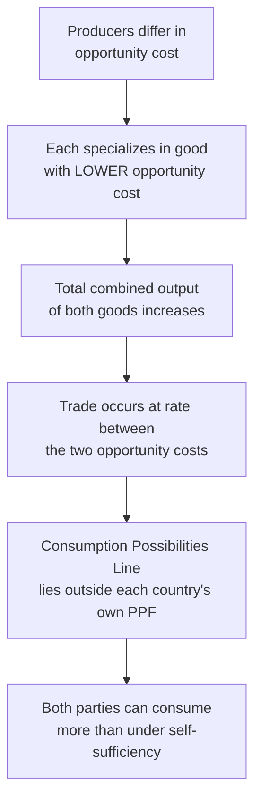

## Gains from Trade and Specialization

### Definition and Scope

Gains from trade refer to the increase in total output, consumption possibilities, and economic welfare that arises when individuals, firms, or nations specialize in producing goods according to comparative advantage and exchange the resulting output. Specialization is the mechanism that generates these gains: rather than each producer attempting self-sufficiency, producers concentrate resources on the activity in which they hold the lowest opportunity cost, then trade for everything else.

This item builds directly on comparative advantage, translating the theoretical opportunity-cost comparison into its practical consequences: how much total output rises, how consumption possibilities expand beyond a single producer's own production frontier, and what conditions govern whether trade is actually mutually beneficial.

### The Mechanism of Specialization

**Definition**: Specialization is the concentration of a producer's resources (labor, capital, land) on producing a narrower range of goods or a single good, rather than dividing resources across many goods for self-sufficiency.

**Why specialization increases total output**: When two producers face different opportunity costs for the same pair of goods, reallocating production so that each produces more of their comparatively-advantaged good (and less of the other) increases combined output of at least one good without reducing the other — and, under full specialization according to comparative advantage, increases total combined output of both goods relative to autarky (no-trade, self-sufficient production).

**Types of specialization**:

- **Individual specialization**: A person focuses on one occupation or task (e.g., a carpenter builds furniture rather than also farming, weaving, and doctoring).
- **Firm-level specialization**: A company focuses on producing a narrow set of goods or components, often relying on other firms for other stages of production.
- **National specialization**: A country concentrates production in industries where it holds comparative advantage (e.g., exporting agricultural goods while importing manufactured goods).

### Quantifying Gains from Trade

**Illustrative example**, continuing from the comparative advantage framework: two countries with fixed labor endowments and differing productivity in wheat and cloth.

| Country | Opportunity Cost of 1 Wheat | Opportunity Cost of 1 Cloth |
| --- | --- | --- |
| Country X | 0.5 Cloth | 2 Wheat |
| Country Y | 1 Cloth | 1 Wheat |

**No-trade (autarky) consumption** — each country must consume only what it produces itself. Suppose, splitting resources evenly, each country's consumption is limited to a point on its own PPF.

**With specialization and trade**: Country X (lower opportunity cost of wheat) specializes fully in wheat; Country Y (lower opportunity cost of cloth) specializes fully in cloth. They then trade at a mutually agreed rate strictly between the two opportunity costs (between 0.5 and 1 unit of Cloth per unit of Wheat).

**Consumption Possibilities Line (Trade Line)**: When trade is possible, each country's *consumption* possibilities are no longer bound by its own PPF — they are bound by a new line reflecting the world (traded) price ratio. This trade line lies outside the country's own PPF for at least part of its range, meaning the country can consume combinations of the two goods that it could never have produced domestically.

$$\text{Gains from Trade} = \text{Post-Trade Consumption} - \text{Autarky (No-Trade) Consumption}$$

For gains from trade to exist for *both* parties simultaneously, the trade price must fall strictly between the two countries' respective opportunity costs — at exactly 0.5 or exactly 1, one country would capture none of the gains, receiving exactly what autarky already offered for that good. [Inference: the specific division of the gains between the two trading parties depends on bargaining power and market conditions and is not pinned down by the comparative advantage principle itself, which establishes only that mutual gains are *possible*.]

### The Consumption Possibilities Frontier vs. the PPF

**Key distinction**:

- **Production Possibilities Frontier (PPF)**: The maximum combinations of goods a country can *produce* domestically, given its own resources.
- **Consumption Possibilities Frontier (CPF)** (also called the trade line): The maximum combinations of goods a country can *consume* once trade at world/negotiated prices is available — this line is typically tangent to or intersects the PPF at the specialization point and extends beyond the PPF elsewhere.

The gap between the CPF and the PPF at any given consumption bundle represents the gains from trade at that bundle — the additional consumption made possible purely by exchange, without any change in the country's own productive resources or technology.

**Illustrative diagram — PPF vs. consumption possibilities with trade (svg_diagram)**:

<svg xmlns="http://www.w3.org/2000/svg" viewBox="0 0 500 340" font-family="sans-serif">
<text x="250" y="22" text-anchor="middle" font-size="15" font-weight="bold">Gains from Trade: PPF vs. Consumption Line (svg_diagram)</text>
<line x1="60" y1="300" x2="60" y2="50" stroke="black" stroke-width="2" />
<line x1="60" y1="300" x2="450" y2="300" stroke="black" stroke-width="2" />
<text x="20" y="55" font-size="12">Cloth</text>
<text x="420" y="320" font-size="12">Wheat</text>
<path d="M 60 70 Q 130 160 200 220 Q 280 270 380 290" fill="none" stroke="#2563eb" stroke-width="2.5" />
<text x="240" y="245" font-size="11" fill="#2563eb">Country's own PPF</text>
<circle cx="380" cy="290" r="5" fill="#16a34a" />
<text x="330" y="280" font-size="10" fill="#16a34a">Specialization point</text>
<line x1="60" y1="120" x2="440" y2="290" stroke="#dc2626" stroke-width="2.5" stroke-dasharray="6,3" />
<text x="130" y="140" font-size="11" fill="#dc2626">Consumption Possibilities Line (trade)</text>
<circle cx="250" cy="200" r="5" fill="#9333ea" />
<text x="255" y="195" font-size="11" fill="#9333ea">Post-trade consumption (outside own PPF)</text>
</svg>

### Sources of Gains from Trade

1. **Comparative-advantage-driven specialization** — the primary source covered above: reallocating production toward each party's lowest-opportunity-cost good.
2. **Economies of scale** — specialization allows producers to focus on larger production runs of fewer goods, which can lower per-unit costs as fixed costs are spread over greater output. [Inference: the magnitude of scale economies varies significantly by industry and is not guaranteed in every specialization scenario.]
3. **Increased competition and variety** — trade exposes domestic producers to foreign competition, which can drive productivity improvements, and gives consumers access to a wider variety of goods than domestic production alone would offer.
4. **Learning and technology transfer** — engagement in specialized production and trade can facilitate the diffusion of production techniques and innovations across trading partners. [Speculation: the extent to which technology transfer occurs, and how quickly, depends heavily on institutional and policy factors not captured by the basic trade model.]

### Distributional Considerations

While gains from trade increase *total* output and consumption possibilities in aggregate, the theory does not guarantee that every individual within each trading country benefits equally, or at all, in the short run:

- **Winners**: Producers and workers in the comparatively-advantaged (export) sector generally benefit from expanded markets and increased demand for their output.
- **Losers (short/medium run)**: Producers and workers in the comparatively-disadvantaged (import-competing) sector may face reduced demand, job displacement, or the need to retrain and relocate to other industries.

This distributional dimension is a **normative and policy question** distinct from the **positive** claim that aggregate gains from trade exist — a common area of confusion in public debate over trade policy, and directly connects to the positive/normative distinction covered elsewhere in this chapter.

### Common Misconceptions

- **Misconception**: Gains from trade mean every individual and industry benefits from trade. **Correction**: Aggregate/total gains from trade can coexist with real losses for specific import-competing industries or workers; the theory establishes potential for overall net gains, not universal individual benefit, and addressing the losses is a separate policy question (e.g., trade adjustment assistance).
- **Misconception**: A country must have an absolute advantage to gain from specialization and trade. **Correction**: As established under comparative advantage, gains from trade arise from differences in *opportunity cost*, not absolute productivity — a country can gain from trade even with an absolute disadvantage in every good.
- **Misconception**: Gains from trade require formal international agreements. **Correction**: The underlying economic logic of specialization and gains from trade applies equally to individuals and firms within a domestic economy (e.g., division of labor within a business), not only to cross-border trade.

### Related Topics

- Absolute and comparative advantage (direct prerequisite concept)
- Terms of trade and the negotiated exchange rate between goods
- Economies of scale and their relationship to specialization
- Trade policy: tariffs, quotas, and trade adjustment assistance
- Division of labor and its historical origins (Adam Smith)
- Positive vs. normative economics applied to trade policy debates