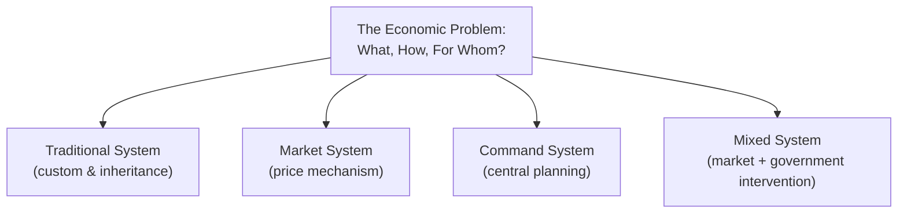

## Economic Systems: Market, Command, Mixed, Traditional

### Definition and Scope

An economic system is the institutional framework a society uses to answer the three fundamental economic questions raised by scarcity: **what** to produce, **how** to produce it, and **for whom** to produce it. Economic systems differ primarily in *who* makes these allocation decisions (individuals/markets vs. central authorities) and *how* resources and output are distributed. This item surveys the four major categories used to classify economic systems: traditional, market, command, and mixed.

### The Three Economic Questions Revisited

Every economic system, regardless of type, must resolve:

1. **What to produce** — which goods and services, and in what quantities
2. **How to produce** — which combination of resources and production techniques
3. **For whom to produce** — how output is distributed among members of society

The four system types below represent different institutional mechanisms for answering these questions, ranging from custom-based allocation to decentralized price signals to centralized planning.

### Traditional Economic System

**Definition**: A traditional economic system allocates resources and organizes production based on custom, tradition, ritual, and inherited social roles passed down through generations, rather than through prices or central directives.

**Key characteristics**:

- Production and occupational roles are typically determined by heredity, family, or social/tribal custom (e.g., a family continuing the same farming or craft trade for generations)
- Barter and direct exchange are common; formal currency and markets play a limited role
- Economic roles tend to be stable and change slowly across generations
- Often associated with subsistence agriculture, hunting-gathering, or pastoral economic activity

**Strengths**: Provides social stability and predictability; roles and expectations are clear; resource allocation is well-understood within the community's customary framework.

**Limitations**: Tends to resist innovation and change; offers limited economic mobility; generally produces lower material living standards relative to systems with specialization and capital accumulation, since production techniques change slowly.

**Contemporary relevance**: Few economies today operate as purely traditional systems at a national scale; elements of traditional allocation persist within some rural, indigenous, or subsistence communities, and traditional elements can be found embedded even within predominantly market or mixed economies (e.g., inherited family businesses, customary land use practices).

### Market Economic System

**Definition**: A market (or capitalist/free-market) economic system allocates resources primarily through the voluntary interaction of buyers and sellers, coordinated by the price mechanism, with production, consumption, and distribution decisions made by decentralized private individuals and firms rather than a central authority.

**Key characteristics**:

- **Private property rights**: Individuals and firms own and control productive resources (land, capital, labor)
- **Price mechanism**: Prices, determined by supply and demand, signal scarcity and coordinate decisions across millions of independent actors without central direction
- **Profit motive**: Firms are driven by the pursuit of profit, which incentivizes efficient production and responsiveness to consumer demand
- **Freedom of choice and enterprise**: Consumers are free to choose what to buy; producers are free to choose what to produce and how
- **Limited government role**: In a pure/idealized market system, government's role is limited to enforcing property rights and contracts, with minimal direct intervention in production or pricing decisions

**How the three questions are answered**: What to produce is determined by consumer demand (expressed through willingness to pay); how to produce is determined by firms competing to minimize cost and maximize profit; for whom is determined by the distribution of income, which itself reflects resource ownership and market-determined prices for labor and capital.

**Strengths**: Tends to allocate resources efficiently in response to changing consumer preferences; strong incentives for innovation, cost reduction, and entrepreneurship; decentralized coordination avoids the informational burden of central planning.

**Limitations**: Can produce significant income and wealth inequality; may underprovide public goods (e.g., national defense, basic research) and fail to account for externalities (e.g., pollution) without correction; provides no guarantee of full employment or macroeconomic stability on its own.

### Command Economic System

**Definition**: A command (or centrally planned/socialist) economic system allocates resources primarily through centralized government planning and directive, rather than through market prices or private decision-making.

**Key characteristics**:

- **State/collective ownership**: The government or the collective typically owns and controls the major means of production (land, factories, capital)
- **Central planning**: A central planning authority sets production targets, allocates resources among industries, and often sets prices administratively rather than allowing them to be determined by supply and demand
- **Limited private enterprise**: Private ownership and profit-driven production are minimal or prohibited
- **Distribution by plan or policy**: The "for whom" question is answered largely through government policy (e.g., wage scales, rationing, or stated egalitarian distribution goals) rather than market-determined income

**How the three questions are answered**: What, how, and for whom are all determined primarily by central planning authorities based on stated social, political, or strategic objectives, rather than by decentralized price signals.

**Strengths**: Can rapidly mobilize resources toward specific national priorities (e.g., wartime production, large-scale infrastructure); can, in principle, directly pursue egalitarian distributional goals without relying on market outcomes.

**Limitations**: Central planners face a severe **information problem** — coordinating an entire economy's worth of production and consumption decisions without price signals requires information that is dispersed, decentralized, and difficult to aggregate centrally. This is frequently cited as a core structural weakness of command systems, associated historically with the "economic calculation problem" debate in 20th-century economics. Command systems have also been associated with weaker incentives for innovation and efficiency (since profit motives are absent or muted) and historically with chronic shortages or surpluses of specific goods due to planning errors.

### Mixed Economic System

**Definition**: A mixed economic system combines elements of market allocation (private property, price mechanisms, profit motive) with government intervention (regulation, public provision of goods and services, redistribution, and macroeconomic management).

**Key characteristics**:

- **Predominantly market-based** allocation for most goods and services, coordinated through prices and private enterprise
- **Government intervention** in specific areas, which can include: providing public goods (defense, infrastructure), correcting externalities (environmental regulation), enforcing competition (antitrust law), redistributing income (taxation and welfare programs), and macroeconomic stabilization (monetary and fiscal policy)
- **Degree of mixing varies widely** across countries and over time — there is no single fixed proportion of "market" vs. "government" that defines a mixed economy

**Real-world prevalence**: Virtually all contemporary national economies are mixed economies to some degree, differing mainly in the *extent* and *form* of government involvement rather than in whether government involvement exists at all. Nations often described as having strong market orientations (e.g., the United States) still feature substantial public provision (public education, social insurance programs) and regulation, while nations often described as having strong welfare-state or social-democratic orientations (e.g., many Nordic countries) still rely predominantly on private markets and property rights for the bulk of production decisions.

**Strengths**: Aims to capture the efficiency and innovation incentives of market coordination while using government intervention to address well-documented market failures (public goods, externalities, monopoly power) and social objectives (reducing poverty, providing safety nets).

**Limitations**: Determining the *optimal* extent and form of government intervention is a persistent subject of both empirical dispute (positive economics) and value-based disagreement (normative economics); intervention itself can introduce inefficiencies (e.g., regulatory compliance costs, unintended incentive effects) alongside its intended benefits.

### Comparative Summary

| System | Resource Ownership | Allocation Mechanism | "What/How/For Whom" Decided By |
| --- | --- | --- | --- |
| Traditional | Communal/family, by custom | Custom and inherited roles | Tradition and social norms |
| Market | Private | Price mechanism (supply & demand) | Decentralized individuals & firms |
| Command | State/collective | Central planning directive | Central planning authority |
| Mixed | Predominantly private, with public sector | Price mechanism + government intervention | Markets, moderated by government policy |

**Illustrative diagram — the spectrum of economic systems (svg_diagram)**:

<svg xmlns="http://www.w3.org/2000/svg" viewBox="0 0 520 220" font-family="sans-serif">
<text x="260" y="24" text-anchor="middle" font-size="15" font-weight="bold">Spectrum of Economic Systems (svg_diagram)</text>
<line x1="50" y1="100" x2="470" y2="100" stroke="black" stroke-width="3" />
<circle cx="80" cy="100" r="7" fill="#9333ea" />
<text x="80" y="130" text-anchor="middle" font-size="11">Traditional</text>
<circle cx="440" cy="100" r="7" fill="#dc2626" />
<text x="440" y="130" text-anchor="middle" font-size="11">Command</text>
<circle cx="180" cy="100" r="7" fill="#2563eb" />
<text x="180" y="130" text-anchor="middle" font-size="11">Free Market</text>
<circle cx="310" cy="100" r="8" fill="#16a34a" />
<text x="310" y="130" text-anchor="middle" font-size="11" font-weight="bold">Mixed Economies</text>
<text x="310" y="150" text-anchor="middle" font-size="10" fill="#555">(most real-world economies)</text>
<text x="120" y="80" text-anchor="middle" font-size="10" fill="#555">Less government role</text>
<text x="400" y="80" text-anchor="middle" font-size="10" fill="#555">More government role</text>
</svg>

### Common Misconceptions

- **Misconception**: Real-world economies fall cleanly into one of the four pure categories. **Correction**: The four types are theoretical/idealized poles used for analytical comparison; virtually every actual economy is a mixed system incorporating elements of market coordination, government intervention, and, to varying degrees, traditional practices.
- **Misconception**: "Mixed economy" means an even 50/50 split between market and government. **Correction**: The term describes the presence of both market and government mechanisms, not any particular proportion — the *degree* of mixing varies enormously across countries and over time within the same country.
- **Misconception**: Command economies are always less prosperous than market economies. **Correction**: While the information and incentive problems associated with central planning are widely documented as structural weaknesses, prosperity outcomes for any specific economy depend on many additional factors (institutions, human capital, resource endowment, governance quality, historical context) beyond system classification alone. [Inference: broad empirical comparisons across the 20th century are often cited to support market-oriented outcomes, but drawing firm general conclusions requires care given the many confounding historical and institutional differences between compared economies.]

### Related Topics

- The economic calculation problem and central planning
- Market failure: public goods, externalities, and monopoly power
- The role of government in a mixed economy: taxation, regulation, redistribution
- Property rights and their role in economic coordination
- Comparative economic systems across historical and contemporary case studies
- Positive vs. normative economics applied to system design debates