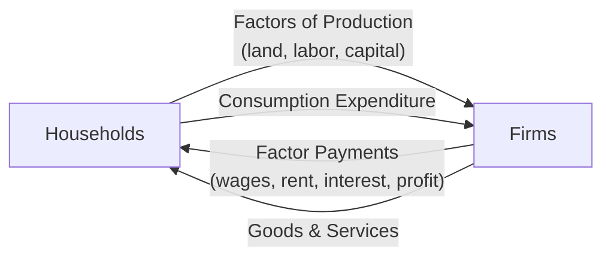
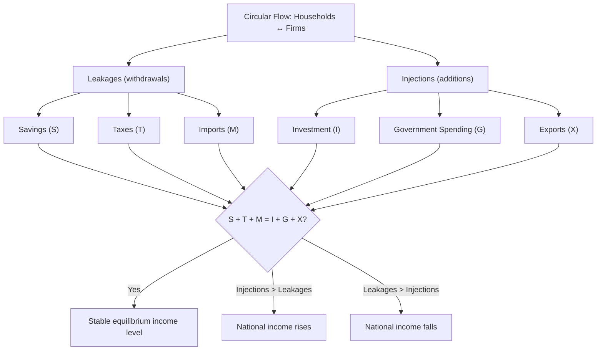

## Circular Flow of Income and Expenditure

### Definition and Scope

The circular flow of income and expenditure is a macroeconomic model depicting how money, goods, services, and factors of production move between the major sectors of an economy — households, firms, government, and the foreign sector — in a continuous, interconnected cycle. It illustrates a foundational principle of macroeconomics: one economic agent's expenditure is simultaneously another agent's income, and the value of aggregate output equals the value of aggregate income equals the value of aggregate expenditure.

### The Two-Sector Circular Flow Model

**Definition**: The simplest version of the model considers only two sectors — households and firms — connected through two distinct but interlocking markets.

**The two markets**:

1. **Factor market (resource market)**: Households supply factors of production — land, labor, capital, entrepreneurship — to firms, and receive factor payments in return (rent, wages, interest, and profit, respectively).
2. **Product market (goods and services market)**: Firms supply goods and services to households, and receive consumption expenditure in return.

**Two flows within the model**:

- **Real flow**: The physical movement of factors of production (from households to firms) and finished goods/services (from firms to households).
- **Money flow**: The movement of factor payments (from firms to households) and consumption expenditure (from households to firms) — moving in the opposite direction to, and valuing, the real flow.

$$\text{Household Income (from factor market)} = \text{Firm Revenue} = \text{Household Expenditure (in product market)}$$

In this simplified closed model, with no saving, taxation, or government, all income received by households is assumed to be spent, and all revenue received by firms is paid out as factor income, creating a continuously repeating cycle.

### Leakages and Injections: The Extended Model

**Definition**: In reality, not all income is spent, and not all expenditure comes from household consumption alone. The circular flow model is extended to account for **leakages** (withdrawals of money from the circular flow) and **injections** (additions of money into the circular flow) once saving, government, and the foreign sector are introduced.

**The three leakages** (withdrawals from the household-firm spending cycle):

| Leakage | Description |
| --- | --- |
| **Savings (S)** | Income households or firms set aside rather than spend on domestic goods and services |
| **Taxes (T)** | Income withdrawn by government through taxation rather than spent directly by households/firms |
| **Imports (M)** | Spending on foreign-produced goods and services, which flows out of the domestic economy |

**The three injections** (additions into the household-firm spending cycle from outside):

| Injection | Description |
| --- | --- |
| **Investment (I)** | Firm spending on capital goods, often financed by borrowed savings |
| **Government spending (G)** | Government purchases of goods and services, financed by taxation, borrowing, or other revenue |
| **Exports (X)** | Foreign demand for domestically-produced goods and services |

**Equilibrium condition**: For the circular flow (and the broader economy) to be in a stable, non-changing equilibrium, total leakages must equal total injections:

$$S + T + M = I + G + X$$

If injections exceed leakages, the level of national income and output tends to rise (an expansionary tendency); if leakages exceed injections, national income and output tend to fall (a contractionary tendency). This equilibrium condition underlies core macroeconomic concepts such as the multiplier effect and aggregate demand.

### The Four-Sector Circular Flow Model

**Sectors included**: The complete, real-world version of the model incorporates four sectors:

1. **Households** — supply factors of production, consume goods and services, pay taxes, save
2. **Firms** — produce goods and services, pay factor incomes, invest, pay taxes
3. **Government** — collects taxes, provides public goods and transfer payments, purchases goods and services
4. **Foreign sector (Rest of the World)** — engages in exports and imports, and international capital flows

**Financial sector role**: Financial institutions (banks and other intermediaries) are often depicted as a channel connecting household/firm savings to firms' investment borrowing, functioning as the mechanism through which the leakage of savings is converted back into the injection of investment.

**Illustrative diagram — the four-sector circular flow (svg_diagram)**:

<svg viewBox="0 0 560 400" xmlns="http://www.w3.org/2000/svg" font-family="sans-serif">
<text x="280" y="24" text-anchor="middle" font-size="15" font-weight="bold">Four-Sector Circular Flow (svg_diagram)</text>
<rect x="40" y="170" width="130" height="60" rx="6" fill="#dbeafe" stroke="#2563eb" stroke-width="2"/>
<text x="105" y="205" text-anchor="middle" font-size="13" font-weight="bold">Households</text>
<rect x="390" y="170" width="130" height="60" rx="6" fill="#dcfce7" stroke="#16a34a" stroke-width="2"/>
<text x="455" y="205" text-anchor="middle" font-size="13" font-weight="bold">Firms</text>
<rect x="215" y="40" width="130" height="55" rx="6" fill="#fef9c3" stroke="#ca8a04" stroke-width="2"/>
<text x="280" y="72" text-anchor="middle" font-size="13" font-weight="bold">Government</text>
<rect x="215" y="305" width="130" height="55" rx="6" fill="#fee2e2" stroke="#dc2626" stroke-width="2"/>
<text x="280" y="337" text-anchor="middle" font-size="13" font-weight="bold">Foreign Sector</text>
<line x1="170" y1="185" x2="390" y2="185" stroke="black" stroke-width="1.5" marker-end="url(#a1)"/>
<text x="280" y="180" text-anchor="middle" font-size="9">Factors of production</text>
<line x1="390" y1="210" x2="170" y2="210" stroke="black" stroke-width="1.5" marker-end="url(#a1)"/>
<text x="280" y="225" text-anchor="middle" font-size="9">Wages, goods & services</text>
<line x1="150" y1="170" x2="245" y2="95" stroke="black" stroke-width="1" stroke-dasharray="4,2" marker-end="url(#a1)"/>
<text x="180" y="130" font-size="8">Taxes (T)</text>
<line x1="245" y1="95" x2="150" y2="170" stroke="black" stroke-width="1" stroke-dasharray="4,2" marker-end="url(#a1)"/>
<text x="220" y="150" font-size="8">Transfers/G</text>
<line x1="410" y1="170" x2="315" y2="95" stroke="black" stroke-width="1" stroke-dasharray="4,2" marker-end="url(#a1)"/>
<text x="390" y="130" font-size="8">Taxes (T)</text>
<line x1="150" y1="230" x2="245" y2="305" stroke="black" stroke-width="1" stroke-dasharray="4,2" marker-end="url(#a1)"/>
<text x="170" y="280" font-size="8">Imports (M)</text>
<line x1="410" y1="230" x2="315" y2="305" stroke="black" stroke-width="1" stroke-dasharray="4,2" marker-end="url(#a1)"/>
<text x="380" y="280" font-size="8">Exports (X)</text>
<defs>
<marker id="a1" markerWidth="8" markerHeight="8" refX="7" refY="2.5" orient="auto" markerUnits="strokeWidth">
<path d="M0,0 L0,5 L7,2.5 z" fill="black"/>
</marker>
</defs>
</svg>

### Relationship to National Income Accounting

The circular flow model provides the conceptual foundation for the three equivalent methods used to measure Gross Domestic Product (GDP) — a topic developed fully elsewhere in the macroeconomics sequence, but rooted directly in the circular flow logic:

- **Expenditure approach**: Summing total spending on final goods and services, $GDP = C + I + G + (X - M)$, where $C$ is consumption, $I$ is investment, $G$ is government spending, and $(X-M)$ is net exports.
- **Income approach**: Summing all factor incomes generated (wages, rent, interest, profit).
- **Output (value-added) approach**: Summing the market value of all final goods and services produced.

Because the circular flow model shows that expenditure in the product market becomes income in the factor market becomes the value of output produced, these three approaches are conceptually equivalent ways of measuring the same total flow of economic activity — a direct consequence of the circular flow structure.

$$\text{Total Output} = \text{Total Income} = \text{Total Expenditure}$$

### Uses and Significance of the Model

- **Illustrating interdependence**: The model shows that no sector of the economy operates in isolation — a household's decision to save (a leakage) has direct implications for the income available to firms and, if unmatched by investment, for aggregate output.
- **Foundation for macroeconomic policy analysis**: The leakages/injections framework underlies fiscal policy analysis (how changes in $G$ and $T$ affect the equilibrium level of income) and is a direct precursor to the Keynesian income-expenditure model and the multiplier effect.
- **Diagnosing macroeconomic imbalances**: Persistent gaps between injections and leakages help explain sustained periods of economic expansion or contraction, and gaps specifically involving the foreign sector ($X$ vs. $M$) relate directly to a country's trade balance and current account position.

### Common Misconceptions

- **Misconception**: The circular flow model implies the economy is always in equilibrium. **Correction**: The model describes the *flows* between sectors and the *condition* for equilibrium ($S+T+M = I+G+X$); it does not assert that the economy is always at that equilibrium — divergences between leakages and injections are precisely what drive changes in national income over time.
- **Misconception**: Savings are simply "lost" from the economy. **Correction**: Savings are a leakage from the *household-firm spending cycle*, but are typically channeled through financial institutions back into the economy as loanable funds for investment (an injection) — the model highlights this transformation rather than treating saved income as removed from the economic system entirely.
- **Misconception**: The circular flow model applies only to closed (no foreign trade) economies. **Correction**: While the simplest two-sector version excludes the foreign sector for pedagogical clarity, the complete four-sector model explicitly incorporates exports and imports as a standard component.

### Related Topics

- GDP measurement: expenditure, income, and output approaches
- Leakages, injections, and the Keynesian multiplier effect
- Fiscal policy: government spending and taxation effects on national income
- Balance of payments and the current account
- Aggregate demand and aggregate supply framework
- The role of financial intermediaries in channeling savings to investment