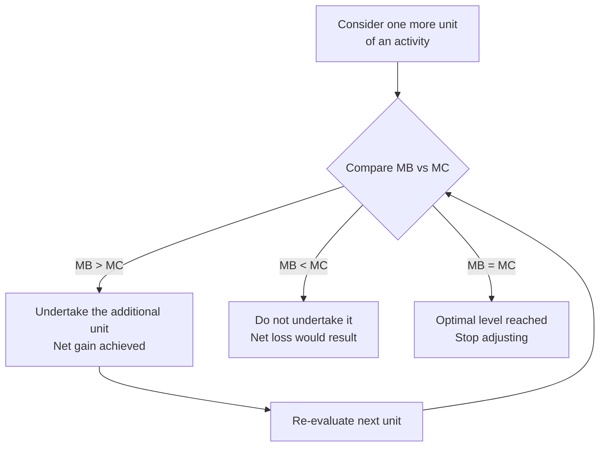

## Marginal Analysis and Rational Decision-Making

### Definition and Scope

Marginal analysis is the economic method of evaluating decisions by examining the additional (marginal) benefit and additional (marginal) cost of a small change in behavior, rather than evaluating the total benefit or total cost of an activity as a whole. It is the primary analytical tool economists use to model how rational agents — consumers, firms, and policymakers — determine the optimal level of an activity, and it underlies the standard economic conception of rational decision-making.

### Core Concepts: Marginal Benefit and Marginal Cost

**Marginal Benefit (MB)**: The additional benefit or satisfaction gained from consuming or producing one more unit of a good, service, or activity.

**Marginal Cost (MC)**: The additional cost incurred from consuming or producing one more unit of a good, service, or activity.

**Formal definitions**:

$$MB = \frac{\Delta \text{Total Benefit}}{\Delta \text{Quantity}}, \qquad MC = \frac{\Delta \text{Total Cost}}{\Delta \text{Quantity}}$$

For continuous, differentiable total benefit and total cost functions, marginal benefit and marginal cost are formally the derivatives of total benefit and total cost with respect to quantity:

$$MB = \frac{dTB}{dQ}, \qquad MC = \frac{dTC}{dQ}$$

**Why "marginal" rather than "total"**: A key insight of marginal analysis is that rational decisions about *how much* of an activity to undertake are governed by the additional unit under consideration, not by the average or total benefit/cost of the activity as a whole. Total benefit can be very high (e.g., the total value of drinking water to a person) while marginal benefit of one *additional* unit is low or even negative (the tenth glass of water in a day) — a distinction that resolves the classical "diamond-water paradox" in the history of economic thought, where diamonds (low total value, high marginal value due to scarcity) command a higher price than water (high total value, low marginal value due to abundance).

### The Marginal Decision Rule

**Definition**: The marginal decision rule states that a rational agent should continue an activity as long as marginal benefit exceeds marginal cost, and should stop (or reduce the activity) once marginal cost exceeds marginal benefit. The optimal quantity of the activity is found where marginal benefit equals marginal cost.

$$\text{Optimal Quantity } Q^*: \quad MB(Q^*) = MC(Q^*)$$

**Decision logic**:

| Condition | Interpretation | Rational Response |
| --- | --- | --- |
| $MB > MC$ | The next unit adds more value than it costs | Increase the activity |
| $MB < MC$ | The next unit costs more than it adds in value | Decrease the activity |
| $MB = MC$ | The next unit adds exactly as much value as it costs | Optimal point — stop adjusting |

**Illustrative diagram — the marginal decision rule (svg_diagram)**:

<svg xmlns="http://www.w3.org/2000/svg" viewBox="0 0 480 320" font-family="sans-serif">
<text x="240" y="22" text-anchor="middle" font-size="15" font-weight="bold">Marginal Benefit = Marginal Cost (svg_diagram)</text>
<line x1="60" y1="280" x2="60" y2="50" stroke="black" stroke-width="2" />
<line x1="60" y1="280" x2="440" y2="280" stroke="black" stroke-width="2" />
<text x="20" y="55" font-size="12">$</text>
<text x="410" y="300" font-size="12">Quantity</text>
<line x1="70" y1="230" x2="420" y2="90" stroke="#2563eb" stroke-width="2.5" />
<text x="425" y="90" font-size="11" fill="#2563eb">MC</text>
<line x1="70" y1="90" x2="420" y2="230" stroke="#16a34a" stroke-width="2.5" />
<text x="425" y="230" font-size="11" fill="#16a34a">MB</text>
<circle cx="245" cy="160" r="5" fill="#dc2626" />
<line x1="245" y1="160" x2="245" y2="280" stroke="#dc2626" stroke-width="1" stroke-dasharray="4,2" />
<text x="250" y="150" font-size="11" fill="#dc2626">Q* (MB = MC)</text>
<text x="130" y="255" font-size="10" fill="#16a34a">MB &gt; MC: expand</text>
<text x="300" y="255" font-size="10" fill="#2563eb">MC &gt; MB: reduce</text>
</svg>

### Applications of Marginal Analysis

**Consumer theory**: A rational consumer allocates a limited budget across goods by comparing the marginal utility per dollar spent on each good, continuing to purchase a good as long as its marginal utility per dollar exceeds that of alternative purchases, until the marginal utility per dollar is equalized across all goods purchased (the consumer equilibrium condition):

$$\frac{MU_A}{P_A} = \frac{MU_B}{P_B}$$

where $MU$ denotes marginal utility and $P$ denotes price.

**Producer/firm theory**: A profit-maximizing firm determines its optimal output level by producing up to the point where marginal revenue (MR, the additional revenue from selling one more unit) equals marginal cost (MC, the additional cost of producing one more unit):

$$\text{Profit-Maximizing Output: } MR = MC$$

This rule is the foundation of firm output decisions across all standard market structure models (perfect competition, monopoly, monopolistic competition, oligopoly), differing across models mainly in how marginal revenue is determined.

**Everyday and policy decisions**: Marginal analysis extends readily beyond formal markets — for example, an individual deciding whether to study one more hour weighs the marginal benefit (expected improvement in exam performance) against the marginal cost (forgone leisure time or wages); a policymaker deciding on the optimal level of pollution abatement weighs the marginal benefit of reduced pollution (health and environmental gains) against the marginal cost of abatement (compliance costs to firms).

### Marginal Analysis and Diminishing Returns

**Law of diminishing marginal utility**: As a consumer consumes successive additional units of a good, the marginal utility (satisfaction) derived from each additional unit typically declines, holding consumption of other goods constant. This principle underlies the downward-sloping marginal benefit curve typically used in marginal analysis diagrams.

**Law of diminishing marginal returns** (production side): As additional units of a variable input (e.g., labor) are added to a fixed input (e.g., capital or land), the additional (marginal) output produced by each successive unit of the variable input eventually declines. This principle underlies the typically rising marginal cost curve used in producer marginal analysis, since declining marginal returns to a variable input translate into rising marginal cost of additional output.

Both principles explain why marginal benefit curves are commonly drawn sloping downward and marginal cost curves sloping upward in standard marginal analysis diagrams — producing the intersection point that defines the optimal quantity.

### Marginal Analysis and Rational Decision-Making

**The standard rational-agent model**: Marginal analysis rests on the assumption that economic agents are rational — meaning they have well-defined, consistent preferences and systematically choose the option that maximizes their net benefit (utility, profit, or welfare), given the constraints they face and the information available to them.

**Rationality does not require perfect information or infinite calculation**: The economic conception of rationality does not assume agents perform explicit calculus or possess complete information; it assumes only that agents behave, at the margin, *as if* they are weighing additional benefits against additional costs, adjusting behavior in the direction that improves their position when a net gain is available.

**Behavioral economics critique**: A substantial body of empirical and experimental research in behavioral economics documents systematic deviations from the idealized marginal-decision-rule model — including bounded rationality (limited cognitive capacity to process all relevant marginal information), loss aversion, present bias, and reliance on heuristics rather than explicit marginal calculation. [Inference: the extent to which these deviations meaningfully alter the *predictions* of standard marginal analysis varies by context — some findings suggest predictions remain reasonably accurate in aggregate or in high-stakes, repeated decisions, while other findings show systematic and persistent divergence, and this remains an active area of ongoing research.]

**Sunk costs and marginal analysis**: A critical implication of marginal analysis is that rational decisions should be based only on marginal (forward-looking) benefits and costs, excluding sunk costs — costs already incurred and unrecoverable regardless of the current decision. Because sunk costs do not change with the marginal decision being made, they are, by the logic of marginal analysis, irrelevant to it. The well-documented tendency of decision-makers to factor in sunk costs anyway (the "sunk cost fallacy") is a specific and heavily studied departure from the marginal decision rule.

### Common Misconceptions

- **Misconception**: Marginal analysis means only small, trivial decisions are being considered. **Correction**: "Marginal" refers to the additional unit or increment under consideration, regardless of the overall scale of the activity — marginal analysis is used to evaluate decisions as consequential as a firm's total output level or a government's optimal regulatory stringency, not only minor adjustments.
- **Misconception**: If marginal benefit is positive, an agent should keep doing more of an activity. **Correction**: The relevant comparison is marginal benefit *relative to* marginal cost, not marginal benefit in isolation — an activity should expand only while marginal benefit exceeds marginal cost, even if marginal benefit alone remains positive.
- **Misconception**: Rational decision-making requires perfect foresight and flawless calculation. **Correction**: The economic notion of rationality embedded in marginal analysis is a modeling assumption about consistent, benefit-maximizing behavior at the margin — it does not require literal, conscious marginal calculus, nor does it claim agents never make mistakes.

### Related Topics

- Law of diminishing marginal utility and consumer equilibrium
- Law of diminishing marginal returns and short-run production theory
- Profit maximization: the MR = MC rule across market structures
- Sunk costs and the sunk cost fallacy
- Behavioral economics: bounded rationality and heuristics
- Cost-benefit analysis in public policy decision-making