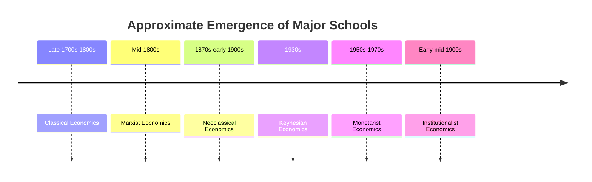
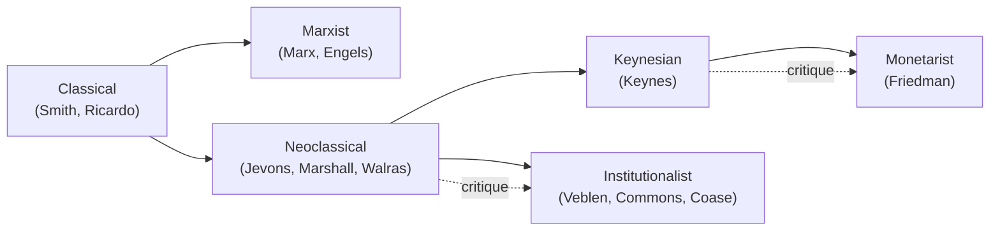

## History of Economic Thought: Classical, Marxist, Neoclassical, Keynesian, Monetarist, Institutionalist Schools

### Definition and Scope

The history of economic thought traces the evolution of major theoretical frameworks economists have developed to explain how economies function, what drives growth and value, how markets and prices are determined, and what role government should play in economic life. This item surveys six major schools that have shaped economic theory and policy: Classical, Marxist, Neoclassical, Keynesian, Monetarist, and Institutionalist economics, presented broadly in the order they emerged historically, while noting that several remain active, evolving traditions in contemporary economics rather than purely historical artifacts.

### Classical Economics

**Period and key figures**: Emerged in the late 18th century, associated primarily with Adam Smith (*The Wealth of Nations*, 1776), David Ricardo, Thomas Malthus, and Jean-Baptiste Say.

**Core ideas**:

- **The invisible hand**: Individuals pursuing their own self-interest in competitive markets are led, as if by an "invisible hand," to promote outcomes beneficial to society as a whole, without requiring central coordination.
- **Laissez-faire**: Markets are generally self-regulating and function best with minimal government intervention; the classical view generally favored limited state involvement, confined mainly to defense, justice, and select public works.
- **Say's Law**: The proposition, associated with Jean-Baptiste Say, that aggregate production creates its own aggregate demand ("supply creates its own demand"), implying that general, economy-wide overproduction (a prolonged glut) should not persist under flexible prices.
- **Labor theory of value**: An early theory (developed further by Ricardo and later central to Marx) holding that the value of a good is determined primarily by the labor required to produce it — a theory later largely superseded in mainstream economics by marginal utility theory.
- **Comparative advantage**: Ricardo's formalization of gains from trade based on relative opportunity cost, directly connecting to the comparative advantage topic covered elsewhere in this chapter.

**Legacy**: Classical economics established foundational concepts — division of labor, free markets, gains from trade, and the systematic study of economic growth — that remain embedded in nearly all subsequent schools of economic thought, even those that substantially revised or rejected specific classical claims.

### Marxist Economics

**Period and key figures**: Developed primarily by Karl Marx (*Das Kapital*, published in volumes from 1867) and Friedrich Engels in the mid-to-late 19th century, building critically on and departing from classical labor theory of value.

**Core ideas**:

- **Labor theory of value (extended)**: Marx argued the value of a commodity derives from the socially necessary labor time required to produce it, and that capitalists extract "surplus value" from workers by paying wages below the full value workers create.
- **Class conflict**: Marx analyzed capitalist economies through the lens of conflict between capital-owning classes (the bourgeoisie) and labor-selling classes (the proletariat), viewing this conflict as a central driver of historical and economic change.
- **Critique of capitalism's internal contradictions**: Marx argued capitalism contains inherent instabilities and contradictions — including a tendency toward crises of overproduction, concentration of capital, and (in Marx's analysis) a long-run tendency for the rate of profit to fall — that he predicted would eventually lead to capitalism's transformation into socialism.
- **Historical materialism**: A broader theoretical framework viewing economic (material) conditions and production relationships as the primary driver of social, political, and historical change.

**Legacy and reception**: Marxist economic theory profoundly influenced 20th-century political and economic history, providing the theoretical basis for centrally planned command economies in various states during that period. [Inference: mainstream contemporary economics has generally not adopted the labor theory of value as its core value framework, favoring marginal utility and price-based approaches instead, though Marxist and post-Marxist analysis continues as an active heterodox tradition, particularly regarding class, distribution, and critiques of capitalism.]

### Neoclassical Economics

**Period and key figures**: Emerged in the 1870s through the early 20th century via the "marginalist revolution," associated with William Stanley Jevons, Carl Menger, Léon Walras, and later Alfred Marshall, who synthesized much of the framework still taught in introductory microeconomics today.

**Core ideas**:

- **Marginal utility theory**: Replaced the classical/Marxist labor theory of value with the idea that the value (price) of a good is determined by its marginal utility — the additional satisfaction gained from consuming one more unit — resolving longstanding paradoxes (e.g., the diamond-water paradox) that the labor theory struggled to explain.
- **Rational, optimizing agents**: Models consumers as utility-maximizers and firms as profit-maximizers, operating under constraints (budgets, technology), using marginal analysis (marginal benefit = marginal cost) as the central decision rule.
- **Supply and demand equilibrium**: Formalized supply and demand curves and market-clearing equilibrium price determination as the central tool of price theory, an approach substantially developed by Alfred Marshall.
- **General equilibrium theory**: Léon Walras developed formal mathematical models of how prices and quantities in *all* markets in an economy could simultaneously reach equilibrium.

**Legacy**: Neoclassical economics forms the theoretical core of most standard introductory and intermediate microeconomics curricula today, including supply and demand analysis, consumer theory, and firm theory; many of its core tools (marginal analysis, utility maximization, equilibrium analysis) are used across virtually all subsequent schools, even those that critique its behavioral or macroeconomic assumptions.

### Keynesian Economics

**Period and key figures**: Developed by John Maynard Keynes, primarily in *The General Theory of Employment, Interest and Money* (1936), in direct response to the Great Depression and perceived failures of classical theory to explain prolonged, severe unemployment.

**Core ideas**:

- **Rejection of Say's Law in the short run**: Keynes argued that aggregate demand could fall short of the economy's productive capacity for extended periods, leading to persistent involuntary unemployment, contrary to the classical presumption of automatic self-correction.
- **Aggregate demand as the driver of short-run output**: Keynesian theory holds that total spending (consumption, investment, government spending, net exports) determines the level of output and employment in the short run, particularly when prices and wages are "sticky" (slow to adjust downward).
- **Role of active government intervention**: Keynes argued that during economic downturns, government could and should use fiscal policy (increased government spending or reduced taxation) to boost aggregate demand and reduce unemployment, rather than relying on markets to self-correct.
- **The multiplier effect**: An initial change in spending (e.g., government spending) generates a larger overall change in national income, as each round of new spending becomes income that is partly re-spent.

**Legacy**: Keynesian economics fundamentally shaped 20th-century macroeconomic policy, providing the theoretical foundation for active countercyclical fiscal policy; it remains a major and actively developed macroeconomic tradition (via subsequent New Keynesian economics), particularly regarding short-run business cycle analysis and demand-side policy.

### Monetarist Economics

**Period and key figures**: Developed prominently by Milton Friedman and the "Chicago School" from the 1950s through the 1970s, in substantial part as a critique of Keynesian emphasis on fiscal policy.

**Core ideas**:

- **Primacy of the money supply**: Monetarists argue that changes in the money supply are the primary driver of nominal economic variables — particularly inflation — over the medium to long run, encapsulated in Friedman's frequently cited claim that inflation is fundamentally a monetary phenomenon.
- **Quantity theory of money**: Rooted in the equation of exchange, $MV = PQ$ (money supply × velocity of money = price level × real output), monetarists generally argue that with relatively stable velocity, growth in the money supply beyond the growth of real output translates into inflation.
- **Skepticism of discretionary fiscal policy**: Monetarists generally argued that discretionary fiscal policy is subject to significant implementation lags and can be less effective or more destabilizing than Keynesians claimed, favoring predictable, rules-based monetary policy (e.g., steady, modest growth in the money supply) over active fiscal fine-tuning.
- **Long-run monetary neutrality**: Consistent with much of neoclassical theory, monetarists generally hold that changes in the money supply affect only nominal variables (prices) in the long run, not real variables (output, employment), which are determined by real factors such as technology and resources.

**Legacy**: Monetarist ideas substantially influenced central bank policy frameworks from the late 20th century onward, particularly regarding the emphasis on controlling inflation as a primary central bank objective; while pure monetarist money-supply-targeting fell out of favor as a specific operational framework in many central banks, its influence persists in the broader consensus that monetary policy plays the central role in controlling inflation.

### Institutionalist Economics

**Period and key figures**: Developed primarily in the early-to-mid 20th century in the United States, associated with Thorstein Veblen, John R. Commons, and Wesley Clair Mitchell, and continuing in various forms as "new institutional economics" from the latter 20th century onward (e.g., Douglass North, Ronald Coase, Oliver Williamson).

**Core ideas**:

- **Institutions matter**: Institutionalist economics emphasizes that economic behavior and outcomes are shaped substantially by legal, social, political, and cultural institutions (property rights, contracts, norms, organizations), not solely by abstract price mechanisms operating on idealized rational agents.
- **Critique of pure rational-actor models**: Early institutionalists, notably Veblen, critiqued the neoclassical assumption of purely rational, utility-maximizing behavior, emphasizing instead the role of habit, social convention, and evolving custom (e.g., Veblen's concept of "conspicuous consumption").
- **Transaction costs (new institutional economics)**: Later institutionalist work, particularly Ronald Coase's contributions, emphasized how transaction costs — the costs of negotiating, monitoring, and enforcing agreements — shape the boundaries of firms, the structure of markets, and the efficiency of different institutional arrangements.
- **Path dependence and historical specificity**: Institutionalists generally emphasize that economic outcomes are shaped by historical context and evolving institutions, cautioning against universal, historically-invariant economic laws.

**Legacy**: Institutionalist ideas substantially informed the development of law and economics, contract theory, and the economics of organizations; the "new institutional economics" tradition remains an active and influential subfield addressing property rights, governance, and economic development.

### Comparative Summary

| School | Core Focus | View on Government Role | Key Contribution |
| --- | --- | --- | --- |
| Classical | Free markets, growth, trade | Minimal (laissez-faire) | Division of labor, comparative advantage, invisible hand |
| Marxist | Class conflict, exploitation, capitalist crisis | State/collective control (in Marxist-derived systems) | Class analysis, critique of capitalism's contradictions |
| Neoclassical | Marginal utility, rational optimization, equilibrium | Market-based, limited correction of failures | Marginal analysis, supply-demand equilibrium |
| Keynesian | Aggregate demand, short-run unemployment | Active countercyclical fiscal policy | Multiplier effect, demand management |
| Monetarist | Money supply and inflation | Rules-based monetary policy, limited discretionary fiscal role | Quantity theory of money, monetary policy primacy |
| Institutionalist | Institutions, transaction costs, historical context | Varies; emphasizes institutional design | Transaction cost theory, critique of pure rational-actor models |

### Common Misconceptions

- **Misconception**: These schools represent a strict linear progression, with each fully replacing the last. **Correction**: While the schools emerged roughly in historical sequence, several coexist and remain actively developed today (e.g., New Keynesian, monetarist-influenced central banking, new institutional economics), and modern mainstream economics draws selectively on tools and insights from multiple traditions rather than adhering to a single school exclusively.
- **Misconception**: Keynesian and monetarist economics are entirely incompatible. **Correction**: While the two traditions historically debated the relative importance of fiscal vs. monetary policy and the speed of market self-correction, much of contemporary mainstream macroeconomics (sometimes termed the "New Keynesian" or broader "neoclassical synthesis" tradition) incorporates elements of both, generally assigning monetary policy the primary role in managing the business cycle while retaining a role for fiscal policy under specific conditions.
- **Misconception**: Marxist economics and institutionalist economics are the same as "socialism" or "government control" as policy positions. **Correction**: These are analytical and theoretical frameworks for understanding economic phenomena (class relations, institutions, transaction costs); the specific policy conclusions drawn from them (including the degree of government involvement advocated) vary among economists working within each tradition and are separate normative questions from the underlying positive analytical framework.

### Related Topics

- The invisible hand and laissez-faire market theory
- Marginal utility theory and the marginalist revolution
- The multiplier effect and Keynesian aggregate demand management
- Quantity theory of money and monetary policy
- Transaction cost economics and the theory of the firm
- Comparative economic systems: market, command, and mixed economies