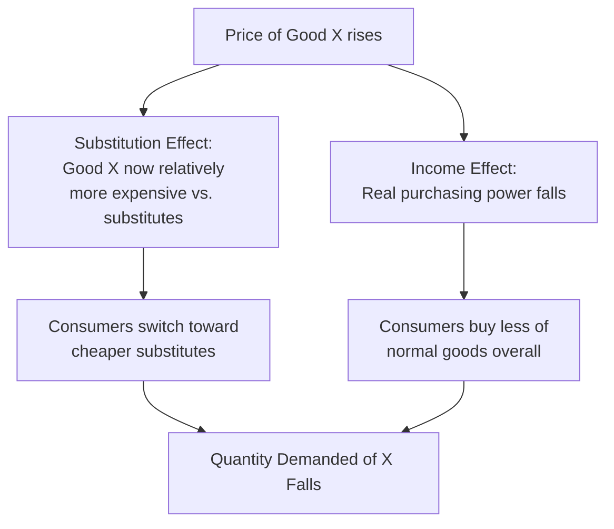
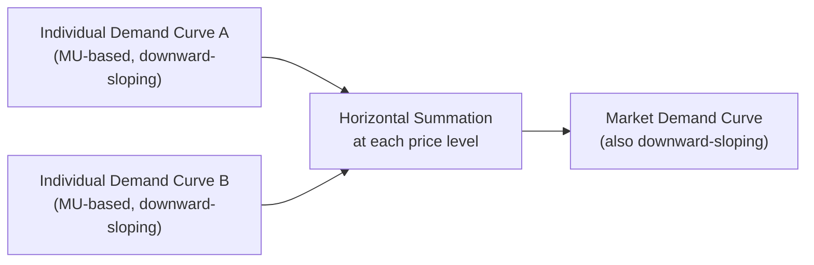

## Law of Demand and Demand Curve Derivation

### Definition and Scope

The law of demand describes the fundamental inverse relationship between the price of a good and the quantity of that good consumers are willing and able to purchase, holding all other determinants of demand constant. The demand curve is the graphical representation of this relationship. This item covers the statement and rationale of the law of demand, the theoretical derivation of the demand curve from underlying consumer behavior, and the distinction between individual and market demand.

### The Law of Demand

**Definition**: The law of demand states that, *ceteris paribus* (holding all other factors constant), as the price of a good rises, the quantity demanded of that good falls; and as the price falls, the quantity demanded rises. Price and quantity demanded are inversely related.

$$\text{As } P \uparrow, \quad Q_d \downarrow \quad (\text{ceteris paribus})$$

**Quantity demanded vs. demand**: A precise distinction underlies the law of demand:

- **Quantity demanded**: The specific amount of a good consumers are willing and able to buy at a *particular* price, at a given point in time.
- **Demand**: The entire relationship between price and quantity demanded across *all* possible prices — represented by the full demand curve or demand schedule, not a single point.

The law of demand describes how quantity demanded changes in response to a change in the good's own price — this is represented as a **movement along** a fixed demand curve, not a shift of the curve itself (per the ceteris paribus convention covered in the economic methodology topic).

### Three Explanations for the Law of Demand

**1. The substitution effect**: When the price of a good rises, that good becomes relatively more expensive compared to substitute goods, leading consumers to substitute toward relatively cheaper alternatives, reducing quantity demanded of the now-pricier good.

**2. The income effect**: When the price of a good rises, a consumer's real purchasing power (the real value of a fixed money income) falls, since the same income now buys less. For most goods (normal goods), reduced real income leads to reduced quantity demanded.

**3. Diminishing marginal utility**: As established in marginal analysis, each successive unit of a good consumed typically provides less additional (marginal) satisfaction than the previous unit. Because consumers weigh marginal utility against price when deciding whether to buy another unit, a rational consumer will only purchase additional units if the price falls sufficiently to match the declining marginal utility — directly implying that a lower price is required to induce a higher quantity demanded.

### Deriving the Individual Demand Curve

**Step 1 — Marginal utility and the consumer's decision rule**: A rational consumer purchases additional units of a good as long as the marginal utility derived from the good, expressed in monetary terms, is at least as great as its price. The consumer's optimal purchase quantity at any given price is found where:

$$MU_x = P_x$$

(more precisely, in a multi-good setting, where marginal utility per dollar is equalized across goods, as covered in marginal analysis: $\frac{MU_x}{P_x} = \frac{MU_y}{P_y}$).

**Step 2 — Diminishing marginal utility generates a downward-sloping relationship**: Because marginal utility diminishes as consumption increases, a *higher* price is required to make the consumer stop at a *lower* quantity, and a *lower* price is required to induce the consumer to continue purchasing to a *higher* quantity. Plotting the sequence of (price, quantity) pairs that satisfy the consumer's marginal decision rule at each price level directly generates a downward-sloping individual demand curve.

**Step 3 — From a demand schedule to a demand curve**: An individual's demand can be represented as a table (demand schedule) showing quantity demanded at each price, which is then plotted with price on the vertical axis and quantity on the horizontal axis (the standard economic convention, following historical usage established by Alfred Marshall) to produce the demand curve.

**Illustrative individual demand schedule**:

| Price ($) | Quantity Demanded (units/week) |
| --- | --- |
| 10 | 2 |
| 8 | 4 |
| 6 | 6 |
| 4 | 9 |
| 2 | 14 |

**Illustrative diagram — deriving the demand curve from marginal utility (svg_diagram)**:

<svg xmlns="http://www.w3.org/2000/svg" viewBox="0 0 500 340" font-family="sans-serif">
<text x="250" y="22" text-anchor="middle" font-size="15" font-weight="bold">Demand Curve Derivation (svg_diagram)</text>
<line x1="60" y1="300" x2="60" y2="50" stroke="black" stroke-width="2" />
<line x1="60" y1="300" x2="440" y2="300" stroke="black" stroke-width="2" />
<text x="20" y="55" font-size="12">Price</text>
<text x="410" y="320" font-size="12">Quantity</text>
<path d="M 80 70 Q 150 150 250 220 Q 330 260 420 285" fill="none" stroke="#2563eb" stroke-width="3" />
<text x="360" y="230" font-size="12" fill="#2563eb">Demand Curve (D)</text>
<circle cx="90" cy="80" r="4" fill="#dc2626" />
<circle cx="150" cy="130" r="4" fill="#dc2626" />
<circle cx="230" cy="190" r="4" fill="#dc2626" />
<circle cx="330" cy="255" r="4" fill="#dc2626" />
<text x="70" y="330" font-size="10" fill="#555">Points derived from MU = Price at each quantity level</text>
</svg>

### From Individual Demand to Market Demand

**Definition**: Market demand is the total quantity demanded of a good by all consumers in the market at each price level, obtained by *horizontally summing* individual demand curves (summing quantities, not prices, at each given price level).

$$Q_{d,\text{market}}(P) = \sum_{i=1}^{n} Q_{d,i}(P)$$

**Illustrative aggregation** (two consumers, A and B):

| Price ($) | $Q_A$ | $Q_B$ | $Q_{\text{market}} = Q_A + Q_B$ |
| --- | --- | --- | --- |
| 10 | 2 | 1 | 3 |
| 6 | 6 | 4 | 10 |
| 2 | 14 | 9 | 23 |

The market demand curve retains the same downward-sloping shape as individual demand curves, since it is built from horizontally summing curves that each individually obey the law of demand.

### Movement Along vs. Shift of the Demand Curve

**Movement along the demand curve**: Caused *only* by a change in the good's own price, holding all other demand determinants constant (the ceteris paribus condition). This is precisely what the law of demand describes.

**Shift of the entire demand curve**: Caused by a change in any of the other determinants of demand held constant under ceteris paribus, including: consumer income, prices of related goods (substitutes and complements), consumer tastes and preferences, consumer expectations about future prices or income, and the number of buyers in the market. A shift represents a change in *demand* itself (the entire price-quantity relationship), not merely quantity demanded at a fixed price.

| Change | Effect on Demand Curve |
| --- | --- |
| Price of the good itself changes | Movement along the existing curve |
| Income, tastes, related prices, expectations, or number of buyers change | Entire curve shifts (right = increase, left = decrease) |

### Exceptions and Special Cases

**Giffen goods**: A theoretical exception to the law of demand in which quantity demanded rises as price rises, arising when a good is both strongly inferior and represents a very large share of a low-income consumer's budget, causing the income effect to outweigh the substitution effect. [Unverified: empirical documentation of genuine Giffen goods in real-world markets is rare and has been debated in the empirical economics literature; most textbook treatments present it as a theoretical possibility rather than a commonly observed phenomenon.]

**Veblen goods**: Goods for which quantity demanded may rise as price rises because the high price itself signals status or exclusivity (conspicuous consumption), an effect associated with the institutionalist economist Thorstein Veblen. This is generally treated as a demand-side psychological/social effect operating alongside, rather than as a formal violation embedded within, standard consumer utility theory. [Inference: whether Veblen effects should be modeled as a true exception to the law of demand or as a shift in the utility function driven by price itself (i.e., price entering the utility function directly) is a matter of theoretical framing rather than settled empirical consensus.]

### Common Misconceptions

- **Misconception**: "Demand" and "quantity demanded" are interchangeable terms. **Correction**: Demand refers to the entire price-quantity relationship (the whole curve); quantity demanded refers to a single point on that curve at one specific price — conflating the two is a frequent source of confusion between movements along and shifts of the demand curve.
- **Misconception**: The demand curve is derived arbitrarily or is simply an empirical observation with no theoretical basis. **Correction**: The downward-sloping demand curve is derived formally from the combination of diminishing marginal utility and the consumer's marginal decision rule ($MU = P$), giving it a rigorous microeconomic foundation rather than being a purely descriptive empirical pattern.
- **Misconception**: The law of demand applies to every conceivable good without exception. **Correction**: While the law of demand holds overwhelmingly for the vast majority of goods and is treated as a foundational empirical regularity, theoretical exceptions (Giffen goods, Veblen goods) are recognized in the literature, even though their real-world prevalence is limited and debated.

### Related Topics

- Law of supply and supply curve derivation
- Market equilibrium: intersection of supply and demand
- Determinants of demand and demand curve shifts
- Consumer theory: marginal utility and consumer equilibrium
- Price elasticity of demand
- Giffen goods, Veblen goods, and exceptions to standard demand theory