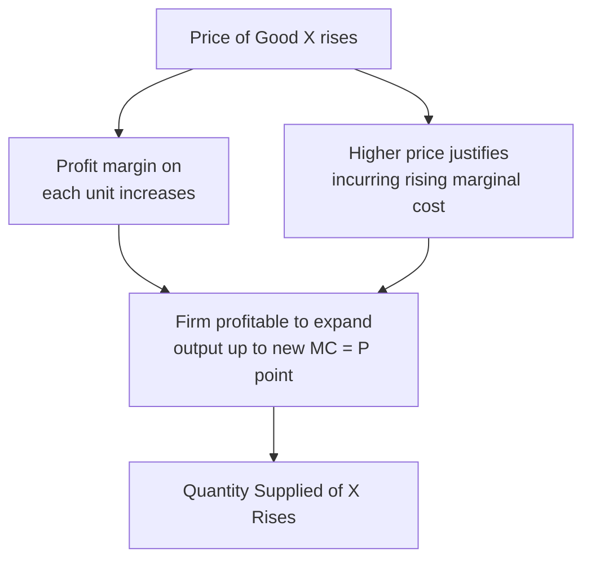
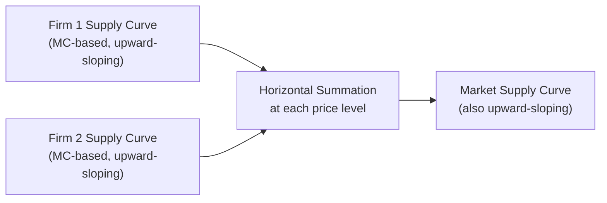

## Law of Supply and Supply Curve Derivation

### Definition and Scope

The law of supply describes the fundamental direct (positive) relationship between the price of a good and the quantity of that good producers are willing and able to offer for sale, holding all other determinants of supply constant. The supply curve is the graphical representation of this relationship. This item covers the statement and rationale of the law of supply, the theoretical derivation of the supply curve from underlying producer cost behavior, and the distinction between individual firm and market supply.

### The Law of Supply

**Definition**: The law of supply states that, *ceteris paribus* (holding all other factors constant), as the price of a good rises, the quantity supplied of that good rises; and as the price falls, the quantity supplied falls. Price and quantity supplied are directly (positively) related.

$$\text{As } P \uparrow, \quad Q_s \uparrow \quad (\text{ceteris paribus})$$

**Quantity supplied vs. supply**: A precise distinction underlies the law of supply, mirroring the demand-side distinction:

- **Quantity supplied**: The specific amount of a good producers are willing and able to sell at a *particular* price, at a given point in time.
- **Supply**: The entire relationship between price and quantity supplied across *all* possible prices — represented by the full supply curve or supply schedule, not a single point.

The law of supply describes how quantity supplied changes in response to a change in the good's own price — this is represented as a **movement along** a fixed supply curve, not a shift of the curve itself (per the ceteris paribus convention).

### Rationale for the Law of Supply

**1. Profit incentive**: A higher price, holding production costs constant, increases the profit margin on each unit sold, incentivizing existing producers to increase output and potentially attracting new producers into the market.

**2. Rising marginal cost and profit-maximizing behavior**: As covered in marginal analysis, a profit-maximizing firm produces up to the point where marginal revenue equals marginal cost ($MR = MC$). Because marginal cost typically rises as output increases (a consequence of the law of diminishing marginal returns to a variable input in the short run), a firm requires a *higher* price to justify profitably producing a *higher* quantity — directly implying the positive price-quantity relationship of the law of supply.

**3. Opportunity cost of resources**: Producing more of a given good typically requires reallocating resources away from other productive uses, and a higher price is needed to compensate for the rising opportunity cost of drawing progressively more resources away from alternative uses (mirroring the law of increasing opportunity cost on the PPF).

### Deriving the Individual (Firm) Supply Curve

**Step 1 — The firm's profit-maximizing decision rule**: A profit-maximizing firm in a competitive market produces the quantity at which marginal cost equals the market price (since, for a price-taking firm, marginal revenue equals price):

$$MC(Q) = P$$

**Step 2 — Rising marginal cost generates an upward-sloping relationship**: Because marginal cost typically rises with output in the short run (due to diminishing marginal returns to the variable input), a *higher* price is required to make it profitable for the firm to produce a *higher* quantity. Plotting the sequence of (price, quantity) pairs that satisfy $MC = P$ at each price level directly generates the firm's upward-sloping supply curve — in fact, the firm's short-run supply curve corresponds exactly to the portion of its marginal cost curve above the shutdown point (the price level below which the firm minimizes losses by ceasing production rather than continuing to operate).

**Step 3 — From a supply schedule to a supply curve**: A firm's supply behavior can be represented as a table (supply schedule) showing quantity supplied at each price, which is then plotted with price on the vertical axis and quantity on the horizontal axis to produce the supply curve.

**Illustrative individual firm supply schedule**:

| Price ($) | Quantity Supplied (units/week) |
| --- | --- |
| 2 | 0 |
| 4 | 5 |
| 6 | 10 |
| 8 | 14 |
| 10 | 17 |

**Illustrative diagram — deriving the supply curve from marginal cost (svg_diagram)**:

<svg xmlns="http://www.w3.org/2000/svg" viewBox="0 0 500 340" font-family="sans-serif">
<text x="250" y="22" text-anchor="middle" font-size="15" font-weight="bold">Supply Curve Derivation from Marginal Cost (svg_diagram)</text>
<line x1="60" y1="300" x2="60" y2="50" stroke="black" stroke-width="2" />
<line x1="60" y1="300" x2="440" y2="300" stroke="black" stroke-width="2" />
<text x="20" y="55" font-size="12">Price</text>
<text x="410" y="320" font-size="12">Quantity</text>
<path d="M 90 270 Q 200 220 300 140 Q 370 90 420 60" fill="none" stroke="#dc2626" stroke-width="3" />
<text x="340" y="80" font-size="12" fill="#dc2626">Supply Curve (S) = MC curve</text>
<circle cx="120" cy="255" r="4" fill="#2563eb" />
<circle cx="200" cy="210" r="4" fill="#2563eb" />
<circle cx="290" cy="150" r="4" fill="#2563eb" />
<circle cx="370" cy="95" r="4" fill="#2563eb" />
<text x="70" y="330" font-size="10" fill="#555">Points derived from MC = Price at each quantity level</text>
</svg>

### From Individual (Firm) Supply to Market Supply

**Definition**: Market supply is the total quantity supplied of a good by all producers in the market at each price level, obtained by *horizontally summing* individual firm supply curves (summing quantities, not prices, at each given price level).

$$Q_{s,\text{market}}(P) = \sum_{j=1}^{m} Q_{s,j}(P)$$

**Illustrative aggregation** (two firms, Firm 1 and Firm 2):

| Price ($) | $Q_1$ | $Q_2$ | $Q_{\text{market}} = Q_1 + Q_2$ |
| --- | --- | --- | --- |
| 4 | 5 | 3 | 8 |
| 6 | 10 | 7 | 17 |
| 8 | 14 | 11 | 25 |

The market supply curve retains the same upward-sloping shape as individual firm supply curves, since it is built from horizontally summing curves that each individually obey the law of supply. The number of firms in the market is itself one of the key determinants of market supply, distinct from a change in any individual firm's output decision.

### Movement Along vs. Shift of the Supply Curve

**Movement along the supply curve**: Caused *only* by a change in the good's own price, holding all other supply determinants constant (the ceteris paribus condition). This is precisely what the law of supply describes.

**Shift of the entire supply curve**: Caused by a change in any of the other determinants of supply held constant under ceteris paribus, including: input/factor prices (cost of labor, raw materials, capital), technology and productivity, prices of related goods in production (substitutes and complements in production), producer expectations about future prices, the number of sellers/firms in the market, and government policy (taxes, subsidies, regulation).

| Change | Effect on Supply Curve |
| --- | --- |
| Price of the good itself changes | Movement along the existing curve |
| Input costs, technology, related goods' prices, expectations, number of sellers, or taxes/subsidies change | Entire curve shifts (right = increase, left = decrease) |

**Direction of shifts**: A fall in input costs, an improvement in technology, or a production subsidy each reduces marginal cost at every output level, shifting the supply curve rightward (an increase in supply). Conversely, a rise in input costs, a production tax, or increased regulatory compliance costs shifts the supply curve leftward (a decrease in supply).

### Short-Run vs. Long-Run Supply Considerations

**Short run**: At least one factor of production (typically capital/plant size) is fixed, so firms adjust output primarily by varying the utilization of variable inputs (e.g., labor), subject to diminishing marginal returns — this is the standard setting in which the short-run, upward-sloping MC-based supply curve is derived.

**Long run**: All factors of production, including plant size and capital stock, are variable, and firms can enter or exit the industry freely (in a competitive market). Long-run supply curves are generally flatter (more elastic) than short-run supply curves, since firms have greater flexibility to adjust the scale and composition of production, and industry-level entry/exit further affects the responsiveness of quantity supplied to price changes over the long run. [Inference: the precise shape of a long-run industry supply curve (constant-cost, increasing-cost, or decreasing-cost industry) depends on how input prices respond to industry-wide expansion, which varies by industry and is a more advanced topic in production and market structure theory.]

### Common Misconceptions

- **Misconception**: "Supply" and "quantity supplied" are interchangeable terms. **Correction**: Supply refers to the entire price-quantity relationship (the whole curve); quantity supplied refers to a single point on that curve at one specific price — conflating the two is a frequent source of confusion between movements along and shifts of the supply curve, mirroring the analogous demand-side distinction.
- **Misconception**: The supply curve is simply an arbitrary empirical pattern with no theoretical grounding. **Correction**: The upward-sloping supply curve is derived formally from the combination of rising marginal cost (due to diminishing marginal returns) and the firm's profit-maximizing decision rule ($MC = P$), giving it a rigorous microeconomic foundation.
- **Misconception**: An increase in supply and an increase in quantity supplied always occur together. **Correction**: An increase in the good's own price causes only an increase in *quantity supplied* (movement along the curve); an increase in *supply* (a rightward shift of the entire curve) is caused specifically by changes in the other determinants of supply, such as falling input costs or improved technology.

### Related Topics

- Law of demand and demand curve derivation
- Market equilibrium: intersection of supply and demand
- Determinants of supply and supply curve shifts
- Producer theory: marginal cost, diminishing returns, and the shutdown decision
- Price elasticity of supply
- Short-run vs. long-run supply and industry cost structures