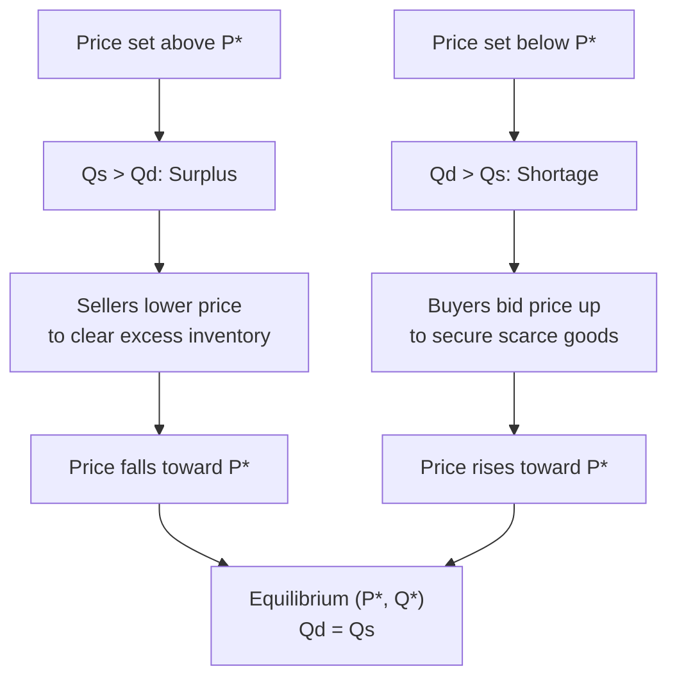

## Market Equilibrium and Price Determination

### Definition and Scope

Market equilibrium is the condition in a market at which the quantity of a good that consumers wish to buy exactly equals the quantity that producers wish to sell, at a specific price. This item covers how equilibrium price and quantity are determined through the interaction of supply and demand, the market adjustment process that moves prices toward equilibrium, and how shifts in supply or demand alter the equilibrium outcome.

### Defining Market Equilibrium

**Definition**: Market equilibrium occurs at the price and quantity combination where the demand curve and supply curve intersect — the point at which quantity demanded ($Q_d$) equals quantity supplied ($Q_s$).

$$Q_d(P^*) = Q_s(P^*) = Q^*$$

where $P^*$ is the **equilibrium price** (also called the market-clearing price) and $Q^*$ is the **equilibrium quantity**.

**Why equilibrium is a stable resting point**: At the equilibrium price, there is no inherent economic pressure for price to change, because the quantity buyers wish to purchase exactly matches the quantity sellers wish to offer — every buyer willing to pay $P^*$ can find a seller, and every seller willing to accept $P^*$ can find a buyer, with no unsatisfied demand or unsold surplus remaining.

**Illustrative equilibrium diagram (svg_diagram)**:

<svg xmlns="http://www.w3.org/2000/svg" viewBox="0 0 480 340" font-family="sans-serif">
<text x="240" y="22" text-anchor="middle" font-size="15" font-weight="bold">Market Equilibrium (svg_diagram)</text>
<line x1="60" y1="300" x2="60" y2="50" stroke="black" stroke-width="2" />
<line x1="60" y1="300" x2="440" y2="300" stroke="black" stroke-width="2" />
<text x="20" y="55" font-size="12">Price</text>
<text x="410" y="320" font-size="12">Quantity</text>
<path d="M 80 80 Q 180 160 260 230 Q 320 270 410 290" fill="none" stroke="#16a34a" stroke-width="3" />
<text x="350" y="240" font-size="12" fill="#16a34a">Demand (D)</text>
<path d="M 90 280 Q 190 220 280 140 Q 350 90 410 65" fill="none" stroke="#2563eb" stroke-width="3" />
<text x="340" y="90" font-size="12" fill="#2563eb">Supply (S)</text>
<circle cx="245" cy="195" r="6" fill="#dc2626" />
<line x1="245" y1="195" x2="245" y2="300" stroke="#dc2626" stroke-width="1" stroke-dasharray="4,2" />
<line x1="60" y1="195" x2="245" y2="195" stroke="#dc2626" stroke-width="1" stroke-dasharray="4,2" />
<text x="255" y="185" font-size="11" fill="#dc2626">Equilibrium (E)</text>
<text x="15" y="200" font-size="10">P*</text>
<text x="235" y="315" font-size="10">Q*</text>
</svg>

### Disequilibrium: Surplus and Shortage

**Surplus (excess supply)**: Occurs when the market price is set *above* the equilibrium price, so that quantity supplied exceeds quantity demanded at that price.

$$P > P^* \implies Q_s(P) > Q_d(P) \implies \text{Surplus} = Q_s(P) - Q_d(P)$$

**Shortage (excess demand)**: Occurs when the market price is set *below* the equilibrium price, so that quantity demanded exceeds quantity supplied at that price.

$$P < P^* \implies Q_d(P) > Q_s(P) \implies \text{Shortage} = Q_d(P) - Q_s(P)$$

**Illustrative surplus/shortage table** (using a hypothetical market schedule):

| Price ($) | $Q_d$ | $Q_s$ | Condition |
| --- | --- | --- | --- |
| 10 | 20 | 60 | Surplus of 40 |
| 8 | 35 | 45 | Surplus of 10 |
| 6 | 50 | 30 | Equilibrium ($P^* = 6$)* |
| 4 | 65 | 15 | Shortage of 50 |

*In this illustrative schedule, equilibrium falls between the listed price points; a continuous demand/supply relationship would identify $P^*$ precisely where $Q_d = Q_s$.

### The Market Adjustment Process (Tâtonnement)

**Definition**: The market adjustment process describes how, in a competitive market with flexible prices, disequilibrium prices tend to move automatically toward the equilibrium price through the independent decisions of buyers and sellers responding to observed surpluses or shortages.

**Adjustment from a surplus (price above equilibrium)**: Sellers observe unsold inventory accumulating, and respond by lowering prices to clear excess stock; as price falls, quantity demanded rises and quantity supplied falls, narrowing the surplus, until price reaches $P^*$ and the surplus is eliminated.

**Adjustment from a shortage (price below equilibrium)**: Buyers observe an inability to purchase desired quantities (e.g., waiting lines, stock-outs), and are willing to bid prices upward to secure the good; as price rises, quantity supplied rises and quantity demanded falls, narrowing the shortage, until price reaches $P^*$ and the shortage is eliminated.

This self-correcting tendency is a specific, mechanistic illustration of the "invisible hand" concept from classical economic thought — decentralized price adjustments by self-interested buyers and sellers move the market toward a coordinated equilibrium outcome without centralized direction.

### Comparative Statics: How Shifts Change Equilibrium

**Definition**: Comparative statics analysis examines how a shift in either the demand curve or the supply curve changes the equilibrium price and quantity, comparing the new equilibrium to the original one.

**Effect of a demand shift (supply held constant)**:

| Change | Effect on $P^*$ | Effect on $Q^*$ |
| --- | --- | --- |
| Demand increases (curve shifts right) | Rises | Rises |
| Demand decreases (curve shifts left) | Falls | Falls |

**Effect of a supply shift (demand held constant)**:

| Change | Effect on $P^*$ | Effect on $Q^*$ |
| --- | --- | --- |
| Supply increases (curve shifts right) | Falls | Rises |
| Supply decreases (curve shifts left) | Rises | Falls |

**Simultaneous shifts in both curves**: When both demand and supply shift at the same time, the direction of change in $P^*$ or $Q^*$ can become ambiguous without knowing the *relative magnitude* of each shift — one of the two outcome variables (price or quantity) will move in a determinate direction while the other becomes ambiguous, depending on which pair of shifts is considered.

| Simultaneous Shift | Effect on $Q^*$ | Effect on $P^*$ |
| --- | --- | --- |
| Demand ↑ and Supply ↑ | Rises (determinate) | Ambiguous |
| Demand ↓ and Supply ↓ | Falls (determinate) | Ambiguous |
| Demand ↑ and Supply ↓ | Ambiguous | Rises (determinate) |
| Demand ↓ and Supply ↑ | Ambiguous | Falls (determinate) |

**Illustrative diagram — demand increase shifting equilibrium (svg_diagram)**:

<svg xmlns="http://www.w3.org/2000/svg" viewBox="0 0 480 340" font-family="sans-serif">
<text x="240" y="22" text-anchor="middle" font-size="15" font-weight="bold">Effect of a Demand Increase (svg_diagram)</text>
<line x1="60" y1="300" x2="60" y2="50" stroke="black" stroke-width="2" />
<line x1="60" y1="300" x2="440" y2="300" stroke="black" stroke-width="2" />
<text x="20" y="55" font-size="12">Price</text>
<text x="410" y="320" font-size="12">Quantity</text>
<path d="M 80 80 Q 180 160 260 230 Q 320 270 410 290" fill="none" stroke="#16a34a" stroke-width="2.5" />
<text x="350" y="245" font-size="11" fill="#16a34a">D1</text>
<path d="M 120 60 Q 220 140 300 210 Q 360 250 430 270" fill="none" stroke="#16a34a" stroke-width="2.5" stroke-dasharray="6,3" />
<text x="395" y="255" font-size="11" fill="#16a34a">D2 (increase)</text>
<path d="M 90 280 Q 190 220 280 140 Q 350 90 410 65" fill="none" stroke="#2563eb" stroke-width="2.5" />
<text x="340" y="90" font-size="11" fill="#2563eb">Supply (S)</text>
<circle cx="245" cy="195" r="5" fill="#dc2626" />
<text x="200" y="212" font-size="10" fill="#dc2626">E1</text>
<circle cx="292" cy="163" r="5" fill="#9333ea" />
<text x="298" y="158" font-size="10" fill="#9333ea">E2 (new equilibrium)</text>
</svg>

### Price Ceilings and Price Floors — Government-Imposed Disequilibrium

**Price ceiling**: A legally imposed maximum price, set *below* the equilibrium price, intended to make a good more affordable. Because it is set below $P^*$, a binding price ceiling causes a persistent shortage, since quantity demanded at the ceiling price exceeds quantity supplied, and the market cannot adjust upward to clear the shortage as it normally would. Common example: rent control policies.

**Price floor**: A legally imposed minimum price, set *above* the equilibrium price, intended to guarantee producers or sellers a minimum return. Because it is set above $P^*$, a binding price floor causes a persistent surplus, since quantity supplied at the floor price exceeds quantity demanded, and the market cannot adjust downward to clear the surplus. Common example: minimum wage laws (in the labor market) and agricultural price supports.

**Non-binding controls**: A price ceiling set *above* equilibrium, or a price floor set *below* equilibrium, has no practical effect on market outcomes, since the market would not have reached that price level in the absence of the control anyway — the market continues to clear at $P^*$.

| Control | Position relative to $P^*$ | Effect |
| --- | --- | --- |
| Price ceiling | Below $P^*$ (binding) | Persistent shortage |
| Price ceiling | Above $P^*$ (non-binding) | No effect |
| Price floor | Above $P^*$ (binding) | Persistent surplus |
| Price floor | Below $P^*$ (non-binding) | No effect |

### Common Misconceptions

- **Misconception**: Market equilibrium means prices never change. **Correction**: Equilibrium describes a specific price-quantity combination given the *current* demand and supply curves; if either curve shifts due to a change in one of its underlying determinants, a new equilibrium price and quantity will be established, and the market will adjust toward that new point.
- **Misconception**: A shortage or surplus simply persists indefinitely in a free, unregulated market. **Correction**: In the absence of price controls or other rigidities, shortages and surpluses are inherently temporary, self-correcting phenomena that trigger price adjustments driving the market back toward equilibrium; a *persistent* shortage or surplus is generally a signal of a binding price control or some other market friction preventing price adjustment.
- **Misconception**: When both curves shift, the resulting change in price and quantity can always be predicted from the direction of the shifts alone. **Correction**: As shown in the comparative statics table above, only one of the two outcome variables (price or quantity) is determinate when both curves shift simultaneously in certain combinations; the other requires knowledge of the *relative magnitude* of each shift, which the direction of the shift alone does not provide.

### Related Topics

- Law of demand and demand curve derivation
- Law of supply and supply curve derivation
- Comparative statics and simultaneous shifts in supply and demand
- Price ceilings, price floors, and deadweight loss
- Price elasticity and its role in the speed/extent of market adjustment
- Consumer and producer surplus at market equilibrium