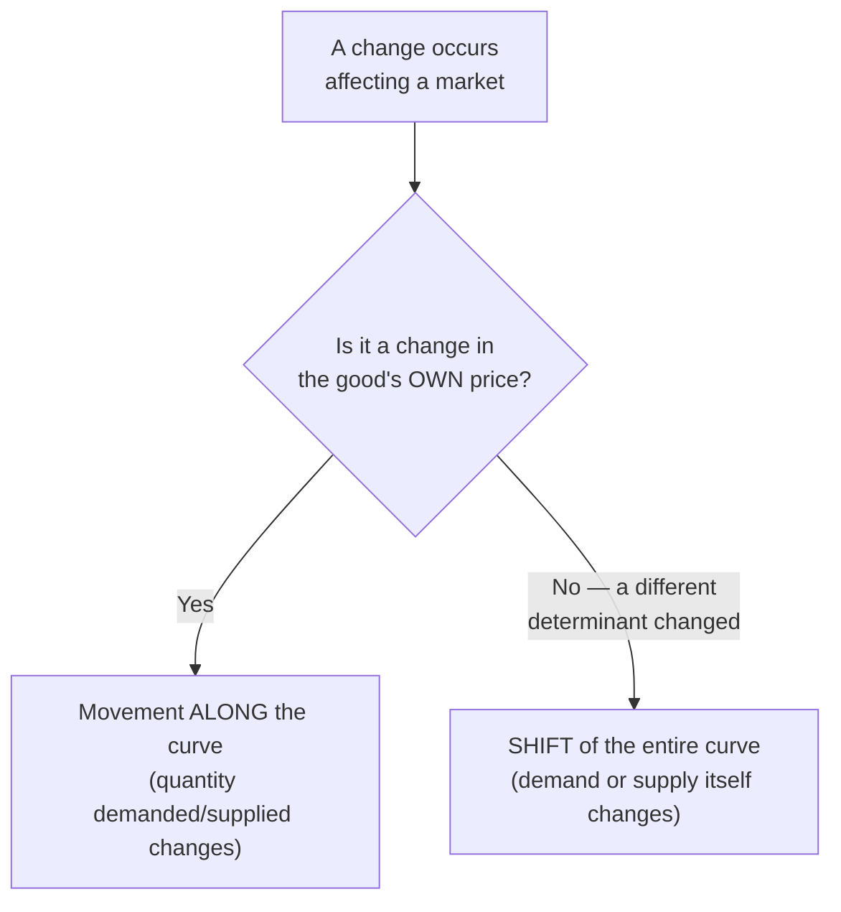
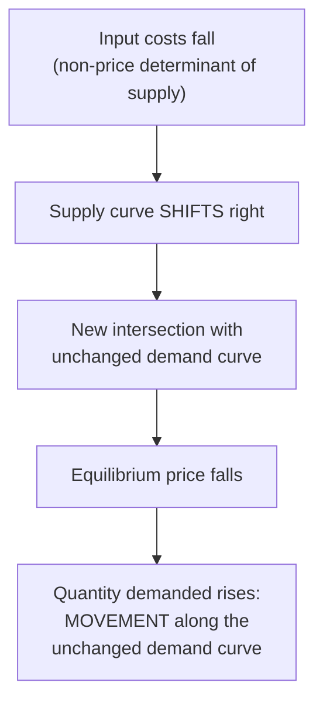

## Shifts versus Movements Along Curves

### Definition and Scope

Distinguishing a shift of a curve from a movement along a curve is one of the most fundamental analytical skills in microeconomics, applying to both demand and supply curves. This item isolates and systematically develops the distinction that underlies both the law of demand and the law of supply: which changes cause a curve to move along itself, and which changes cause the entire curve to relocate on the graph.

### The Core Distinction

**Movement along a curve**: A change in the quantity demanded or quantity supplied that results *only* from a change in the good's own price, with all other determinants held constant (the ceteris paribus condition). Graphically, this is represented by moving from one point to another *on the same, fixed curve*.

**Shift of a curve**: A change in demand or supply itself, caused by a change in one of the *other* determinants that were being held constant under ceteris paribus (not the good's own price). Graphically, this is represented by the *entire curve* relocating to a new position on the graph — every point on the new curve reflects the changed relationship at every price level, not just at one price.

**The essential rule**: If the good's own price changes, look for movement along the existing curve. If anything else relevant changes, look for a shift of the entire curve.

### Movements Along the Demand Curve

**Cause**: A change in the price of the good itself.

**Terminology**: Referred to precisely as a change in **quantity demanded**, not a change in "demand."

**Illustration**: If the price of coffee rises from $4 to $5 per cup, and consumers respond by reducing the number of cups purchased per week, this is a movement along the existing demand curve for coffee — the entire demand relationship (how much would be bought at every possible price) has not changed; only the specific point being observed on that unchanged relationship has moved.

### Shifts of the Demand Curve

**Cause**: A change in any determinant of demand other than the good's own price. The standard determinants of demand include:

| Determinant | Effect of an Increase (for a normal good) |
| --- | --- |
| Consumer income | Demand shifts right (increase) |
| Price of a substitute good | Demand shifts right (increase) |
| Price of a complementary good | Demand shifts left (decrease) |
| Consumer tastes/preferences (favorable shift) | Demand shifts right (increase) |
| Consumer expectations (expect future price rise) | Demand shifts right (increase now) |
| Number of buyers in the market | Demand shifts right (increase) |

**Terminology**: Referred to precisely as a change in **demand** (an increase = rightward shift; a decrease = leftward shift), not merely a change in "quantity demanded."

**Note on income and good type**: For a **normal good**, a rise in income shifts demand rightward (increase); for an **inferior good**, a rise in income shifts demand leftward (decrease), since consumers purchase less of an inferior good as they become wealthier and can afford preferred substitutes.

**Illustrative diagram — demand shift vs. movement (svg_diagram)**:

<svg xmlns="http://www.w3.org/2000/svg" viewBox="0 0 500 340" font-family="sans-serif">
<text x="250" y="22" text-anchor="middle" font-size="15" font-weight="bold">Demand: Movement vs. Shift (svg_diagram)</text>
<line x1="60" y1="300" x2="60" y2="50" stroke="black" stroke-width="2" />
<line x1="60" y1="300" x2="440" y2="300" stroke="black" stroke-width="2" />
<text x="20" y="55" font-size="12">Price</text>
<text x="410" y="320" font-size="12">Quantity</text>
<path d="M 80 80 Q 180 160 260 230 Q 320 270 410 290" fill="none" stroke="#2563eb" stroke-width="2.5" />
<text x="360" y="240" font-size="11" fill="#2563eb">D1 (original)</text>
<circle cx="180" cy="160" r="4" fill="#dc2626" />
<circle cx="260" cy="230" r="4" fill="#dc2626" />
<line x1="180" y1="160" x2="260" y2="230" stroke="#dc2626" stroke-width="1.5" stroke-dasharray="3,2" />
<text x="130" y="145" font-size="10" fill="#dc2626">Movement (Δ price)</text>
<path d="M 130 55 Q 230 130 310 200 Q 370 240 430 270" fill="none" stroke="#16a34a" stroke-width="2.5" stroke-dasharray="6,3" />
<text x="380" y="255" font-size="11" fill="#16a34a">D2 (shift: Δ income, etc.)</text>
</svg>

### Movements Along the Supply Curve

**Cause**: A change in the price of the good itself.

**Terminology**: Referred to precisely as a change in **quantity supplied**, not a change in "supply."

**Illustration**: If the price of wheat rises from $6 to $8 per bushel, and farmers respond by planting more acreage and producing more wheat, this is a movement along the existing supply curve for wheat — the entire supply relationship has not changed; only the specific point being observed on it has moved.

### Shifts of the Supply Curve

**Cause**: A change in any determinant of supply other than the good's own price. The standard determinants of supply include:

| Determinant | Effect of an Increase |
| --- | --- |
| Input/factor prices (wages, raw materials) | Supply shifts left (decrease) |
| Technology/productivity improvement | Supply shifts right (increase) |
| Price of a substitute good in production | Supply shifts left (decrease, as producers switch toward the substitute) |
| Producer expectations (expect future price rise) | Supply shifts left (decrease now, as producers hold back current output) |
| Number of sellers/firms in the market | Supply shifts right (increase) |
| Taxes on production | Supply shifts left (decrease) |
| Subsidies on production | Supply shifts right (increase) |

**Terminology**: Referred to precisely as a change in **supply** (an increase = rightward shift; a decrease = leftward shift), not merely a change in "quantity supplied."

**Illustrative diagram — supply shift vs. movement (svg_diagram)**:

<svg xmlns="http://www.w3.org/2000/svg" viewBox="0 0 500 340" font-family="sans-serif">
<text x="250" y="22" text-anchor="middle" font-size="15" font-weight="bold">Supply: Movement vs. Shift (svg_diagram)</text>
<line x1="60" y1="300" x2="60" y2="50" stroke="black" stroke-width="2" />
<line x1="60" y1="300" x2="440" y2="300" stroke="black" stroke-width="2" />
<text x="20" y="55" font-size="12">Price</text>
<text x="410" y="320" font-size="12">Quantity</text>
<path d="M 100 280 Q 200 220 280 140 Q 350 90 410 65" fill="none" stroke="#2563eb" stroke-width="2.5" />
<text x="330" y="90" font-size="11" fill="#2563eb">S1 (original)</text>
<circle cx="200" cy="215" r="4" fill="#dc2626" />
<circle cx="280" cy="140" r="4" fill="#dc2626" />
<line x1="200" y1="215" x2="280" y2="140" stroke="#dc2626" stroke-width="1.5" stroke-dasharray="3,2" />
<text x="215" y="200" font-size="10" fill="#dc2626">Movement (Δ price)</text>
<path d="M 140 280 Q 240 200 320 110 Q 380 60 420 45" fill="none" stroke="#16a34a" stroke-width="2.5" stroke-dasharray="6,3" />
<text x="330" y="55" font-size="11" fill="#16a34a">S2 (shift: Δ technology, etc.)</text>
</svg>

### Summary Comparison Table

| Aspect | Movement Along Curve | Shift of Curve |
| --- | --- | --- |
| Cause | Change in the good's own price | Change in a non-price determinant |
| Demand-side terminology | Change in quantity demanded | Change in demand |
| Supply-side terminology | Change in quantity supplied | Change in supply |
| Graphical effect | Point moves along the same curve | Entire curve relocates |
| Held constant? | All non-price determinants held constant | The good's own price is not what's causing the change |

### Combining Movements and Shifts in Analysis

**A common analytical sequence**: In many real-world scenarios, an initial shift of one curve (say, supply) leads to a new equilibrium price, which then interacts with the (unchanged) demand curve — producing a movement along the demand curve to the new equilibrium quantity. This two-step process is a standard technique for full comparative statics analysis:

1. Identify which curve shifts based on the underlying cause (a non-price determinant change).
2. Determine the direction of the shift (increase = right, decrease = left).
3. Find the new equilibrium price and quantity where the shifted curve intersects the *other*, unshifted curve.
4. Recognize that the unshifted curve itself did not move — the change in its quantity is a movement along that curve, driven by the change in price generated by the shift in the other curve.

### Common Misconceptions

- **Misconception**: Any change in quantity bought or sold represents a "change in demand" or "change in supply." **Correction**: Precise economic terminology reserves "change in demand/supply" specifically for curve shifts caused by non-price determinants; a change driven by the good's own price is a "change in quantity demanded/supplied," representing movement along an unchanged curve.
- **Misconception**: A shift in one curve cannot also be described using the language of "movement" anywhere in the analysis. **Correction**: A shift in one curve (e.g., supply) typically produces a new equilibrium price, which in turn causes a movement along the *other*, unshifted curve (e.g., demand) — both concepts frequently appear together within a single comparative statics analysis, applied to different curves.
- **Misconception**: The direction of a shift (which way the curve moves) is difficult to determine without memorizing every determinant separately. **Correction**: A consistent underlying logic applies: any determinant change that makes a good more desirable/affordable to buy shifts demand right; any change that makes it cheaper/easier to produce shifts supply right — the reference tables above can be derived from this consistent underlying reasoning rather than requiring rote memorization of each case independently.

### Related Topics

- Law of demand and demand curve derivation
- Law of supply and supply curve derivation
- Market equilibrium and comparative statics
- Determinants of demand: income, related goods, tastes, expectations
- Determinants of supply: input costs, technology, taxes and subsidies
- Normal goods vs. inferior goods