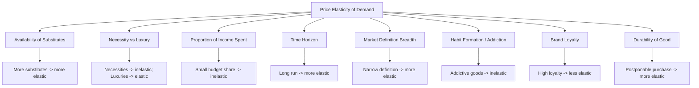

## Price Elasticity of Demand and Determinants

### Definition and Conceptual Basis

Price elasticity of demand (PED) measures the responsiveness of quantity demanded of a good to a change in its own price, holding all other determinants of demand constant (ceteris paribus). It quantifies the sensitivity of consumer purchasing behavior to price movements, expressed as a ratio of relative changes rather than absolute changes, which allows comparison across goods with different units and price scales.

**Key Points**

- PED is always conceptually negative for normal downward-sloping demand curves (law of demand: price and quantity demanded move inversely), though it is conventionally reported as an absolute value.
- PED is a point-in-time and context-specific measure; it can vary along a single demand curve.
- It is distinct from, but related to, income elasticity of demand and cross-price elasticity of demand.

### The Basic Formula

**Percentage Method (Point Elasticity Approximation)**

$$E_d = \frac{\%\Delta Q_d}{\%\Delta P}$$

Where:

- $\%\Delta Q_d$ = percentage change in quantity demanded
- $\%\Delta P$ = percentage change in price

Expanded form:

$$E_d = \frac{\Delta Q_d / Q_d}{\Delta P / P}$$

**Midpoint (Arc Elasticity) Method**

The midpoint formula is preferred for calculating elasticity over a discrete price range because it yields the same result regardless of the direction of the price change (avoiding the base-point asymmetry problem of the simple percentage method):

$$E_d = \frac{(Q_2 - Q_1) / [(Q_2 + Q_1)/2]}{(P_2 - P_1) / [(P_2 + P_1)/2]}$$

**Example**

Suppose the price of a good rises from $10 to $12, and quantity demanded falls from 100 units to 80 units.

Using the midpoint method:

- $\Delta Q = 80 - 100 = -20$; average $Q = 90$; $\%\Delta Q = -20/90 = -22.2\%$
- $\Delta P = 12 - 10 = 2$; average $P = 11$; $\%\Delta P = 2/11 = 18.2\%$
- $E_d = -22.2\% / 18.2\% \approx -1.22$

The magnitude $|E_d| = 1.22 > 1$ indicates elastic demand over this range.

### Classifications of Elasticity

| Value of $|E_d|$ | Classification | Interpretation |

|---|---|---|

| $E_d = 0$ | Perfectly inelastic | Quantity demanded does not change at all with price |

| $0 < |E_d| < 1$ | Inelastic (relatively) | Quantity demanded changes proportionally less than price |

| $|E_d| = 1$ | Unit elastic | Quantity demanded changes exactly proportionally to price |

| $1 < |E_d| < \infty$ | Elastic (relatively) | Quantity demanded changes proportionally more than price |

| $|E_d| \to \infty$ | Perfectly elastic | Any price increase causes quantity demanded to fall to zero |

**Geometric Illustration (svg_diagram)**

<svg xmlns="http://www.w3.org/2000/svg" viewBox="0 0 720 460" font-family="Helvetica, Arial, sans-serif">
<text x="360" y="30" text-anchor="middle" font-size="18" font-weight="bold" fill="#1a1a1a">Demand Curve Elasticity Extremes (svg_diagram)</text>

<g transform="translate(20,60)">
<line x1="40" y1="20" x2="40" y2="330" stroke="#333" stroke-width="2" />
<line x1="40" y1="330" x2="220" y2="330" stroke="#333" stroke-width="2" />
<text x="10" y="20" font-size="11" fill="#333">P</text>
<text x="215" y="350" font-size="11" fill="#333">Q</text>
<line x1="130" y1="20" x2="130" y2="330" stroke="#c0392b" stroke-width="3" />
<text x="70" y="380" font-size="13" font-weight="bold" fill="#c0392b">Perfectly Inelastic</text>
<text x="70" y="398" font-size="11" fill="#555">(Ed = 0, vertical)</text>
</g>

<g transform="translate(270,60)">
<line x1="40" y1="20" x2="40" y2="330" stroke="#333" stroke-width="2" />
<line x1="40" y1="330" x2="220" y2="330" stroke="#333" stroke-width="2" />
<text x="10" y="20" font-size="11" fill="#333">P</text>
<text x="215" y="350" font-size="11" fill="#333">Q</text>
<path d="M 60 40 Q 130 175 210 320" stroke="#2980b9" stroke-width="3" fill="none" />
<text x="55" y="380" font-size="13" font-weight="bold" fill="#2980b9">Unit Elastic</text>
<text x="55" y="398" font-size="11" fill="#555">(Ed = 1, rectangular hyperbola)</text>
</g>

<g transform="translate(520,60)">
<line x1="40" y1="20" x2="40" y2="330" stroke="#333" stroke-width="2" />
<line x1="40" y1="330" x2="220" y2="330" stroke="#333" stroke-width="2" />
<text x="10" y="20" font-size="11" fill="#333">P</text>
<text x="215" y="350" font-size="11" fill="#333">Q</text>
<line x1="40" y1="150" x2="220" y2="150" stroke="#27ae60" stroke-width="3" />
<text x="65" y="380" font-size="13" font-weight="bold" fill="#27ae60">Perfectly Elastic</text>
<text x="65" y="398" font-size="11" fill="#555">(Ed → ∞, horizontal)</text>
</g>
</svg>

### Determinants of Price Elasticity of Demand

**1. Availability of Substitutes**

The number and closeness of substitute goods is generally regarded as the most significant determinant. The more close substitutes available, the more elastic demand tends to be, since consumers can easily switch away when price rises.

- Example: Demand for a specific brand of butter (e.g., a particular supermarket brand) tends to be more elastic than demand for butter as a general category, since consumers can switch to other brands.
- Narrowly defined goods (a specific brand) tend to exhibit more elastic demand than broadly defined categories (the entire product class).

**2. Necessity vs. Luxury**

Necessities (staple foods, essential medicine, water) tend to have inelastic demand because consumption cannot be easily postponed or foregone. Luxuries (jewelry, vacations, premium electronics) tend to have elastic demand because purchases can be deferred or skipped.

**3. Proportion of Income Spent on the Good**

Goods that constitute a small fraction of a consumer's budget (salt, matches, chewing gum) tend to have inelastic demand, since price changes barely affect overall purchasing power. Goods that take up a large share of income (automobiles, housing, foreign holidays) tend to have more elastic demand.

**4. Time Horizon**

Demand tends to become more elastic over longer time periods, because consumers have more time to find substitutes, change habits, or adjust consumption patterns. In the short run, consumers may be "locked in" to existing consumption patterns (e.g., existing car/appliance choices affecting gasoline or electricity demand), producing more inelastic short-run demand.

**5. Definition of the Market/Good**

Broadly defined markets (e.g., "food") tend to have more inelastic demand than narrowly defined markets (e.g., "organic breakfast cereal"), because narrower categories have more available substitutes.

**6. Habit Formation and Addiction**

Goods subject to habitual or addictive consumption (tobacco, alcohol, certain drugs) tend to exhibit inelastic demand, since consumers continue purchasing despite price increases due to physiological or psychological dependence.

**7. Brand Loyalty**

Strong brand loyalty reduces the perceived availability of substitutes in the consumer's mind, decreasing elasticity even when objective substitutes exist in the market.

**8. Durability of the Good**

For durable goods, demand can be more elastic in the sense that purchases can be postponed (deferred replacement) when prices rise, whereas non-durable/perishable goods often need continuous repurchase.

### Determinants Summary Diagram

### Elasticity Along a Linear Demand Curve

A common misconception is that elasticity is constant along a straight-line demand curve. In fact, for a linear demand curve, elasticity varies continuously from point to point, even though the slope $(\Delta P/\Delta Q)$ remains constant.

For a linear demand curve $P = a - bQ$:

$$E_d = \frac{1}{b} \cdot \frac{P}{Q} \cdot (-1)$$

More precisely, elasticity depends on the ratio $P/Q$, which changes along the line:

- Near the vertical (price) intercept: $Q$ is small, $P$ is large → elasticity is high (elastic).
- At the midpoint of the line: $E_d = -1$ (unit elastic).
- Near the horizontal (quantity) intercept: $P$ is small, $Q$ is large → elasticity is low (inelastic).

### Relationship Between Elasticity and Total Revenue

Total revenue (TR) is defined as $TR = P \times Q$. The relationship between PED and the effect of a price change on total revenue is a core application:

| Demand Elasticity | Price Increase Effect on TR | Price Decrease Effect on TR |
| --- | --- | --- |
| Elastic ($ | E_d | > 1$) |
| Unit elastic ($ | E_d | = 1$) |
| Inelastic ($ | E_d | < 1$) |

**Explanation**: When demand is elastic, the percentage drop in quantity demanded outweighs the percentage rise in price, so revenue falls despite the higher price. When demand is inelastic, the percentage drop in quantity is smaller than the percentage price rise, so revenue increases.

**Total Revenue Test (Diagrammatic) (svg_diagram)**

<svg xmlns="http://www.w3.org/2000/svg" viewBox="0 0 640 380" font-family="Helvetica, Arial, sans-serif">
<text x="320" y="28" text-anchor="middle" font-size="17" font-weight="bold" fill="#1a1a1a">Demand Curve and Total Revenue Test (svg_diagram)</text>

<g transform="translate(40,50)">
<line x1="0" y1="0" x2="0" y2="260" stroke="#333" stroke-width="2" />
<line x1="0" y1="260" x2="260" y2="260" stroke="#333" stroke-width="2" />
<text x="-25" y="0" font-size="12" fill="#333">P</text>
<text x="265" y="280" font-size="12" fill="#333">Q</text>
<line x1="10" y1="10" x2="250" y2="250" stroke="#2c3e50" stroke-width="2.5" />
<text x="60" y="30" font-size="11" fill="#c0392b">Elastic region</text>
<text x="140" y="150" font-size="11" fill="#8e44ad">Unit elastic (midpoint)</text>
<text x="150" y="230" font-size="11" fill="#27ae60">Inelastic region</text>
<circle cx="130" cy="130" r="4" fill="#8e44ad" />
</g>

<g transform="translate(340,50)">
<line x1="0" y1="0" x2="0" y2="260" stroke="#333" stroke-width="2" />
<line x1="0" y1="260" x2="260" y2="260" stroke="#333" stroke-width="2" />
<text x="-30" y="0" font-size="12" fill="#333">TR</text>
<text x="265" y="280" font-size="12" fill="#333">Q</text>
<path d="M 5 255 Q 130 20 255 255" stroke="#2980b9" stroke-width="2.5" fill="none" />
<line x1="130" y1="0" x2="130" y2="260" stroke="#8e44ad" stroke-width="1" stroke-dasharray="4,4" />
<text x="90" y="300" font-size="11" fill="#555">TR maximized at unit elastic point</text>
</g>
</svg>

### Elasticity, Tax Incidence, and Policy Applications

**Key Points**

- Excise tax burden distribution depends on the relative elasticities of demand and supply. The more inelastic side of the market (demand or supply) bears a larger share of the tax burden, because that side is less able to adjust quantity in response to the price change.
- Sin taxes (on tobacco, alcohol) exploit inelastic demand to raise government revenue efficiently with relatively smaller deadweight loss (relative to taxing elastic goods), while also serving corrective/Pigouvian purposes for negative externalities.
- Elasticity of demand is central to price discrimination strategy: firms charge higher prices to segments with more inelastic demand and lower prices to segments with more elastic demand (e.g., student/senior discounts, peak vs. off-peak pricing).
- Agricultural price volatility is frequently explained by inelastic demand for staple crops combined with supply shocks (weather, harvest variability), producing large price swings from small quantity shifts (cobweb model context).

### Elasticity and Firm Pricing Strategy

**Example**

A firm assessing whether to raise prices should estimate PED for its product:

- If $|E_d| < 1$ (inelastic): raising price increases total revenue — a rational strategy if marginal cost changes are not a concern.
- If $|E_d| > 1$ (elastic): raising price decreases total revenue — the firm should consider alternative strategies (non-price competition, bundling, differentiation) rather than price increases.

This logic underpins markup pricing rules in monopoly/monopolistic competition models, where the profit-maximizing markup over marginal cost is inversely related to the elasticity of demand faced by the firm:

$$\frac{P - MC}{P} = \frac{-1}{E_d}$$

This is known as the Lerner Index / inverse elasticity pricing rule, showing that firms facing more inelastic demand can sustain higher markups.

### Empirical Measurement Considerations

- Real-world PED estimates are typically derived via regression analysis of historical price-quantity data, controlling for confounding variables (income, prices of related goods, seasonality, advertising).
- [Inference] Because observed price and quantity are jointly determined by supply and demand shifts, naive correlation between price and quantity can produce biased elasticity estimates; economists often use instrumental variable techniques or natural experiments to isolate demand-side responses.
- [Unverified] Specific numerical elasticity estimates cited in textbooks (e.g., "gasoline demand elasticity is -0.2 in the short run") vary across studies, time periods, and countries, and should be treated as illustrative rather than universal constants.

### Common Misconceptions

- **Misconception**: Elasticity equals the slope of the demand curve. **Correction**: Slope is $\Delta P/\Delta Q$ (a constant for linear curves), while elasticity is a percentage ratio that varies along the curve based on the price-quantity point being evaluated.
- **Misconception**: Inelastic demand means quantity demanded never changes. **Correction**: Inelastic simply means quantity demanded changes proportionally less than price; it can still change to a non-zero degree unless perfectly inelastic ($E_d = 0$).
- **Misconception**: A steeper-looking demand curve is always more inelastic in absolute terms. **Correction**: Visual steepness depends on axis scaling; elasticity must be calculated using percentage changes, not visual slope alone.

### Worked Practice Problem

**Example**

A café raises the price of a specialty coffee from $4.00 to $4.40. Quantity demanded falls from 200 cups/day to 170 cups/day. Calculate PED using the midpoint method and interpret the result for revenue.

1. $\%\Delta Q = (170-200)/[(170+200)/2] = -30/185 = -16.2\%$
2. $\%\Delta P = (4.40-4.00)/[(4.40+4.00)/2] = 0.40/4.20 = 9.5\%$
3. $E_d = -16.2\%/9.5\% \approx -1.70$

**Interpretation**: $|E_d| = 1.70 > 1$, so demand is elastic over this range. Since demand is elastic, the price increase will reduce total revenue:

- Old TR $= 4.00 \times 200 = \$800$
- New TR $= 4.40 \times 170 = \$748$

Revenue fell by $52, confirming the elastic classification's prediction.

**Next Steps**

**Related Topics**

- Cross-Price Elasticity of Demand (substitutes vs. complements)
- Income Elasticity of Demand and Engel Curves
- Price Elasticity of Supply and its Determinants
- Tax Incidence and Deadweight Loss under Different Elasticities
- Consumer and Producer Surplus
- Monopoly Pricing and the Lerner Index
- Price Discrimination (First, Second, Third Degree)
- Cobweb Model and Agricultural Market Price Instability
- Pigouvian Taxes and Externality Correction
- Elasticity of Demand for Labor (factor market extension)