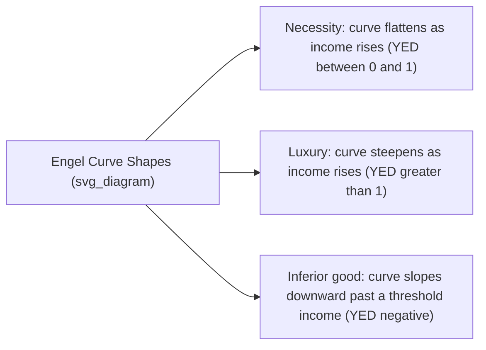
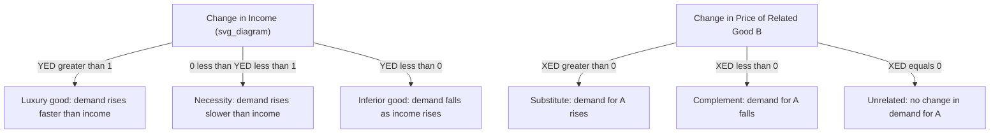

## Income Elasticity and Cross-Price Elasticity

### Overview

Income elasticity of demand (YED) and cross-price elasticity of demand (XED) extend the elasticity framework beyond own-price elasticity by measuring how quantity demanded responds to changes in consumer income and in the prices of related goods, respectively. Both are essential for classifying goods, forecasting demand shifts over the business cycle, and analyzing competitive relationships between products.

### Income Elasticity of Demand (YED)

**Definition**

Income elasticity of demand measures the responsiveness of quantity demanded of a good to a change in consumer income, holding the good's own price and the prices of other goods constant.

**Formula**

$$YED = \dfrac{\%\Delta Q_d}{\%\Delta Y}$$

Using the midpoint (arc) method to avoid directional bias:

$$YED = \dfrac{(Q_2 - Q_1)/[(Q_2+Q_1)/2]}{(Y_2 - Y_1)/[(Y_2+Y_1)/2]}$$

where $Q$ is quantity demanded and $Y$ is income.

**Classification of Goods by YED**

| YED Value | Classification | Interpretation |
| --- | --- | --- |
| $YED < 0$ | Inferior good | Demand falls as income rises |
| $0 < YED < 1$ | Normal good, income-inelastic (necessity) | Demand rises slower than income |
| $YED = 1$ | Unit income elastic | Demand rises proportionally with income |
| $YED > 1$ | Normal good, income-elastic (luxury/superior) | Demand rises faster than income |
| $YED = 0$ | Income-neutral | Demand unaffected by income |

**Key Points**

- Necessities (staple foods, basic utilities) typically have $0 < YED < 1$.
- Luxuries (designer goods, overseas travel, premium electronics) typically have $YED > 1$.
- Inferior goods (e.g., instant noodles, second-hand clothing, public transport in some contexts) have negative YED — as income rises, consumers substitute toward superior alternatives.
- A good can shift classification over time or across income brackets: what is a luxury at low income levels may become a necessity as average income rises (a phenomenon linked to Engel's Law).

**Engel's Law and Engel Curves**

Engel's Law states that as household income rises, the proportion of income spent on food declines, even if the absolute amount spent increases. This is graphically represented by an Engel curve, which plots quantity demanded (or expenditure) against income at a given price.

**Numerical Example**

A household's income rises from ₱30,000 to ₱36,000 per month (a 20% increase). Monthly restaurant visits rise from 4 to 6 (a 50% increase).

$$YED = \dfrac{50\%}{20\%} = 2.5$$

Since $YED > 1$, restaurant dining is a normal, income-elastic good (a luxury/superior good) for this household.

**Applications of YED**

- **Business cycle forecasting**: Firms selling income-elastic goods (luxury cars, jewelry, travel) experience amplified sales swings during expansions and recessions; firms selling income-inelastic goods (basic groceries, utilities) see comparatively stable demand.
- **Sectoral growth and structural change**: Over long-run economic development, resources shift away from agriculture (low/negative YED for staple foods in wealthier economies) toward manufacturing and services (often higher YED), a pattern central to development economics.
- **Government policy**: Predicting how tax revenues (e.g., VAT) or demand for public services shift with economic growth or downturns.
- **Business strategy**: Portfolio diversification across goods with different YED values to smooth revenue over the economic cycle.

### Cross-Price Elasticity of Demand (XED)

**Definition**

Cross-price elasticity of demand measures the responsiveness of quantity demanded of one good (Good A) to a change in the price of another good (Good B), holding all else constant.

**Formula**

$$XED = \dfrac{\%\Delta Q_{d,A}}{\%\Delta P_B}$$

Midpoint version:

$$XED = \dfrac{(Q_{A2} - Q_{A1})/[(Q_{A2}+Q_{A1})/2]}{(P_{B2} - P_{B1})/[(P_{B2}+P_{B1})/2]}$$

**Classification of Goods by XED**

| XED Sign/Value | Relationship | Interpretation |
| --- | --- | --- |
| $XED > 0$ | Substitutes | Price of B rises → demand for A rises (consumers switch to A) |
| $XED < 0$ | Complements | Price of B rises → demand for A falls (A and B are consumed together) |
| $XED = 0$ | Unrelated (independent) | No relationship between the two goods |
| Larger $\lvert XED \rvert$ | Stronger relationship | Weak substitutes/complements have XED near 0; close substitutes/complements have large $\lvert XED \rvert$ |

**Key Points**

- **Substitutes** (e.g., butter and margarine, Coke and Pepsi, bus fare and jeepney fare): a price increase in one shifts the demand curve of the other to the right.
- **Complements** (e.g., printers and ink cartridges, cars and gasoline, smartphones and mobile data plans): a price increase in one shifts the demand curve of the other to the left.
- The magnitude of XED indicates the closeness of the relationship — near-perfect substitutes (generic vs. branded paracetamol) have high positive XED; strong complements (left shoes and right shoes) have highly negative XED.
- XED is not necessarily symmetric: $XED_{AB}$ (response of A to B's price) need not equal $XED_{BA}$ (response of B to A's price) in magnitude.

**Numerical Example (Substitutes)**

The price of Pepsi rises from ₱30 to ₱36 (a 20% increase). Quantity demanded of Coke rises from 100 to 110 units (a 10% increase).

$$XED = \dfrac{10\%}{20\%} = 0.5$$

Positive XED confirms Coke and Pepsi are substitutes, though only moderately close ones (a value near or above 1 would indicate very close substitutes).

**Numerical Example (Complements)**

The price of printers falls from $100 to $80 (a 20% decrease). Quantity demanded of ink cartridges rises from 200 to 220 units (a 10% increase).

$$XED = \dfrac{10\%}{-20\%} = -0.5$$

Negative XED confirms printers and ink cartridges are complements.

**Applications of XED**

- **Antitrust and market definition**: Regulators use XED to determine whether two products compete in the same relevant market (a high positive XED between two brands suggests they belong to the same market and merging them could reduce competition).
- **Pricing strategy**: Firms selling complementary goods may price one good low (or as a "loss leader," e.g., printers) to drive demand for the higher-margin complement (ink), a strategy sometimes called the "razor-and-blades" model.
- **Predicting spillover effects**: Estimating how a price change or tax on one good (e.g., a sugar tax on soda) affects demand for related goods (e.g., fruit juice as a substitute, or snacks as a complement).
- **Portfolio and supply-chain planning**: Firms producing complementary goods coordinate production planning based on expected cross-price responses.

### Comparison: YED vs. XED vs. Own-Price Elasticity

| Elasticity | Measures Response To | Sign Convention | Classifies |
| --- | --- | --- | --- |
| Own-price elasticity (PED) | Change in a good's own price | Typically negative (Law of Demand) | Elastic / inelastic goods |
| Income elasticity (YED) | Change in consumer income | Positive (normal) or negative (inferior) | Normal (necessity/luxury) / inferior goods |
| Cross-price elasticity (XED) | Change in price of a related good | Positive (substitutes) or negative (complements) | Substitutes / complements / unrelated |

### Diagrammatic Summary

### Worked Problem

A consumer's data on Good X:

- Income rises from $2,000 to $2,200 (10% increase); quantity demanded of X falls from 50 to 45 units (−10% change).
- Price of Good Y falls from $10 to $9 (−10% change); quantity demanded of X falls from 50 to 48 units (−4% change).

**Step 1 — YED:**

$$YED = \dfrac{-10\%}{10\%} = -1.0$$

Good X is an inferior good.

**Step 2 — XED (with respect to Good Y):**

$$XED = \dfrac{-4\%}{-10\%} = 0.4$$

Positive XED indicates X and Y are substitutes (weakly, given the value is well below 1).

**Interpretation**: Good X behaves as an inferior good relative to income, yet is a mild substitute for Good Y. This is plausible — for example, X could be a lower-quality staple good that consumers also occasionally substitute with a moderately related alternative Y.

### Common Pitfalls

- **Confusing YED sign with PED sign**: A negative YED does not imply a violation of the Law of Demand; it only describes the income relationship, not the price relationship.
- **Assuming XED symmetry**: The cross-price elasticity of A with respect to B's price is not guaranteed to equal that of B with respect to A's price.
- **Using point elasticity formulas across large discrete changes**: For large percentage changes, the midpoint (arc elasticity) method is preferred to avoid the asymmetry of point elasticity depending on the direction of the change. [Inference: whether a given textbook or exam expects the point or arc method depends on the specific curriculum's convention.]
- **Ignoring ceteris paribus violations**: In real-world data, income and multiple relative prices often change simultaneously, so isolating YED or XED empirically typically requires multivariate regression (e.g., holding other prices constant via control variables) rather than simple before-after ratios.

**Related Topics**

- Own-price elasticity of demand (PED) and determinants of elasticity
- Price elasticity of supply
- Consumer theory: indifference curves and the income-consumption curve
- Engel's Law and structural transformation in development economics
- Market definition and antitrust analysis (SSNIP test)
- Elasticity and tax incidence (excise taxes, sugar taxes)
- Giffen goods and Veblen goods as special demand cases
- Total revenue test and its relationship to elasticity