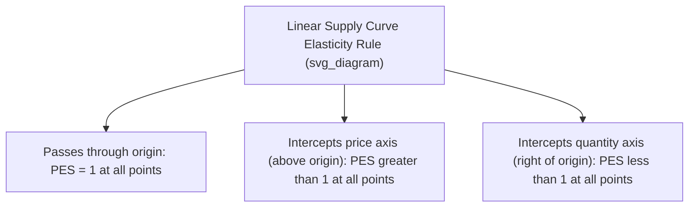
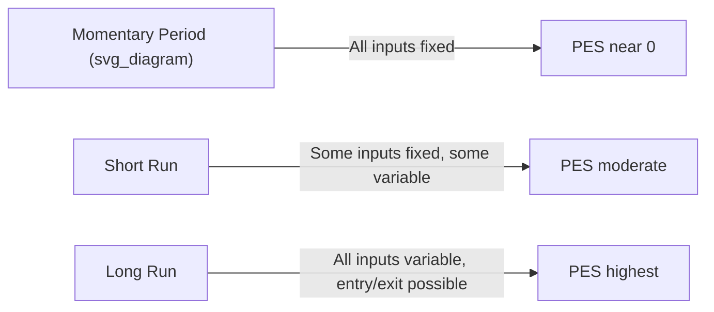
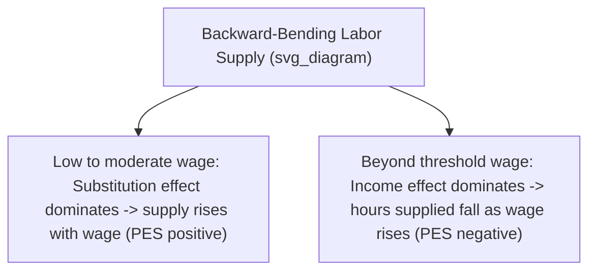

## Elasticity of Supply

### Overview

Price elasticity of supply (PES) measures the responsiveness of quantity supplied of a good to a change in its own price, holding all other determinants of supply (input costs, technology, expectations, number of sellers) constant. It captures how readily producers can adjust output in response to price signals and is central to understanding market adjustment speed, tax incidence, and price volatility.

### Formula

$$PES = \dfrac{\%\Delta Q_s}{\%\Delta P}$$

Midpoint (arc) method, used to avoid directional bias over discrete changes:

$$PES = \dfrac{(Q_2 - Q_1)/[(Q_2+Q_1)/2]}{(P_2 - P_1)/[(P_2+P_1)/2]}$$

Point elasticity (for continuous/differentiable supply functions):

$$PES = \dfrac{dQ_s}{dP} \cdot \dfrac{P}{Q_s}$$

**Sign convention**: Because supply curves are typically upward-sloping (Law of Supply), PES is normally positive. A negative PES is unusual and generally signals a backward-bending supply curve (discussed below).

### Classification of Supply Elasticity

| PES Value | Classification | Interpretation |
| --- | --- | --- |
| $PES = 0$ | Perfectly inelastic | Quantity supplied is fixed regardless of price (vertical supply curve) |
| $0 < PES < 1$ | Inelastic | Quantity supplied changes proportionally less than price |
| $PES = 1$ | Unit elastic | Quantity supplied changes proportionally with price |
| $PES > 1$ | Elastic | Quantity supplied changes proportionally more than price |
| $PES = \infty$ | Perfectly elastic | Infinite quantity supplied at a given price; any price drop reduces quantity to zero (horizontal supply curve) |

**Key geometric note**: Unlike demand curves, where slope alone does not determine elasticity type, for *linear supply curves through the origin*, PES = 1 at every point regardless of slope. A linear supply curve intersecting the price axis (positive Q-intercept... more precisely, a positive price-axis intercept) has $PES > 1$ everywhere; one intersecting the quantity axis has $PES < 1$ everywhere.

### Diagram: Extreme Cases

<svg xmlns="http://www.w3.org/2000/svg" viewBox="0 0 720 320">
<text x="20" y="20" font-size="14" font-weight="bold" fill="var(--text-color, #222)">Perfectly Inelastic vs. Perfectly Elastic Supply (svg_diagram)</text>

<g transform="translate(40,40)">
<line x1="0" y1="0" x2="0" y2="220" stroke="#333" stroke-width="2" />
<line x1="0" y1="220" x2="260" y2="220" stroke="#333" stroke-width="2" />
<text x="-25" y="-5" font-size="12">Price</text>
<text x="230" y="245" font-size="12">Quantity</text>
<line x1="130" y1="0" x2="130" y2="220" stroke="#c0392b" stroke-width="3" />
<text x="90" y="240" font-size="12" fill="#c0392b">S (PES = 0)</text>
<line x1="0" y1="70" x2="260" y2="70" stroke="#999" stroke-dasharray="4,4" />
<line x1="0" y1="150" x2="260" y2="150" stroke="#999" stroke-dasharray="4,4" />
<text x="-20" y="74" font-size="10">P2</text>
<text x="-20" y="154" font-size="10">P1</text>
<circle cx="130" cy="70" r="4" fill="#c0392b" />
<circle cx="130" cy="150" r="4" fill="#c0392b" />
<text x="60" y="300" font-size="12" text-anchor="middle">Vertical: Q fixed regardless of P</text>
</g>

<g transform="translate(400,40)">
<line x1="0" y1="0" x2="0" y2="220" stroke="#333" stroke-width="2" />
<line x1="0" y1="220" x2="260" y2="220" stroke="#333" stroke-width="2" />
<text x="-25" y="-5" font-size="12">Price</text>
<text x="230" y="245" font-size="12">Quantity</text>
<line x1="0" y1="100" x2="260" y2="100" stroke="#2980b9" stroke-width="3" />
<text x="150" y="90" font-size="12" fill="#2980b9">S (PES = infinity)</text>
<line x1="60" y1="0" x2="60" y2="220" stroke="#999" stroke-dasharray="4,4" />
<line x1="180" y1="0" x2="180" y2="220" stroke="#999" stroke-dasharray="4,4" />
<circle cx="60" cy="100" r="4" fill="#2980b9" />
<circle cx="180" cy="100" r="4" fill="#2980b9" />
<text x="130" y="300" font-size="12" text-anchor="middle">Horizontal: any Q supplied at fixed P</text>
</g>
</svg>

### Determinants of Elasticity of Supply

**1. Time period (the most important determinant)**

- **Momentary/market period**: Supply is fixed (perfectly inelastic); producers cannot alter output at all (e.g., a fisherman's catch already brought to market today).
- **Short run**: Some inputs (typically capital, factory capacity) are fixed while others (labor, raw materials) are variable; supply is more elastic than the market period but still constrained.
- **Long run**: All inputs are variable, including capital and plant capacity; new firms can enter or exit the industry; supply is at its most elastic.

**2. Spare production capacity**: Firms operating well below full capacity can raise output quickly with little cost increase, making supply more elastic; firms near full capacity face steeply rising marginal costs, making supply more inelastic.

**3. Availability and mobility of factors of production**: If labor, raw materials, and capital can be easily reallocated from other uses, supply responds more elastically. Highly specialized or immobile factors (e.g., skilled labor, specific machinery) reduce elasticity.

**4. Ease of factor substitution**: Industries able to substitute between inputs flexibly (e.g., switching between capital and labor) can adjust output more readily than those with fixed input ratios.

**5. Number of firms and ease of entry/exit**: Industries with low barriers to entry allow new suppliers to respond quickly to price increases, raising long-run PES. High barriers (licensing, large sunk capital costs, patents) reduce elasticity.

**6. Ability to store output / inventories**: Goods that can be stockpiled (non-perishable goods) allow producers to release inventory in response to price changes, increasing elasticity. Perishable goods (fresh produce, seasonal harvests) cannot be stored, reducing elasticity, especially in the short run.

**7. Production time / gestation lag**: Goods that take a long time to produce (agricultural crops with fixed growing seasons, large infrastructure, ships) have low short-run elasticity because output cannot be adjusted quickly, regardless of price.

**8. Risk-bearing and attitude to risk**: In industries with high risk or uncertainty (e.g., agriculture subject to weather), producers may be more cautious about scaling production even when prices rise, lowering effective elasticity.

### Special Case: Backward-Bending Supply Curve

For certain markets — most notably the labor market — supply can bend backward at high price (wage) levels, producing a negative PES over part of the curve. As wages rise, workers initially supply more labor (substitution effect of leisure becoming more expensive dominates), but beyond a certain wage, workers may prefer more leisure over additional income (income effect dominates), reducing hours supplied.

[Inference: the exact wage threshold at which the curve bends backward is empirical and varies by individual preferences and labor market context; it is not a fixed universal value.]

### Numerical Examples

**Example 1 — Elastic Supply**

Price of a manufactured good rises from $50 to $55 (a 10% increase). Quantity supplied rises from 1,000 to 1,300 units (a 30% increase).

$$PES = \dfrac{30\%}{10\%} = 3.0$$

Since $PES > 1$, supply is elastic — consistent with a manufactured good produced with spare capacity and flexible inputs.

**Example 2 — Inelastic Supply**

Price of fresh strawberries rises by 20% during an unexpected demand surge, but quantity supplied only rises by 4% because the harvest is already fixed for the season.

$$PES = \dfrac{4\%}{20\%} = 0.2$$

Since $PES < 1$, supply is inelastic — typical of agricultural goods in the short run due to fixed growing cycles.

**Example 3 — Using the Point Elasticity Formula**

Given a supply function $Q_s = 20 + 4P$, evaluate PES at $P = 10$ (so $Q_s = 60$).

$$\dfrac{dQ_s}{dP} = 4$$

$$PES = 4 \times \dfrac{10}{60} = 0.67$$

Since $PES < 1$ at this point, supply is inelastic at $P=10$, even though the curve does not pass through the origin.

### Applications of Elasticity of Supply

- **Tax incidence**: The relative elasticities of supply and demand determine how the burden (incidence) of an excise tax is split between producers and consumers. Inelastic supply (relative to demand) shifts more of the tax burden onto producers, and vice versa.
- **Price volatility**: Markets with inelastic supply (agriculture, real estate, oil in the short run) tend to exhibit larger price swings in response to demand shocks, since quantity cannot adjust quickly to absorb the shock.
- **Government price interventions**: The effectiveness and side effects of price ceilings/floors (e.g., shortages, surpluses) depend on the elasticity of supply — inelastic supply combined with a price ceiling produces a smaller shortage than elastic supply would, holding demand constant, because quantity supplied does not fall by much regardless.

[Inference: this particular shortage-size comparison assumes demand elasticity is held constant while only supply elasticity varies; in practice, both elasticities interact simultaneously.]

- **Cobweb model**: In markets with production lags (notably agriculture), elastic supply responses to past prices combined with elastic/inelastic demand can generate cyclical price oscillations (the cobweb phenomenon), which may converge, diverge, or persist depending on the relative elasticities of supply and demand.
- **Industrial policy and infrastructure planning**: Governments investing in transport, storage facilities, or vocational training aim to raise long-run elasticity of supply in strategic sectors (e.g., housing supply, agricultural output) to stabilize prices.

### Elasticity of Supply vs. Elasticity of Demand: Summary Table

| Aspect | Supply Elasticity (PES) | Demand Elasticity (PED) |
| --- | --- | --- |
| Typical sign | Positive | Negative |
| Key determinant | Time period for production adjustment | Availability of substitutes |
| Perfectly inelastic curve | Vertical | Vertical |
| Perfectly elastic curve | Horizontal | Horizontal |
| Special anomaly | Backward-bending (labor supply) | Giffen goods (rare exception to Law of Demand) |

### Common Pitfalls

- **Assuming slope alone determines PES for all supply curves**: The origin-intercept rule applies specifically to *linear* supply curves; nonlinear curves require the point elasticity formula at each price level.
- **Ignoring the time dimension**: A good may appear highly inelastic in the momentary period but elastic in the long run — always specify the relevant time horizon when reporting a PES value.
- **Confusing a shift in supply with a movement along the supply curve**: PES describes movement along a given supply curve due to a price change; changes due to cost shocks, technology, or input price changes are supply shifts, not elasticity effects.
- **Treating negative PES as an error**: While rare, a negative PES is theoretically valid in specific cases (e.g., backward-bending labor supply) and should not automatically be dismissed as a calculation mistake.

**Related Topics**

- Price elasticity of demand and its determinants
- Income elasticity and cross-price elasticity of demand
- Tax incidence and deadweight loss
- Price ceilings, price floors, and market disequilibrium
- The cobweb model and dynamic market adjustment
- Labor supply theory: income and substitution effects
- Short-run vs. long-run cost curves and production theory
- Market structure and entry/exit dynamics