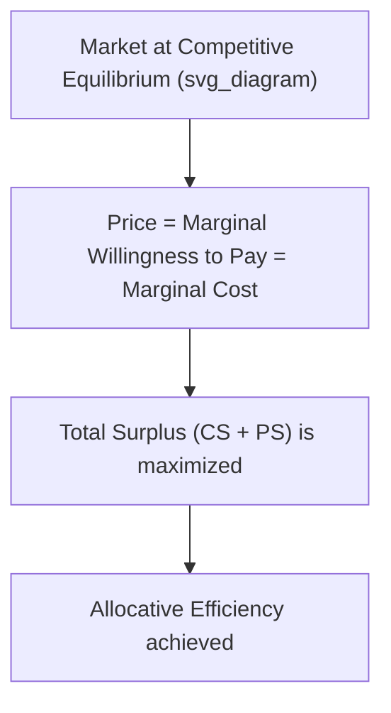
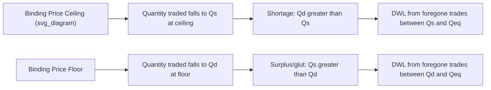

## Consumer and Producer Surplus

### Overview

Consumer surplus and producer surplus are measures of economic welfare derived from market transactions. They quantify the net benefit that buyers and sellers receive from participating in a market at the equilibrium price, and together they form the basis for evaluating market efficiency, the effects of government intervention, and deadweight loss.

### Consumer Surplus

**Definition**

Consumer surplus (CS) is the difference between the maximum price a consumer is willing and able to pay for a good (as reflected by the demand curve) and the price they actually pay. It represents the net benefit consumers receive from purchasing at the market price rather than at their maximum willingness to pay.

**Formula**

For a linear demand curve:

$$CS = \dfrac{1}{2} \times (P_{max} - P_{eq}) \times Q_{eq}$$

where $P_{max}$ is the demand curve's price-axis intercept (choke price), $P_{eq}$ is the equilibrium price, and $Q_{eq}$ is the equilibrium quantity.

For a general (possibly nonlinear) demand function $Q_d(P)$ or its inverse $P_d(Q)$, consumer surplus is the area under the demand curve and above the price line, computed as:

$$CS = \int_0^{Q_{eq}} P_d(Q)\, dQ - P_{eq} \times Q_{eq}$$

**Graphical Representation**

<svg xmlns="http://www.w3.org/2000/svg" viewBox="0 0 500 340">
<text x="20" y="20" font-size="14" font-weight="bold" fill="var(--text-color, #222)">Consumer and Producer Surplus (svg_diagram)</text>
<g transform="translate(60,40)">
<line x1="0" y1="0" x2="0" y2="260" stroke="#333" stroke-width="2" />
<line x1="0" y1="260" x2="380" y2="260" stroke="#333" stroke-width="2" />
<text x="-30" y="-5" font-size="12">Price</text>
<text x="350" y="285" font-size="12">Quantity</text>



```

<line x1="0" y1="20" x2="360" y2="240" stroke="#c0392b" stroke-width="2" />
<text x="330" y="235" font-size="12" fill="#c0392b">D</text>


<line x1="0" y1="240" x2="360" y2="40" stroke="#2980b9" stroke-width="2" />
<text x="330" y="55" font-size="12" fill="#2980b9">S</text>


<line x1="200" y1="0" x2="200" y2="140" stroke="#999" stroke-dasharray="4,4" />
<line x1="0" y1="140" x2="200" y2="140" stroke="#999" stroke-dasharray="4,4" />
<circle cx="200" cy="140" r="4" fill="#222" />
<text x="205" y="135" font-size="11">E (equilibrium)</text>
<text x="-25" y="144" font-size="10">Peq</text>
<text x="195" y="278" font-size="10">Qeq</text>


<polygon points="0,20 200,140 0,140" fill="#e74c3c" fill-opacity="0.25" stroke="none" />
<text x="30" y="100" font-size="12" fill="#c0392b">Consumer Surplus</text>


<polygon points="0,240 200,140 0,140" fill="#3498db" fill-opacity="0.25" stroke="none" />
<text x="20" y="200" font-size="12" fill="#2980b9">Producer Surplus</text>
```

</g>
</svg>

**Key Points**

- Graphically, CS is the area of the triangle bounded above by the demand curve, below by the horizontal equilibrium price line, and on the left by the price axis.
- CS increases when the equilibrium price falls (for a given demand curve) or when demand increases (rightward shift), holding supply constant.
- Individual consumers with higher willingness to pay than the market price capture more surplus per unit than marginal consumers (those willing to pay exactly the market price, who receive zero surplus).
- CS is a money-metric approximation of consumer welfare gain; it relies on the assumption that the demand curve reflects true marginal willingness to pay, which in turn assumes no externalities and rational, informed consumers.

**Numerical Example**

A linear demand curve has a price-axis intercept of $100 (choke price) and equilibrium price and quantity of $P_{eq} = \$60$ and $Q_{eq} = 400$ units.

$$CS = \dfrac{1}{2} \times (100 - 60) \times 400 = \dfrac{1}{2} \times 40 \times 400 = \$8{,}000$$

### Producer Surplus

**Definition**

Producer surplus (PS) is the difference between the price a producer actually receives for a good and the minimum price they would have been willing to accept (as reflected by the supply curve, which reflects marginal cost of production). It represents the net benefit producers receive from selling at the market price rather than at their minimum acceptable price.

**Formula**

For a linear supply curve:

$$PS = \dfrac{1}{2} \times (P_{eq} - P_{min}) \times Q_{eq}$$

where $P_{min}$ is the supply curve's price-axis intercept (the minimum price at which any output is supplied).

For a general supply function $Q_s(P)$ or its inverse $P_s(Q)$:

$$PS = P_{eq} \times Q_{eq} - \int_0^{Q_{eq}} P_s(Q)\, dQ$$

**Key Points**

- Graphically, PS is the area of the triangle bounded below by the supply curve, above by the horizontal equilibrium price line, and on the left by the price axis (or, if the supply curve has a positive price intercept, bounded below by that intercept line rather than the quantity axis).
- PS increases when the equilibrium price rises (for a given supply curve) or when supply decreases (leftward shift), holding demand constant.
- Producers with lower marginal costs than the market price capture more surplus per unit than the marginal producer (whose marginal cost equals the market price, earning zero surplus on that unit).
- Producer surplus is conceptually related to, but not identical to, accounting profit: PS reflects the difference between revenue and variable/marginal cost captured in the supply curve, while profit also accounts for fixed costs. [Inference: the exact relationship between PS and economic profit depends on how fixed costs are treated in the specific model — in the short run with fixed costs, PS equals total revenue minus total variable cost, which differs from profit by the amount of fixed costs.]

**Numerical Example**

A linear supply curve has a price-axis intercept of $20 (minimum acceptable price) and equilibrium price and quantity of $P_{eq} = \$60$ and $Q_{eq} = 400$ units.

$$PS = \dfrac{1}{2} \times (60 - 20) \times 400 = \dfrac{1}{2} \times 40 \times 400 = \$8{,}000$$

### Total Surplus (Social Welfare)

**Definition**

Total surplus (also called social surplus or total welfare) is the sum of consumer surplus and producer surplus, representing the total net benefit to society from a market's operation at a given quantity.

$$TS = CS + PS$$

**Efficiency Condition**

Total surplus is maximized at the competitive market equilibrium, where quantity supplied equals quantity demanded ($Q_s = Q_d = Q_{eq}$) and price equals both the marginal willingness to pay and the marginal cost of production. This outcome is termed **allocative efficiency**.



**Numerical Example (continuing above)**

$$TS = CS + PS = \$8{,}000 + \$8{,}000 = \$16{,}000$$

### Deadweight Loss (DWL)

**Definition**

Deadweight loss is the reduction in total surplus that occurs when a market operates away from the competitive equilibrium quantity — due to price controls, taxes, subsidies, quotas, monopoly power, or externalities — such that mutually beneficial trades are not made (or unbeneficial trades are forced).

**Formula (for a linear market with a quantity distortion)**

$$DWL = \dfrac{1}{2} \times |Q_{eq} - Q_{new}| \times |P_d(Q_{new}) - P_s(Q_{new})|$$

where $Q_{new}$ is the distorted (restricted or expanded) quantity, and the price gap term is the vertical distance between the demand and supply curves at $Q_{new}$ (this gap represents the per-unit surplus lost on units no longer traded).

**Sources of Deadweight Loss**

| Source | Mechanism |
| --- | --- |
| Price ceiling (binding, below equilibrium) | Quantity restricted to the ceiling quantity supplied; shortage created; DWL from foregone trades |
| Price floor (binding, above equilibrium) | Quantity restricted to the floor quantity demanded; surplus (glut) created; DWL from foregone trades |
| Per-unit tax | Wedge between price paid by buyers and price received by sellers; quantity traded falls below efficient level |
| Quota | Quantity capped below equilibrium; DWL from foregone trades beyond the quota |
| Monopoly | Output restricted below the competitive level to maximize profit; price exceeds marginal cost |
| Negative externality (uncorrected) | Market quantity exceeds the socially optimal quantity; overproduction relative to true social marginal cost |

**Diagram: Effect of a Per-Unit Tax**

<svg xmlns="http://www.w3.org/2000/svg" viewBox="0 0 520 340">
<text x="20" y="20" font-size="14" font-weight="bold" fill="var(--text-color, #222)">Deadweight Loss from a Per-Unit Tax (svg_diagram)</text>
<g transform="translate(60,40)">
<line x1="0" y1="0" x2="0" y2="260" stroke="#333" stroke-width="2" />
<line x1="0" y1="260" x2="380" y2="260" stroke="#333" stroke-width="2" />
<text x="-30" y="-5" font-size="12">Price</text>
<text x="350" y="285" font-size="12">Quantity</text>



```

<line x1="0" y1="20" x2="360" y2="240" stroke="#c0392b" stroke-width="2" />
<text x="330" y="235" font-size="12" fill="#c0392b">D</text>


<line x1="0" y1="240" x2="360" y2="40" stroke="#2980b9" stroke-width="2" />
<text x="330" y="55" font-size="12" fill="#2980b9">S (before tax)</text>


<line x1="0" y1="290" x2="360" y2="90" stroke="#2980b9" stroke-width="2" stroke-dasharray="6,4" />
<text x="330" y="105" font-size="12" fill="#2980b9">S + tax</text>


<line x1="200" y1="0" x2="200" y2="140" stroke="#999" stroke-dasharray="3,3" />
<circle cx="200" cy="140" r="4" fill="#222" />


<line x1="140" y1="0" x2="140" y2="180" stroke="#999" stroke-dasharray="3,3" />
<text x="120" y="278" font-size="10">Qtax</text>
<text x="195" y="278" font-size="10">Qeq</text>


<circle cx="140" cy="100" r="4" fill="#c0392b" />
<circle cx="140" cy="180" r="4" fill="#2980b9" />
<text x="-30" y="104" font-size="10">Pb</text>
<text x="-30" y="184" font-size="10">Ps</text>


<polygon points="140,100 200,140 140,180" fill="#7f8c8d" fill-opacity="0.4" stroke="none" />
<text x="150" y="145" font-size="11">DWL</text>
```

</g>
</svg>

**Key Points**

- The tax wedge equals the vertical distance between the demand and supply curves at the new, lower quantity $Q_{tax}$: $P_b - P_s = \text{tax per unit}$.
- Tax revenue collected by government equals $(P_b - P_s) \times Q_{tax}$, which is a *transfer* (not a loss) from consumers and producers to government, and is therefore excluded from deadweight loss.
- DWL rises with the price elasticities of both demand and supply — the more elastic either side is, the larger the quantity reduction from a given tax, and the greater the deadweight loss. Conversely, taxing goods with perfectly inelastic demand or supply on one side produces zero deadweight loss on that side, since quantity does not change.

**Numerical Example**

Before a tax, $Q_{eq} = 400$. After a $20 per-unit tax, quantity traded falls to $Q_{tax} = 300$. At $Q_{tax}=300$, the price buyers pay is $P_b = \$70$ and the price sellers receive is $P_s = \$50$ (confirming the $20 tax wedge).

$$DWL = \dfrac{1}{2} \times (400 - 300) \times (70 - 50) = \dfrac{1}{2} \times 100 \times 20 = \$1{,}000$$

### Effects of Price Controls on Surplus

**Price Ceiling (Binding, Set Below Equilibrium)**

- Consumers who can still purchase at the lower ceiling price gain surplus per unit purchased, but total consumer surplus may rise or fall depending on the relative size of this per-unit gain versus the loss from reduced quantity available (rationing).
- Producer surplus unambiguously falls, since producers receive a lower price and supply a smaller quantity.
- A binding price ceiling always creates deadweight loss, since quantity traded falls below the efficient equilibrium quantity, and may also create secondary costs (queuing, black markets, non-price rationing) not captured in the standard DWL triangle.

**Price Floor (Binding, Set Above Equilibrium)**

- Producers who can still sell at the higher floor price gain surplus per unit sold, but total producer surplus may rise or fall depending on the magnitude of the quantity reduction versus the price gain.
- Consumer surplus unambiguously falls, since consumers pay a higher price and purchase a smaller quantity.
- A binding price floor always creates deadweight loss and may result in unsold surplus output (e.g., agricultural price supports), which governments sometimes purchase or store, adding further costs beyond the basic DWL triangle.



### Effect of a Subsidy on Surplus

A per-unit subsidy shifts the supply curve rightward (or lowers the effective marginal cost curve), increasing quantity traded above the free-market equilibrium. Both CS and PS typically rise (consumers pay a lower price, producers receive a higher effective price), but the subsidy cost to government/taxpayers generally exceeds the combined gain in CS and PS, producing a deadweight loss because the subsidized quantity exceeds the allocatively efficient quantity — units are produced whose marginal cost exceeds their marginal benefit to consumers.

### Applications

- **Cost-benefit analysis of government policy**: CS and PS changes are used to evaluate the net welfare effects of taxes, subsidies, tariffs, trade quotas, and price controls.
- **International trade analysis**: Import tariffs and quotas are analyzed using CS/PS/DWL diagrams to show gains to domestic producers and government (tariff revenue) versus losses to domestic consumers, with a net deadweight loss from restricted trade volume.
- **Monopoly welfare analysis**: Comparing CS and PS under monopoly versus perfect competition demonstrates that monopolies transfer surplus from consumers to producers and generate deadweight loss from restricted output.
- **Externality correction**: Pigouvian taxes and subsidies are designed to shift market quantity toward the socially optimal level by internalizing external costs or benefits, thereby reducing deadweight loss caused by the externality.

### Common Pitfalls

- **Treating tax revenue as a welfare loss**: Tax revenue is a transfer between private agents and government, not a loss to society as a whole; only the reduction in mutually beneficial trades constitutes deadweight loss.
- **Assuming CS or PS always falls with any government intervention**: Subsidies typically raise both CS and PS in the short run (even though they may create deadweight loss and have a separate fiscal cost); the welfare judgment depends on the full accounting, including the cost of raising the subsidy funds.
- **Confusing producer surplus with profit**: PS excludes fixed costs already sunk into production, whereas accounting/economic profit is a fuller measure that nets out both fixed and variable costs.
- **Applying the linear-curve triangle formula to nonlinear curves**: For nonlinear demand/supply, CS, PS, and DWL must be computed via integration rather than the simple triangle-area formula.

**Related Topics**

- Price elasticity of demand and supply
- Market equilibrium and comparative statics
- Excise taxes and tax incidence
- Price ceilings and price floors
- Externalities and Pigouvian taxation
- International trade: tariffs, quotas, and trade welfare analysis
- Monopoly and market power welfare effects
- Cost-benefit analysis in public economics