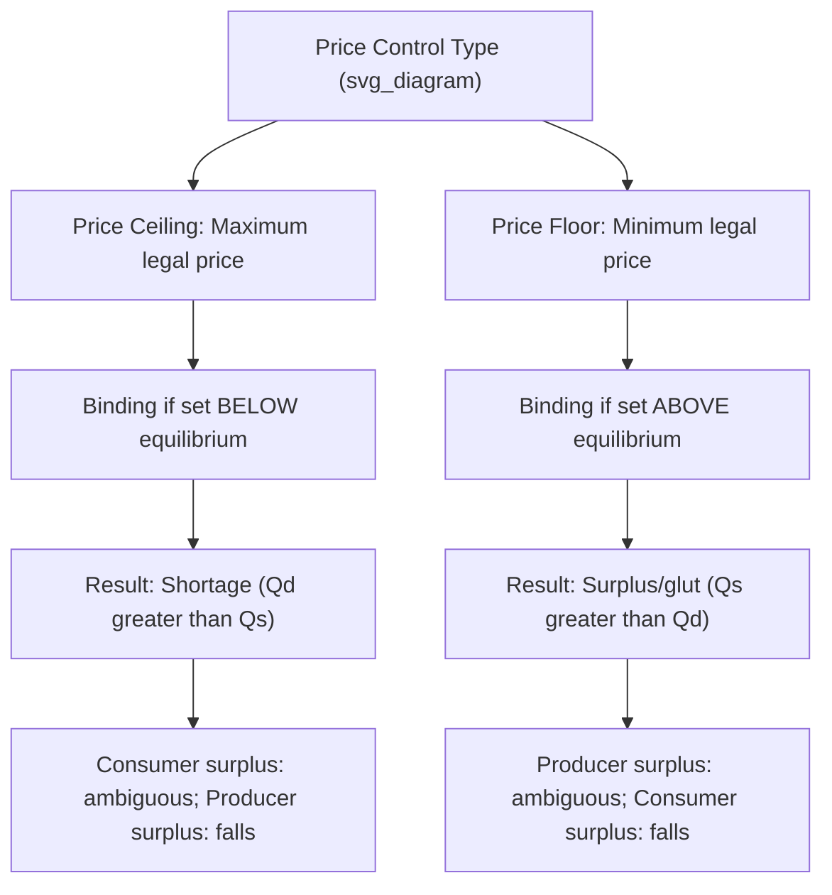

## Price Controls: Ceilings and Floors

### Overview

Price controls are government-mandated limits on the price of a good or service, imposed to override the market equilibrium price for policy reasons such as affordability, income protection, or market stabilization. The two primary forms are **price ceilings** (maximum legal prices) and **price floors** (minimum legal prices). While intended to help specific groups, price controls that bind (i.e., interfere with the free-market equilibrium) generally create market distortions, including shortages, surpluses, and deadweight loss.

### Price Ceilings

**Definition**

A price ceiling is a legally mandated maximum price that sellers may charge for a good or service. It is binding (has an economic effect) only if set **below** the free-market equilibrium price; a ceiling set above equilibrium has no effect, since the market would not naturally trade above the ceiling anyway.

**Effects of a Binding Price Ceiling**

| Effect | Description |
| --- | --- |
| Shortage | Quantity demanded exceeds quantity supplied at the ceiling price ($Q_d > Q_s$) |
| Quantity traded | Falls to $Q_s$ (the lesser of demand and supply at the ceiling price), since sellers cannot be forced to supply more than they choose |
| Consumer surplus | Ambiguous — those who obtain the good gain from the lower price, but this is offset by losses from rationing (some consumers cannot buy at all) |
| Producer surplus | Unambiguously falls, since producers receive a lower price and sell a smaller quantity |
| Deadweight loss | Created, since quantity traded falls below the efficient equilibrium quantity |
| Non-price rationing | Emerges as a substitute allocation mechanism: queuing, waiting lists, favoritism, lotteries |
| Black markets | May emerge as some consumers are willing to pay above the ceiling price, creating incentive for illegal resale |
| Quality deterioration | Sellers facing a capped price may reduce quality or service levels to cut costs, an effect not captured in the basic supply-demand diagram |

**Diagram: Binding Price Ceiling**

<svg xmlns="http://www.w3.org/2000/svg" viewBox="0 0 520 340">
<text x="20" y="20" font-size="14" font-weight="bold" fill="var(--text-color, #222)">Binding Price Ceiling and Resulting Shortage (svg_diagram)</text>
<g transform="translate(60,40)">
<line x1="0" y1="0" x2="0" y2="260" stroke="#333" stroke-width="2" />
<line x1="0" y1="260" x2="380" y2="260" stroke="#333" stroke-width="2" />
<text x="-30" y="-5" font-size="12">Price</text>
<text x="350" y="285" font-size="12">Quantity</text>



```

<line x1="0" y1="20" x2="360" y2="240" stroke="#c0392b" stroke-width="2" />
<text x="330" y="235" font-size="12" fill="#c0392b">D</text>


<line x1="0" y1="240" x2="360" y2="40" stroke="#2980b9" stroke-width="2" />
<text x="330" y="55" font-size="12" fill="#2980b9">S</text>


<line x1="200" y1="0" x2="200" y2="140" stroke="#999" stroke-dasharray="3,3" />
<line x1="0" y1="140" x2="200" y2="140" stroke="#999" stroke-dasharray="3,3" />
<circle cx="200" cy="140" r="4" fill="#222" />
<text x="-25" y="144" font-size="10">Peq</text>


<line x1="0" y1="190" x2="380" y2="190" stroke="#8e44ad" stroke-width="2" stroke-dasharray="6,4" />
<text x="340" y="186" font-size="12" fill="#8e44ad">Ceiling</text>


<line x1="110" y1="0" x2="110" y2="260" stroke="#999" stroke-dasharray="2,2" />
<line x1="285" y1="0" x2="285" y2="260" stroke="#999" stroke-dasharray="2,2" />
<text x="95" y="278" font-size="10">Qs</text>
<text x="275" y="278" font-size="10">Qd</text>


<line x1="110" y1="205" x2="285" y2="205" stroke="#e67e22" stroke-width="3" />
<text x="150" y="220" font-size="11" fill="#e67e22">Shortage</text>
```

</g>
</svg>

**Numerical Example**

At the free-market equilibrium, $P_{eq} = \$50$ and $Q_{eq} = 300$ units. The government imposes a price ceiling of $35. At $35, quantity demanded is 400 units and quantity supplied is 200 units.

- Shortage = $Q_d - Q_s = 400 - 200 = 200$ units
- Quantity actually traded = $Q_s = 200$ units (limited by what sellers are willing to supply)

**Real-World Examples**

- Rent control in urban housing markets
- Price caps on essential medicines or fuel during emergencies
- Maximum interest rate caps (usury laws) on lending

[Inference: whether a real-world price ceiling like rent control produces the textbook shortage effect in practice depends on local supply elasticity, enforcement, and market-specific factors; empirical results vary across studies and contexts.]

### Price Floors

**Definition**

A price floor is a legally mandated minimum price that buyers must pay for a good or service. It is binding only if set **above** the free-market equilibrium price; a floor set below equilibrium has no effect.

**Effects of a Binding Price Floor**

| Effect | Description |
| --- | --- |
| Surplus (glut) | Quantity supplied exceeds quantity demanded at the floor price ($Q_s > Q_d$) |
| Quantity traded | Falls to $Q_d$ (the lesser of demand and supply at the floor price), since buyers cannot be forced to purchase more than they choose |
| Producer surplus | Ambiguous — those who can still sell gain from the higher price, but this is offset by losses from unsold output |
| Consumer surplus | Unambiguously falls, since consumers pay a higher price and buy a smaller quantity |
| Deadweight loss | Created, since quantity traded falls below the efficient equilibrium quantity |
| Unsold surplus | May require government intervention (buying excess output, storage, export subsidies, or destruction) to prevent price collapse from unsold stock |
| Resource misallocation | Resources are drawn into producing goods with unsold surplus rather than more valued alternatives |

**Diagram: Binding Price Floor**

<svg xmlns="http://www.w3.org/2000/svg" viewBox="0 0 520 340">
<text x="20" y="20" font-size="14" font-weight="bold" fill="var(--text-color, #222)">Binding Price Floor and Resulting Surplus (svg_diagram)</text>
<g transform="translate(60,40)">
<line x1="0" y1="0" x2="0" y2="260" stroke="#333" stroke-width="2" />
<line x1="0" y1="260" x2="380" y2="260" stroke="#333" stroke-width="2" />
<text x="-30" y="-5" font-size="12">Price</text>
<text x="350" y="285" font-size="12">Quantity</text>



```

<line x1="0" y1="20" x2="360" y2="240" stroke="#c0392b" stroke-width="2" />
<text x="330" y="235" font-size="12" fill="#c0392b">D</text>


<line x1="0" y1="240" x2="360" y2="40" stroke="#2980b9" stroke-width="2" />
<text x="330" y="55" font-size="12" fill="#2980b9">S</text>


<line x1="200" y1="0" x2="200" y2="140" stroke="#999" stroke-dasharray="3,3" />
<line x1="0" y1="140" x2="200" y2="140" stroke="#999" stroke-dasharray="3,3" />
<circle cx="200" cy="140" r="4" fill="#222" />
<text x="-25" y="144" font-size="10">Peq</text>


<line x1="0" y1="90" x2="380" y2="90" stroke="#27ae60" stroke-width="2" stroke-dasharray="6,4" />
<text x="345" y="86" font-size="12" fill="#27ae60">Floor</text>


<line x1="115" y1="0" x2="115" y2="260" stroke="#999" stroke-dasharray="2,2" />
<line x1="280" y1="0" x2="280" y2="260" stroke="#999" stroke-dasharray="2,2" />
<text x="100" y="278" font-size="10">Qd</text>
<text x="270" y="278" font-size="10">Qs</text>


<line x1="115" y1="105" x2="280" y2="105" stroke="#e67e22" stroke-width="3" />
<text x="150" y="120" font-size="11" fill="#e67e22">Surplus</text>
```

</g>
</svg>

**Numerical Example**

At the free-market equilibrium, $P_{eq} = \$10$ (per hour of labor, i.e., the equilibrium wage) and $Q_{eq} = 500$ (labor hours). The government imposes a minimum wage floor of $15. At $15, quantity of labor demanded is 350 hours and quantity supplied is 600 hours.

- Surplus (excess labor supply, i.e., unemployment in this context) = $Q_s - Q_d = 600 - 350 = 250$ hours
- Quantity actually employed = $Q_d = 350$ hours (limited by what employers are willing to hire)

**Real-World Examples**

- Minimum wage laws in the labor market
- Agricultural price supports (guaranteed minimum prices for crops)
- Minimum pricing on alcohol in some jurisdictions

[Inference: the employment effects of minimum wage laws specifically are empirically debated in economics — some studies find measurable disemployment effects consistent with the basic model, while others find minimal effects, particularly at modest minimum wage levels or in markets with monopsony power. This is treated as a live empirical question rather than a settled fact.]

### Summary Comparison



| Feature | Price Ceiling | Price Floor |
| --- | --- | --- |
| Nature of limit | Maximum price | Minimum price |
| Binding condition | Set below equilibrium price | Set above equilibrium price |
| Market imbalance | Shortage (excess demand) | Surplus (excess supply) |
| Quantity traded | Equals $Q_s$ (supply-constrained) | Equals $Q_d$ (demand-constrained) |
| Group typically protected | Consumers/buyers | Producers/sellers |
| Common non-price effects | Queuing, black markets, rationing, quality reduction | Unsold inventory, government purchase programs, wasted resources |
| Example | Rent control | Minimum wage |

### Deadweight Loss from Price Controls

Both binding price ceilings and binding price floors reduce the quantity traded below the free-market equilibrium quantity, which prevents mutually beneficial trades from occurring between units where the marginal buyer's willingness to pay exceeds the marginal seller's marginal cost. This generates deadweight loss, calculated as:

$$DWL = \dfrac{1}{2} \times |Q_{eq} - Q_{control}| \times |P_d(Q_{control}) - P_s(Q_{control})|$$

where $Q_{control}$ is the quantity actually traded under the ceiling or floor (the smaller of $Q_d$ and $Q_s$ at the controlled price).

**Numerical Example (continuing the price ceiling example above)**

At $Q_{control} = 200$ (the quantity traded under the $35 ceiling), suppose the demand curve's price at $Q=200$ is $P_d(200) = \$65$ (what consumers would be willing to pay for that marginal unit) and the supply curve's price at $Q=200$ is $P_s(200) = \$35$ (the ceiling price itself, since sellers are supply-constrained).

$$DWL = \dfrac{1}{2} \times (300 - 200) \times (65 - 35) = \dfrac{1}{2} \times 100 \times 30 = \$1{,}500$$

### Additional Consequences Beyond the Basic Model

**Price Ceilings**

- **Search and waiting costs**: Consumers may spend real resources (time queuing, searching for available stock) that represent a further welfare loss not captured in the standard DWL triangle.
- **Black market prices**: Illegal resale markets can emerge at prices above the ceiling (sometimes above even the original equilibrium price), transferring surplus to those willing to break the law rather than to the intended beneficiaries.
- **Reduced long-run investment**: Persistent ceilings (e.g., long-term rent control) may discourage investment in maintaining or expanding the supply of the controlled good, worsening shortages over time. [Inference: the magnitude of this long-run supply response is context- and market-specific.]

**Price Floors**

- **Government disposal costs**: Agricultural price floors historically have required governments to purchase and store or destroy surplus output, or subsidize exports, adding a fiscal cost beyond the deadweight loss triangle.
- **Substitution effects in labor markets**: A binding minimum wage may induce employers to substitute toward capital or higher-skilled labor, disproportionately affecting the employment of lower-skilled or entry-level workers.
- **Informal/uncovered sector effects**: Excess labor supply from a binding minimum wage may shift into uncovered sectors (informal economy, self-employment), potentially depressing wages there — an effect sometimes discussed as the "two-sector model" of minimum wage impacts.

### Policy Rationale and Trade-offs

| Control | Common Policy Goal | Standard Economic Critique |
| --- | --- | --- |
| Rent ceilings | Housing affordability for tenants | May reduce housing supply/quality and worsen long-run shortages |
| Minimum wage | Income protection for low-wage workers | May reduce employment for some workers, depending on labor demand elasticity and market structure |
| Agricultural price floors | Stabilize farmer incomes, food security | Creates surpluses and fiscal costs; may distort international trade |
| Interest rate caps (usury laws) | Protect borrowers from predatory lending | May reduce credit availability to higher-risk borrowers, pushing them toward informal lenders |

### Common Pitfalls

- **Assuming any price control is automatically "binding"**: A ceiling above or a floor below the equilibrium price has no real effect on the market outcome — only ceilings below or floors above equilibrium alter quantity traded.
- **Confusing shortage/surplus with elasticity effects**: The *size* of the shortage or surplus depends on the price elasticities of demand and supply — more elastic curves produce larger gaps between $Q_d$ and $Q_s$ at a given controlled price.
- **Overlooking who "wins" the rationed good**: Under a shortage, the quantity actually sold does not necessarily go to those with the highest willingness to pay; non-price rationing mechanisms (queues, favoritism) can allocate the good inefficiently, reducing realized consumer surplus below the theoretical maximum.
- **Ignoring dynamic/long-run effects**: Static supply-demand diagrams capture short-run effects; long-run responses (reduced investment, market exit, black market development) can compound the welfare costs of persistent price controls.

**Related Topics**

- Consumer and producer surplus
- Deadweight loss and market efficiency
- Elasticity of demand and supply (determinants of shortage/surplus size)
- Minimum wage theory and monopsony in labor markets
- Agricultural policy and price support programs
- Black markets and informal economic activity
- Taxes and subsidies as alternative policy instruments
- Rent control and housing market economics