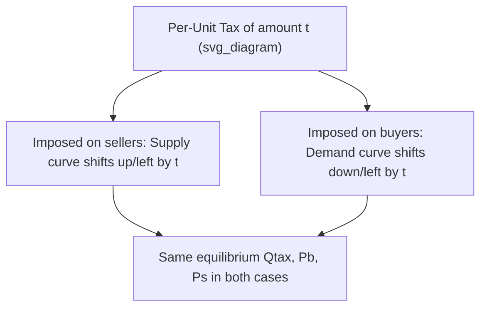
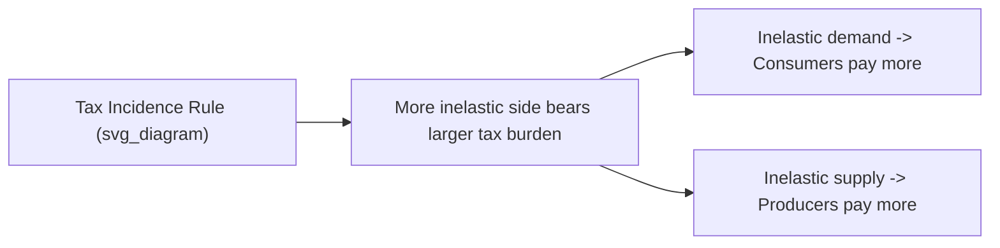
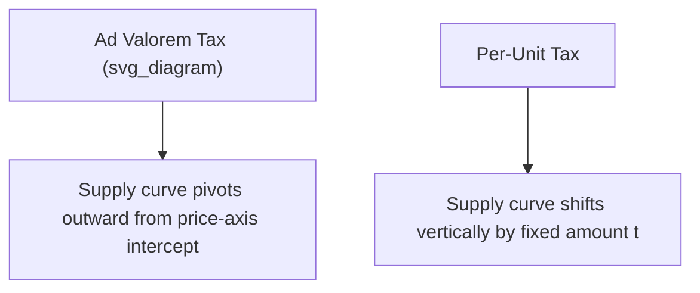

## Taxes, Subsidies, and Tax Incidence


### Overview

Taxes and subsidies are government interventions that alter the effective price faced by buyers or sellers, driving a wedge between the price consumers pay and the price producers receive. Tax incidence analyzes how the economic burden (or benefit, in the case of subsidies) of these interventions is actually distributed between the two sides of the market — a distribution that depends on the relative price elasticities of demand and supply, not on the statutory party responsible for remitting the tax.

### Per-Unit (Specific) Taxes

**Definition**

A per-unit tax is a fixed monetary amount charged on each unit of a good bought or sold (e.g., $2 per pack of cigarettes), as opposed to an ad valorem tax, which is a percentage of the price.

**Mechanism**

A per-unit tax of $t$ creates a wedge between the price buyers pay ($P_b$) and the price sellers receive ($P_s$):

$$P_b - P_s = t$$

Graphically, this can be modeled as either:

- A leftward (upward) shift of the supply curve by the amount $t$ (if legally imposed on sellers), or
- A leftward (downward) shift of the demand curve by the amount $t$ (if legally imposed on buyers)

**Key Point (Invariance of Economic Incidence to Legal Incidence)**

The economic outcome — the equilibrium quantity, the price buyers pay, and the price sellers receive — is identical regardless of whether the tax is legally imposed on buyers or sellers. Only the *legal* responsibility for remitting the tax to the government differs; the *economic* burden depends on elasticities.



**Diagram: Per-Unit Tax on Sellers**

<svg xmlns="http://www.w3.org/2000/svg" viewBox="0 0 520 340">
<text x="20" y="20" font-size="14" font-weight="bold" fill="var(--text-color, #222)">Per-Unit Tax: Effect on Market Equilibrium (svg_diagram)</text>
<g transform="translate(60,40)">
<line x1="0" y1="0" x2="0" y2="260" stroke="#333" stroke-width="2" />
<line x1="0" y1="260" x2="380" y2="260" stroke="#333" stroke-width="2" />
<text x="-30" y="-5" font-size="12">Price</text>
<text x="350" y="285" font-size="12">Quantity</text>



```

<line x1="0" y1="20" x2="360" y2="240" stroke="#c0392b" stroke-width="2" />
<text x="330" y="235" font-size="12" fill="#c0392b">D</text>


<line x1="0" y1="240" x2="360" y2="40" stroke="#2980b9" stroke-width="2" />
<text x="330" y="55" font-size="12" fill="#2980b9">S (before tax)</text>


<line x1="0" y1="290" x2="360" y2="90" stroke="#2980b9" stroke-width="2" stroke-dasharray="6,4" />
<text x="320" y="105" font-size="12" fill="#2980b9">S + tax</text>


<line x1="200" y1="0" x2="200" y2="140" stroke="#999" stroke-dasharray="3,3" />
<circle cx="200" cy="140" r="4" fill="#222" />
<text x="205" y="135" font-size="10">Original E</text>


<line x1="140" y1="0" x2="140" y2="180" stroke="#999" stroke-dasharray="3,3" />
<text x="120" y="278" font-size="10">Qtax</text>
<text x="195" y="278" font-size="10">Qeq</text>

<circle cx="140" cy="100" r="4" fill="#c0392b" />
<circle cx="140" cy="180" r="4" fill="#2980b9" />
<text x="-25" y="104" font-size="10">Pb</text>
<text x="-25" y="184" font-size="10">Ps</text>


<line x1="150" y1="100" x2="150" y2="180" stroke="#f39c12" stroke-width="3" />
<text x="155" y="145" font-size="11" fill="#f39c12">tax = Pb − Ps</text>
```

</g>
</svg>

### Tax Incidence

**Definition**

Tax incidence refers to the division of the economic burden of a tax between consumers and producers, measured by how much of the tax each side effectively pays relative to the pre-tax price.

**Formula**

Consumer's share of tax burden:

$$\text{Consumer burden} = P_b - P_{eq}$$

Producer's share of tax burden:

$$\text{Producer burden} = P_{eq} - P_s$$

Total tax per unit:

$$t = (P_b - P_{eq}) + (P_{eq} - P_s)$$

**Elasticity Rule**

The side of the market with the more inelastic (less price-responsive) curve bears a larger share of the tax burden, because that side is less able to adjust quantity in response to the price change and therefore has less ability to "escape" the tax.

$$\dfrac{\text{Consumer burden}}{\text{Producer burden}} = \dfrac{PES}{|PED|}$$

| Relative Elasticity | Burden Distribution |
| --- | --- |
| Demand more inelastic than supply | Consumers bear a larger share of the tax |
| Supply more inelastic than demand | Producers bear a larger share of the tax |
| Perfectly inelastic demand | Consumers bear 100% of the tax; quantity unchanged |
| Perfectly elastic demand | Producers bear 100% of the tax |
| Perfectly inelastic supply | Producers bear 100% of the tax; quantity unchanged |
| Perfectly elastic supply | Consumers bear 100% of the tax |



**Numerical Example**

Before a $10 per-unit tax, $P_{eq} = \$50$, $Q_{eq} = 200$. After the tax, $P_b = \$58$ (price consumers pay) and $P_s = \$48$ (price producers receive), with $Q_{tax} = 160$.

- Consumer burden = $58 - 50 = \$8$ per unit
- Producer burden = $50 - 48 = \$2$ per unit
- Total tax = $8 + 2 = \$10$ ✓ (confirms consistency)

Since consumers bear $8 of the $10 tax versus producers' $2, demand is relatively more inelastic than supply in this market — consistent with, for example, a good with few close substitutes (inelastic demand) taxed in an industry where producers can relatively easily adjust output (more elastic supply).

**Government Tax Revenue**

$$\text{Tax Revenue} = t \times Q_{tax}$$

Using the example above: $\text{Revenue} = \$10 \times 160 = \$1{,}600$.

Tax revenue is split graphically into a portion borne by consumers (rectangle of height $P_b - P_{eq}$) and a portion borne by producers (rectangle of height $P_{eq} - P_s$), both over the base $Q_{tax}$.

### Ad Valorem Taxes

**Definition**

An ad valorem tax is a tax levied as a percentage of the price (e.g., a 12% VAT), rather than a fixed amount per unit.

**Key Differences from Per-Unit Taxes**

- The absolute tax wedge (in currency terms) grows with the price level, so graphically the supply curve pivots (rotating around the price-axis intercept) rather than shifting in parallel.
- The same qualitative incidence rule applies: the more inelastic side bears a larger share of the burden.
- Ad valorem taxes (like VAT/GST) are common in real-world tax systems because they automatically scale with price changes and inflation.



### Subsidies

**Definition**

A subsidy is a payment made by the government to producers or consumers per unit of a good, effectively a "negative tax" that lowers the price paid by consumers, raises the price received by producers, or both, while increasing quantity traded above the free-market equilibrium.

**Mechanism**

A per-unit subsidy of $s$ creates a wedge such that:

$$P_s - P_b = s$$

where $P_s$ (price received by producers) exceeds $P_b$ (price paid by consumers) by the subsidy amount.

Graphically, a subsidy shifts the supply curve rightward (downward) by the amount $s$, increasing equilibrium quantity from $Q_{eq}$ to a larger $Q_{sub}$.

**Diagram: Effect of a Subsidy**

<svg xmlns="http://www.w3.org/2000/svg" viewBox="0 0 520 340">
<text x="20" y="20" font-size="14" font-weight="bold" fill="var(--text-color, #222)">Per-Unit Subsidy: Effect on Market Equilibrium (svg_diagram)</text>
<g transform="translate(60,40)">
<line x1="0" y1="0" x2="0" y2="260" stroke="#333" stroke-width="2" />
<line x1="0" y1="260" x2="380" y2="260" stroke="#333" stroke-width="2" />
<text x="-30" y="-5" font-size="12">Price</text>
<text x="350" y="285" font-size="12">Quantity</text>



```

<line x1="0" y1="20" x2="360" y2="240" stroke="#c0392b" stroke-width="2" />
<text x="330" y="235" font-size="12" fill="#c0392b">D</text>


<line x1="0" y1="240" x2="360" y2="40" stroke="#2980b9" stroke-width="2" />
<text x="330" y="55" font-size="12" fill="#2980b9">S (before subsidy)</text>


<line x1="0" y1="190" x2="360" y2="-10" stroke="#2980b9" stroke-width="2" stroke-dasharray="6,4" />
<text x="240" y="10" font-size="12" fill="#2980b9">S − subsidy</text>


<line x1="200" y1="0" x2="200" y2="140" stroke="#999" stroke-dasharray="3,3" />
<circle cx="200" cy="140" r="4" fill="#222" />


<line x1="250" y1="0" x2="250" y2="110" stroke="#999" stroke-dasharray="3,3" />
<text x="195" y="278" font-size="10">Qeq</text>
<text x="240" y="278" font-size="10">Qsub</text>

<circle cx="250" cy="90" r="4" fill="#2980b9" />
<circle cx="250" cy="110" r="4" fill="#c0392b" />
<text x="-25" y="94" font-size="10">Ps</text>
<text x="-25" y="114" font-size="10">Pb</text>
```

</g>
</svg>

**Key Points**

- Both consumer surplus and producer surplus generally rise under a subsidy, since consumers pay less and producers receive more per unit.
- The government bears a fiscal cost equal to $s \times Q_{sub}$, which typically exceeds the combined gain in CS and PS, producing a deadweight loss — because the subsidized quantity $Q_{sub}$ exceeds the allocatively efficient quantity $Q_{eq}$, meaning units are produced whose marginal cost to society exceeds their marginal benefit.
- As with taxes, the distribution of subsidy benefit between consumers and producers depends on relative elasticities: the more inelastic side captures a larger share of the subsidy's benefit.

**Numerical Example**

A $6 per-unit subsidy is granted to producers. Before the subsidy, $P_{eq} = \$40$, $Q_{eq} = 300$. After the subsidy, $P_b = \$36$ (price consumers pay) and $P_s = \$42$ (price producers receive), with $Q_{sub} = 340$.

- Consumer benefit = $40 - 36 = \$4$ per unit
- Producer benefit = $42 - 40 = \$2$ per unit
- Total subsidy = $4 + 2 = \$6$ ✓
- Total government cost = $\$6 \times 340 = \$2{,}040$

Consumers capture a larger share of the subsidy benefit here ($4 vs. $2), implying demand is relatively less elastic than supply in this market. [Note: this is the mirror-image application of the same elasticity rule used for tax incidence.]

### Tax and Subsidy Incidence Summary

| Intervention | Wedge Direction | More Inelastic Side | Effect |
| --- | --- | --- | --- |
| Tax | $P_b > P_s$ | Bears larger tax burden | Quantity falls; DWL created |
| Subsidy | $P_s > P_b$ | Captures larger benefit share | Quantity rises; DWL created (overproduction) |

### Deadweight Loss from Taxes and Subsidies

For a tax:

$$DWL_{tax} = \dfrac{1}{2} \times (Q_{eq} - Q_{tax}) \times t$$

For a subsidy:

$$DWL_{subsidy} = \dfrac{1}{2} \times (Q_{sub} - Q_{eq}) \times s$$

Both formulas reflect that deadweight loss grows with (a) the size of the per-unit tax or subsidy, and (b) the magnitude of the quantity distortion, which itself depends on the price elasticities of demand and supply — more elastic curves produce larger deadweight loss for a given tax or subsidy rate.

**Numerical Example (Tax DWL, continuing earlier example)**

$$DWL = \dfrac{1}{2} \times (200 - 160) \times 10 = \dfrac{1}{2} \times 40 \times 10 = \$200$$

**Numerical Example (Subsidy DWL, continuing earlier example)**

$$DWL = \dfrac{1}{2} \times (340 - 300) \times 6 = \dfrac{1}{2} \times 40 \times 6 = \$120$$

### Applications

- **Excise taxes on demerit goods**: Taxes on cigarettes, alcohol, and sugary beverages aim to reduce consumption and/or raise revenue; incidence analysis shows that because demand for such goods is often relatively inelastic (especially for addictive goods), consumers bear a substantial share of these taxes despite the tax often being legally levied on producers/sellers.
- **Payroll taxes**: Analysis of whether payroll taxes nominally split between employers and employees actually fall more on workers (via lower wages) or firms (via higher labor costs) depends on labor supply and demand elasticities, not the legal split.
- **Agricultural subsidies**: Government subsidies to farmers are analyzed for how much benefit flows to farmers (producers) versus consumers (via lower food prices), and for the resulting overproduction and fiscal costs.
- **Pigouvian taxation**: Taxes designed to correct negative externalities (e.g., carbon taxes) are evaluated not only for revenue and incidence but for whether they move quantity closer to the socially optimal level, distinguishing them from purely distortionary taxes.
- **Trade policy**: Tariffs (a tax on imports) and export subsidies are analyzed using the same incidence and deadweight loss framework, extended to include a foreign supply/demand side.

### Common Pitfalls

- **Confusing legal incidence with economic incidence**: Who is legally required to remit a tax to the government has no bearing on who actually bears the greater economic burden — that is determined entirely by relative elasticities.
- **Assuming an even 50/50 split of tax burden by default**: The split is only even when demand and supply have identical elasticity magnitudes at the relevant point; in general, the split is uneven and determined by the elasticity ratio.
- **Treating tax revenue as part of deadweight loss**: Tax revenue is a transfer from private agents to the government, not a loss to society; only the reduction in quantity traded (and the associated foregone surplus) constitutes deadweight loss.
- **Assuming subsidies have no efficiency cost**: Even though subsidies raise both CS and PS, they generally reduce total welfare net of fiscal cost, because they push quantity beyond the point where marginal benefit equals marginal cost.
- **Ignoring the difference between per-unit and ad valorem tax mechanics**: A per-unit tax shifts curves in parallel; an ad valorem tax pivots them, which affects how the tax wedge changes with the price level.

**Related Topics**

- Price elasticity of demand and supply
- Consumer and producer surplus
- Deadweight loss and market efficiency
- Price ceilings and price floors
- Externalities and Pigouvian taxation
- International trade: tariffs and quotas
- Public finance and government revenue systems
- Market equilibrium and comparative statics