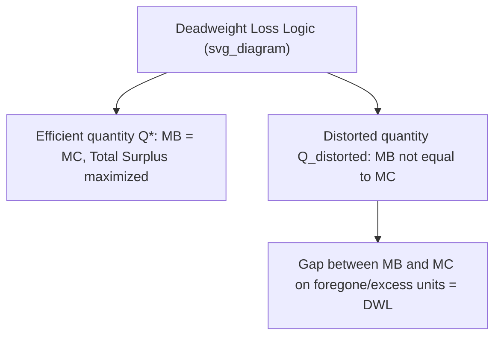
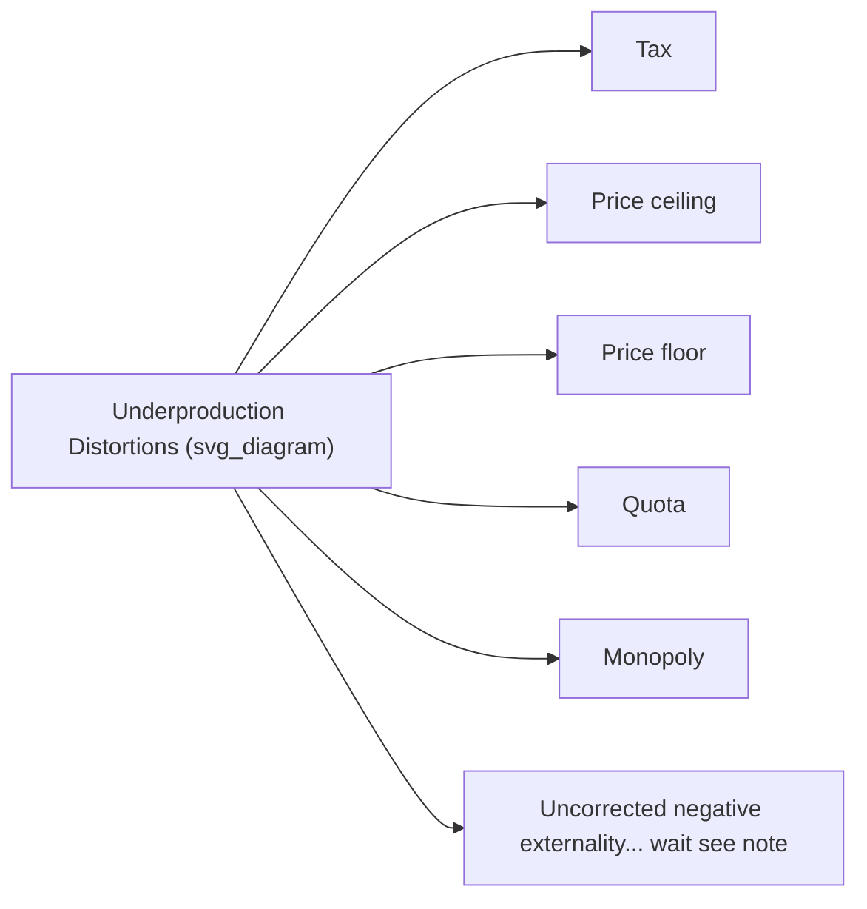
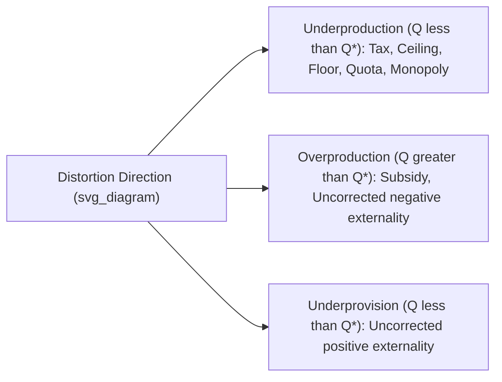
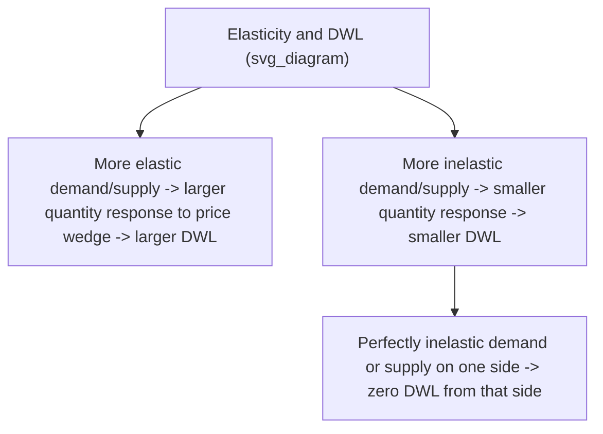

## Deadweight Loss Analysis

### Overview

Deadweight loss (DWL) is the loss of total economic surplus that occurs when a market operates at a quantity other than the allocatively efficient (competitive equilibrium) quantity. It represents mutually beneficial trades that fail to occur (or unbeneficial trades that are forced to occur), and is the standard measure economists use to quantify the efficiency cost of market distortions such as taxes, subsidies, price controls, quotas, monopoly power, and externalities.

### Conceptual Foundation

**Allocative Efficiency Benchmark**

A market achieves allocative efficiency at the quantity where marginal social benefit (reflected by the demand curve) equals marginal social cost (reflected by the supply curve):

$$MB(Q^*) = MC(Q^*)$$

At this quantity $Q^*$, total surplus (consumer surplus + producer surplus) is maximized. Any quantity below $Q^*$ forgoes beneficial trades (where $MB > MC$); any quantity above $Q^*$ forces trades where the cost exceeds the benefit (where $MC > MB$).

**Definition of Deadweight Loss**

$$DWL = TS(Q^*) - TS(Q_{distorted})$$

where $TS$ is total surplus and $Q_{distorted}$ is the quantity that actually results under the distortion.



### General Formula

For a linear demand and supply market with a quantity distortion:

$$DWL = \dfrac{1}{2} \times |Q^* - Q_{distorted}| \times |MB(Q_{distorted}) - MC(Q_{distorted})|$$

This is the area of a triangle: the base is the horizontal distance between the efficient and distorted quantities, and the height is the vertical gap between the demand and supply curves at the distorted quantity (representing the per-unit surplus lost on the units no longer — or wrongly — traded).

**Diagram: Generic Deadweight Loss Triangle**

<svg xmlns="http://www.w3.org/2000/svg" viewBox="0 0 520 340">
<text x="20" y="20" font-size="14" font-weight="bold" fill="var(--text-color, #222)">Deadweight Loss Triangle (svg_diagram)</text>
<g transform="translate(60,40)">
<line x1="0" y1="0" x2="0" y2="260" stroke="#333" stroke-width="2" />
<line x1="0" y1="260" x2="380" y2="260" stroke="#333" stroke-width="2" />
<text x="-30" y="-5" font-size="12">Price</text>
<text x="350" y="285" font-size="12">Quantity</text>



```

<line x1="0" y1="20" x2="360" y2="240" stroke="#c0392b" stroke-width="2" />
<text x="330" y="235" font-size="12" fill="#c0392b">D (MB)</text>


<line x1="0" y1="240" x2="360" y2="40" stroke="#2980b9" stroke-width="2" />
<text x="330" y="55" font-size="12" fill="#2980b9">S (MC)</text>


<line x1="200" y1="0" x2="200" y2="140" stroke="#999" stroke-dasharray="3,3" />
<circle cx="200" cy="140" r="4" fill="#222" />
<text x="190" y="278" font-size="10">Q*</text>


<line x1="140" y1="0" x2="140" y2="260" stroke="#999" stroke-dasharray="3,3" />
<text x="120" y="278" font-size="10">Qdistorted</text>

<circle cx="140" cy="100" r="4" fill="#c0392b" />
<circle cx="140" cy="180" r="4" fill="#2980b9" />


<polygon points="140,100 200,140 140,180" fill="#7f8c8d" fill-opacity="0.45" stroke="none" />
<text x="148" y="145" font-size="11">DWL</text>
```

</g>
</svg>

### Sources of Deadweight Loss

| Source | Mechanism | Quantity Effect |
| --- | --- | --- |
| Per-unit or ad valorem tax | Wedge between price paid and price received; MB ≠ MC at traded quantity | Quantity falls below $Q^*$ |
| Subsidy | Negative wedge lowers effective price to buyers, raises price to sellers | Quantity rises above $Q^*$ |
| Binding price ceiling | Quantity constrained to $Q_s$ at the capped price | Quantity falls below $Q^*$ |
| Binding price floor | Quantity constrained to $Q_d$ at the floor price | Quantity falls below $Q^*$ |
| Quota | Legal cap on quantity, independent of price | Quantity falls below $Q^*$ |
| Monopoly / market power | Profit-maximizing firm restricts output where $MR = MC$, with price above $MC$ | Quantity falls below $Q^*$ |
| Negative externality (uncorrected) | Private marginal cost understates true social marginal cost | Market quantity exceeds socially optimal quantity |
| Positive externality (uncorrected) | Private marginal benefit understates true social marginal benefit | Market quantity falls short of socially optimal quantity |



Note: negative externalities cause *overproduction* relative to the social optimum, not underproduction — this is corrected in the dedicated externality diagram below.



### Case 1: Deadweight Loss from a Tax

Already covered by the general formula, with $Q_{distorted} = Q_{tax}$ (the reduced quantity traded after the tax) and the height equal to the tax wedge $t = P_b - P_s$ at that quantity.

$$DWL_{tax} = \dfrac{1}{2} \times (Q^* - Q_{tax}) \times t$$

**Numerical Example**

$Q^* = 500$, $Q_{tax} = 420$, tax $t = \$12$ per unit.

$$DWL = \dfrac{1}{2} \times (500 - 420) \times 12 = \dfrac{1}{2} \times 80 \times 12 = \$480$$

### Case 2: Deadweight Loss from a Subsidy

$$DWL_{subsidy} = \dfrac{1}{2} \times (Q_{sub} - Q^*) \times s$$

Here the loss arises because units between $Q^*$ and $Q_{sub}$ have a marginal cost exceeding their marginal benefit to consumers — they are only produced because the subsidy artificially lowers the effective price to consumers below the good's true opportunity cost.

**Numerical Example**

$Q^* = 300$, $Q_{sub} = 350$, subsidy $s = \$8$ per unit.

$$DWL = \dfrac{1}{2} \times (350 - 300) \times 8 = \dfrac{1}{2} \times 50 \times 8 = \$200$$

### Case 3: Deadweight Loss from Price Ceilings and Floors

For both, quantity traded is constrained to the smaller of $Q_d$ and $Q_s$ at the controlled price, and DWL is measured the same way — as the triangle between $Q^*$ and $Q_{control}$, bounded by the demand and supply curves.

**Numerical Example (Price Ceiling)**

$Q^* = 400$, ceiling causes $Q_s = 300$ to be the binding constraint. At $Q=300$: $MB = \$70$ (demand curve height), $MC$ = ceiling price = $40.

$$DWL = \dfrac{1}{2} \times (400 - 300) \times (70 - 40) = \dfrac{1}{2} \times 100 \times 30 = \$1{,}500$$

### Case 4: Deadweight Loss from Monopoly

A profit-maximizing monopolist produces where marginal revenue equals marginal cost ($MR = MC$), rather than where price equals marginal cost (the competitive/efficient condition). Since $MR < P$ for a downward-sloping demand curve, the monopoly quantity $Q_m$ is less than the competitive/efficient quantity $Q^*$, and price $P_m$ exceeds marginal cost.

**Diagram: Monopoly Deadweight Loss**

<svg xmlns="http://www.w3.org/2000/svg" viewBox="0 0 520 340">
<text x="20" y="20" font-size="14" font-weight="bold" fill="var(--text-color, #222)">Deadweight Loss under Monopoly (svg_diagram)</text>
<g transform="translate(60,40)">
<line x1="0" y1="0" x2="0" y2="260" stroke="#333" stroke-width="2" />
<line x1="0" y1="260" x2="380" y2="260" stroke="#333" stroke-width="2" />
<text x="-30" y="-5" font-size="12">Price</text>
<text x="350" y="285" font-size="12">Quantity</text>



```

<line x1="0" y1="20" x2="360" y2="240" stroke="#c0392b" stroke-width="2" />
<text x="330" y="235" font-size="12" fill="#c0392b">D = AR</text>


<line x1="0" y1="20" x2="180" y2="240" stroke="#e67e22" stroke-width="2" />
<text x="130" y="200" font-size="12" fill="#e67e22">MR</text>


<line x1="0" y1="200" x2="360" y2="80" stroke="#2980b9" stroke-width="2" />
<text x="330" y="95" font-size="12" fill="#2980b9">MC</text>


<line x1="230" y1="0" x2="230" y2="150" stroke="#999" stroke-dasharray="3,3" />
<circle cx="230" cy="150" r="4" fill="#222" />
<text x="220" y="278" font-size="10">Q*</text>


<line x1="130" y1="0" x2="130" y2="260" stroke="#999" stroke-dasharray="3,3" />
<text x="115" y="278" font-size="10">Qm</text>

<circle cx="130" cy="152" r="4" fill="#c0392b" />
<circle cx="130" cy="170" r="4" fill="#2980b9" />
<text x="-25" y="156" font-size="10">Pm</text>


<polygon points="130,152 230,150 130,170" fill="#7f8c8d" fill-opacity="0.45" stroke="none" />
<text x="140" y="168" font-size="10">DWL</text>
```

</g>
</svg>

$$DWL_{monopoly} = \dfrac{1}{2} \times (Q^* - Q_m) \times (P_m - MC(Q_m))$$

This deadweight loss also involves a transfer: part of the consumer surplus lost to consumers becomes producer surplus (monopoly profit) rather than pure loss, but the DWL triangle itself represents the portion of surplus that vanishes entirely, benefiting no one.

### Case 5: Deadweight Loss from Negative Externalities

When production generates a negative externality (e.g., pollution), the private marginal cost ($MPC$) borne by producers is less than the true social marginal cost ($MSC = MPC + \text{external cost}$). The unregulated market equilibrium occurs where $MB = MPC$, at a quantity $Q_{market}$ that exceeds the socially optimal quantity $Q^*$ where $MB = MSC$.

**Diagram: Deadweight Loss from a Negative Externality**

<svg xmlns="http://www.w3.org/2000/svg" viewBox="0 0 520 340">
<text x="20" y="20" font-size="14" font-weight="bold" fill="var(--text-color, #222)">Deadweight Loss from Negative Externality (svg_diagram)</text>
<g transform="translate(60,40)">
<line x1="0" y1="0" x2="0" y2="260" stroke="#333" stroke-width="2" />
<line x1="0" y1="260" x2="380" y2="260" stroke="#333" stroke-width="2" />
<text x="-30" y="-5" font-size="12">Price/Cost</text>
<text x="350" y="285" font-size="12">Quantity</text>



```

<line x1="0" y1="20" x2="360" y2="240" stroke="#c0392b" stroke-width="2" />
<text x="330" y="235" font-size="12" fill="#c0392b">D = MB</text>


<line x1="0" y1="240" x2="360" y2="40" stroke="#2980b9" stroke-width="2" />
<text x="330" y="55" font-size="12" fill="#2980b9">MPC</text>


<line x1="0" y1="180" x2="300" y2="0" stroke="#8e44ad" stroke-width="2" stroke-dasharray="6,4" />
<text x="270" y="15" font-size="12" fill="#8e44ad">MSC</text>


<line x1="200" y1="0" x2="200" y2="140" stroke="#999" stroke-dasharray="3,3" />
<circle cx="200" cy="140" r="4" fill="#222" />
<text x="190" y="278" font-size="10">Qmarket</text>


<line x1="150" y1="0" x2="150" y2="170" stroke="#999" stroke-dasharray="3,3" />
<text x="140" y="278" font-size="10">Q*</text>

<circle cx="150" cy="130" r="4" fill="#c0392b" />
<circle cx="150" cy="170" r="4" fill="#8e44ad" />


<polygon points="150,130 200,140 150,170" fill="#7f8c8d" fill-opacity="0.45" stroke="none" />
<text x="155" y="150" font-size="10">DWL</text>
```

</g>
</svg>

$$DWL_{externality} = \dfrac{1}{2} \times (Q_{market} - Q^*) \times \text{(external cost per unit at } Q^*\text{ to } Q_{market}\text{)}$$

This loss arises because units between $Q^*$ and $Q_{market}$ have a true social cost exceeding their marginal benefit, even though private producers find it profitable to produce them.

### Elasticity and the Size of Deadweight Loss

Deadweight loss from a given tax, subsidy, or quantity distortion grows larger as the price elasticities of demand and/or supply increase, because more elastic curves mean a given price wedge produces a larger quantity response (a larger deviation from $Q^*$).



**Key Implication for Tax Policy**: To minimize deadweight loss while raising a given amount of revenue, governments have an incentive to tax goods with relatively inelastic demand and supply (e.g., necessities, addictive goods) — a principle related to the Ramsey Rule / "inverse elasticity rule" in optimal tax theory. This efficiency consideration is frequently in tension with equity concerns, since inelastically demanded necessities are often consumed disproportionately by lower-income households, making such taxes regressive.

[Inference: the practical weighting between efficiency (minimizing DWL) and equity (distributional fairness) in real tax policy design is a normative and political question, not a matter of positive economic analysis alone.]

### Deadweight Loss vs. Transfers: A Critical Distinction

| Component | Nature | Included in DWL? |
| --- | --- | --- |
| Tax revenue collected by government | Transfer from consumers/producers to government | No — society does not lose this value, it is redistributed |
| Monopoly profit | Transfer from consumers to the monopolist producer | No — this is a distributional shift, not a loss of total surplus |
| Subsidy payment to producers/consumers | Transfer from government (taxpayers) to market participants | No — the DWL is separate from the transfer amount |
| Surplus on foregone/excess trades | No one captures this value | Yes — this is the deadweight loss itself |

**Key Point**: A common analytical error is to treat the entire tax revenue or the entire monopoly profit as a "loss to society." These are transfers between economic agents; only the surplus that vanishes because efficient trades did not occur (or inefficient trades were forced) constitutes true deadweight loss.

### Applications

- **Optimal taxation theory**: Governments designing tax systems weigh the deadweight loss of alternative tax bases (income tax, consumption tax, excise tax) against revenue needs and equity goals.
- **Antitrust and competition policy**: Deadweight loss from monopoly pricing provides the standard efficiency rationale for antitrust enforcement and regulation of market power.
- **Environmental policy**: Pigouvian taxes and cap-and-trade systems are designed explicitly to reduce the deadweight loss associated with uncorrected negative externalities by moving market quantity toward the socially optimal level.
- **Trade policy analysis**: Tariffs and quotas are evaluated for their deadweight loss (efficiency cost) alongside their distributional effects (transfers between domestic consumers, producers, and government).
- **Healthcare and insurance economics**: Moral hazard from insurance coverage can be modeled as generating deadweight loss when the effective price faced by patients diverges from the true marginal cost of care. [Inference: applying the standard DWL framework to healthcare markets requires additional assumptions, since information asymmetries and non-standard demand behavior are also present.]

### Common Pitfalls

- **Counting tax revenue or monopoly profit as deadweight loss**: These are transfers, not losses to total surplus — only the triangle representing foregone or excess trades counts as DWL.
- **Assuming DWL is always a triangle**: The triangle shape specifically arises from linear demand and supply curves; nonlinear curves require integration to find the exact area between $MB$ and $MC$ over the relevant quantity range.
- **Forgetting the direction of distortion**: Some distortions (taxes, price ceilings, quotas, monopoly) cause underproduction relative to $Q^*$; others (subsidies, uncorrected negative externalities) cause overproduction. The DWL formula's quantity difference must be taken in the correct direction for the specific case.
- **Ignoring elasticity's role in determining the DWL magnitude**: Two taxes of the same per-unit size can produce very different deadweight losses depending on how elastic demand and supply are in each market.
- **Treating DWL as the only cost of a distortion**: Some interventions carry additional costs beyond the DWL triangle (e.g., administrative costs, enforcement costs, black market activity, rent-seeking behavior to obtain monopoly power), which are not captured in the basic geometric measure.

**Related Topics**

- Consumer and producer surplus
- Taxes, subsidies, and tax incidence
- Price controls: ceilings and floors
- Elasticity of demand and supply
- Monopoly and market power
- Externalities and Pigouvian taxation
- Optimal taxation and public finance theory
- International trade: tariffs and quotas