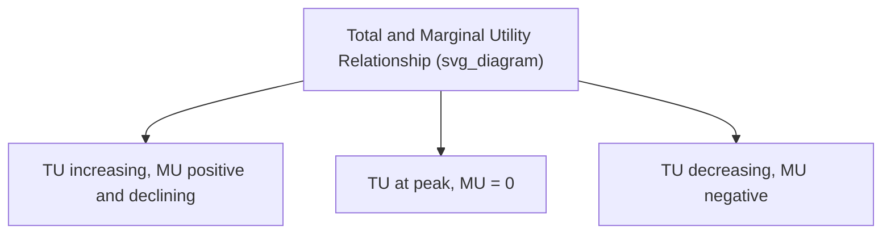
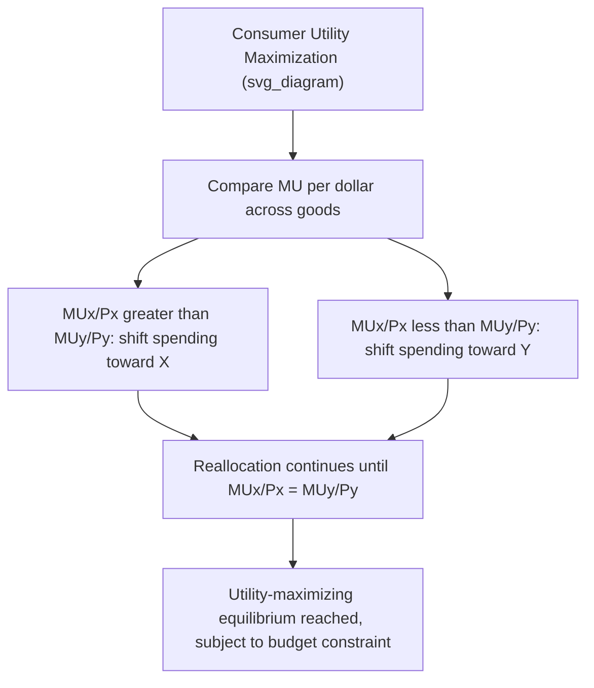
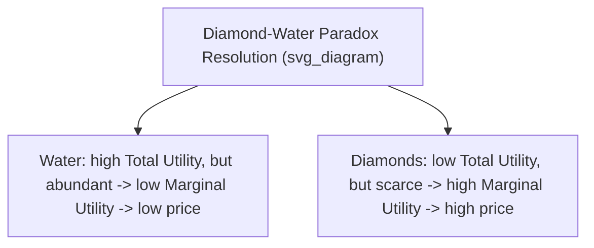

## Utility Theory: Total and Marginal Utility

### Overview

Utility theory provides the microeconomic foundation for consumer choice by modeling the satisfaction, or welfare, an individual derives from consuming goods and services. Total utility and marginal utility are the two core constructs used to explain why demand curves slope downward and how rational consumers allocate limited income across alternative goods.

### Total Utility

**Definition**

Total utility (TU) is the overall satisfaction or benefit a consumer derives from consuming a given quantity of a good or bundle of goods.

**Utility Function**

$$TU = U(Q)$$

where $Q$ is the quantity consumed of a good (holding consumption of other goods constant), or more generally $U(x_1, x_2, \ldots, x_n)$ for a bundle of $n$ goods.

**Key Points**

- Total utility is typically assumed to increase with consumption up to a saturation point, after which further consumption may leave TU unchanged or even reduce it (e.g., overeating).
- Utility is an **ordinal** concept in modern microeconomics — it ranks preferences (bundle A preferred to bundle B) rather than measuring satisfaction in absolute, comparable units (cardinal utility). Early utility theory (19th-century cardinalist tradition) treated utility as measurable in absolute units ("utils"), but this approach is now used mainly as a pedagogical simplification rather than a literal claim about measurable satisfaction. [Note: this represents the standard distinction taught in introductory versus more advanced treatments of consumer theory.]

### Marginal Utility

**Definition**

Marginal utility (MU) is the additional satisfaction gained from consuming one more unit of a good, holding consumption of all other goods constant.

**Formula**

Discrete form:

$$MU_n = TU_n - TU_{n-1}$$

Continuous form (calculus-based):

$$MU = \dfrac{dTU}{dQ}$$

**Relationship Between TU and MU**

| TU Behavior | MU Behavior |
| --- | --- |
| TU rising | MU positive |
| TU at a maximum (peak) | MU = 0 |
| TU falling | MU negative |
| TU rising at a decreasing rate | MU positive but declining |

### The Law of Diminishing Marginal Utility

**Statement**

As a consumer consumes successive additional units of a good within a given time period (holding consumption of other goods constant), the marginal utility derived from each additional unit eventually decreases.

**Key Points**

- This is the foundational psychological/behavioral assumption underlying the law of demand: because each additional unit provides less additional satisfaction, a consumer is only willing to pay a lower price for additional units, producing a downward-sloping demand curve.
- Diminishing marginal utility does not require marginal utility to be positive throughout — MU can decline while remaining positive (TU still rising, just at a decreasing rate) or decline into negative territory (TU falling, i.e., overconsumption reducing total satisfaction).
- The law is typically assumed to apply "eventually" — the first few units of a good may exhibit *increasing* marginal utility in some cases (e.g., needing a minimum quantity to enjoy a good at all), but diminishing marginal utility is assumed to set in beyond some point.

**Numerical Example**

| Units of Pizza Consumed | Total Utility (utils) | Marginal Utility (utils) |
| --- | --- | --- |
| 0 | 0 | — |
| 1 | 20 | 20 |
| 2 | 36 | 16 |
| 3 | 48 | 12 |
| 4 | 56 | 8 |
| 5 | 60 | 4 |
| 6 | 60 | 0 |
| 7 | 56 | −4 |

At 6 units, TU reaches its maximum (60 utils) and MU = 0. Beyond 6 units, TU declines and MU turns negative, reflecting overconsumption (e.g., discomfort from eating too much).

**Diagram: Total and Marginal Utility Curves**

<svg xmlns="http://www.w3.org/2000/svg" viewBox="0 0 560 380">
<text x="20" y="20" font-size="14" font-weight="bold" fill="var(--text-color, #222)">Total Utility and Marginal Utility Curves (svg_diagram)</text>

<g transform="translate(50,40)">
<line x1="0" y1="0" x2="0" y2="140" stroke="#333" stroke-width="2" />
<line x1="0" y1="140" x2="380" y2="140" stroke="#333" stroke-width="2" />
<text x="-35" y="-5" font-size="12">Total Utility</text>
<text x="350" y="160" font-size="12">Quantity</text>
<polyline points="0,140 55,60 110,25 165,5 220,-8 275,-12 330,-8" fill="none" stroke="#c0392b" stroke-width="3" />
<text x="280" y="-18" font-size="11" fill="#c0392b">TU (peaks, then declines)</text>
<circle cx="275" cy="-12" r="4" fill="#c0392b" />
<line x1="275" y1="-12" x2="275" y2="140" stroke="#999" stroke-dasharray="3,3" />
</g>

<g transform="translate(50,240)">
<line x1="0" y1="0" x2="0" y2="120" stroke="#333" stroke-width="2" />
<line x1="0" y1="120" x2="380" y2="120" stroke="#333" stroke-width="2" />
<text x="-35" y="-5" font-size="12">Marginal Utility</text>
<text x="350" y="140" font-size="12">Quantity</text>
<line x1="0" y1="60" x2="380" y2="60" stroke="#bbb" stroke-dasharray="2,2" />
<text x="385" y="64" font-size="10">0</text>
<polyline points="0,10 55,25 110,38 165,48 220,55 275,60 330,72" fill="none" stroke="#2980b9" stroke-width="3" />
<text x="270" y="90" font-size="11" fill="#2980b9">MU (declining, crosses zero)</text>
<circle cx="275" cy="60" r="4" fill="#2980b9" />
<line x1="275" y1="0" x2="275" y2="120" stroke="#999" stroke-dasharray="3,3" />
</g>
</svg>

### Utility Maximization and Consumer Equilibrium

**The Utility-Maximizing Rule**

A rational consumer with a limited budget allocates spending across goods to maximize total utility. The condition for utility-maximizing equilibrium across two (or more) goods is that the marginal utility per dollar (or peso) spent is equalized across all goods purchased:

$$\dfrac{MU_X}{P_X} = \dfrac{MU_Y}{P_Y} = \ldots = \dfrac{MU_n}{P_n}$$

subject to the budget constraint:

$$P_X \cdot Q_X + P_Y \cdot Q_Y = \text{Income}$$

**Intuition**

If $\dfrac{MU_X}{P_X} > \dfrac{MU_Y}{P_Y}$, the consumer gets more satisfaction per dollar from good X than from good Y, so they should reallocate spending toward X and away from Y until the ratios equalize (since MU of X falls as more X is consumed, and MU of Y rises as less Y is consumed, due to diminishing marginal utility).

**Numerical Example**

A consumer has $20 to spend on snacks ($2 each) and drinks ($4 each).

| Units | MU Snacks | MU Snacks / Price | MU Drinks | MU Drinks / Price |
| --- | --- | --- | --- | --- |
| 1 | 20 | 10 | 32 | 8 |
| 2 | 16 | 8 | 24 | 6 |
| 3 | 12 | 6 | 16 | 4 |
| 4 | 8 | 4 | 8 | 2 |
| 5 | 4 | 2 | 4 | 1 |

To maximize utility subject to the $20 budget, the consumer compares $MU/P$ ratios and allocates spending unit-by-unit to whichever good offers the higher ratio, continuing until the budget is exhausted and the ratios are as close to equal as the discrete units allow. Working through this: buying units in descending order of $MU/P$ (10, 8, 8, 6, 6, 4, 4...) — 3 snacks ($6) and 2 drinks ($8) gives ratios of 6 and 6 respectively at the margin, but the consumer has $20 total, so continuing: 4 snacks ($8) and 3 drinks ($12) totals $20, with marginal ratios of 4 (snacks) and 4 (drinks) — equalized at the margin, exhausting the budget exactly.

$$4 \text{ snacks} \times \$2 + 3 \text{ drinks} \times \$4 = \$8 + \$12 = \$20 ✓$$

At this allocation, $\dfrac{MU_{snacks}}{P_{snacks}} = \dfrac{8}{2} = 4$ and $\dfrac{MU_{drinks}}{P_{drinks}} = \dfrac{8}{4} = 2$. [Note: this particular numerical table does not perfectly equalize ratios at whole-unit combinations exhausting exactly $20 — in practice, with discrete/lumpy units, exact equality may not be achievable, and the consumer selects the combination that gets closest to equalized ratios within the budget constraint. Continuous utility functions allow for exact equalization at the margin.]

### Deriving the Law of Demand from Diminishing Marginal Utility

The law of diminishing marginal utility implies that a consumer is willing to pay a lower price for additional units of a good, since each successive unit provides less marginal satisfaction. This provides one classical (cardinalist) justification for the downward-sloping demand curve — as price falls, the consumer's marginal utility per dollar spent on the good is restored to the equilibrium level relative to other goods, inducing them to buy more.

### The Diamond-Water Paradox

**Statement of the Paradox**

Water, essential for survival, has a very low market price, while diamonds, largely non-essential, command a very high price. This apparent paradox troubled early economists (including Adam Smith) because it seemed to contradict the idea that useful goods should be valuable.

**Resolution via Marginal Utility**

The paradox is resolved by distinguishing **total utility** from **marginal utility**. Water has enormous total utility (it is essential to life), but because it is abundant, its marginal utility (the value of one additional unit) is low. Diamonds have low total utility relative to water, but because they are scarce, their marginal utility is high. Price is determined by marginal utility (and marginal cost of provision), not total utility.

### Cardinal vs. Ordinal Utility Approaches

| Approach | Key Assumption | Analytical Tool |
| --- | --- | --- |
| Cardinal utility (classical) | Utility is measurable in absolute units ("utils") and comparable across goods/individuals | Total and marginal utility schedules/curves |
| Ordinal utility (modern) | Consumers can only rank bundles (prefer A to B), not measure the intensity of preference numerically | Indifference curves and the marginal rate of substitution |

**Key Point**: Modern consumer theory generally relies on the ordinal approach (indifference curve analysis) because it requires weaker assumptions about what can be measured, while still deriving the same core predictions (e.g., downward-sloping demand, the utility-maximizing budget allocation rule expressed via the marginal rate of substitution equaling the price ratio). Total/marginal utility with cardinal "utils" remains a widely used introductory teaching tool because it is more intuitive before indifference curve analysis is introduced.

### Applications

- **Explaining the law of demand**: Diminishing marginal utility provides an intuitive, if simplified, behavioral rationale for why demand curves slope downward.
- **Consumer surplus interpretation**: Consumer surplus can be understood as the excess of total utility (converted to monetary terms via marginal utility) over the amount actually paid.
- **Resource allocation decisions**: The equal marginal utility per dollar rule underlies the general principle of efficient allocation of a limited budget across competing uses, applicable beyond simple consumer goods (e.g., time allocation, public budget allocation across projects).
- **Progressive taxation arguments**: Some ability-to-pay arguments for progressive taxation informally invoke diminishing marginal utility of income — the idea that an additional dollar provides less added satisfaction to a high-income individual than to a low-income individual. [Note: this application relies on interpersonal utility comparisons, which are explicitly avoided in modern ordinal utility theory and are treated as a normative/philosophical extension rather than a strict implication of positive economic theory.]

### Common Pitfalls

- **Confusing total utility with marginal utility**: A good can have very high total utility (e.g., water) while having low marginal utility due to abundance; price tracks marginal, not total, utility.
- **Assuming marginal utility is always positive**: MU can be zero (at the TU peak) or negative (during overconsumption); "diminishing" marginal utility does not mean marginal utility must stay positive.
- **Treating "utils" as literally measurable, comparable units**: The cardinal utility framework with numerical utils is a simplifying pedagogical device; modern theory relies on ordinal rankings and does not require utility to be measured on an absolute, interpersonally comparable scale.
- **Forgetting the "holding other goods constant" condition**: Marginal utility of one good is defined holding consumption of all other goods fixed; changes in the consumption of complements or substitutes can shift the entire marginal utility schedule for a given good.
- **Misapplying the equal marginal utility per dollar rule to indivisible/lumpy goods**: With large discrete units, exact equalization of $MU/P$ ratios across goods may not be achievable at any feasible combination; the rule is exact only in the continuous case or as an approximate guide with discrete units.

**Related Topics**

- Indifference curves and the marginal rate of substitution
- Budget constraints and consumer equilibrium
- Consumer and producer surplus
- Income and substitution effects
- Elasticity of demand
- Behavioral economics: bounded rationality and prospect theory
- Revealed preference theory
- Diamond-water paradox and value theory in the history of economic thought