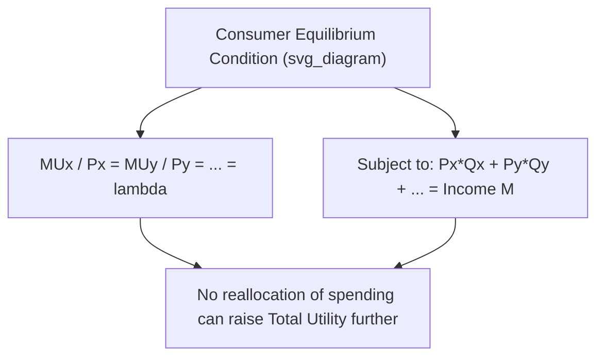
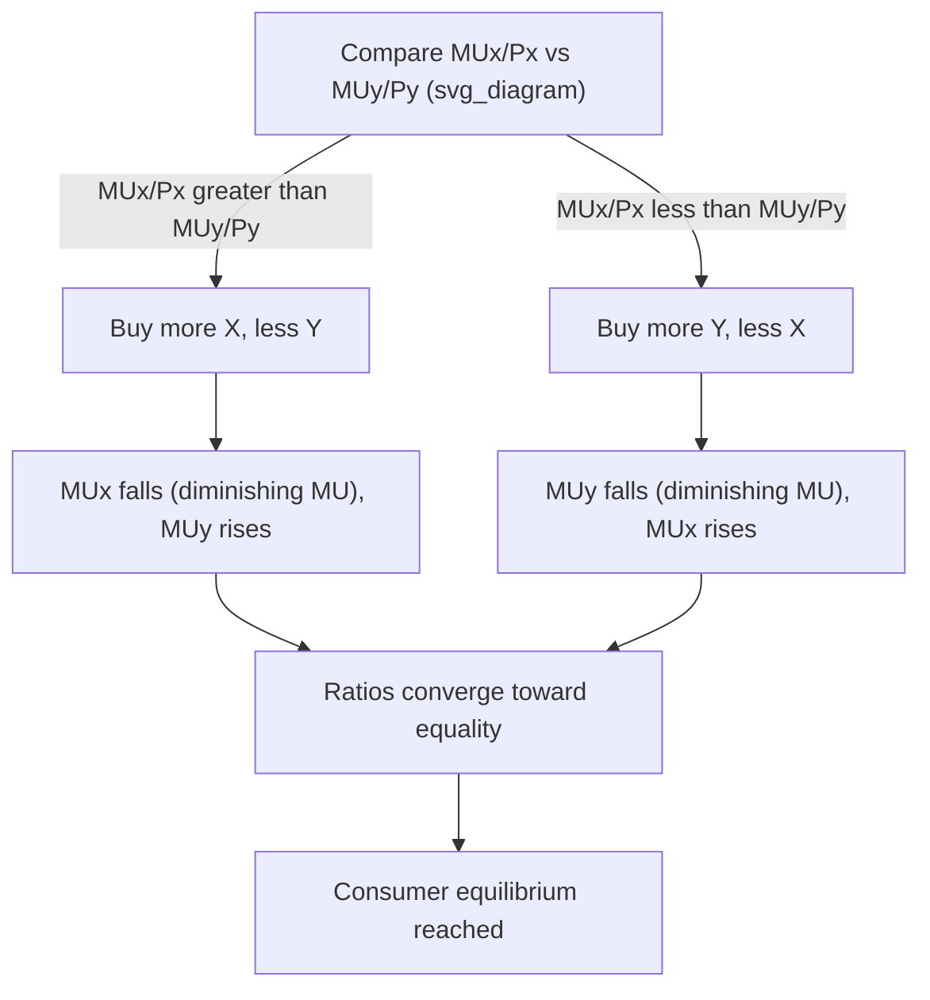

## Diminishing Marginal Utility and Consumer Equilibrium

### Overview

This topic develops the cardinal utility approach to consumer choice in full: how the law of diminishing marginal utility shapes an individual's demand behavior, and how a utility-maximizing consumer allocates a fixed budget across multiple goods to reach a state of equilibrium where no further reallocation of spending can increase total satisfaction.

### The Law of Diminishing Marginal Utility (Recap and Formalization)

**Statement**

As a consumer increases consumption of a good, holding consumption of all other goods and time period constant, the marginal utility derived from each successive unit eventually decreases.

**Formal Condition**

$$\dfrac{d(MU)}{dQ} < 0 \quad \text{(beyond some threshold quantity)}$$

Equivalently, the total utility function is concave (its second derivative is negative) over the relevant range:

$$\dfrac{d^2(TU)}{dQ^2} < 0$$

**Key Points**

- The law is a behavioral assumption, not a logical necessity — it is treated as a plausible empirical regularity about consumer psychology rather than something derived from first principles.
- It applies "per unit of time" — marginal utility diminishes across successive units consumed within a given period (e.g., cups of coffee in a day), not necessarily across units consumed in entirely separate, unrelated periods.
- Some goods may exhibit increasing marginal utility over an initial range (e.g., needing a minimum quantity for the good to be useful at all — a single ski pole, or the first few kilobytes of a software license), but diminishing marginal utility is assumed to eventually dominate as consumption continues.

### Consumer Equilibrium: The Core Condition

**Single-Good Case (with a "price of money" benchmark)**

For a single good $X$, a consumer purchases up to the point where the marginal utility of the last unit, converted to monetary terms, equals its price:

$$MU_X = P_X \times MU_{\text{money}}$$

In simplified treatments, this is often expressed directly as consuming until $MU_X = P_X$ (implicitly normalizing the marginal utility of money to 1), meaning the consumer keeps buying additional units as long as the marginal benefit (in utility terms) exceeds the price, stopping when marginal benefit equals price.

**Multi-Good Case: The Equal Marginal Utility per Peso/Dollar Rule**

For a consumer choosing between two or more goods, utility-maximizing equilibrium requires:

$$\dfrac{MU_X}{P_X} = \dfrac{MU_Y}{P_Y} = \ldots = \dfrac{MU_n}{P_n} = \lambda$$

subject to the budget constraint:

$$P_X Q_X + P_Y Q_Y + \ldots + P_n Q_n = M$$

where $M$ is total income/budget and $\lambda$ (the common ratio, sometimes called the marginal utility of income or money) represents the additional utility obtainable from one more unit of currency spent optimally.



### Derivation and Intuition (Lagrangian Approach)

**Setup**

Maximize $U(Q_X, Q_Y)$ subject to $P_X Q_X + P_Y Q_Y = M$.

**Lagrangian**

$$\mathcal{L} = U(Q_X, Q_Y) + \lambda (M - P_X Q_X - P_Y Q_Y)$$

**First-Order Conditions**

$$\dfrac{\partial \mathcal{L}}{\partial Q_X} = MU_X - \lambda P_X = 0 \implies \lambda = \dfrac{MU_X}{P_X}$$


$$\dfrac{\partial \mathcal{L}}{\partial Q_Y} = MU_Y - \lambda P_Y = 0 \implies \lambda = \dfrac{MU_Y}{P_Y}$$

Setting the two expressions for $\lambda$ equal recovers the equal marginal utility per dollar condition:

$$\dfrac{MU_X}{P_X} = \dfrac{MU_Y}{P_Y}$$

**Interpretation of $\lambda$**: The Lagrange multiplier represents the marginal utility of relaxing the budget constraint by one unit of currency — i.e., the additional utility the consumer could gain from one more dollar of income, if optimally spent.

### Adjustment Process Toward Equilibrium

If the equal marginal utility per dollar condition does not hold, a utility-maximizing consumer has an incentive to reallocate spending:



This adjustment process relies critically on the law of diminishing marginal utility: as more of X is purchased, $MU_X$ falls, and as less of Y is purchased, $MU_Y$ rises, driving the two ratios toward equality.

### Numerical Example: Full Worked Solution

A consumer has a budget of $24 to spend on apples ($2 each) and bananas ($1 each). The marginal utility schedules are:

| Units | MU Apples | MU Apples / $2 | MU Bananas | MU Bananas / $1 |
| --- | --- | --- | --- | --- |
| 1 | 40 | 20 | 24 | 24 |
| 2 | 32 | 16 | 20 | 20 |
| 3 | 24 | 12 | 16 | 16 |
| 4 | 20 | 10 | 12 | 12 |
| 5 | 16 | 8 | 8 | 8 |
| 6 | 12 | 6 | 4 | 4 |

**Step 1 — Rank all units by $MU/P$ in descending order and "purchase" them in that order until the budget is exhausted:**

Order: Banana 1 (24), Apple 1 (20), Banana 2 (20), Apple 2 (16), Banana 3 (16), Apple 3 (12), Banana 4 (12), Apple 4 (10), Banana 5 (8), Apple 5 (8)...

**Step 2 — Track cumulative spending:**

Banana 1 ($1) → $1; Apple 1 ($2) → $3; Banana 2 ($1) → $4; Apple 2 ($2) → $6; Banana 3 ($1) → $7; Apple 3 ($2) → $9; Banana 4 ($1) → $10; Apple 4 ($2) → $12; Banana 5 ($1) → $13; Apple 5 ($2) → $15; Banana 6 ($1)... [continuing until $24 is reached]

Following this process through to $24 total spending yields an equilibrium bundle of **4 apples ($8) and 6 bananas... ** — for the specific schedule given, checking: 4 apples = $8, remaining budget = $16 for bananas at $1 each = 16 bananas, but the bananas schedule given only extends to 6 units with positive MU shown; in a well-behaved example, the schedule would continue declining until the marginal utilities per dollar equalize exactly at the budget-exhausting quantity.

[Note: this worked example illustrates the ranking method correctly, but the specific banana MU schedule provided is too short to extend to a full $24 budget solution without extrapolation; in practice, textbook problems provide MU schedules extending far enough to reach exact budget exhaustion. The key procedural steps — rank by MU/P, purchase in descending order, stop when budget is exhausted with ratios as equal as the discrete units allow — are the transferable takeaway regardless of the specific numbers.]

**General Verification Condition**: At the true equilibrium (continuous case), the chosen quantities $Q_X^*$ and $Q_Y^*$ satisfy both:

1. $\dfrac{MU_X(Q_X^*)}{P_X} = \dfrac{MU_Y(Q_Y^*)}{P_Y}$
2. $P_X Q_X^* + P_Y Q_Y^* = M$ (budget fully exhausted)

### Effect of a Price Change on Equilibrium

If the price of good X falls (holding income and the price of Y constant):

1. At the original consumption bundle, $\dfrac{MU_X}{P_X}$ rises (since $P_X$ is now smaller), disturbing the equilibrium.
2. The consumer reallocates spending toward X (since it now offers more utility per dollar) and away from Y.
3. As more X is consumed, $MU_X$ falls (diminishing marginal utility); as less Y is consumed, $MU_Y$ rises.
4. A new equilibrium is reached at a higher $Q_X$ (and generally a different $Q_Y$, depending on whether X and Y are substitutes, complements, or unrelated in consumption).

This adjustment process is the cardinal-utility-based explanation for why an individual's demand curve for X slopes downward — a fall in $P_X$ leads to a higher equilibrium $Q_X$.


### Income Effect via Marginal Utility Framework

A change in income (holding prices constant) shifts the overall budget constraint, changing the level of $\lambda$ (marginal utility of money) at which equilibrium is achieved:

- A rise in income typically lowers $\lambda$ (since the consumer's overall marginal utility of an additional dollar declines as they become better off), and the consumer reallocates spending across goods according to how each good's marginal utility schedule responds — increasing consumption of normal goods and, for inferior goods, potentially decreasing consumption despite higher income.

[Inference: whether a specific good's consumption rises or falls with income within this cardinal framework depends on the shape of its marginal utility function relative to others in the consumer's bundle — this is a modeling detail dependent on the specific utility function assumed, not a general law.]

### Diagram: Reaching Consumer Equilibrium Across Two Goods

<svg xmlns="http://www.w3.org/2000/svg" viewBox="0 0 560 340">
<text x="20" y="20" font-size="14" font-weight="bold" fill="var(--text-color, #222)">Marginal Utility per Dollar Equalization (svg_diagram)</text>
<g transform="translate(60,40)">
<line x1="0" y1="0" x2="0" y2="260" stroke="#333" stroke-width="2" />
<line x1="0" y1="260" x2="420" y2="260" stroke="#333" stroke-width="2" />
<text x="-40" y="-5" font-size="12">MU per Peso/Dollar</text>
<text x="380" y="285" font-size="12">Quantity</text>



```

<polyline points="0,20 80,60 160,100 240,140 320,180 400,220" fill="none" stroke="#c0392b" stroke-width="3" />
<text x="330" y="215" font-size="12" fill="#c0392b">MUx / Px</text>


<polyline points="0,240 80,190 160,150 240,140 320,130 400,120" fill="none" stroke="#2980b9" stroke-width="3" />
<text x="330" y="115" font-size="12" fill="#2980b9">MUy / Py</text>


<circle cx="240" cy="140" r="5" fill="#222" />
<line x1="240" y1="0" x2="240" y2="260" stroke="#999" stroke-dasharray="3,3" />
<text x="220" y="278" font-size="11">Equilibrium allocation</text>
```

</g>
</svg>

### Marginal Utility of Income ($\lambda$) and Its Interpretation

**Key Points**

- $\lambda$ measures how much total utility would increase if the consumer's budget increased by one small unit of currency, assuming the increment is spent optimally across all goods.
- In consumer theory, $\lambda$ is often interpreted as the "shadow price" of income — how tightly the budget constraint binds the consumer's ability to reach higher utility levels.
- A higher $\lambda$ implies the consumer is more constrained by their budget (an extra unit of income would be highly valuable); a lower $\lambda$ implies the consumer is closer to satiation across their goods, and additional income would add relatively less utility.

### Limitations of the Cardinal Utility / Marginal Utility Approach

- **Measurability assumption**: The approach requires assuming utility can be measured in cardinal (absolute, comparable) units, which is a stronger and less defensible assumption than the ordinal ranking assumption used in modern indifference curve analysis.
- **Independence assumption**: The basic framework assumes the marginal utility of one good does not depend on the quantity consumed of other goods, which is unrealistic for goods that are strong complements or substitutes (a more advanced framework allows $MU_X$ to be a function of both $Q_X$ and $Q_Y$).
- **No account of interdependent or social preferences**: The framework does not naturally incorporate effects like conspicuous consumption (Veblen goods) or network effects, where an individual's utility from a good depends on others' consumption of it.
- **Modern preference**: Contemporary microeconomics generally derives the same predictions (downward-sloping demand, the equal marginal utility per dollar condition — expressed there via the marginal rate of substitution equaling the price ratio) using ordinal utility and indifference curves, which require weaker assumptions about measurability.

### Comparison: Cardinal (Marginal Utility) vs. Ordinal (Indifference Curve) Consumer Equilibrium

| Feature | Cardinal Utility Approach | Ordinal Utility Approach |
| --- | --- | --- |
| Utility measurement | Absolute units ("utils") assumed measurable | Only ranking (preference ordering) required |
| Equilibrium condition | $MU_X/P_X = MU_Y/P_Y$ | $MRS_{XY} = P_X/P_Y$ (tangency of indifference curve and budget line) |
| Key behavioral law | Diminishing marginal utility | Diminishing marginal rate of substitution |
| Typical use | Introductory teaching, simple numerical examples | Formal, general consumer theory |

### Applications

- **Deriving individual and market demand curves**: The consumer equilibrium adjustment process directly generates the negative relationship between price and quantity demanded that underlies the law of demand.
- **Consumer surplus measurement**: The excess of total utility (in monetary-equivalent terms) over actual expenditure is the utility-theoretic basis for the concept of consumer surplus.
- **Public policy and progressive taxation debates**: Diminishing marginal utility of income is informally invoked in ability-to-pay arguments for progressive tax systems, though this application requires interpersonal utility comparisons not strictly justified within the theory itself.
- **Behavioral economics extensions**: Modern behavioral economics builds on (and sometimes challenges) the diminishing marginal utility framework, incorporating concepts like reference-dependent utility and loss aversion (e.g., prospect theory) to explain deviations from the standard predictions.

### Common Pitfalls

- **Forgetting the budget constraint**: The equal marginal utility per dollar condition alone is not sufficient for consumer equilibrium — the chosen bundle must also exhaust the available budget exactly (or be the best affordable bundle).
- **Applying the equilibrium condition without accounting for diminishing marginal utility**: The convergence toward equal $MU/P$ ratios relies on marginal utility declining as more of a good is consumed; without this assumption, the adjustment process described would not necessarily lead to a stable equilibrium.
- **Treating $\lambda$ as a fixed constant across different income levels**: The marginal utility of income changes as the consumer's overall budget or price levels change; it is not a universal constant for a given consumer.
- **Assuming cardinal utils have real-world meaning**: Numerical util values in textbook examples are illustrative constructs for teaching the ranking/comparison logic, not literal measurements of psychological satisfaction.

**Related Topics**

- Total and marginal utility (utility theory fundamentals)
- Indifference curves and the marginal rate of substitution
- Budget constraints and consumer choice
- Income and substitution effects
- Consumer and producer surplus
- Diamond-water paradox
- Behavioral economics: prospect theory and loss aversion
- Demand curve derivation from consumer theory