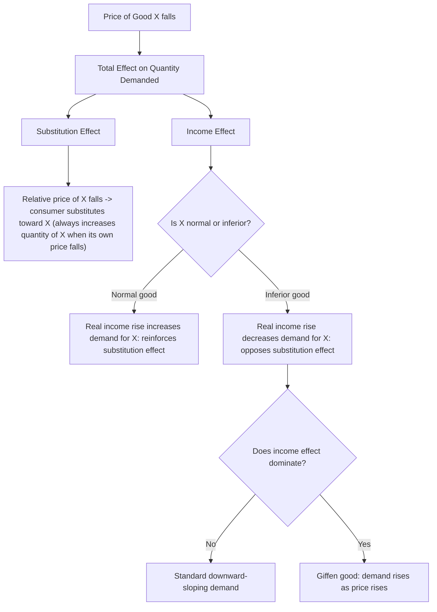

## Indifference Curves and Budget Constraints

### Overview

Consumer theory models how a rational, utility-maximizing individual allocates a limited budget across available goods. Two constructs anchor this model: the **indifference curve**, which represents the consumer's subjective preferences, and the **budget constraint**, which represents the objective limits imposed by income and prices. Together they determine the consumer's optimal, utility-maximizing bundle of goods.

### Preferences and Utility

A consumer's preferences over bundles of goods are typically assumed to satisfy several axioms:

- **Completeness**: for any two bundles $A$ and $B$, the consumer can state whether $A \succ B$, $B \succ A$, or $A \sim B$.
- **Transitivity**: if $A \succeq B$ and $B \succeq C$, then $A \succeq C$.
- **Non-satiation (more is better)**: more of a good is weakly preferred to less.
- **Convexity**: consumers prefer averages/mixtures of bundles to extremes, which produces the standard bowed-in shape of indifference curves.

These axioms let preferences be represented by a **utility function** $U(x, y)$, where $x$ and $y$ are quantities of two goods. Utility functions are ordinal, not cardinal — the specific numeric values carry no meaning beyond their ranking; a monotonic transformation of $U$ represents the same preferences.

### Indifference Curves

An indifference curve is the locus of all bundles $(x, y)$ that yield the same level of utility:

$$U(x, y) = \bar{U}$$

where $\bar{U}$ is a constant utility level. A full set of indifference curves for different utility levels is called an **indifference map**.

**Key properties**, given standard preference axioms:

- **Downward sloping**: to hold utility constant while decreasing one good, the other must increase (assuming non-satiation).
- **Cannot cross**: two indifference curves intersecting would violate transitivity, since the intersection point would imply two different utility levels for the same bundle.
- **Higher curves represent higher utility**: curves further from the origin correspond to greater total satisfaction.
- **Convex to the origin (bowed inward)**: this follows from a diminishing marginal rate of substitution.

### Marginal Rate of Substitution (MRS)

The **MRS** measures how much of good $y$ a consumer is willing to give up for one additional unit of good $x$, while remaining equally satisfied. It is the negative of the slope of the indifference curve at a given point:

$$MRS_{x,y} = -\frac{dy}{dx}\bigg|_{U=\bar{U}} = \frac{MU_x}{MU_y}$$

where $MU_x = \partial U/\partial x$ and $MU_y = \partial U/\partial y$ are the marginal utilities of each good.

**Diminishing MRS**: as a consumer acquires more of $x$ and less of $y$, they typically require progressively smaller reductions in $y$ to compensate for each additional unit of $x$ — this is what produces the convex shape of well-behaved indifference curves.

**Special cases**:

- **Perfect substitutes** (e.g., two brands the consumer views as identical): $U(x, y) = ax + by$. Indifference curves are straight lines; MRS is constant.
- **Perfect complements** (e.g., left and right shoes): $U(x, y) = \min(ax, by)$. Indifference curves are L-shaped (right angles); goods are consumed in fixed proportions.
- **Cobb-Douglas preferences**: $U(x, y) = x^{\alpha} y^{\beta}$. Produces smooth, convex, hyperbola-like curves; widely used due to tractable math and constant expenditure shares.

<svg xmlns="http://www.w3.org/2000/svg" viewBox="0 0 500 400">
<text x="250" y="25" text-anchor="middle" font-size="16" font-weight="bold" fill="#222">Indifference Map (svg_diagram)</text>
<line x1="60" y1="350" x2="60" y2="40" stroke="#333" stroke-width="2" />
<line x1="60" y1="350" x2="470" y2="350" stroke="#333" stroke-width="2" />
<text x="475" y="355" font-size="14" fill="#333">Good X</text>
<text x="30" y="40" font-size="14" fill="#333">Good Y</text>
<path d="M 90,330 C 150,140 260,90 420,70" fill="none" stroke="#1f77b4" stroke-width="2" />
<path d="M 120,330 C 190,170 300,120 450,100" fill="none" stroke="#2ca02c" stroke-width="2" />
<path d="M 150,330 C 230,200 340,150 460,135" fill="none" stroke="#d62728" stroke-width="2" />

<text x="425" y="65" font-size="12" fill="`#1f77b4`">U1</text>

<text x="455" y="95" font-size="12" fill="`#2ca02c`">U2</text>

<text x="465" y="130" font-size="12" fill="`#d62728`">U3</text>

<text x="250" y="380" text-anchor="middle" font-size="12" fill="#555">Utility increases outward: U3 &gt; U2 &gt; U1</text>

</svg>

### The Budget Constraint

The budget constraint reflects the set of bundles a consumer can afford given income $M$ and prices $P_x$, $P_y$:

$$P_x x + P_y y \leq M$$

The **budget line** (the boundary of this set, assuming all income is spent) is:

$$P_x x + P_y y = M \quad \Longrightarrow \quad y = \frac{M}{P_y} - \frac{P_x}{P_y}x$$

**Key features**:

- **Vertical intercept** ($x = 0$): $y = M / P_y$ — maximum affordable quantity of $y$.
- **Horizontal intercept** ($y = 0$): $x = M / P_x$ — maximum affordable quantity of $x$.
- **Slope**: $-P_x / P_y$, the negative of the price ratio. This represents the **market rate of exchange** — how many units of $y$ must be sacrificed in the market to obtain one more unit of $x$.
- The area beneath and including the line is the **feasible/affordable set**; points beyond it are unaffordable.

**Shifts and rotations**:

- A change in income $M$ (with prices fixed) shifts the budget line **parallel** — outward for an increase, inward for a decrease.
- A change in $P_x$ alone **rotates** the line around the $y$-intercept (since $M/P_y$ is unaffected).
- A change in $P_y$ alone rotates the line around the $x$-intercept.
- A proportional change in both prices and income leaves the line unchanged (no money illusion under this assumption).

<svg xmlns="http://www.w3.org/2000/svg" viewBox="0 0 500 400">
<text x="250" y="25" text-anchor="middle" font-size="16" font-weight="bold" fill="#222">Budget Line Shifts and Rotations (svg_diagram)</text>
<line x1="60" y1="350" x2="60" y2="40" stroke="#333" stroke-width="2" />
<line x1="60" y1="350" x2="470" y2="350" stroke="#333" stroke-width="2" />
<text x="475" y="355" font-size="14" fill="#333">Good X</text>
<text x="30" y="40" font-size="14" fill="#333">Good Y</text>
<line x1="60" y1="300" x2="300" y2="350" stroke="#1f77b4" stroke-width="2" />
<line x1="60" y1="200" x2="420" y2="350" stroke="#2ca02c" stroke-width="2" />
<line x1="60" y1="200" x2="250" y2="350" stroke="#d62728" stroke-width="2" />

<text x="65" y="295" font-size="12" fill="`#1f77b4`">Original</text>

<text x="65" y="195" font-size="12" fill="`#2ca02c`">Income ↑ (parallel shift)</text>

<text x="255" y="345" font-size="12" fill="`#d62728`">Px ↑ (rotation)</text>

</svg>

### Consumer Equilibrium: Utility Maximization

The consumer's problem is:

$$\max_{x,y} U(x, y) \quad \text{subject to} \quad P_x x + P_y y = M$$

**Graphical solution**: the optimal bundle occurs where the highest attainable indifference curve is **tangent** to the budget line — the point where the curve just touches the line without crossing it.

**Tangency condition**: at the optimum (for an interior solution with smooth, convex indifference curves):

$$MRS_{x,y} = \frac{P_x}{P_y} \quad \Longleftrightarrow \quad \frac{MU_x}{MU_y} = \frac{P_x}{P_y} \quad \Longleftrightarrow \quad \frac{MU_x}{P_x} = \frac{MU_y}{P_y}$$

This last form is the **equimarginal principle**: at the optimum, the marginal utility per dollar spent must be equal across all goods. If it were not equal, the consumer could reallocate spending toward the good with higher marginal utility per dollar and increase total utility.

**Lagrangian derivation**:

$$\mathcal{L} = U(x, y) + \lambda (M - P_x x - P_y y)$$

First-order conditions:

$$\frac{\partial \mathcal{L}}{\partial x} = MU_x - \lambda P_x = 0, \qquad \frac{\partial \mathcal{L}}{\partial y} = MU_y - \lambda P_y = 0$$

Dividing these yields the tangency condition above. Here $\lambda$ represents the **marginal utility of income** — the additional utility from one more unit of the budget.

<svg xmlns="http://www.w3.org/2000/svg" viewBox="0 0 500 400">
<text x="250" y="25" text-anchor="middle" font-size="16" font-weight="bold" fill="#222">Consumer Equilibrium: Tangency (svg_diagram)</text>
<line x1="60" y1="350" x2="60" y2="40" stroke="#333" stroke-width="2" />
<line x1="60" y1="350" x2="470" y2="350" stroke="#333" stroke-width="2" />
<text x="475" y="355" font-size="14" fill="#333">Good X</text>
<text x="30" y="40" font-size="14" fill="#333">Good Y</text>
<line x1="60" y1="90" x2="430" y2="350" stroke="#555" stroke-width="2" />
<text x="330" y="330" font-size="12" fill="#555">Budget Line</text>
<path d="M 100,340 C 160,190 260,150 400,140" fill="none" stroke="#999" stroke-width="1.5" stroke-dasharray="4,3" />
<path d="M 130,340 C 200,220 290,180 400,220" fill="none" stroke="#1f77b4" stroke-width="2" />
<path d="M 160,340 C 230,260 310,240 400,280" fill="none" stroke="#999" stroke-width="1.5" stroke-dasharray="4,3" />
<circle cx="245" cy="205" r="5" fill="#d62728" />
<text x="255" y="200" font-size="12" fill="#d62728">E (optimal bundle)</text>
<text x="410" y="215" font-size="12" fill="#1f77b4">Attainable, tangent U</text>
</svg>

### Corner Solutions

When goods are **perfect substitutes**, or when preferences are non-convex, the optimum may occur at a **corner** — where the consumer spends their entire budget on one good — rather than at an interior tangency point. Here the tangency condition may not hold with equality; instead, the consumer buys $x$ only if $MU_x / P_x > MU_y / P_y$ at every feasible point along the axis.

### Comparative Statics: Deriving Demand and Income Curves

**Price changes and demand**: repeating the utility-maximization exercise for different values of $P_x$ (holding $M$ and $P_y$ fixed) traces out the individual **demand curve** for good $x$ — the relationship between $P_x$ and the utility-maximizing quantity $x^*$.

**Income changes and Engel curves**: repeating the exercise for different values of $M$ (holding prices fixed) traces the **income consumption curve**, connecting the sequence of optimal bundles. Plotting $M$ against $x^*$ gives the **Engel curve**.

- A **normal good**: quantity demanded rises as income rises (Engel curve slopes upward).
- An **inferior good**: quantity demanded falls as income rises (Engel curve slopes downward) beyond some income level.

**Price changes and the price consumption curve**: connecting optimal bundles as $P_x$ varies traces the **price consumption curve**.

### Income and Substitution Effects

A change in $P_x$ has two conceptually distinct effects on quantity demanded, decomposed using the **Slutsky** or **Hicksian** method:

- **Substitution effect**: the change in quantity demanded due purely to the change in relative prices, holding utility (or real purchasing power) constant. This is isolated by pivoting the budget line around the original indifference curve (Hicks) or the original bundle (Slutsky).
- **Income effect**: the change in quantity demanded due to the change in real purchasing power caused by the price change, holding relative prices constant. This is isolated by shifting the pivoted budget line out to the new budget line.

For a **normal good**, both effects reinforce each other when price falls (both increase quantity demanded). For an **inferior good**, the income effect works against the substitution effect. A **Giffen good** is the extreme case where the income effect dominates and quantity demanded moves in the same direction as price — an upward-sloping demand curve. [Inference: true Giffen behavior is a theoretical limiting case rarely documented unambiguously in real-world data, though some empirical studies have proposed candidate examples.]

### Special Cases and Applications

- **Quasi-linear utility** ($U(x, y) = v(x) + y$): produces demand for $x$ that is independent of income, useful in partial equilibrium and welfare analysis.
- **Homothetic preferences** (e.g., Cobb-Douglas, perfect substitutes/complements): the ratio of goods demanded depends only on relative prices, not on income level — the income consumption curve is a straight line through the origin.
- **Kinked budget constraints**: arise in applications such as overtime wages, subsidized quantities, or quantity discounts, where the price of a good changes after a threshold quantity.
- **Endowment models**: used in labor supply and intertemporal consumption, where the consumer's initial endowment (rather than pure money income) defines the budget constraint, and the constraint pivots around the endowment point as prices change.

### Common Pitfalls

- Confusing the **slope of the indifference curve** (MRS, a preference-based ratio) with the **slope of the budget line** (a market-based price ratio); the optimum condition is that these are equal, not that either alone determines the outcome.
- Assuming diminishing MRS always holds — it does not for perfect substitutes (constant MRS) or perfect complements (undefined/infinite MRS along the kink).
- Treating utility values as cardinally meaningful (e.g., claiming a bundle with $U=20$ is "twice as good" as one with $U=10$) — ordinal utility only ranks bundles, and is unique up to positive monotonic transformation.
- Forgetting that a parallel shift in the budget line comes from an income change, while a rotation comes from a relative price change.

### Related Topics

- Utility functions and marginal utility
- Slutsky equation (formal decomposition of price effects)
- Revealed preference theory
- Consumer surplus and welfare measurement
- Labor-leisure choice model
- Intertemporal choice and the consumption-savings model
- General equilibrium and the Edgeworth box