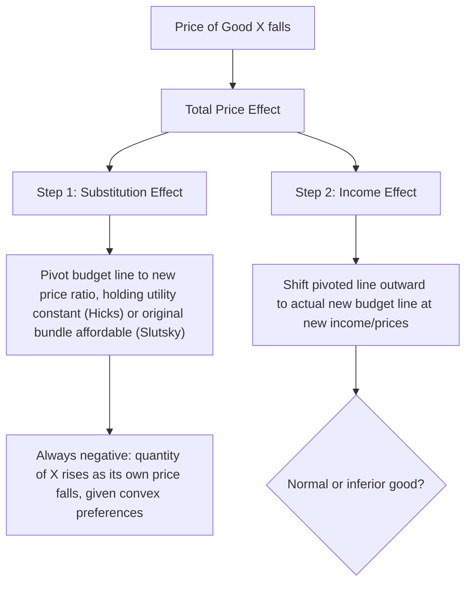

## Income and Substitution Effects

### Overview

When the price of a good changes, the quantity a utility-maximizing consumer demands changes for two distinct, simultaneously operating reasons. The **substitution effect** captures the change in consumption due purely to the change in relative prices, holding the consumer's real purchasing power (utility) constant. The **income effect** captures the change in consumption due to the change in real purchasing power caused by the price change, holding relative prices constant. Decomposing the total price effect into these two components is central to understanding demand behavior, welfare analysis, and anomalies such as Giffen goods.

### The Total Effect

Starting from consumer equilibrium — where an indifference curve is tangent to the budget line — a fall in $P_x$ (holding $P_y$ and income $M$ fixed) rotates the budget line outward around the $y$-intercept. The consumer reoptimizes at a new tangency point on a higher indifference curve. The change in the quantity of $x$ demanded, from the original bundle to this new bundle, is the **total effect** (or total price effect).

$$\text{Total Effect} = x_2^* - x_1^*$$

where $x_1^*$ is the original optimal quantity and $x_2^*$ is the new optimal quantity after the price change.

### Decomposing the Total Effect

Two standard methods isolate the substitution effect by imagining an intermediate, hypothetical budget line at the new relative prices. They differ in what is held fixed to construct that intermediate line.

#### Hicksian (Compensating Variation) Decomposition

The Hicksian approach holds **utility** constant. Construct a hypothetical budget line that:

- Has the slope of the **new** price ratio ($-P_x'/P_y$)
- Is tangent to the **original** indifference curve

This isolates a movement along the same indifference curve — a pure change in the relative-price-driven consumption mix with no change in welfare.

- **Substitution effect (Hicks)**: the movement from the original bundle to the tangency point of the new price ratio with the *original* indifference curve.
- **Income effect (Hicks)**: the movement from that intermediate tangency point to the actual new optimal bundle on the *new* indifference curve.

#### Slutsky (Compensating Income) Decomposition

The Slutsky approach holds **purchasing power over the original bundle** constant, rather than utility. Construct a hypothetical budget line that:

- Has the slope of the **new** price ratio
- Passes through the **original** consumption bundle (i.e., the consumer is given just enough income to still afford their original bundle at new prices)
- **Substitution effect (Slutsky)**: the movement from the original bundle to the optimal bundle chosen along this hypothetical line.
- **Income effect (Slutsky)**: the movement from that point to the actual new optimal bundle.

[Inference: the Slutsky compensation is more directly observable and computable from market data since it requires no knowledge of the underlying utility function, whereas the Hicksian version requires expenditure-minimization concepts; for this reason, empirical demand estimation more commonly relies on the Slutsky formulation, while Hicksian measures are favored in formal welfare analysis.]

<svg xmlns="http://www.w3.org/2000/svg" viewBox="0 0 520 420">
<text x="260" y="25" text-anchor="middle" font-size="16" font-weight="bold" fill="#222">Hicksian Decomposition of a Price Fall (svg_diagram)</text>
<line x1="60" y1="370" x2="60" y2="40" stroke="#333" stroke-width="2" />
<line x1="60" y1="370" x2="480" y2="370" stroke="#333" stroke-width="2" />
<text x="485" y="375" font-size="13" fill="#333">Good X</text>
<text x="30" y="40" font-size="13" fill="#333">Good Y</text>
<line x1="60" y1="120" x2="300" y2="370" stroke="#555" stroke-width="2" />
<text x="220" y="345" font-size="11" fill="#555">Original budget line</text>
<line x1="60" y1="120" x2="460" y2="370" stroke="#888" stroke-width="1.5" stroke-dasharray="5,3" />
<text x="380" y="355" font-size="11" fill="#888">Hypothetical (new prices, old utility)</text>
<line x1="60" y1="70" x2="440" y2="370" stroke="#2ca02c" stroke-width="2" />
<text x="330" y="330" font-size="11" fill="#2ca02c">New budget line</text>
<path d="M 100,360 C 160,220 250,175 380,165" fill="none" stroke="#1f77b4" stroke-width="2" />
<path d="M 130,360 C 200,240 300,200 420,220" fill="none" stroke="#d62728" stroke-width="2" />
<circle cx="230" cy="200" r="5" fill="#1f77b4" />
<text x="238" y="195" font-size="12" fill="#1f77b4">A: original bundle</text>
<circle cx="320" cy="185" r="5" fill="#888" />
<text x="328" y="180" font-size="12" fill="#555">B: substitution point (same U)</text>
<circle cx="290" cy="205" r="5" fill="#d62728" />
<text x="298" y="240" font-size="12" fill="#d62728">C: new optimal bundle</text>

<text x="230" y="270" font-size="11" fill="`#1f77b4`">← Substitution effect (A→B) →</text>

<text x="290" y="290" font-size="11" fill="`#d62728`">← Income effect (B→C) →</text>

</svg>

### Sign and Magnitude of the Substitution Effect

Given convex, well-behaved indifference curves, the substitution effect is **always negative**: a fall in $P_x$ (relative to $P_y$) always increases the quantity of $x$ chosen along the same indifference curve, regardless of whether $x$ is normal or inferior. This follows directly from the shape of convex indifference curves and does not depend on income effects at all. [Inference: this unambiguous sign is a defining theoretical result rather than an empirical regularity, and is what makes the substitution effect the more "law-like" of the two components in demand theory.]

### Sign and Magnitude of the Income Effect

The income effect's sign depends on how the good responds to changes in real income:

- **Normal good**: quantity demanded increases as real income rises. A price fall raises real income, so the income effect reinforces the substitution effect — both push quantity demanded up.
- **Inferior good**: quantity demanded decreases as real income rises. A price fall raises real income, so the income effect works in the *opposite* direction of the substitution effect.
- **Giffen good**: a special, extreme case of an inferior good where the income effect not only opposes but **outweighs** the substitution effect, so total quantity demanded moves in the same direction as price — producing an upward-sloping demand curve. [Inference: Giffen behavior requires the good to be a very large share of the budget with no close substitutes, conditions rarely satisfied in modern developed-economy consumption; documented real-world cases are limited and often contested, such as staple-grain studies in some developing regions.]

| Good Type | Substitution Effect (Price ↓) | Income Effect (Price ↓) | Net Effect on Quantity |
| --- | --- | --- | --- |
| Normal | Increases $x$ | Increases $x$ | Increases (reinforcing) |
| Inferior (non-Giffen) | Increases $x$ | Decreases $x$ | Increases (substitution dominates) |
| Giffen | Increases $x$ | Decreases $x$ (strongly) | Decreases (income dominates) |

### The Slutsky Equation

The formal relationship linking the total, substitution, and income effects is the **Slutsky equation**, expressed in terms of the Marshallian (ordinary) demand $x(P_x, P_y, M)$ and the Hicksian (compensated) demand $x^h(P_x, P_y, U)$:

$$\frac{\partial x}{\partial P_x}\bigg|_{M} = \frac{\partial x^h}{\partial P_x}\bigg|_{U} - x \cdot \frac{\partial x}{\partial M}$$

Interpretation of each term:

- $\dfrac{\partial x}{\partial P_x}\Big|_{M}$: the total effect — how observed (Marshallian) demand responds to a price change holding money income fixed.
- $\dfrac{\partial x^h}{\partial P_x}\Big|_{U}$: the pure substitution effect — always negative (or zero) for a good's own price under standard convexity assumptions.
- $-x \cdot \dfrac{\partial x}{\partial M}$: the income effect term, where $\partial x/\partial M$ is the marginal propensity to consume $x$ out of income. This term is negative if $x$ is normal ($\partial x/\partial M > 0$) and positive if $x$ is inferior ($\partial x/\partial M < 0$).

A Giffen good arises when the negative income term is large enough in magnitude (i.e., $x$ is strongly inferior) to flip the overall sign of $\partial x/\partial P_x$ from negative to positive.

### Application: Deriving Own-Price Elasticity of Demand Decomposition

Multiplying the Slutsky equation through by $P_x/x$ yields a decomposition of the **own-price elasticity of demand** into substitution and income elasticity components, which is useful for empirical demand system estimation (e.g., in the Almost Ideal Demand System or translog models). [Inference: this elasticity decomposition is a standard extension taught alongside the Slutsky equation in intermediate and advanced microeconomics, though notation varies by textbook.]

### Special Cases

- **Perfect complements** ($U = \min(ax, by)$): the substitution effect is **zero**. Since the goods are always consumed in fixed proportion, there is no possibility of substituting toward the cheaper good; the entire price effect is an income effect.
- **Quasi-linear utility** ($U(x,y) = v(x) + y$): the income effect on $x$ is zero (demand for $x$ is independent of income), so the total effect on $x$ equals the substitution effect exactly.
- **Homothetic preferences** (e.g., Cobb-Douglas): income effects are proportional across goods, simplifying comparative statics since the income consumption curve is a straight line through the origin.

### Common Pitfalls

- Assuming the substitution effect can be positive (i.e., that a price fall could ever *reduce* quantity demanded via substitution alone) — under standard convex preferences this cannot happen; only the income effect can produce a positive relationship between price and quantity.
- Conflating "inferior good" with "Giffen good" — all Giffen goods are inferior, but most inferior goods are not Giffen, since the substitution effect usually dominates.
- Confusing the Hicksian and Slutsky compensated bundles — they coincide only in the limit of an infinitesimally small price change; for a discrete price change they differ (Slutsky compensation slightly overcompensates relative to Hicks for a price decrease).
- Forgetting that the sign convention in the Slutsky equation depends on whether the derivative is with respect to a price increase or decrease — always define the direction of the price change explicitly before assigning signs to each effect.

### Related Topics

- Indifference curves and budget constraints
- Slutsky equation and demand elasticity decomposition
- Marshallian vs. Hicksian demand functions
- Consumer surplus and compensating/equivalent variation
- Giffen goods and empirical evidence
- Labor supply and the backward-bending supply curve (income/substitution effects on leisure)
- Engel curves and income elasticity of demand