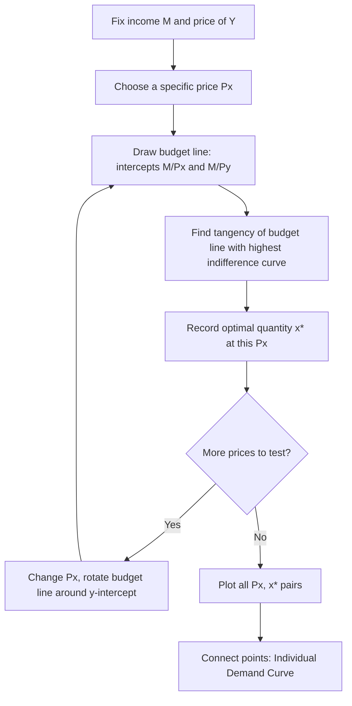

## Deriving the Individual Demand Curve

### Overview

The individual demand curve summarizes how a single utility-maximizing consumer's optimal quantity purchased of a good varies with that good's own price, holding income, the prices of other goods, and preferences constant. It is not assumed directly — it is derived as a byproduct of solving the consumer's constrained utility-maximization problem repeatedly across a range of prices. This derivation connects the graphical apparatus of indifference curves and budget lines to the price-quantity relationship used throughout partial equilibrium analysis.

### Starting Point: Consumer Equilibrium

At each price of good $x$, the consumer solves:

$$\max_{x,y} U(x, y) \quad \text{subject to} \quad P_x x + P_y y = M$$

yielding an optimal bundle $(x^*, y^*)$ characterized by the tangency condition:

$$\frac{MU_x}{MU_y} = \frac{P_x}{P_y}$$

The solution to this problem, expressed as a function of prices and income, is the consumer's **Marshallian (ordinary) demand function**:

$$x^* = x(P_x, P_y, M)$$

The individual demand curve for good $x$ is this function with $P_y$ and $M$ held fixed, viewed purely as a relationship between $P_x$ and $x^*$.

### Step-by-Step Graphical Derivation

1. **Fix $P_y$ and $M$.** Draw the initial budget line with intercepts $M/P_x^{(1)}$ and $M/P_y$.
2. **Find the tangency point.** Locate the bundle where the highest attainable indifference curve is tangent to this budget line; read off $x_1^*$.
3. **Change $P_x$.** Lower (or raise) $P_x$ to $P_x^{(2)}$, holding $P_y$ and $M$ fixed. The budget line rotates around the $y$-intercept (since $M/P_y$ is unchanged) to a new $x$-intercept $M/P_x^{(2)}$.
4. **Find the new tangency point.** Locate the new optimal bundle; read off $x_2^*$.
5. **Repeat for a range of prices.** Each price generates one optimal quantity, tracing out the **price consumption curve** in the $(x,y)$ plane — the locus of all optimal bundles as $P_x$ varies.
6. **Map price-quantity pairs to a new diagram.** Plot each $(P_x, x^*)$ pair in a separate lower panel with $P_x$ on the vertical axis and $x$ on the horizontal axis. Connecting these points traces the **individual demand curve**.

<svg xmlns="http://www.w3.org/2000/svg" viewBox="0 0 520 500">
<text x="260" y="25" text-anchor="middle" font-size="15" font-weight="bold" fill="#222">From Indifference Curves to the Demand Curve (svg_diagram)</text>

<text x="140" y="50" text-anchor="middle" font-size="13" fill="#333">Upper Panel: Optimal Bundles</text>

<line x1="60" y1="220" x2="60" y2="60" stroke="#333" stroke-width="2" />

<line x1="60" y1="220" x2="260" y2="220" stroke="#333" stroke-width="2" />

<text x="265" y="225" font-size="11" fill="#333">X</text>

<text x="35" y="60" font-size="11" fill="#333">Y</text>

<line x1="60" y1="90" x2="180" y2="220" stroke="#555" stroke-width="1.5" />
<line x1="60" y1="90" x2="240" y2="220" stroke="#2ca02c" stroke-width="1.5" />
<path d="M 80,210 C 110,150 150,120 200,115" fill="none" stroke="#1f77b4" stroke-width="1.5" />
<path d="M 100,210 C 140,160 190,140 235,150" fill="none" stroke="#d62728" stroke-width="1.5" />
<circle cx="128" cy="150" r="4" fill="#1f77b4" />
<circle cx="175" cy="163" r="4" fill="#d62728" />
<text x="90" y="140" font-size="10" fill="#1f77b4">A (high Px)</text>
<text x="180" y="158" font-size="10" fill="#d62728">B (low Px)</text>
<line x1="128" y1="150" x2="128" y2="260" stroke="#999" stroke-width="1" stroke-dasharray="3,2" />
<line x1="175" y1="163" x2="175" y2="260" stroke="#999" stroke-width="1" stroke-dasharray="3,2" />

<text x="140" y="300" text-anchor="middle" font-size="13" fill="#333">Lower Panel: Demand Curve</text>

<line x1="60" y1="460" x2="60" y2="310" stroke="#333" stroke-width="2" />

<line x1="60" y1="460" x2="260" y2="460" stroke="#333" stroke-width="2" />

<text x="30" y="315" font-size="11" fill="#333">Px</text>

<text x="265" y="465" font-size="11" fill="#333">X</text>

<circle cx="128" cy="350" r="4" fill="#1f77b4" />
<circle cx="175" cy="410" r="4" fill="#d62728" />
<line x1="128" y1="350" x2="175" y2="410" stroke="#000" stroke-width="2" />
<text x="180" y="440" font-size="10" fill="#000">Demand curve D</text>
</svg>

### Algebraic Derivation (Cobb-Douglas Example)

For $U(x,y) = x^{\alpha}y^{1-\alpha}$ subject to $P_x x + P_y y = M$, applying the Lagrangian and solving the first-order conditions gives closed-form Marshallian demands:

$$x^*(P_x, P_y, M) = \frac{\alpha M}{P_x}, \qquad y^*(P_x, P_y, M) = \frac{(1-\alpha)M}{P_y}$$

Holding $M$ and $P_y$ fixed, $x^*$ as a function of $P_x$ alone is a **rectangular hyperbola** — this is the individual demand curve for this utility specification, and it implies a constant expenditure share $\alpha$ on good $x$ regardless of price (unit own-price elasticity).

### Distinguishing the Total Effect from the Substitution Effect Along the Curve

The individual demand curve derived this way — the **Marshallian demand curve** — reflects the **total price effect** (substitution effect plus income effect) at each price point, since income $M$ is held constant in money terms while real purchasing power fluctuates with price.

A related but distinct construct is the **Hicksian (compensated) demand curve**, derived by holding utility (rather than money income) constant as price varies — tracing quantity demanded along a single indifference curve as the budget line's slope changes. The Hicksian demand curve isolates the pure substitution effect and is therefore always downward sloping, unlike the Marshallian curve, which can theoretically slope upward for a Giffen good.

| Feature | Marshallian Demand | Hicksian Demand |
| --- | --- | --- |
| Held constant | Money income $M$ | Utility level $U$ |
| Captures | Total effect (substitution + income) | Substitution effect only |
| Slope | Downward, except possible Giffen case | Always downward (non-positive) |
| Observability | Directly observable from market data | Not directly observable; derived theoretically |

### Movements Along vs. Shifts of the Demand Curve

- A change in $P_x$ itself produces a **movement along** the already-derived demand curve — this is exactly the relationship the derivation traces out.
- A change in any variable held fixed during derivation — income $M$, the price of the related good $P_y$, or the consumer's preferences/tastes — shifts the **entire curve**, since it changes the underlying tangency solutions at every price level.
  - An increase in $M$ shifts the curve rightward for a normal good, leftward for an inferior good.
  - A change in $P_y$ shifts the curve depending on whether $x$ and $y$ are substitutes (curve shifts right when $P_y$ rises) or complements (curve shifts left when $P_y$ rises).

### From Individual to Market Demand

The **market demand curve** is obtained by horizontally summing individual demand curves across all consumers in the market at each price:

$$X(P_x) = \sum_{i=1}^{n} x_i(P_x, P_y, M_i)$$

This aggregation assumes each consumer's demand has already been derived via the individual optimization process described above, and is a standard bridge from consumer theory to market-level supply-and-demand analysis.

### Elasticity Along the Curve

The **own-price elasticity of demand** at a point on the individual demand curve is:

$$\varepsilon_{x,P_x} = \frac{\partial x}{\partial P_x} \cdot \frac{P_x}{x}$$

For linear demand curves, elasticity varies continuously along the curve even though the slope is constant — it approaches negative infinity near the price axis and zero near the quantity axis. For constant-elasticity forms (like the Cobb-Douglas case above, with elasticity $-1$), elasticity is the same at every point on the curve. [Inference: whether standard textbook treatment emphasizes this distinction depends on the course level; introductory treatments often gloss over the difference between slope and elasticity.]

### Common Pitfalls

- Treating the demand curve as a primitive assumption rather than a derived object — every point on it comes from solving a separate utility-maximization problem at a specific price.
- Confusing a **movement along** the demand curve (caused only by the good's own price changing) with a **shift** of the curve (caused by income, other prices, or preference changes).
- Assuming the demand curve must be downward sloping — this holds for the Hicksian (compensated) curve by construction, but the Marshallian curve can theoretically be upward sloping for a Giffen good.
- Ignoring that the individual demand curve is only valid holding all other determinants — $P_y$, $M$, and preferences — literally constant; changing any of these invalidates the specific curve traced.

### Related Topics

- Indifference curves and budget constraints
- Income and substitution effects
- Slutsky equation and Marshallian vs. Hicksian demand
- Market demand and horizontal aggregation
- Price elasticity of demand
- Consumer surplus
- Giffen goods and empirical evidence