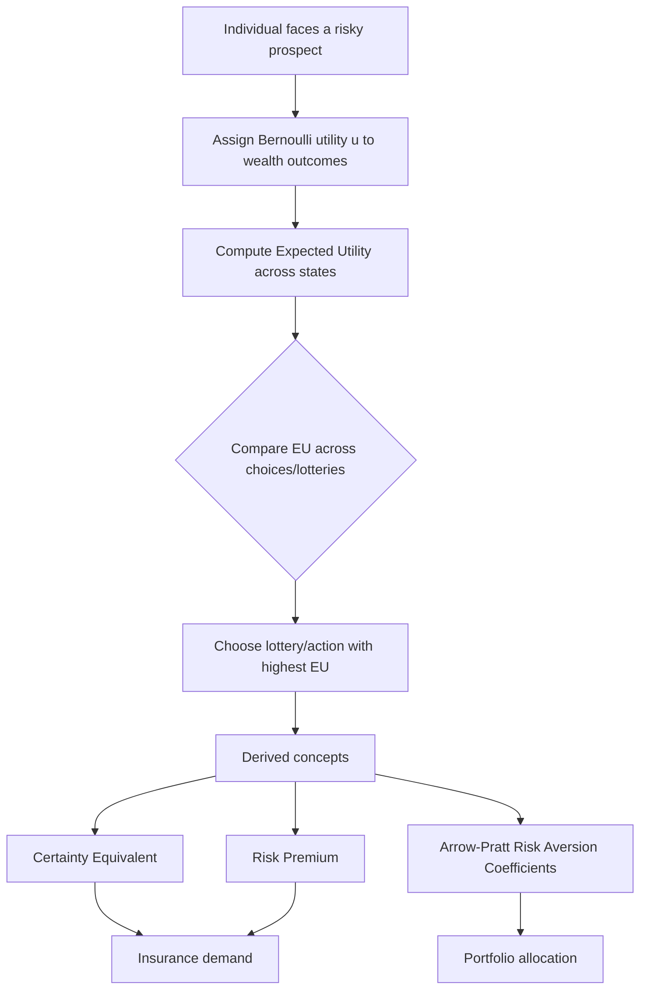

## Consumer Choice Under Risk and Uncertainty

### Overview

Standard consumer theory assumes outcomes are known with certainty. Many real economic decisions — insurance purchases, investment allocation, occupational choice, gambling — instead involve **risk** (outcomes are uncertain but probabilities are known) or **uncertainty** (probabilities themselves are unknown or ambiguous). This subfield extends utility theory to model choice among risky prospects, explaining phenomena such as insurance demand, diversification, and risk premia.

### Lotteries and Expected Value

A **lottery** (or prospect) is a set of possible outcomes with associated probabilities: $L = (p_1, x_1; p_2, x_2; \ldots; p_n, x_n)$, where $\sum p_i = 1$.

The **expected value** of a lottery is:

$$EV(L) = \sum_{i=1}^{n} p_i x_i$$

Expected value alone is a poor predictor of actual choices — most people do not evaluate risky prospects purely by their expected monetary value, as illustrated by the classic **St. Petersburg Paradox**, where a lottery with infinite expected value is nonetheless valued by most people at a small finite amount.

### Expected Utility Theory

**Expected utility theory (EUT)**, formalized by von Neumann and Morgenstern, proposes that individuals rank lotteries not by expected value but by **expected utility**:

$$EU(L) = \sum_{i=1}^{n} p_i \, u(x_i)$$

where $u(\cdot)$ is a **Bernoulli utility function** defined over outcomes (typically wealth or income levels). A rational decision-maker facing a choice among lotteries selects the one with the highest expected utility.

**Von Neumann–Morgenstern (VNM) axioms** underlying this representation:

- **Completeness and transitivity**: as in standard preference theory.
- **Continuity**: preferences over lotteries vary continuously with probabilities.
- **Independence**: if $L_1 \succeq L_2$, then for any $L_3$ and probability $\alpha \in (0,1)$, $\alpha L_1 + (1-\alpha)L_3 \succeq \alpha L_2 + (1-\alpha)L_3$. This axiom is the most behaviorally contested and is famously violated in the **Allais Paradox**.

Under these axioms, preferences over lotteries can be represented by a utility function unique up to a positive affine (linear) transformation — unlike ordinal utility under certainty, the VNM utility function's curvature carries meaningful information about risk attitudes.

### Risk Attitudes and Utility Curvature

An individual's attitude toward risk is determined by the **curvature** of their Bernoulli utility function $u(x)$ over wealth $x$:

- **Risk-averse**: $u''(x) < 0$ (concave). The individual prefers a certain payment equal to a lottery's expected value over the lottery itself.
- **Risk-neutral**: $u''(x) = 0$ (linear). The individual is indifferent between a lottery and its expected value with certainty.
- **Risk-seeking**: $u''(x) > 0$ (convex). The individual prefers the lottery over its certain expected value.

<svg xmlns="http://www.w3.org/2000/svg" viewBox="0 0 520 400">
<text x="260" y="25" text-anchor="middle" font-size="15" font-weight="bold" fill="#222">Utility Curvature and Risk Attitude (svg_diagram)</text>
<line x1="60" y1="350" x2="60" y2="40" stroke="#333" stroke-width="2" />
<line x1="60" y1="350" x2="480" y2="350" stroke="#333" stroke-width="2" />
<text x="485" y="355" font-size="12" fill="#333">Wealth</text>
<text x="30" y="40" font-size="12" fill="#333">Utility</text>
<path d="M 80,320 Q 250,120 460,70" fill="none" stroke="#1f77b4" stroke-width="2" />
<text x="330" y="100" font-size="11" fill="#1f77b4">Risk-averse (concave)</text>
<line x1="80" y1="320" x2="460" y2="80" stroke="#2ca02c" stroke-width="2" />
<text x="330" y="200" font-size="11" fill="#2ca02c">Risk-neutral (linear)</text>
<path d="M 80,320 Q 250,300 460,80" fill="none" stroke="#d62728" stroke-width="2" />
<text x="280" y="290" font-size="11" fill="#d62728">Risk-seeking (convex)</text>
</svg>

### Certainty Equivalent and Risk Premium

For a lottery $L$ with expected value $EV(L)$:

- The **certainty equivalent (CE)** is the certain sum of money that yields the same utility as the lottery: $u(CE) = EU(L)$.
- The **risk premium (RP)** is the amount a risk-averse individual would sacrifice from the expected value to avoid the risk entirely:

$$RP = EV(L) - CE$$

For a risk-averse individual, $CE < EV(L)$, so $RP > 0$. This is precisely the amount an insurer can charge above actuarially fair value and still have the consumer willingly purchase insurance. [Inference: the exact size of the risk premium is not a fixed constant but depends on the specific shape of $u(\cdot)$ and the variance of the lottery, so it must be computed per case rather than assumed.]

<svg xmlns="http://www.w3.org/2000/svg" viewBox="0 0 520 380">
<text x="260" y="25" text-anchor="middle" font-size="15" font-weight="bold" fill="#222">Certainty Equivalent and Risk Premium (svg_diagram)</text>
<line x1="60" y1="330" x2="60" y2="40" stroke="#333" stroke-width="2" />
<line x1="60" y1="330" x2="480" y2="330" stroke="#333" stroke-width="2" />
<text x="485" y="335" font-size="12" fill="#333">Wealth</text>
<text x="30" y="40" font-size="12" fill="#333">Utility</text>
<path d="M 80,310 Q 280,100 450,60" fill="none" stroke="#1f77b4" stroke-width="2" />
<circle cx="150" cy="255" r="4" fill="#333" />
<circle cx="380" cy="90" r="4" fill="#333" />
<line x1="150" y1="330" x2="150" y2="255" stroke="#999" stroke-dasharray="3,2" />
<line x1="380" y1="330" x2="380" y2="90" stroke="#999" stroke-dasharray="3,2" />
<text x="130" y="345" font-size="10" fill="#333">Low outcome</text>
<text x="360" y="345" font-size="10" fill="#333">High outcome</text>
<line x1="150" y1="255" x2="380" y2="90" stroke="#d62728" stroke-width="1.5" stroke-dasharray="4,2" />
<circle cx="265" cy="172" r="4" fill="#d62728" />
<line x1="265" y1="330" x2="265" y2="172" stroke="#d62728" stroke-dasharray="3,2" />
<text x="240" y="345" font-size="10" fill="#d62728">EV(L)</text>
<circle cx="220" cy="172" r="4" fill="#2ca02c" />
<line x1="220" y1="330" x2="220" y2="172" stroke="#2ca02c" stroke-dasharray="3,2" />
<text x="185" y="345" font-size="10" fill="#2ca02c">CE</text>

<text x="200" y="150" font-size="10" fill="#000">RP = EV(L) − CE</text>

</svg>

### The Arrow-Pratt Measures of Risk Aversion

To quantify risk aversion independent of the units of the utility function, two standard measures are used:

**Absolute risk aversion (ARA)**:

$$A(x) = -\frac{u''(x)}{u'(x)}$$

**Relative risk aversion (RRA)**:

$$R(x) = -x \cdot \frac{u''(x)}{u'(x)} = x \cdot A(x)$$

Common functional forms and their risk-aversion properties:

| Utility Function | Form | ARA Behavior | RRA Behavior |
| --- | --- | --- | --- |
| CARA (exponential) | $u(x) = -e^{-\alpha x}$ | Constant: $A(x) = \alpha$ | Increasing |
| CRRA (power/log) | $u(x) = \dfrac{x^{1-\gamma}}{1-\gamma}$ (or $\ln x$ if $\gamma=1$) | Decreasing | Constant: $R(x) = \gamma$ |
| Quadratic | $u(x) = x - bx^2$ | Increasing | Increasing |

- **CARA** implies risk aversion does not change with wealth level — used heavily in finance for tractability, though [Inference: it is generally regarded as an empirically implausible assumption at very high or very low wealth levels since risk tolerance in practice typically responds to wealth].
- **CRRA** implies the *proportion* of wealth allocated to a risky asset does not depend on wealth level, a common assumption in portfolio choice and macroeconomic models.

### Application: Insurance Demand

A risk-averse consumer facing a potential loss $L$ with probability $p$ will purchase insurance if the premium charged is less than or equal to their willingness to pay, which exceeds the actuarially fair premium ($pL$) by the risk premium. This underlies the basic economic rationale for insurance markets: **risk-averse individuals are willing to pay more than the expected loss to eliminate uncertainty**, while **risk-neutral insurers** (who can pool many independent risks and thus effectively become risk-neutral via the law of large numbers) are willing to accept a premium at or slightly above the expected payout.

**Full insurance result**: given actuarially fair premiums and no informational asymmetries, a risk-averse expected-utility maximizer will choose to fully insure against loss, equalizing wealth across states of the world.

### Application: Portfolio Choice

Given a risk-free asset with return $r_f$ and a risky asset with uncertain return $\tilde{r}$, a risk-averse investor's expected-utility-maximizing allocation depends on the degree of risk aversion relative to the risk premium of the risky asset. Under CRRA utility, the optimal share invested in the risky asset is independent of the level of initial wealth — a foundational result in portfolio theory. [Inference: this exact independence result is specific to CRRA-type preferences and does not generalize to arbitrary utility functions, where wealth effects on portfolio share can appear.]

### Challenges to Expected Utility Theory

Empirical and experimental evidence has documented systematic departures from EUT predictions:

- **Allais Paradox**: reveals violations of the independence axiom — people's choices between lotteries can be inconsistent with any expected-utility representation when a common outcome is added or removed from both options in a choice pair.
- **Ellsberg Paradox**: demonstrates **ambiguity aversion** — a preference for known probabilities (risk) over unknown probabilities (true uncertainty/ambiguity), which EUT alone cannot accommodate since it presumes probabilities are always well-defined.
- **Prospect Theory** (Kahneman and Tversky): proposes that people evaluate outcomes as gains and losses relative to a reference point (rather than final wealth levels), exhibit **loss aversion** (losses loom larger than equivalent gains), and apply nonlinear **probability weighting** (overweighting small probabilities, underweighting large/moderate ones). [Inference: prospect theory is widely used in behavioral economics as a descriptive alternative to EUT, though standard microeconomic consumer theory courses generally still treat EUT as the baseline normative model.]

### Common Pitfalls

- Confusing **risk** (known probabilities) with **uncertainty** in the stricter Knightian sense (unknown or ill-defined probabilities) — many models and textbooks use the terms loosely, but formal treatments distinguish them, and only risk is directly handled by standard expected utility theory.
- Assuming expected value maximization is equivalent to expected utility maximization — they coincide only for risk-neutral agents.
- Treating the VNM utility function as ordinal (unique only up to any monotonic transform) — it is instead a **cardinal** utility function unique only up to positive *affine* (linear) transformations, since the expected utility calculation requires meaningful differences, not just rankings.
- Assuming risk aversion implies an individual will never gamble — many risk-averse individuals under EUT still participate in specific gambles depending on stakes, framing, and the shape of $u(\cdot)$ in different wealth regions (e.g., mixed risk attitudes are possible with non-globally-concave utility functions).

### Related Topics

- Indifference curves and budget constraints (certainty baseline)
- Arrow-Pratt measures of risk aversion
- Insurance markets and adverse selection/moral hazard
- Portfolio theory and asset pricing
- Behavioral economics: prospect theory and heuristics
- Information economics and asymmetric information
- State-preference theory (Arrow-Debreu contingent claims)