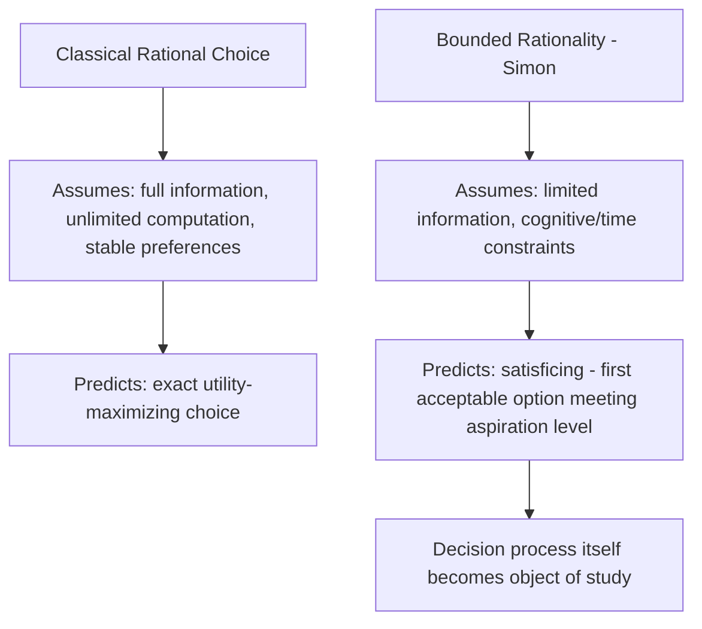

## Behavioral Economics: Bounded Rationality and Heuristics

### Overview

Standard consumer theory assumes agents are fully rational — they possess stable preferences, unlimited computational capacity, and perfect self-control, and they optimize accordingly. **Behavioral economics** relaxes these assumptions to incorporate psychological realism into economic models, drawing on empirical findings from cognitive psychology. Two foundational concepts anchor this field: **bounded rationality**, the idea that decision-making is constrained by limited information, cognitive capacity, and time; and **heuristics**, the mental shortcuts people use to make judgments and decisions under these constraints, which can produce systematic and predictable deviations from the rational-choice benchmark.

### Bounded Rationality

The concept originates with Herbert Simon, who argued that classical rational-choice models overstate human computational and informational capacities. Rather than fully optimizing, agents engage in **satisficing** — searching for a solution that is "good enough" relative to an aspiration level, rather than exhaustively identifying the single utility-maximizing option.

**Core features of bounded rationality**:

- **Limited information processing**: agents cannot costlessly acquire, store, or process all relevant information.
- **Computational constraints**: even with full information, optimizing may be computationally infeasible or too costly in time.
- **Satisficing rather than optimizing**: decisions stop once an option meets a threshold of acceptability, rather than continuing until the true optimum is found.
- **Procedural rationality**: the *process* of decision-making, not just the outcome, is what agents are evaluated on — a decision can be "rational" given the constraints faced, even if it deviates from the unconstrained optimum.

### Heuristics: General Framework

A **heuristic** is a simplified rule of thumb that substitutes a hard judgment problem with an easier one. Heuristics economize on cognitive effort and often perform well, but can produce systematic errors called **biases** in specific, identifiable circumstances. The heuristics-and-biases research program, pioneered by Kahneman and Tversky, catalogs many such shortcuts.

#### Representativeness Heuristic

Judging the probability of an event by how closely it resembles a stereotype or typical case, rather than by actual statistical likelihood (e.g., base rates, sample size).

- **Associated bias — base-rate neglect**: ignoring the underlying population frequency of an event in favor of case-specific (often anecdotal) information.
- **Associated bias — conjunction fallacy**: judging a conjunction of two events (A and B) as more probable than one of the events alone (A), which is a logical impossibility since $P(A \cap B) \leq P(A)$.
- **Associated bias — gambler's fallacy**: believing that past independent random outcomes affect future probabilities (e.g., expecting a coin to be "due" for tails after a run of heads).

#### Availability Heuristic

Judging the probability or frequency of an event by how easily relevant examples come to mind, rather than by actual frequency. Events that are vivid, recent, or emotionally salient are recalled more easily and thus judged as more probable, even when statistically rare.

- Example: overestimating the probability of dying in a plane crash (heavily covered in media) relative to more common but less publicized causes of death.

#### Anchoring and Adjustment

Judgments are formed by starting from an initial reference point (an "anchor") — even an arbitrary or irrelevant one — and adjusting insufficiently away from it.

- Anchors influence numerical estimates even when the anchor is explicitly known to be random or uninformative, a robust finding across many experimental contexts.
- Relevant to consumer behavior in pricing contexts: an initial "list price" or "reference price" anchors a consumer's perception of a subsequent discount as a good deal.

#### Affect Heuristic

Relying on current emotional state ("does this feel good or bad") as a shortcut for a more effortful cost-benefit evaluation, which can lead risk and benefit judgments to be inversely (and sometimes incorrectly) correlated in the mind of the decision-maker.

### Reference-Dependent Preferences and Prospect Theory

**Prospect theory** (Kahneman and Tversky) is the most influential formal behavioral alternative to expected utility theory, built on reference dependence rather than absolute wealth levels.

**Key components**:

- **Reference point**: outcomes are evaluated as gains or losses relative to a reference point (often the status quo), not in terms of final wealth.
- **Loss aversion**: losses are weighted more heavily than equivalent-sized gains — the value function is steeper for losses than for gains. This is commonly summarized by a loss-aversion coefficient $\lambda$, empirically often estimated in a range around $\lambda \approx 2$–$2.5$, though [Inference: the precise magnitude varies considerably across studies, populations, and elicitation methods, so this figure should be treated as an illustrative order of magnitude rather than a fixed universal constant].
- **Diminishing sensitivity**: the value function is concave over gains and convex over losses — the psychological impact of a change diminishes as the outcome moves further from the reference point in either direction, producing an S-shaped value function.
- **Probability weighting**: people do not weight outcomes by objective probabilities directly but by a nonlinear weighting function that overweights small probabilities and underweights moderate-to-large probabilities.

<svg xmlns="http://www.w3.org/2000/svg" viewBox="0 0 520 400">
<text x="260" y="25" text-anchor="middle" font-size="15" font-weight="bold" fill="#222">Prospect Theory Value Function (svg_diagram)</text>
<line x1="260" y1="350" x2="260" y2="40" stroke="#333" stroke-width="2" />
<line x1="60" y1="200" x2="460" y2="200" stroke="#333" stroke-width="2" />
<text x="465" y="205" font-size="12" fill="#333">Gains/Losses</text>
<text x="230" y="35" font-size="12" fill="#333">Value</text>
<text x="270" y="330" font-size="11" fill="#555">Losses</text>
<text x="380" y="215" font-size="11" fill="#555">Gains</text>
<path d="M 260,200 Q 350,120 460,90" fill="none" stroke="#2ca02c" stroke-width="2" />
<path d="M 260,200 Q 190,300 90,350" fill="none" stroke="#d62728" stroke-width="2" />

<text x="330" y="110" font-size="10" fill="`#2ca02c`">Concave over gains</text>

<text x="100" y="320" font-size="10" fill="`#d62728`">Convex over losses (steeper)</text>

</svg>

### Present Bias and Time-Inconsistent Preferences

Standard intertemporal choice models assume **exponential discounting**, giving time-consistent preferences. Behavioral evidence instead often supports **quasi-hyperbolic (β-δ) discounting**:

$$U_t = u(c_t) + \beta \sum_{s=1}^{\infty} \delta^s \, u(c_{t+s}), \quad 0 < \beta \leq 1, \ 0 < \delta < 1$$

The parameter $\beta$ captures a discrete **present bias** — an extra discount applied specifically to the immediate future relative to any later comparison, which generates time-inconsistent choices: a plan made today about future behavior may not be honored once "today" arrives.

- **Sophisticated agents**: aware of their own present bias, and may adopt commitment devices to bind future behavior.
- **Naive agents**: unaware of their present bias, and consistently underestimate how much their future selves will also over-discount, leading to repeated postponement of costly-but-beneficial actions (e.g., saving, exercising, quitting smoking).

### Default Effects and Choice Architecture

Because full optimization is costly, the **default option** in a choice set exerts a disproportionate influence on outcomes — a phenomenon inconsistent with the "irrelevance of defaults" implied by standard rational choice.

- **Status quo bias**: a general tendency to stick with the current or default state, even when switching would be net beneficial, partly explained by loss aversion (giving up the status quo is coded as a loss).
- **Nudges**: choice-architecture interventions (e.g., automatic enrollment in retirement savings plans) that steer decisions toward a particular outcome while preserving the individual's freedom to opt out — a core policy application of bounded-rationality research, associated with Thaler and Sunstein's concept of "libertarian paternalism."

### Mental Accounting

Individuals often treat money as non-fungible, mentally partitioning it into separate "accounts" (e.g., a vacation fund, gambling winnings, regular income) that are governed by different implicit rules, contrary to the standard assumption that money is fully fungible across uses.

- Example: being unwilling to dip into a "savings account" to cover a small unexpected expense while carrying high-interest credit card debt, even though this is financially suboptimal treated as a single unified budget.
- Related concept — **the sunk cost fallacy**: continuing a course of action because of resources already invested (which are, by definition, unrecoverable and thus irrelevant to a forward-looking rational decision).

### Comparison with Standard Consumer Theory

| Dimension | Standard (Rational) Model | Behavioral Model |
| --- | --- | --- |
| Information processing | Unlimited, costless | Limited, uses heuristics |
| Decision process | Full optimization | Satisficing, rules of thumb |
| Reference point | None (absolute wealth/utility) | Reference-dependent (gains/losses) |
| Risk attitude | Consistent curvature of $u(\cdot)$ | Loss-averse, probability weighting |
| Time preference | Exponential discounting, consistent | Quasi-hyperbolic, present-biased |
| Money treatment | Fully fungible | Mentally partitioned (mental accounting) |

### Applications

- **Consumer protection policy**: disclosure requirements and cooling-off periods designed around known biases such as anchoring and present bias.
- **Retirement savings design**: automatic enrollment and escalation features that leverage default effects and present bias to raise savings rates.
- **Marketing and pricing**: reference-price anchoring, decoy pricing, and framing of discounts exploit loss aversion and anchoring.
- **Health behavior**: commitment devices (e.g., pre-committing to gym visits or smoking cessation) address the gap between sophisticated long-run intentions and present-biased short-run behavior.

### Common Pitfalls

- Treating "bounded rationality" as synonymous with "irrationality" — the framework describes rationality *given* real constraints on information and cognition, not the absence of purposeful behavior.
- Assuming all heuristics are harmful — most heuristics perform well in the environments they evolved to handle (an idea developed further in the "ecological rationality" literature) and only produce systematic errors in specific, identifiable situations.
- Conflating prospect theory's probability weighting function with the classical concept of subjective probability — probability weights in prospect theory are decision weights applied to already-known objective probabilities, not beliefs about likelihood per se.
- Assuming present bias implies a fixed universal discount parameter — behavioral parameters like $\beta$ and loss aversion coefficients vary across individuals, contexts, and elicitation methods, and are generally treated as estimated parameters rather than fixed constants. [Unverified: the specific numerical estimates cited across the behavioral literature vary substantially by study design and should be checked against the original source before use in applied work.]

### Related Topics

- Consumer choice under risk and uncertainty (expected utility theory baseline)
- Prospect theory in depth: value function and probability weighting
- Intertemporal choice and hyperbolic discounting
- Nudge theory and libertarian paternalism
- Mental accounting and the sunk cost fallacy
- Behavioral welfare economics
- Experimental and behavioral game theory