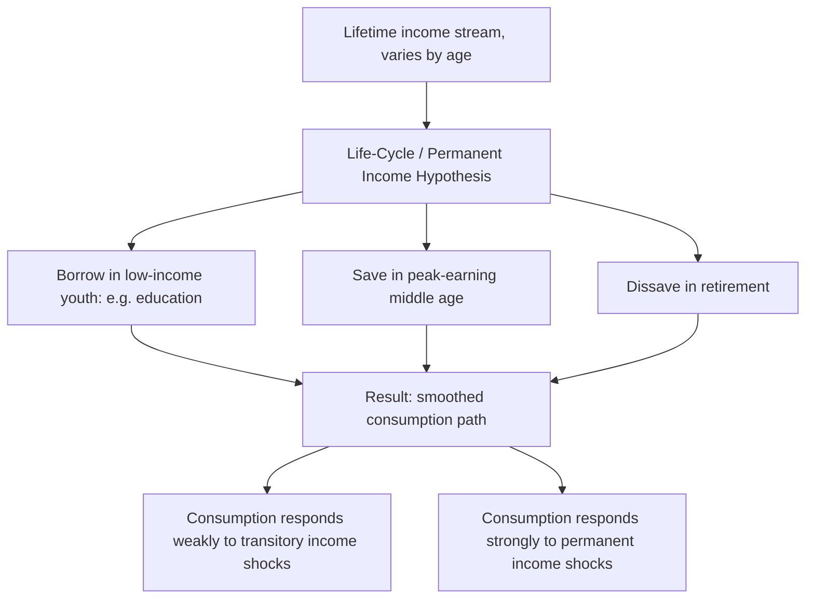

## Intertemporal Choice and Time Preference

### Overview

Intertemporal choice theory extends the standard consumer optimization framework across time periods, modeling how individuals allocate consumption between the present and the future given a budget constraint that spans multiple periods. Central to this analysis is **time preference** — the degree to which individuals value present consumption over future consumption — formalized through discounting. This framework underlies models of saving, borrowing, investment, and human capital accumulation, and provides the baseline against which behavioral departures (present bias, hyperbolic discounting) are measured.

### The Two-Period Consumption Model

Consider a consumer choosing consumption $c_1$ in period 1 and $c_2$ in period 2, with income $y_1$ and $y_2$ in each period respectively, and access to a capital/credit market offering interest rate $r$.

**Intertemporal budget constraint**: the present value of lifetime consumption must equal the present value of lifetime income:

$$c_1 + \frac{c_2}{1+r} = y_1 + \frac{y_2}{1+r}$$

Equivalently, expressed in future-value terms:

$$c_1(1+r) + c_2 = y_1(1+r) + y_2$$

**Slope of the intertemporal budget line**: $-(1+r)$, representing the market rate of exchange between present and future consumption — giving up one unit of $c_1$ today allows $(1+r)$ additional units of $c_2$ tomorrow.

- If $c_1 < y_1$, the consumer is a **saver** (lends the difference at rate $r$).
- If $c_1 > y_1$, the consumer is a **borrower** (borrows against future income at rate $r$).

<svg viewBox="0 0 500 400" xmlns="http://www.w3.org/2000/svg">
<text x="250" y="25" text-anchor="middle" font-size="15" font-weight="bold" fill="#222">Intertemporal Budget Constraint (svg_diagram)</text>
<line x1="60" y1="350" x2="60" y2="40" stroke="#333" stroke-width="2"/>
<line x1="60" y1="350" x2="460" y2="350" stroke="#333" stroke-width="2"/>
<text x="465" y="355" font-size="12" fill="#333">c1 (present)</text>
<text x="30" y="40" font-size="12" fill="#333">c2 (future)</text>
<line x1="150" y1="90" x2="400" y2="330" stroke="#555" stroke-width="2"/>
<circle cx="240" cy="220" r="5" fill="#d62728"/>
<text x="248" y="215" font-size="11" fill="#d62728">Endowment point (y1, y2)</text>
<line x1="150" y1="90" x2="150" y2="350" stroke="#999" stroke-dasharray="3,2"/>
<text x="120" y="345" font-size="10" fill="#555">y2/r+ ... (max c1 if borrow fully)</text>

<text x="330" y="290" font-size="10" fill="#555">Saving region (c1 < y1)</text>

<text x="170" y="130" font-size="10" fill="#555">Borrowing region (c1 > y1)</text>

</svg>

### Time Preference and the Discount Factor

The consumer maximizes lifetime utility:

$$U = u(c_1) + \delta \, u(c_2)$$

where $\delta \in (0,1)$ is the **discount factor**, reflecting time preference — how much less a unit of future utility is valued relative to present utility. The **discount rate** $\rho$ relates to $\delta$ by $\delta = \dfrac{1}{1+\rho}$.

**Tangency condition (Euler equation)** for the two-period problem:

$$\frac{u'(c_1)}{\delta \, u'(c_2)} = 1 + r \quad \Longleftrightarrow \quad u'(c_1) = \delta(1+r)\,u'(c_2)$$

This is the intertemporal analog of the standard MRS = price ratio condition, with $\delta(1+r)$ playing the role of the relative price of future consumption in utility terms.

**Interpreting the relationship between $\rho$ and $r$**:

- If $\rho = r$: consumption is perfectly smoothed, $c_1 = c_2$ (for time-separable, stationary utility).
- If $\rho > r$ (impatient relative to the market return): consumption path is declining, $c_1 > c_2$.
- If $\rho < r$ (patient relative to the market return): consumption path is rising, $c_1 < c_2$.

### Exponential Discounting (The Standard Model)

The standard multi-period discounted utility model extends the two-period case to $T$ periods:

$$U = \sum_{t=0}^{T} \delta^t \, u(c_t)$$

**Exponential discounting** is characterized by a *constant* discount rate applied uniformly between any two adjacent periods, regardless of how far in the future they are. This produces **time-consistent preferences**: a plan for future consumption made today will still be considered optimal when that future period arrives, with no new information — the ranking of any two future dates relative to each other does not change merely because time has passed.

### The Fisher Separation Theorem

With access to a perfect capital market (borrowing and lending at the same rate $r$), the consumer's intertemporal consumption decision can be separated from their production/investment decision:

- First, choose the investment/production plan that maximizes the present value of the income stream, independent of personal time preference.
- Second, choose the consumption path that maximizes utility subject to the budget constraint defined by that present value, borrowing or lending in the capital market to achieve the preferred timing.

This result (Irving Fisher) underlies the separation of a firm's investment decision from its owners' individual consumption preferences in corporate finance, and shows that differences in individual time preference do not need to affect real investment decisions when capital markets function well. [Inference: this separation result relies on frictionless, complete capital markets; in practice with borrowing constraints or differing lending/borrowing rates, the separation breaks down and individual consumption paths become directly tied to individual income timing.]

### Permanent Income and Life-Cycle Hypotheses

Building on the intertemporal framework, two related theories of consumption behavior over the full lifespan:

- **Permanent Income Hypothesis (Friedman)**: consumption in any period is based on an estimate of *permanent* (long-run average expected) income rather than current income, smoothing consumption relative to transitory income fluctuations.
- **Life-Cycle Hypothesis (Modigliani)**: individuals plan consumption to be roughly smooth across their entire lifetime, borrowing in early low-income years (e.g., education), saving during peak-earning middle age, and drawing down savings in retirement.

Both models predict that consumption responds more strongly to *permanent* changes in income than to *transitory* changes, a testable implication distinguishing them from a simple current-income-based consumption function.

### Departures from Exponential Discounting: Hyperbolic and Quasi-Hyperbolic Models

Empirical elicitation of discount rates frequently contradicts the constant-discount-rate assumption of exponential discounting, motivating alternative functional forms.

**Hyperbolic discounting**: the discount rate *declines* as the time horizon lengthens — near-term delays are discounted much more heavily than equally long delays further in the future. A common functional form:

$$D(t) = \frac{1}{1+kt}$$

where $k$ is a constant governing the steepness of the decline.

**Quasi-hyperbolic ($\beta$-$\delta$) discounting**: a simpler, widely used approximation (Laibson) that adds a single extra discrete discount factor $\beta \leq 1$ applied specifically to the immediate future, with standard exponential discounting thereafter:

$$U_t = u(c_t) + \beta \sum_{s=1}^{\infty} \delta^s \, u(c_{t+s})$$

Both forms generate **time-inconsistent preferences**: a plan for consumption timing made today (e.g., "I will save more starting next month") may no longer be optimal once next month actually arrives, since the discrete extra discount $\beta$ is reapplied to whatever period is now "the immediate future."

| Model | Discount Rate Behavior | Preference Consistency | Common Use |
| --- | --- | --- | --- |
| Exponential | Constant across all horizons | Time-consistent | Standard neoclassical model, Fisher separation |
| Hyperbolic | Declining with longer horizon | Time-inconsistent | Descriptive fit to experimental discount-rate data |
| Quasi-hyperbolic (β-δ) | One extra discrete discount on immediate period | Time-inconsistent | Tractable behavioral macro/micro modeling |

### Sophistication vs. Naivety Under Time Inconsistency

- **Sophisticated agents**: correctly anticipate their own future present bias and may adopt **commitment devices** (e.g., illiquid savings accounts, pre-committed gym memberships) to bind their future selves to the originally preferred plan.
- **Naive agents**: incorrectly believe their future selves will behave according to today's exponential-discounting-consistent plan, repeatedly postponing costly-but-beneficial actions (e.g., saving, starting a diet) because each "future self" reapplies the same present bias.

### Application: Retirement Savings and Present Bias

Present-biased preferences help explain widely documented under-saving for retirement relative to what standard exponential-discounting life-cycle models predict, motivating policy interventions such as automatic enrollment and automatic escalation in retirement plans — these interventions work specifically because they shift the "default" action for a present-biased agent from "must actively choose to save" to "must actively choose to opt out," reducing the cost of inertia.

### Common Pitfalls

- Confusing the **discount factor** $\delta$ (a value between 0 and 1 that shrinks future utility) with the **discount rate** $\rho$ (a rate, typically expressed as a percentage, related by $\delta = 1/(1+\rho)$) — the two move in opposite directions (higher $\rho$ means lower $\delta$).
- Assuming a higher personal discount rate always implies "irrational" impatience — under the standard model, a discount rate that differs from the market interest rate is simply a preference parameter, not necessarily an error, though behavioral research does examine departures that may reflect self-control problems.
- Treating hyperbolic and exponential discounting as producing identical long-run behavior — they coincide only for a single fixed evaluation date; because hyperbolic discounting revises relative valuations as time passes, the two models generate different actual behavior once the decision-maker reaches the future date in question.
- Ignoring that the Fisher separation theorem requires frictionless, complete capital markets — with borrowing constraints (a common empirical feature, especially for lower-income households), consumption timing becomes directly tied to income timing rather than separable from it.

### Related Topics

- Indifference curves and budget constraints (single-period baseline)
- Income and substitution effects (adapted intertemporally to interest rate changes)
- Consumer choice under risk and uncertainty
- Behavioral economics: bounded rationality and heuristics
- Life-cycle and permanent income hypotheses of consumption
- Fisher separation theorem and capital markets
- Commitment devices and self-control in savings behavior