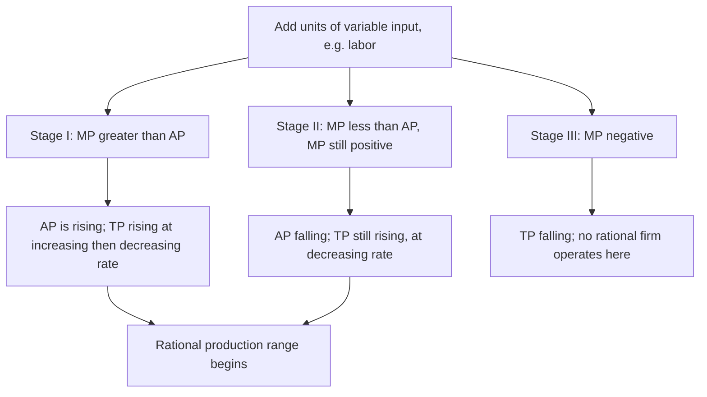

## Production Function: Total, Average, Marginal Product

### Overview

The production function describes the technological relationship between the quantities of inputs a firm employs and the maximum quantity of output it can produce. Analyzing this relationship through **total product**, **average product**, and **marginal product** — particularly for a single variable input in the short run — reveals the systematic patterns of productivity that underlie the shapes of short-run cost curves and explain observed regularities in production, such as diminishing returns.

### The Production Function

A production function expresses output $Q$ as a function of input quantities, most commonly capital $K$ and labor $L$:

$$Q = f(K, L)$$

In the **short run**, at least one input is fixed (typically capital, $K = \bar{K}$), and the firm varies only the **variable input** (typically labor $L$) to change output. This is the standard setting for analyzing total, average, and marginal product.

$$Q = f(\bar{K}, L)$$

In the **long run**, all inputs are variable, and analysis shifts to isoquants and returns to scale (a distinct but related topic).

### Total Product (TP)

**Total product** is simply the total quantity of output produced at a given level of the variable input, holding the fixed input constant:

$$TP(L) = f(\bar{K}, L)$$

As labor increases from zero, total product typically follows a characteristic S-shaped curve: it rises at an increasing rate initially, then at a decreasing rate, reaches a maximum, and eventually may decline if additional workers begin to interfere with production (e.g., overcrowding a fixed factory floor).

### Marginal Product (MP)

**Marginal product** measures the additional output produced by employing one additional unit of the variable input, holding all other inputs fixed:

$$MP_L = \frac{\partial TP}{\partial L} = \frac{\partial Q}{\partial L}$$

In discrete terms: $MP_L = \dfrac{\Delta TP}{\Delta L}$.

Geometrically, $MP_L$ at any point is the **slope of the total product curve** at that point.

### Average Product (AP)

**Average product** measures output per unit of the variable input — total product divided by the quantity of labor employed:

$$AP_L = \frac{TP}{L} = \frac{f(\bar{K}, L)}{L}$$

Geometrically, $AP_L$ at any point on the total product curve is the **slope of a ray drawn from the origin** to that point on the TP curve.

### The Law of Diminishing Marginal Returns

Holding the fixed input constant, as successive units of the variable input are added, **marginal product eventually declines**. This is not a claim that marginal product declines from the very first unit — most production processes exhibit an initial phase of *increasing* marginal returns (e.g., from specialization and division of labor among the first few workers) before diminishing returns set in.

**Three-stage characterization of production**:

- **Stage I** (increasing $AP_L$): $MP_L > AP_L$, pulling the average up. Adding labor is unambiguously beneficial; a rational firm would never stop hiring within this stage.
- **Stage II** (decreasing $AP_L$, but $MP_L > 0$): $MP_L < AP_L$ but marginal product remains positive, so total product continues rising, just at a decreasing rate. Rational short-run production occurs in this stage.
- **Stage III** ($MP_L < 0$): additional labor causes total product to *decline* — the fixed input becomes so crowded relative to labor that extra workers reduce output. No rational firm operates here, since output could be increased by *reducing* labor input.

### Relationship Between TP, MP, and AP

The three curves are mathematically and geometrically linked in specific, predictable ways:

- **MP = 0 when TP is at its maximum.** The slope of the TP curve is zero exactly at its peak.
- **MP = AP when AP is at its maximum.** This follows from calculus: $AP$ is maximized where $\dfrac{d(AP)}{dL} = 0$, and differentiating $AP = TP/L$ gives $\dfrac{d(AP)}{dL} = \dfrac{MP \cdot L - TP}{L^2}$, which equals zero precisely when $MP = TP/L = AP$.
- **MP curve crosses AP curve at AP's maximum, from above.** Before this point, $MP > AP$ (pulling the average up); after this point, $MP < AP$ (pulling the average down) — this is the same general mathematical relationship that holds between any marginal and average quantity (e.g., marginal cost and average cost).
- **MP is above AP wherever AP is rising; MP is below AP wherever AP is falling.**

<svg xmlns="http://www.w3.org/2000/svg" viewBox="0 0 560 460">
<text x="280" y="25" text-anchor="middle" font-size="15" font-weight="bold" fill="#222">TP, MP, and AP Curves (svg_diagram)</text>
<line x1="70" y1="220" x2="70" y2="50" stroke="#333" stroke-width="2" />
<line x1="70" y1="220" x2="500" y2="220" stroke="#333" stroke-width="2" />
<text x="505" y="225" font-size="11" fill="#333">Labor (L)</text>
<text x="40" y="50" font-size="11" fill="#333">TP</text>
<path d="M 90,215 C 180,150 260,70 350,60 C 400,55 460,90 490,140" fill="none" stroke="#1f77b4" stroke-width="2.5" />
<text x="330" y="55" font-size="11" fill="#1f77b4">Total Product</text>
<line x1="70" y1="420" x2="70" y2="250" stroke="#333" stroke-width="2" />
<line x1="70" y1="420" x2="500" y2="420" stroke="#333" stroke-width="2" />
<text x="505" y="425" font-size="11" fill="#333">Labor (L)</text>
<text x="40" y="255" font-size="11" fill="#333">MP, AP</text>
<path d="M 90,400 C 160,300 210,270 250,275 C 320,285 380,340 440,420" fill="none" stroke="#d62728" stroke-width="2.5" />
<text x="150" y="290" font-size="11" fill="#d62728">MP</text>
<path d="M 90,410 C 200,340 260,320 320,325 C 370,330 410,350 440,375" fill="none" stroke="#2ca02c" stroke-width="2.5" />
<text x="330" y="345" font-size="11" fill="#2ca02c">AP</text>
<circle cx="250" cy="275" r="4" fill="#000" />
<text x="255" y="270" font-size="10" fill="#000">MP crosses AP at AP's max</text>
<line x1="350" y1="60" x2="350" y2="420" stroke="#999" stroke-dasharray="3,2" />
<text x="355" y="415" font-size="9" fill="#555">TP peak → MP = 0</text>
</svg>

### Numerical Example

| Labor ($L$) | Total Product ($TP$) | Marginal Product ($MP_L$) | Average Product ($AP_L$) |
| --- | --- | --- | --- |
| 0 | 0 | — | — |
| 1 | 10 | 10 | 10.0 |
| 2 | 24 | 14 | 12.0 |
| 3 | 39 | 15 | 13.0 |
| 4 | 52 | 13 | 13.0 |
| 5 | 60 | 8 | 12.0 |
| 6 | 60 | 0 | 10.0 |
| 7 | 56 | −4 | 8.0 |

**Reading the table**:

- $MP_L$ rises from $L=1$ to $L=3$ (increasing marginal returns, Stage I), then falls from $L=3$ onward (diminishing marginal returns begin).
- $AP_L$ rises through $L=4$, where it equals $MP_L$ (both at 13) — confirming $MP_L = AP_L$ at $AP_L$'s maximum.
- At $L=6$, $TP$ reaches its maximum (60, same as $L=5$) and $MP_L = 0$.
- At $L=7$, $MP_L$ turns negative and $TP$ declines — Stage III, irrational to operate here.

### Algebraic Example (Cobb-Douglas Short-Run Case)

For a short-run Cobb-Douglas production function with fixed capital $\bar{K}$:

$$Q = A\bar{K}^{\alpha}L^{\beta}, \quad 0 < \beta < 1$$

$$MP_L = \frac{\partial Q}{\partial L} = \beta A \bar{K}^{\alpha} L^{\beta - 1}, \qquad AP_L = \frac{Q}{L} = A\bar{K}^{\alpha}L^{\beta - 1}$$

Note that $MP_L = \beta \cdot AP_L$. Since $0 < \beta < 1$, this implies $MP_L < AP_L$ at every level of $L$ — meaning this particular functional form exhibits **diminishing marginal returns everywhere** and never displays an initial increasing-returns Stage I. [Inference: this is a property of the specific Cobb-Douglas functional form with $\beta$ constant across all $L$; more general or piecewise production functions are needed to model an initial increasing-marginal-product phase before diminishing returns set in.]

### Link to Short-Run Cost Curves

The shapes of $TP$, $MP_L$, and $AP_L$ map directly onto short-run cost curve shapes, since cost is simply the (fixed) wage rate divided by productivity:

$$MC = \frac{w}{MP_L}, \qquad AVC = \frac{w}{AP_L}$$

- Where $MP_L$ is rising, $MC$ is falling.
- Where $MP_L$ is at its maximum, $MC$ is at its minimum.
- Where $MP_L$ is falling (but still positive), $MC$ is rising.
- Where $AP_L$ is at its maximum, $AVC$ is at its minimum.

This is the direct analytical bridge between production theory and the U-shaped short-run cost curves used in firm-level cost analysis.

### Common Pitfalls

- Assuming marginal product declines from the very first unit of labor — most realistic production processes have an initial region of *increasing* marginal returns due to specialization, before diminishing returns take over.
- Confusing "diminishing marginal returns" with "negative marginal returns" — diminishing returns (Stage II) still means output is *increasing*, just at a decreasing rate; only Stage III involves an absolute decline in total product.
- Assuming a firm would rationally operate in Stage I — since $MP_L > AP_L$ throughout Stage I, it always pays to hire additional labor within this stage; the profit-maximizing input choice (subject to price of output and wage) will occur in Stage II.
- Forgetting that the law of diminishing marginal returns is a **short-run** concept that assumes at least one input is fixed — it does not directly describe returns to scale, which is a **long-run** concept involving proportional changes in *all* inputs simultaneously.

### Related Topics

- Isoquants and returns to scale (long-run production analysis)
- Short-run cost curves: MC, AVC, AFC, ATC
- Marginal Rate of Technical Substitution (MRTS)
- Cobb-Douglas and other production function specifications
- Profit maximization and the optimal input decision
- Long-run cost curves and economies of scale