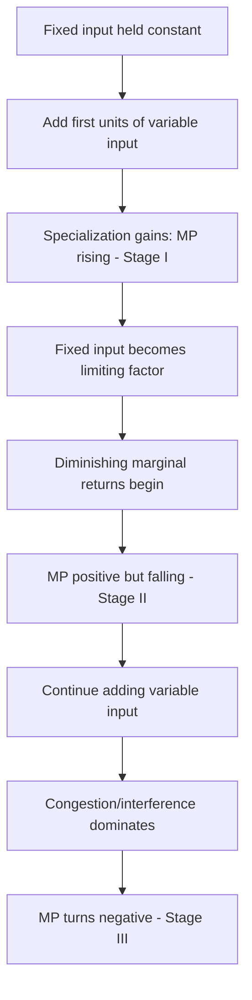

## Law of Diminishing Marginal Returns

### Overview

The law of diminishing marginal returns (also called the law of diminishing marginal product, or historically the law of variable proportions) states that as successive units of a variable input are added to a fixed input, holding technology constant, the marginal product of the variable input will eventually decline. This is one of the most fundamental empirical regularities in production theory, underlying the U-shape of short-run marginal and average variable cost curves and providing the theoretical basis for the eventual scarcity-driven limits on short-run output expansion.

### Formal Statement

Given a short-run production function with one fixed input $\bar{K}$ and one variable input $L$:

$$Q = f(\bar{K}, L)$$

the law states that beyond some point $L^*$, the marginal product of labor declines as $L$ increases further:

$$\frac{\partial MP_L}{\partial L} < 0 \quad \text{for } L > L^*$$

Equivalently, in terms of the production function itself, the second partial derivative with respect to the variable input eventually turns negative:

$$\frac{\partial^2 Q}{\partial L^2} < 0 \quad \text{for } L > L^*$$

**Crucially, the law is a statement about the short run and requires at least one input held fixed.** It says nothing directly about what happens if *all* inputs are increased proportionally (that is governed by returns to scale, a distinct long-run concept).

### Why Diminishing Returns Occur

The intuitive mechanism is that a **fixed input places a ceiling on how effectively the variable input can be deployed**. As more units of the variable input are combined with an unchanging quantity of the fixed input:

- Each additional unit of the variable input has progressively less of the fixed input to work with.
- Workers may begin to interfere with one another, wait for shared equipment, or otherwise experience congestion.
- The most productive combinations and specializations of tasks are typically exhausted first, leaving only less productive arrangements for additional units.

This is fundamentally a **statement about the technological substitutability of inputs holding capacity fixed** — it does not depend on any assumption about worker skill, motivation, or economic behavior; it is a property of the production technology itself.

### Three Stages of Production Revisited

The law of diminishing returns is what generates the three-stage characterization of short-run production:

- **Stage I**: marginal product is *increasing* — this occurs before diminishing returns set in, typically due to specialization gains among the first few units of the variable input. The law of diminishing returns has not yet begun to operate in this stage.
- **Stage II**: marginal product is *positive but declining* — diminishing returns are now in effect, though total product still rises. This is the stage in which rational short-run production occurs.
- **Stage III**: marginal product is *negative* — so much of the variable input relative to the fixed input that total product actually falls. This is an extreme consequence of the same underlying mechanism, now strong enough to reverse total output.

<svg xmlns="http://www.w3.org/2000/svg" viewBox="0 0 520 380">
<text x="260" y="25" text-anchor="middle" font-size="15" font-weight="bold" fill="#222">Diminishing Marginal Returns: MP Curve (svg_diagram)</text>
<line x1="70" y1="330" x2="70" y2="50" stroke="#333" stroke-width="2" />
<line x1="70" y1="330" x2="470" y2="330" stroke="#333" stroke-width="2" />
<line x1="70" y1="200" x2="470" y2="200" stroke="#999" stroke-width="1" stroke-dasharray="2,2" />
<text x="475" y="335" font-size="11" fill="#333">Variable input (L)</text>
<text x="35" y="50" font-size="11" fill="#333">MP</text>
<path d="M 90,260 C 140,150 190,110 230,110 C 290,110 350,190 400,260 C 420,285 440,305 460,325" fill="none" stroke="#1f77b4" stroke-width="2.5" />
<line x1="230" y1="50" x2="230" y2="330" stroke="#999" stroke-dasharray="3,2" />
<text x="150" y="95" font-size="10" fill="#555">Stage I: MP rising</text>
<text x="240" y="150" font-size="10" fill="#555">Stage II: MP falling, positive</text>
<line x1="405" y1="50" x2="405" y2="330" stroke="#999" stroke-dasharray="3,2" />
<text x="410" y="300" font-size="10" fill="#555">Stage III: MP &lt; 0</text>
</svg>

### Diminishing Returns vs. Negative Returns

A frequent point of confusion: **diminishing marginal returns does not mean output is falling** — it means output is still rising, but at a slower rate with each successive unit of input. Only when marginal product turns fully negative (Stage III) does total output actually decline.

| Condition | Marginal Product | Total Product Behavior |
| --- | --- | --- |
| Increasing returns (Stage I) | Rising | Rising at an increasing rate |
| Diminishing returns (Stage II) | Positive but falling | Rising at a decreasing rate |
| Negative returns (Stage III) | Negative | Falling |

### Diminishing Returns vs. Returns to Scale

These are frequently and mistakenly conflated, but they answer different questions and apply in different timeframes:

| Concept | Timeframe | What varies | What is held fixed |
| --- | --- | --- | --- |
| Diminishing marginal returns | Short run | One input (e.g., labor) | At least one other input (e.g., capital) |
| Returns to scale | Long run | All inputs, in the same proportion | Nothing — no input is fixed |

A production function can exhibit diminishing marginal returns to any single input (a very common and near-universal short-run property) while simultaneously exhibiting **constant** or even **increasing** returns to scale in the long run — these are not contradictory, since they describe different experiments (varying one input vs. varying all inputs proportionally).

### Mathematical Illustration (Cobb-Douglas)

For $Q = A K^{\alpha} L^{\beta}$ with capital fixed at $\bar{K}$:

$$MP_L = \beta A \bar{K}^{\alpha} L^{\beta - 1}$$

$$\frac{\partial MP_L}{\partial L} = \beta(\beta - 1) A \bar{K}^{\alpha} L^{\beta - 2}$$

For $0 < \beta < 1$ (the standard assumption ensuring diminishing returns to labor), the term $(\beta - 1)$ is negative, so $\dfrac{\partial MP_L}{\partial L} < 0$ for all $L > 0$ — this specific functional form exhibits diminishing marginal returns to labor at *every* level of labor, not just beyond some threshold $L^*$. [Inference: this is a mathematical property specific to the standard Cobb-Douglas parameterization with fixed exponents between 0 and 1; it is a modeling convenience, and real-world production processes more plausibly show an initial phase of increasing returns before diminishing returns take hold, better captured by more flexible functional forms such as a cubic total product function.]

Note separately that returns to scale for this same function depend on $\alpha + \beta$: if $\alpha + \beta = 1$, the function exhibits constant returns to scale; if $\alpha + \beta > 1$, increasing returns to scale; if $\alpha + \beta < 1$, decreasing returns to scale — entirely independent of the short-run diminishing-returns-to-labor result above, which holds regardless of the value of $\alpha$.

### Empirical and Historical Context

The concept traces to classical economists (notably Turgot and later Ricardo and Malthus) analyzing agricultural output as additional labor was applied to a fixed quantity of land — the original and still-common illustrative example. [Inference: while agriculture remains the textbook illustration, the underlying logic — a fixed capacity constraint limiting the marginal contribution of an expanding variable input — generalizes to virtually any short-run production setting, including manufacturing, services, and knowledge work, wherever at least one factor (space, equipment, managerial oversight) cannot be adjusted quickly.]

### Applications

- **Short-run cost curve shape**: diminishing marginal returns to the variable input is the direct cause of the eventually rising marginal cost curve, since $MC = w / MP_L$ — as $MP_L$ falls, $MC$ rises (holding the wage rate $w$ fixed).
- **Optimal short-run hiring decisions**: a profit-maximizing firm hires labor up to the point where the value of marginal product equals the wage rate; this optimum necessarily falls within Stage II, where the law of diminishing returns is actively in effect.
- **Capacity planning**: informs decisions about when it becomes more cost-effective to expand the fixed input itself (e.g., build a new factory) rather than continuing to add the variable input to existing fixed capacity.

### Common Pitfalls

- Equating "diminishing returns" with "the firm is doing something wrong" — it is a technological property of production with a fixed input, not evidence of mismanagement or inefficiency.
- Applying the law to long-run scenarios where all inputs (including the previously fixed one) are adjustable — in the long run, the relevant concept is returns to scale, not diminishing marginal returns.
- Assuming diminishing returns implies negative marginal product — the two are distinct; diminishing (but still positive) marginal product is the normal, expected condition throughout most of a firm's rational operating range (Stage II).
- Assuming the point at which diminishing returns begins ($L^*$) is a fixed, universal quantity — it depends entirely on the specific production technology and the level of the fixed input, and differs across firms, industries, and specific factors of production.

### Related Topics

- Production function: total, average, marginal product
- Short-run cost curves: MC, AVC, AFC, ATC
- Returns to scale and long-run production
- Isoquants and the Marginal Rate of Technical Substitution (MRTS)
- Cobb-Douglas production function properties
- Profit maximization: the optimal input hiring rule