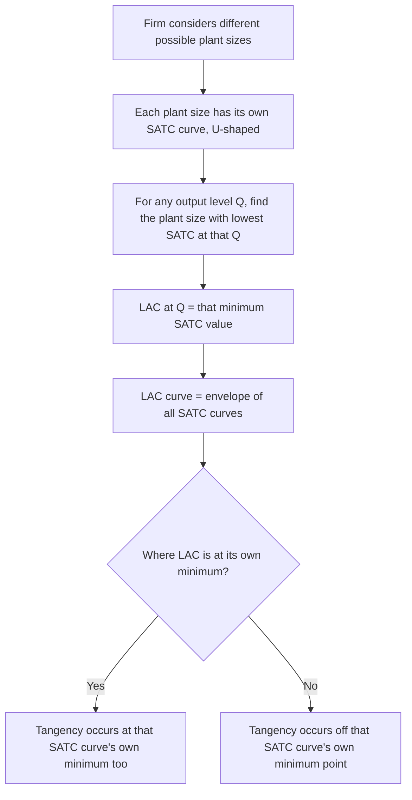

## Short-Run versus Long-Run Cost Curves

### Overview

Cost curves translate a firm's production technology and input prices into the minimum cost of producing each level of output. The distinction between **short-run** and **long-run** cost curves hinges on which inputs are fixed versus variable: in the short run, at least one input (typically capital) is fixed, generating a family of cost curves shaped by diminishing marginal returns; in the long run, all inputs are variable, allowing the firm to choose the cost-minimizing scale of operation at every output level. Understanding both, and how they relate to one another, is foundational to modeling firm behavior, market supply, and industry structure.

### Short-Run Cost Curves

In the short run, total cost decomposes into a fixed component (unavoidable regardless of output) and a variable component (depends on output level):

$$TC(Q) = TFC + TVC(Q)$$

**Fixed costs**: costs of the fixed input(s), incurred even at zero output (e.g., rent, existing equipment lease payments). $TFC$ does not vary with $Q$.

**Variable costs**: costs of the variable input(s), which scale with output level. $TVC(Q)$ rises with $Q$, and its shape is directly determined by the productivity of the variable input (see the law of diminishing marginal returns).

**Per-unit (average) cost curves**:

$$AFC = \frac{TFC}{Q}, \qquad AVC = \frac{TVC(Q)}{Q}, \qquad ATC = AFC + AVC = \frac{TC(Q)}{Q}$$

**Marginal cost**:

$$MC = \frac{\partial TC}{\partial Q} = \frac{\partial TVC}{\partial Q}$$

(Marginal cost is unaffected by fixed costs, since $TFC$ does not vary with $Q$.)

### Shapes and Relationships of Short-Run Curves

- **$AFC$ declines continuously** as output rises, since a constant fixed cost is spread over more units — this is sometimes called "spreading the overhead."
- **$AVC$ and $ATC$ are typically U-shaped**, falling initially (as productivity gains from specialization lower per-unit variable cost) and eventually rising (as diminishing marginal returns raise per-unit variable cost).
- **$MC$ is also U-shaped**, and is the mirror image of the marginal product curve: $MC = w / MP_L$ where $w$ is the wage rate. $MC$ falls while $MP_L$ rises, and rises once $MP_L$ falls.
- **$MC$ intersects both $AVC$ and $ATC$ at their respective minimum points** — this follows the same general marginal-average mathematical relationship seen between $MP_L$ and $AP_L$: whenever marginal is below average, average is falling; whenever marginal is above average, average is rising.
- **The vertical distance between $ATC$ and $AVC$ equals $AFC$** at every output level, and this gap narrows continuously as $Q$ increases (since $AFC \to 0$ as $Q \to \infty$).

<svg xmlns="http://www.w3.org/2000/svg" viewBox="0 0 540 420">
<text x="270" y="25" text-anchor="middle" font-size="15" font-weight="bold" fill="#222">Short-Run Cost Curves (svg_diagram)</text>
<line x1="70" y1="360" x2="70" y2="50" stroke="#333" stroke-width="2" />
<line x1="70" y1="360" x2="490" y2="360" stroke="#333" stroke-width="2" />
<text x="495" y="365" font-size="11" fill="#333">Output (Q)</text>
<text x="35" y="50" font-size="11" fill="#333">Cost per unit</text>
<path d="M 100,150 C 150,300 250,330 350,340 C 400,343 440,346 470,350" fill="none" stroke="#999" stroke-width="2" stroke-dasharray="5,3" />
<text x="120" y="140" font-size="10" fill="#999">AFC (falls continuously)</text>
<path d="M 100,260 C 160,190 220,175 280,180 C 340,185 400,220 460,290" fill="none" stroke="#2ca02c" stroke-width="2.5" />
<text x="330" y="175" font-size="10" fill="#2ca02c">AVC</text>
<path d="M 100,150 C 170,150 230,130 290,135 C 350,140 410,190 460,260" fill="none" stroke="#1f77b4" stroke-width="2.5" />
<text x="360" y="130" font-size="10" fill="#1f77b4">ATC</text>
<path d="M 100,320 C 160,190 220,110 280,90 C 330,80 380,150 430,260 L 460,320" fill="none" stroke="#d62728" stroke-width="2.5" />
<text x="270" y="80" font-size="10" fill="#d62728">MC</text>
<circle cx="280" cy="135" r="4" fill="#000" />
<circle cx="280" cy="180" r="4" fill="#000" />
<text x="290" y="115" font-size="9" fill="#000">MC crosses ATC at ATC min</text>
<text x="290" y="200" font-size="9" fill="#000">MC crosses AVC at AVC min</text>
</svg>

### Long-Run Cost Curves

In the long run, no input is fixed — the firm can freely adjust the scale of every input, including capital. This means there is no distinction between fixed and variable cost; every cost is, by definition, variable in the long run.

**Long-run total cost** ($LTC$ or $LRTC$): the minimum possible cost of producing a given output level $Q$, optimizing over all possible input combinations (found via the expansion path — the locus of cost-minimizing input combinations as output varies, derived from tangencies between isoquants and isocost lines).

**Long-run average cost (LAC or LRAC)**:

$$LAC(Q) = \frac{LTC(Q)}{Q}$$

**Long-run marginal cost (LMC or LRMC)**:

$$LMC(Q) = \frac{\partial LTC}{\partial Q}$$

### The LAC Curve as an Envelope of SAC Curves

A central result connecting the short run and long run: the **long-run average cost curve is the envelope of all possible short-run average total cost (SATC) curves**, one for each possible fixed level of capital (or plant size) the firm could choose.

- For any given output level $Q_0$, the firm's long-run cost equals the *minimum* $SATC$ achievable across all possible plant sizes — the firm will have chosen, in the long run, the plant size whose $SATC$ curve is lowest at that specific output level.
- Each point on the $LAC$ curve is therefore tangent to exactly one $SATC$ curve — the plant size optimally suited to that output level.
- **Important subtlety**: the $LAC$ curve is *not* simply the locus of each $SATC$ curve's own minimum point. Except at the very output level where $LAC$ itself is minimized, the tangency between $LAC$ and the relevant $SATC$ curve occurs at a point *other than* that $SATC$ curve's minimum.

<svg xmlns="http://www.w3.org/2000/svg" viewBox="0 0 540 380">
<text x="270" y="25" text-anchor="middle" font-size="15" font-weight="bold" fill="#222">LAC as Envelope of SATC Curves (svg_diagram)</text>
<line x1="70" y1="330" x2="70" y2="50" stroke="#333" stroke-width="2" />
<line x1="70" y1="330" x2="490" y2="330" stroke="#333" stroke-width="2" />
<text x="495" y="335" font-size="11" fill="#333">Output (Q)</text>
<text x="35" y="50" font-size="11" fill="#333">Cost per unit</text>
<path d="M 100,300 C 140,180 180,150 220,155 C 260,160 300,220 340,300" fill="none" stroke="#999" stroke-width="1.5" stroke-dasharray="4,2" />
<path d="M 150,280 C 190,170 230,130 270,130 C 310,130 350,180 400,270" fill="none" stroke="#999" stroke-width="1.5" stroke-dasharray="4,2" />
<path d="M 220,290 C 260,190 300,120 340,115 C 390,110 430,170 470,280" fill="none" stroke="#999" stroke-width="1.5" stroke-dasharray="4,2" />

<text x="105" y="150" font-size="9" fill="#555">SATC1</text>

<text x="180" y="120" font-size="9" fill="#555">SATC2</text>

<text x="330" y="100" font-size="9" fill="#555">SATC3</text>

<path d="M 100,300 Q 270,130 470,280" fill="none" stroke="#1f77b4" stroke-width="3" />
<text x="400" y="230" font-size="11" fill="#1f77b4">LAC (envelope)</text>
</svg>

### Long-Run Marginal Cost and the Envelope Relationship

$LMC$ intersects $LAC$ at $LAC$'s minimum point, by the same general marginal-average logic used for the short-run curves. However, $LMC$ is **not** simply an envelope of the individual $SMC$ curves the way $LAC$ is an envelope of $SATC$ curves — the relationship between $LMC$ and each plant's $SMC$ is more nuanced:

- At the specific output level where a given plant size's $SATC$ curve is tangent to $LAC$, that plant's $SMC$ equals $LMC$ at that single output level.
- Away from that tangency output, $SMC$ for that plant size and $LMC$ generally diverge.

### Economies and Diseconomies of Scale

The shape of the $LAC$ curve reflects **returns to scale** in the underlying production technology:

- **Economies of scale**: $LAC$ is declining as $Q$ increases — arises from factors such as specialization of labor and management, bulk purchasing discounts, and more efficient use of large-scale equipment.
- **Constant returns to scale**: $LAC$ is flat (constant) over a range of output.
- **Diseconomies of scale**: $LAC$ is rising as $Q$ increases — arises from factors such as coordination and communication difficulties, managerial bureaucracy, and other costs of organizational complexity that grow disproportionately with firm size.
- **Minimum Efficient Scale (MES)**: the smallest output level at which $LAC$ reaches its minimum — the scale beyond which no further average-cost reduction is available from expanding output, relevant to analyzing market structure and the number of firms an industry can efficiently support.

| Region of LAC | Scale Property | Typical Cause |
| --- | --- | --- |
| Declining | Economies of scale | Specialization, bulk discounts, spreading fixed overhead over more capital-adjusted scale |
| Flat | Constant returns to scale | Proportional scaling of all inputs and outputs |
| Rising | Diseconomies of scale | Coordination costs, managerial complexity, bureaucratic overhead |

### Key Distinctions Between Short-Run and Long-Run Costs

| Feature | Short Run | Long Run |
| --- | --- | --- |
| Fixed inputs | At least one (e.g., capital) | None — all inputs variable |
| Cost decomposition | $TFC$ + $TVC$ | No fixed/variable distinction |
| Driving force behind U-shape | Diminishing marginal returns to variable input | Economies/diseconomies of scale |
| Relevant cost-minimization tool | Given fixed capital, minimize variable input cost | Isocost-isoquant tangency across all inputs (expansion path) |
| Curve family | One $SATC$/$SMC$ pair per fixed plant size | Single $LAC$/$LMC$ pair, envelope of all plant sizes |
| Firm's flexibility | Locked into chosen plant size | Free to choose optimal plant size for each output level |

### Application: The Firm's Planning Horizon

A firm choosing a plant size makes a **long-run decision** — selecting the fixed input level (e.g., factory size) that will determine its subsequent short-run cost structure. Once built, the firm operates along that specific $SATC$/$SMC$ pair until it revisits its capital investment decision. This is why $LAC$ is sometimes referred to as the firm's **planning curve**: it represents the menu of possible short-run cost outcomes available at the initial (long-run) planning stage, before capital is committed and treated as fixed.

### Common Pitfalls

- Assuming the $LAC$ curve passes through the minimum point of *every* $SATC$ curve — it only does so at the single output level where $LAC$ itself is at its own minimum; elsewhere, tangency occurs at a point on the relevant $SATC$ curve other than that curve's own minimum.
- Confusing economies of scale (a long-run phenomenon from proportional input scaling) with the initial declining-cost portion of a short-run $ATC$ curve (which arises from diminishing marginal returns to a *single* variable input, not proportional scaling of all inputs).
- Treating fixed costs as relevant to short-run marginal decisions — since $TFC$ does not vary with $Q$, it has no bearing on $MC$ and should be excluded from marginal shutdown/continue-operating decisions (though it does affect the exit-versus-stay decision over a longer horizon).
- Assuming $LMC$ is the envelope of $SMC$ curves the same way $LAC$ is the envelope of $SATC$ curves — this specific parallel does not hold; the relationship between long-run and short-run marginal cost is more limited, coinciding only at the single tangency output for each plant size.

### Related Topics

- Production function: total, average, marginal product
- Law of diminishing marginal returns
- Isoquants, isocost lines, and the expansion path
- Returns to scale and economies of scale
- Profit maximization and the shutdown decision
- Minimum efficient scale and market structure
- Cobb-Douglas cost function derivation