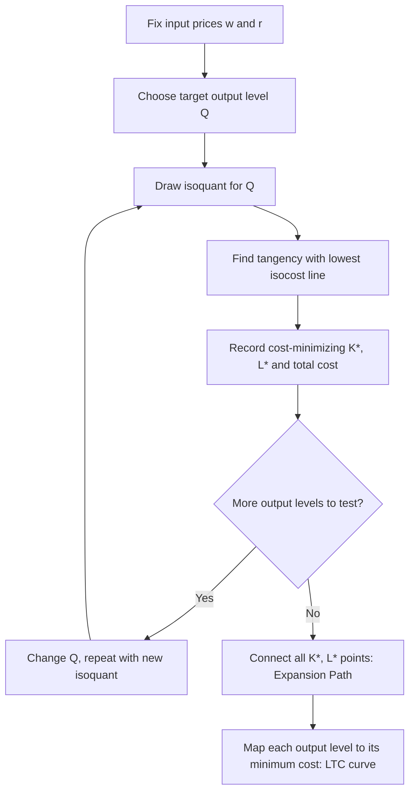

## Isoquants, Isocosts, and Optimal Input Combination

### Overview

The isoquant-isocost framework is the long-run analog to the indifference curve-budget line apparatus in consumer theory: it models how a firm chooses the cost-minimizing combination of inputs — typically capital and labor — to produce a given level of output. Where indifference curves represent constant utility, **isoquants** represent constant output; where the budget line represents a fixed spending limit at given prices, the **isocost line** represents combinations of inputs available at a given total expenditure. Together they determine the firm's optimal input mix and, when solved across all output levels, generate the firm's long-run cost function.

### Isoquants

An **isoquant** is the locus of all input combinations $(K, L)$ that produce the same level of output:

$$f(K, L) = \bar{Q}$$

A collection of isoquants at different output levels forms an **isoquant map**, analogous to an indifference map.

**Properties of well-behaved isoquants** (assuming standard, smooth, convex production technology):

- **Downward sloping**: to hold output constant while reducing one input, the other input must increase.
- **Do not cross**: two isoquants intersecting would imply the same input bundle produces two different output levels, which is inconsistent with a well-defined production function.
- **Isoquants further from the origin represent higher output levels**.
- **Convex to the origin**: reflects a diminishing marginal rate of technical substitution between inputs.

### Marginal Rate of Technical Substitution (MRTS)

The **MRTS** measures the rate at which capital can be substituted for labor (or vice versa) while holding output constant. It is the negative of the slope of the isoquant:

$$MRTS_{L,K} = -\frac{dK}{dL}\bigg|_{Q=\bar{Q}} = \frac{MP_L}{MP_K}$$

where $MP_L$ and $MP_K$ are the marginal products of labor and capital respectively.

**Diminishing MRTS**: as a firm substitutes more labor for capital along an isoquant, it typically requires progressively smaller reductions in capital to keep output constant per additional unit of labor — producing the standard convex isoquant shape.

**Special cases**:

- **Perfect substitutes** ($Q = aL + bK$): isoquants are straight lines; MRTS is constant.
- **Perfect complements / fixed proportions** ($Q = \min(aL, bK)$): isoquants are L-shaped (right angles); inputs must be combined in fixed ratios (e.g., one machine requires exactly two operators).
- **Cobb-Douglas** ($Q = AK^{\alpha}L^{\beta}$): smooth, convex, hyperbola-like isoquants; MRTS varies continuously along the curve.

<svg xmlns="http://www.w3.org/2000/svg" viewBox="0 0 500 400">
<text x="250" y="25" text-anchor="middle" font-size="15" font-weight="bold" fill="#222">Isoquant Map (svg_diagram)</text>
<line x1="60" y1="350" x2="60" y2="40" stroke="#333" stroke-width="2" />
<line x1="60" y1="350" x2="470" y2="350" stroke="#333" stroke-width="2" />
<text x="475" y="355" font-size="12" fill="#333">Labor (L)</text>
<text x="30" y="40" font-size="12" fill="#333">Capital (K)</text>
<path d="M 90,330 C 150,140 260,90 420,70" fill="none" stroke="#1f77b4" stroke-width="2" />
<path d="M 120,330 C 190,170 300,120 450,100" fill="none" stroke="#2ca02c" stroke-width="2" />
<path d="M 150,330 C 230,200 340,150 460,135" fill="none" stroke="#d62728" stroke-width="2" />

<text x="425" y="65" font-size="11" fill="`#1f77b4`">Q1</text>

<text x="455" y="95" font-size="11" fill="`#2ca02c`">Q2</text>

<text x="465" y="130" font-size="11" fill="`#d62728`">Q3</text>

<text x="250" y="380" text-anchor="middle" font-size="11" fill="#555">Output increases outward: Q3 &gt; Q2 &gt; Q1</text>

</svg>

### The Isocost Line

The isocost line shows all combinations of $K$ and $L$ that can be purchased for a given total expenditure $C$, given input prices — the wage rate $w$ and the rental rate of capital $r$:

$$wL + rK = C \quad \Longrightarrow \quad K = \frac{C}{r} - \frac{w}{r}L$$

**Key features**:

- **Vertical intercept** ($L=0$): $K = C/r$ — maximum affordable capital.
- **Horizontal intercept** ($K=0$): $L = C/w$ — maximum affordable labor.
- **Slope**: $-w/r$, the negative ratio of input prices — the market rate at which capital can be substituted for labor in the input market.

**Shifts and rotations**: an increase in total expenditure $C$ shifts the isocost line outward, parallel to itself; a change in $w$ or $r$ alone rotates the line, holding the intercept on the *other* axis fixed.

### Cost Minimization: The Tangency Condition

For a target output level $\bar{Q}$, the firm minimizes cost:

$$\min_{K,L} \; wL + rK \quad \text{subject to} \quad f(K,L) = \bar{Q}$$

**Graphical solution**: the optimal input combination occurs where the isoquant for $\bar{Q}$ is **tangent** to the lowest attainable isocost line.

**Tangency condition**:

$$MRTS_{L,K} = \frac{w}{r} \quad \Longleftrightarrow \quad \frac{MP_L}{MP_K} = \frac{w}{r} \quad \Longleftrightarrow \quad \frac{MP_L}{w} = \frac{MP_K}{r}$$

This last form is the **equimarginal principle for production**: at the cost-minimizing input combination, the marginal product per dollar spent must be equal across all inputs. If it were not, the firm could reallocate spending toward the input with higher marginal product per dollar and produce the same output at lower cost.

**Lagrangian derivation**:

$$\mathcal{L} = wL + rK + \mu(\bar{Q} - f(K,L))$$

First-order conditions:

$$\frac{\partial \mathcal{L}}{\partial L} = w - \mu MP_L = 0, \qquad \frac{\partial \mathcal{L}}{\partial K} = r - \mu MP_K = 0$$

Dividing yields the tangency condition above; $\mu$ represents the **marginal cost of output** at the optimum — the shadow price of relaxing the output constraint by one unit.

<svg xmlns="http://www.w3.org/2000/svg" viewBox="0 0 500 400">
<text x="250" y="25" text-anchor="middle" font-size="15" font-weight="bold" fill="#222">Cost-Minimizing Input Combination (svg_diagram)</text>
<line x1="60" y1="350" x2="60" y2="40" stroke="#333" stroke-width="2" />
<line x1="60" y1="350" x2="470" y2="350" stroke="#333" stroke-width="2" />
<text x="475" y="355" font-size="12" fill="#333">Labor (L)</text>
<text x="30" y="40" font-size="12" fill="#333">Capital (K)</text>
<line x1="60" y1="90" x2="430" y2="350" stroke="#555" stroke-width="2" />
<text x="330" y="330" font-size="11" fill="#555">Isocost Line</text>
<path d="M 100,340 C 160,190 260,150 400,140" fill="none" stroke="#999" stroke-width="1.5" stroke-dasharray="4,3" />
<path d="M 130,340 C 200,220 290,180 400,220" fill="none" stroke="#1f77b4" stroke-width="2" />
<path d="M 160,340 C 230,260 310,240 400,280" fill="none" stroke="#999" stroke-width="1.5" stroke-dasharray="4,3" />
<circle cx="245" cy="205" r="5" fill="#d62728" />
<text x="255" y="200" font-size="11" fill="#d62728">E* (cost-minimizing input mix)</text>
</svg>

### The Expansion Path

Repeating the cost-minimization exercise across different target output levels — holding $w$ and $r$ fixed — traces out a sequence of tangency points. Connecting these points forms the **expansion path**: the locus of cost-minimizing input combinations as output expands, given fixed input prices.

- For **homothetic production functions** (including Cobb-Douglas), the expansion path is a **straight line through the origin** — the cost-minimizing capital-labor ratio $K^*/L^*$ is constant regardless of output level, depending only on relative input prices $w/r$.
- For non-homothetic production functions, the expansion path can curve, meaning the optimal input ratio changes as the scale of output changes.

The expansion path is the direct analog of the income consumption curve in consumer theory, and is the mechanism by which the long-run total cost function $LTC(Q)$ is derived: at each output level along the path, total cost equals $wL^* + rK^*$ at that point.

### Corner Solutions

When inputs are **perfect substitutes**, the cost-minimizing solution may occur at a **corner** — using only the cheaper input exclusively — rather than at an interior tangency. If $w/r \neq MP_L/MP_K$ everywhere along the isoquant (as with a constant MRTS), the firm minimizes cost by using only labor (if $w/r < MRTS$ everywhere) or only capital (if $w/r > MRTS$ everywhere).

With **perfect complements**, the optimal input combination is dictated entirely by the fixed proportion required by the technology, regardless of relative input prices — the firm simply purchases inputs in the technologically required ratio at the lowest total cost for the target output.

### Comparative Statics: Effect of a Wage Change

If the wage rate $w$ rises (holding $r$ fixed), the isocost line becomes steeper, rotating around the $K$-intercept. The new cost-minimizing tangency point on the same isoquant shifts toward using **relatively more capital and less labor** — a **substitution effect** in the firm's input choice, analogous to the substitution effect in consumer demand.

This substitutability can be summarized by the **elasticity of substitution** $\sigma$, which measures the percentage change in the capital-labor ratio for a percentage change in the input price ratio:

$$\sigma = \frac{\% \Delta (K/L)}{\% \Delta (w/r)}$$

- For **Cobb-Douglas** production functions, $\sigma = 1$ (constant, unit elasticity of substitution).
- For **perfect substitutes**, $\sigma \to \infty$ (inputs are fully interchangeable).
- For **perfect complements**, $\sigma = 0$ (no substitutability at all).
- The **Constant Elasticity of Substitution (CES)** production function nests these cases and allows $\sigma$ to be any non-negative constant, making it a common tool in applied production analysis. [Inference: while CES is the standard flexible functional form taught for varying substitutability, more general or translog specifications are used in empirical work when substitution elasticity is expected to vary across the input ratio range rather than remain constant.]

### Relationship to Consumer Theory (Structural Parallel)

| Consumer Theory | Producer Theory |
| --- | --- |
| Indifference curve | Isoquant |
| Utility level $\bar{U}$ | Output level $\bar{Q}$ |
| Budget line | Isocost line |
| MRS (marginal rate of substitution) | MRTS (marginal rate of technical substitution) |
| Tangency: $MRS = P_x/P_y$ | Tangency: $MRTS = w/r$ |
| Income consumption curve | Expansion path |
| Demand curve derivation | Long-run cost curve derivation |

### Common Pitfalls

- Confusing the **slope of the isoquant** (MRTS, a technological ratio) with the **slope of the isocost line** (a market input-price ratio); the cost-minimizing condition is that these are equal, not that either alone determines the optimal input mix.
- Assuming diminishing MRTS always holds — it does not for perfect substitutes (constant MRTS) or perfect complements (MRTS undefined along the kink).
- Treating the expansion path as always linear — this holds specifically for homothetic production functions (including Cobb-Douglas); non-homothetic functions can generate a curved expansion path where the optimal input ratio changes with scale.
- Conflating cost minimization (finding the cheapest way to produce a *given* output level) with profit maximization (choosing the output level itself that maximizes profit) — cost minimization is a necessary condition embedded within profit maximization, but answers a narrower question on its own.

### Related Topics

- Production function: total, average, marginal product
- Short-run versus long-run cost curves
- Economies and diseconomies of scale
- Elasticity of substitution and CES production functions
- Returns to scale
- Profit maximization and the optimal output decision
- Indifference curves and budget constraints (consumer-theory structural parallel)