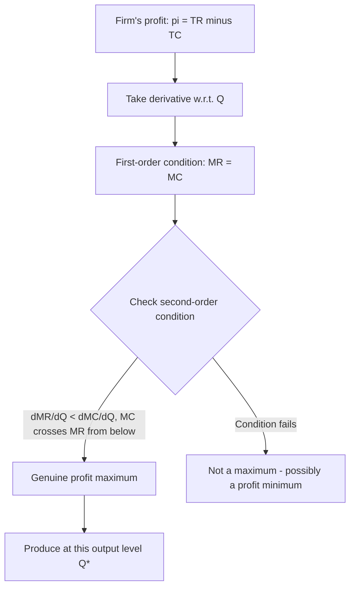

## Profit Maximization: Marginal Revenue Equals Marginal Cost

### Overview

The MR = MC rule is the central decision criterion for a profit-maximizing firm across every market structure — perfect competition, monopoly, monopolistic competition, and oligopoly alike. It states that a firm maximizes profit by producing the output level at which marginal revenue exactly equals marginal cost. This result follows directly from basic calculus applied to the firm's profit function, and it unifies output-decision analysis across otherwise very different market environments, differing only in how marginal revenue itself is determined in each structure.

### The Firm's Profit Function

Profit $\pi$ is defined as total revenue minus total cost, both expressed as functions of output $Q$:

$$\pi(Q) = TR(Q) - TC(Q)$$

To maximize profit with respect to $Q$, take the first derivative and set it equal to zero:

$$\frac{d\pi}{dQ} = \frac{dTR}{dQ} - \frac{dTC}{dQ} = MR - MC = 0$$

$$\Longrightarrow \quad MR = MC$$

**Second-order condition**: for this to be a maximum (not a minimum), the second derivative must be negative:

$$\frac{d^2\pi}{dQ^2} = \frac{dMR}{dQ} - \frac{dMC}{dQ} < 0 \quad \Longleftrightarrow \quad \frac{dMR}{dQ} < \frac{dMC}{dQ}$$

In practice, this means the profit-maximizing output occurs where **$MC$ is crossing $MR$ from below** — i.e., $MC$ must be rising relative to $MR$ at the intersection point. If multiple output levels satisfy $MR = MC$, only those satisfying this second-order condition represent genuine profit maxima; others may be profit-minimizing points.

### Marginal Revenue Across Market Structures

The MR = MC rule is universal, but the specific value of $MR$ differs by market structure, since it depends on how a firm's output decision affects the price it receives.

**Perfect competition**: the firm is a price taker, facing a perfectly elastic (horizontal) demand curve at the market price $P$. Marginal revenue equals price at every unit:

$$MR = P$$

so the profit-maximizing condition simplifies to $P = MC$.

**Monopoly (and other price-searching structures)**: the firm faces the entire downward-sloping market demand curve, so selling an additional unit requires lowering price on *all* units sold (assuming no price discrimination), making $MR < P$ at every output level beyond the first unit:

$$MR = P + Q\frac{dP}{dQ} = P\left(1 + \frac{1}{\varepsilon}\right)$$

where $\varepsilon$ is the price elasticity of demand (negative by convention), so $MR < P$ whenever demand is downward sloping.

<svg xmlns="http://www.w3.org/2000/svg" viewBox="0 0 540 400">
<text x="270" y="25" text-anchor="middle" font-size="15" font-weight="bold" fill="#222">MR = MC Under Perfect Competition vs. Monopoly (svg_diagram)</text>
<line x1="70" y1="180" x2="70" y2="50" stroke="#333" stroke-width="2" />
<line x1="70" y1="180" x2="260" y2="180" stroke="#333" stroke-width="2" />
<text x="265" y="185" font-size="10" fill="#333">Q</text>
<text x="40" y="50" font-size="10" fill="#333">P, MC</text>
<text x="140" y="65" font-size="11" fill="#333">Perfect Competition</text>
<line x1="90" y1="90" x2="240" y2="90" stroke="#2ca02c" stroke-width="2" />
<text x="245" y="85" font-size="10" fill="#2ca02c">D = MR = P</text>
<path d="M 90,170 C 130,120 170,90 210,100" fill="none" stroke="#d62728" stroke-width="2" />
<text x="215" y="105" font-size="10" fill="#d62728">MC</text>
<circle cx="164" cy="90" r="4" fill="#000" />
<line x1="164" y1="90" x2="164" y2="180" stroke="#999" stroke-dasharray="3,2" />
<text x="140" y="195" font-size="9" fill="#000">Q* where MC=MR=P</text>
<line x1="330" y1="180" x2="330" y2="50" stroke="#333" stroke-width="2" />
<line x1="330" y1="180" x2="520" y2="180" stroke="#333" stroke-width="2" />
<text x="525" y="185" font-size="10" fill="#333">Q</text>
<text x="300" y="50" font-size="10" fill="#333">P, MR, MC</text>
<text x="400" y="65" font-size="11" fill="#333">Monopoly</text>
<line x1="350" y1="80" x2="490" y2="160" stroke="#2ca02c" stroke-width="2" />
<text x="490" y="155" font-size="10" fill="#2ca02c">D</text>
<line x1="350" y1="80" x2="450" y2="180" stroke="#1f77b4" stroke-width="2" />
<text x="440" y="175" font-size="10" fill="#1f77b4">MR</text>
<path d="M 350,170 C 380,130 410,105 440,110" fill="none" stroke="#d62728" stroke-width="2" />
<text x="445" y="115" font-size="10" fill="#d62728">MC</text>
<circle cx="405" cy="128" r="4" fill="#000" />
<line x1="405" y1="128" x2="405" y2="180" stroke="#999" stroke-dasharray="3,2" />
<line x1="405" y1="98" x2="330" y2="98" stroke="#999" stroke-dasharray="3,2" />
<text x="345" y="93" font-size="9" fill="#000">P &gt; MR = MC</text>
</svg>

### Alternative Formulation Using Markup Pricing

Rearranging $MR = MC$ using the elasticity expression for MR under imperfect competition gives the **Lerner Index** formulation of monopoly pricing power:

$$\frac{P - MC}{P} = -\frac{1}{\varepsilon}$$

This shows the profit-maximizing markup over marginal cost is inversely related to the elasticity of demand: firms facing more elastic (price-sensitive) demand set a smaller markup, while firms facing less elastic demand can sustain a larger markup, all while still satisfying the same underlying $MR = MC$ logic.

### The Shutdown Decision (Short-Run Qualifier)

$MR = MC$ identifies the profit-maximizing (or loss-minimizing) output level *given that the firm produces at all*. A separate short-run condition determines whether the firm should produce at that output or shut down entirely:

- **Continue operating** if $P \geq AVC$ (in perfect competition) or more generally if total revenue covers total variable cost — since fixed costs are sunk in the short run and irrelevant to the produce-or-shut-down comparison.
- **Shut down** if $P < AVC$ — producing would mean the firm loses money on every unit's variable cost alone, in addition to losing the (unavoidable) fixed cost; shutting down limits losses to fixed costs only.

In the **long run**, the relevant comparison shifts to whether $P \geq ATC$ (or, more generally, whether total revenue covers total cost), since all costs — including what were fixed costs in the short run — become avoidable in the long run; a firm earning below-normal long-run profit will exit the industry.

### Numerical Example

Given a firm facing $TR(Q) = 100Q - 2Q^2$ and $TC(Q) = Q^2 + 10Q + 50$:

$$MR = \frac{dTR}{dQ} = 100 - 4Q, \qquad MC = \frac{dTC}{dQ} = 2Q + 10$$

Setting $MR = MC$:

$$100 - 4Q = 2Q + 10 \quad \Longrightarrow \quad 90 = 6Q \quad \Longrightarrow \quad Q^* = 15$$

Checking the second-order condition: $\dfrac{dMR}{dQ} = -4$, $\dfrac{dMC}{dQ} = 2$; since $-4 < 2$, the condition holds and $Q^* = 15$ is a genuine profit maximum.

Profit at this output: $\pi(15) = TR(15) - TC(15) = [100(15) - 2(15)^2] - [(15)^2 + 10(15) + 50] = 1050 - 425 = 625$.

### Total Curve Interpretation

An equivalent way to see the MR = MC condition graphically is via total revenue and total cost curves directly: **profit is maximized at the output level where the vertical distance between $TR$ and $TC$ is greatest**, which occurs precisely where the slopes of the two curves are equal — i.e., where $\dfrac{dTR}{dQ} = \dfrac{dTC}{dQ}$, exactly the MR = MC condition.

### Common Pitfalls

- Assuming $MR = MC$ alone guarantees a profit-maximizing (rather than profit-minimizing) output — the second-order condition ($MC$ crossing $MR$ from below, i.e., $MC$ rising relative to $MR$ at that point) must also be checked, particularly when the profit function has multiple critical points.
- Confusing "price = marginal cost" (specific to perfect competition, where $MR = P$) with the general rule "$MR = MC$" (which applies universally, but $MR \neq P$ under any form of imperfect competition).
- Believing MR = MC guarantees positive economic profit — the rule identifies the *best available* output level given demand and cost conditions; the firm may still be earning negative economic profit at that output level (in which case the separate shutdown/exit decision becomes relevant).
- Applying the short-run shutdown rule ($P \geq AVC$) to a long-run decision, or vice versa — the correct cost benchmark (AVC vs. ATC) depends on the time horizon and which costs are genuinely avoidable.

### Related Topics

- Short-run versus long-run cost curves
- Perfect competition: firm and market equilibrium
- Monopoly pricing and the Lerner Index
- Price elasticity of demand
- Shutdown decision and the short-run supply curve
- Producer surplus and profit
- Market structures: monopolistic competition and oligopoly