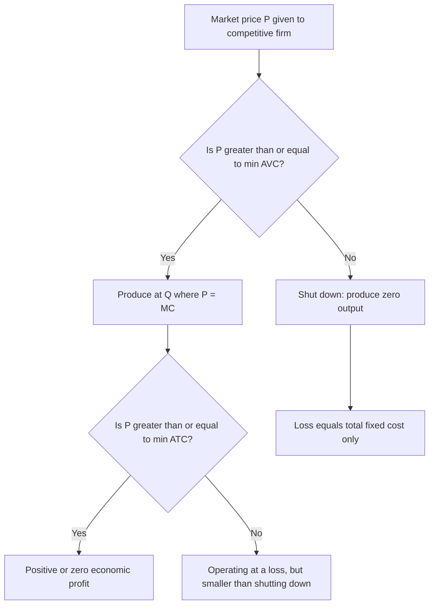

## Shutdown Point and Break-Even Analysis

### Overview

Once a firm has identified its profit-maximizing (or loss-minimizing) output level via the MR = MC rule, a separate question remains: should the firm produce at all? The shutdown point and break-even point are the two critical price thresholds that answer this question in the short run and mark the transition between different zones of firm behavior — operating profitably, operating at a loss but continuing to produce, and shutting down entirely. This analysis is most cleanly developed for a perfectly competitive firm, where $P = MR$, though the underlying logic (comparing revenue to avoidable cost) generalizes to any market structure.

### The Short-Run Produce-or-Shutdown Decision

The key insight is that in the short run, **fixed costs are sunk** — they must be paid regardless of the output decision, including the decision to produce zero output. Since sunk costs cannot be recovered by any current action, they are irrelevant to the marginal decision of whether to operate; only **avoidable (variable) costs** matter for this comparison.

**The firm's short-run choice**:

- **Produce** at the MR = MC output level if doing so generates enough revenue to cover variable costs (and ideally some or all fixed costs too).
- **Shut down** (produce zero output) if revenue cannot even cover variable costs — producing would add losses beyond the unavoidable fixed cost.

### The Break-Even Point

The **break-even point** is the output level (equivalently, the price level for a competitive firm) at which the firm earns exactly zero economic profit — total revenue equals total cost:

$$P = ATC \quad \Longleftrightarrow \quad TR = TC \quad \Longleftrightarrow \quad \pi = 0$$

Graphically, for a competitive firm, this occurs where the (horizontal) price line is **tangent to the minimum point of the $ATC$ curve** — since the firm produces where $P = MC$, and $MC$ crosses $ATC$ at $ATC$'s minimum, the break-even price is exactly $\min(ATC)$.

- If $P > ATC$ at the profit-maximizing output: the firm earns **positive economic profit**.
- If $P = ATC$: the firm earns **zero economic profit** (breaking even) — note this still represents a *normal* return to the firm's resources, since economic cost includes the opportunity cost of the owner's invested capital and effort.
- If $P < ATC$: the firm earns **negative economic profit** (an economic loss).

### The Shutdown Point

The **shutdown point** is the output level (or price level) at which the firm earns just enough revenue to cover variable costs, with nothing left over to contribute toward fixed costs:

$$P = AVC \quad \Longleftrightarrow \quad TR = TVC$$

Graphically, this occurs where the price line is tangent to the **minimum point of the $AVC$ curve** — since $MC$ crosses $AVC$ at $AVC$'s minimum as well.

- If $P > AVC$ (but $P < ATC$): the firm is operating at an economic loss, but that loss is **smaller than fixed costs alone** — the firm should **continue to produce** in the short run, since producing recovers all variable costs plus some contribution toward fixed costs.
- If $P = AVC$: the firm is indifferent between producing (losing exactly $TFC$) and shutting down (also losing exactly $TFC$) — this is the shutdown point exactly.
- If $P < AVC$: the firm should **shut down immediately** — producing would mean losing money on the variable cost of every unit *in addition to* the unavoidable fixed cost, making the loss from producing strictly worse than the loss from shutting down.

<svg xmlns="http://www.w3.org/2000/svg" viewBox="0 0 540 420">
<text x="270" y="25" text-anchor="middle" font-size="15" font-weight="bold" fill="#222">Shutdown and Break-Even Points (svg_diagram)</text>
<line x1="70" y1="360" x2="70" y2="50" stroke="#333" stroke-width="2" />
<line x1="70" y1="360" x2="490" y2="360" stroke="#333" stroke-width="2" />
<text x="495" y="365" font-size="11" fill="#333">Output (Q)</text>
<text x="35" y="50" font-size="11" fill="#333">Cost / Price</text>
<path d="M 100,320 C 160,190 220,150 280,155 C 340,160 400,220 460,300" fill="none" stroke="#2ca02c" stroke-width="2.2" />
<text x="330" y="150" font-size="10" fill="#2ca02c">AVC</text>
<path d="M 100,220 C 170,160 230,140 290,145 C 350,150 410,190 460,260" fill="none" stroke="#1f77b4" stroke-width="2.2" />
<text x="360" y="140" font-size="10" fill="#1f77b4">ATC</text>
<path d="M 100,340 C 160,190 220,110 280,90 C 330,80 380,150 430,260 L 460,320" fill="none" stroke="#d62728" stroke-width="2.2" />
<text x="270" y="80" font-size="10" fill="#d62728">MC</text>
<line x1="70" y1="145" x2="490" y2="145" stroke="#555" stroke-width="1.3" stroke-dasharray="5,3" />
<text x="440" y="140" font-size="10" fill="#555">Break-even price = min(ATC)</text>
<line x1="70" y1="155" x2="490" y2="155" stroke="#888" stroke-width="1.3" stroke-dasharray="5,3" />
<text x="435" y="175" font-size="10" fill="#888">Shutdown price = min(AVC)</text>
<circle cx="290" cy="145" r="4" fill="#000" />
<circle cx="280" cy="155" r="4" fill="#000" />
</svg>

### The Zones of Operation Summarized

| Price Range | Relationship to ATC/AVC | Firm's Best Short-Run Decision | Economic Profit |
| --- | --- | --- | --- |
| $P > \min(ATC)$ | $P > ATC$ at optimal $Q$ | Produce | Positive |
| $P = \min(ATC)$ | $P = ATC$ | Produce (break-even) | Zero |
| $\min(AVC) < P < \min(ATC)$ | $AVC < P < ATC$ | Produce (loss-minimizing) | Negative, but less than $-TFC$ |
| $P = \min(AVC)$ | $P = AVC$ | Indifferent (shutdown point) | Negative, exactly $-TFC$ |
| $P < \min(AVC)$ | $P < AVC$ | Shut down | N/A (zero output; loss = $TFC$) |

### The Short-Run Supply Curve

A critical and testable implication: **the perfectly competitive firm's short-run supply curve is precisely the portion of its marginal cost curve lying at or above the minimum point of $AVC$.** Below that price, the firm supplies zero output (shuts down) rather than following $MC$ down to a lower quantity.

### Numerical Example

Given $TVC(Q) = Q^2 + 4Q$ and $TFC = 36$, so $TC(Q) = Q^2 + 4Q + 36$:

$$AVC = \frac{TVC}{Q} = Q + 4, \qquad ATC = \frac{TC}{Q} = Q + 4 + \frac{36}{Q}$$

**Finding minimum $AVC$**: since $AVC = Q + 4$ is linear and increasing in $Q$ with no interior minimum for $Q>0$ other than at $Q\to 0$, this particular specification implies $AVC$ is minimized as $Q \to 0^+$, approaching $AVC = 4$ — meaning the shutdown price for this specific cost function approaches $P = 4$. [Inference: this simplified linear-AVC example is chosen for algebraic tractability; a more realistic U-shaped $AVC$ curve (arising from an underlying cubic total variable cost function) would have an interior minimum at some positive $Q^*$, which is the more general case typically illustrated in textbook diagrams.]

**Finding minimum $ATC$**: take the derivative of $ATC$ with respect to $Q$ and set to zero:

$$\frac{d(ATC)}{dQ} = 1 - \frac{36}{Q^2} = 0 \quad \Longrightarrow \quad Q^2 = 36 \quad \Longrightarrow \quad Q = 6$$

At $Q = 6$: $ATC = 6 + 4 + \dfrac{36}{6} = 16$. So the break-even price for this firm is $P = 16$.

### Long-Run Shutdown (Exit) Decision

The shutdown/break-even framework above applies specifically to the **short run**, where fixed costs are sunk. In the **long run**, all costs — including what were fixed costs in the short run — become avoidable, since the firm can choose not to renew a lease, sell capital equipment, or otherwise exit the industry entirely.

- **Long-run continue-operating condition**: $P \geq \min(LAC)$ — the firm must cover *all* long-run average costs, since there is no "fixed cost" cushion to justify operating at a loss indefinitely.
- **Long-run exit condition**: if $P < \min(LAC)$ persistently, the firm exits the industry rather than continuing to produce even at the MR = MC output level.

This distinction between the short-run shutdown price ($\min AVC$) and the long-run exit price ($\min LAC$) is one of the most important applications of the broader short-run/long-run cost-curve distinction to firm-level decision-making.

### Applications

- **Industry supply and market equilibrium in perfect competition**: aggregating individual firms' short-run supply curves (each firm's $MC$ curve above its $AVC$ minimum) yields the short-run market supply curve, a direct building block of competitive market equilibrium analysis.
- **Understanding temporary below-cost operation**: explains empirically observed firm behavior of continuing to operate at a loss during a temporary downturn (e.g., a seasonal slump, a recession) rather than immediately shutting down, so long as price remains above $AVC$ — the firm is minimizing losses, not eliminating them, and is behaving rationally given sunk fixed costs.
- **Distinguishing accounting loss from a signal to exit**: an accounting loss alone (revenue below total cost) does not necessarily mean shutting down is the better short-run choice; only when revenue falls below variable cost does immediate shutdown minimize losses.

### Common Pitfalls

- Using the break-even point ($P = ATC$) as the shutdown threshold — this conflates the short-run continue-operating decision (relevant threshold: $AVC$) with the zero-profit point (relevant threshold: $ATC$); a firm earning negative profit but above the shutdown price should still produce.
- Applying the short-run shutdown rule to a long-run exit decision — in the long run, the relevant benchmark shifts entirely to $LAC$, since no costs remain fixed/sunk over that horizon.
- Assuming a firm operating at a loss above the shutdown price is behaving irrationally — given sunk fixed costs, continuing to produce and partially cover those costs is the loss-*minimizing* choice, strictly better than shutting down and losing all of $TFC$.
- Forgetting that "zero economic profit" at the break-even point still represents a *normal* rate of return — economic cost already includes the opportunity cost of the owner's invested resources, so breaking even in the economic sense is a perfectly sustainable long-run outcome, not evidence of business failure.

### Related Topics

- Profit maximization: marginal revenue equals marginal cost
- Short-run versus long-run cost curves
- Perfect competition: firm and market equilibrium
- Producer surplus
- Long-run equilibrium and free entry/exit
- Economies and diseconomies of scale