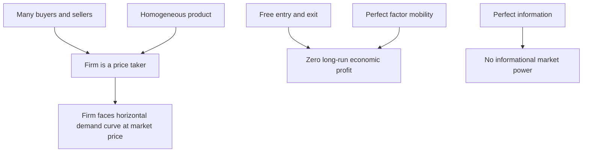

## Perfect Competition: Assumptions and Equilibrium


### Overview

Perfect competition is the benchmark market structure in microeconomics, characterized by a set of idealized assumptions that together imply firms are pure price takers with no individual market power. Despite rarely existing in this exact form in reality, it serves as the theoretical baseline against which all other market structures — monopoly, monopolistic competition, oligopoly — are compared, and it produces the sharpest, most tractable predictions about efficiency, pricing, and long-run industry outcomes.

### Defining Assumptions

A market is perfectly competitive when it satisfies the following conditions simultaneously:

- **Many buyers and sellers**: no single firm or consumer is large enough, relative to the total market, to influence the market price through their individual actions.
- **Homogeneous (standardized) product**: every firm's output is a perfect substitute for every other firm's output — buyers are indifferent between suppliers, so no firm can charge above the market price without losing all customers.
- **Free entry and exit**: no significant barriers prevent new firms from entering the industry when profits are attractive, or existing firms from exiting when losses persist — this assumption is what drives the industry toward zero long-run economic profit.
- **Perfect information**: all buyers and sellers have complete and accurate knowledge of prices, product quality, and available technology — no informational advantage exists for any participant.
- **Perfect factor mobility**: inputs (labor, capital) can move freely and without cost between industries and uses in the long run.



### Implication: The Firm as a Price Taker

Because no individual firm's output decision is large enough to affect the market price, each firm faces a **perfectly elastic (horizontal) demand curve** at the prevailing market price $P$, even though the *market* demand curve is downward sloping as usual.

$$D_{firm}(Q) = P \quad \text{for all } Q$$

This has a direct implication for revenue: since price does not change with the firm's own output, marginal revenue equals price at every unit sold:

$$MR = P$$

This is the key structural feature that distinguishes perfect competition from every other market structure, where $MR < P$ due to the need to lower price to sell additional units along a downward-sloping firm-level demand curve.

### Short-Run Firm Equilibrium

Applying the universal MR = MC profit-maximization rule with $MR = P$ gives the perfectly competitive firm's short-run equilibrium condition:

$$P = MC$$

The firm produces the output level where marginal cost equals the given market price. Whether this results in profit, a loss, or a break-even outcome depends on the relationship between $P$ and $ATC$ at that output level (see shutdown/break-even analysis):

- $P > ATC$: positive economic profit.
- $P = ATC$: zero economic profit (breaking even).
- $AVC < P < ATC$: negative economic profit, but firm continues producing (loss-minimizing).
- $P < AVC$: firm shuts down.

<svg xmlns="http://www.w3.org/2000/svg" viewBox="0 0 520 400">
<text x="260" y="25" text-anchor="middle" font-size="15" font-weight="bold" fill="#222">Short-Run Competitive Firm Equilibrium (svg_diagram)</text>
<line x1="60" y1="350" x2="60" y2="40" stroke="#333" stroke-width="2" />
<line x1="60" y1="350" x2="470" y2="350" stroke="#333" stroke-width="2" />
<text x="475" y="355" font-size="11" fill="#333">Output (Q)</text>
<text x="30" y="40" font-size="11" fill="#333">P, Cost</text>
<line x1="90" y1="150" x2="440" y2="150" stroke="#2ca02c" stroke-width="2.2" />
<text x="445" y="145" font-size="10" fill="#2ca02c">D = MR = P</text>
<path d="M 100,330 C 160,190 220,110 280,90 C 330,80 380,150 430,260 L 450,300" fill="none" stroke="#d62728" stroke-width="2.2" />
<text x="270" y="80" font-size="10" fill="#d62728">MC</text>
<path d="M 100,240 C 170,170 230,150 290,155 C 350,160 410,200 460,270" fill="none" stroke="#1f77b4" stroke-width="2.2" />
<text x="360" y="150" font-size="10" fill="#1f77b4">ATC</text>
<circle cx="330" cy="150" r="5" fill="#000" />
<line x1="330" y1="150" x2="330" y2="350" stroke="#999" stroke-dasharray="3,2" />
<text x="335" y="345" font-size="10" fill="#000">Q* where P = MC</text>
<line x1="330" y1="155" x2="60" y2="155" stroke="#999" stroke-dasharray="3,2" />
<rect x="60" y="150" width="270" height="5" fill="#ccc" opacity="0.5" />
<text x="150" y="130" font-size="9" fill="#555">Profit ≈ (P − ATC) × Q*</text>
</svg>

### The Short-Run Supply Curve

The individual firm's **short-run supply curve** is the portion of its marginal cost curve at or above the minimum point of average variable cost — below that price, the firm produces zero output (shuts down) rather than continuing along $MC$.

The **market short-run supply curve** is the horizontal sum of all individual firms' short-run supply curves, giving the total quantity supplied by the industry at each possible price.

### Long-Run Equilibrium

The distinguishing feature of perfect competition's long-run outcome is **free entry and exit**, which drives economic profit to exactly zero across the industry:

- If firms are earning **positive economic profit** in the short run, this attracts new entrants (since there are no barriers to entry) — increasing market supply, which lowers the market price until profit is competed away.
- If firms are earning **negative economic profit** (losses) in the short run, some firms exit the industry — decreasing market supply, which raises the market price until remaining firms no longer face losses.

**Long-run equilibrium condition** for each firm:

$$P = MC = \min(LAC)$$

At long-run equilibrium, price equals marginal cost *and* equals the minimum point of the long-run average cost curve — meaning firms operate at the most cost-efficient scale (their Minimum Efficient Scale) and earn exactly zero economic profit (a **normal profit**, since economic cost already includes the opportunity cost of the owners' resources).

```mermaid
flowchart TD
    A[Short-run: firms earning positive profit] --> B[New firms enter industry]
    B --> C[Market supply increases]
    C --> D[Market price falls]
    D --> E[Profit falls toward zero]
    F[Short-run: firms earning losses] --> G[Firms exit industry]
    G --> H[Market supply decreases]
    H --> I[Market price rises]
    I --> J[Losses shrink toward zero]
    E --> K[Long-run equilibrium: P = MC = min(LAC), zero economic profit]
    J --> K
```

<svg xmlns="http://www.w3.org/2000/svg" viewBox="0 0 560 380">
<text x="280" y="25" text-anchor="middle" font-size="15" font-weight="bold" fill="#222">Entry/Exit Adjustment to Long-Run Equilibrium (svg_diagram)</text>
<line x1="70" y1="330" x2="70" y2="50" stroke="#333" stroke-width="2" />
<line x1="70" y1="330" x2="260" y2="330" stroke="#333" stroke-width="2" />
<text x="265" y="335" font-size="10" fill="#333">Market Q</text>
<text x="40" y="50" font-size="10" fill="#333">P</text>
<text x="130" y="65" font-size="11" fill="#333">Market (short-run)</text>
<line x1="90" y1="280" x2="240" y2="90" stroke="#555" stroke-width="1.5" />
<text x="245" y="90" font-size="9" fill="#555">D</text>
<line x1="90" y1="100" x2="240" y2="220" stroke="#2ca02c" stroke-width="1.5" />
<text x="245" y="220" font-size="9" fill="#2ca02c">S1</text>
<line x1="90" y1="70" x2="240" y2="190" stroke="#999" stroke-width="1.5" stroke-dasharray="4,2" />
<text x="245" y="190" font-size="9" fill="#999">S2 (entry shifts S right)</text>
<line x1="330" y1="180" x2="520" y2="50" stroke="#333" stroke-width="2" />
<line x1="330" y1="180" x2="520" y2="180" stroke="#333" stroke-width="2" />
<text x="400" y="65" font-size="11" fill="#333">Firm (long-run)</text>
<line x1="350" y1="130" x2="500" y2="130" stroke="#2ca02c" stroke-width="1.5" />
<text x="505" y="125" font-size="9" fill="#2ca02c">P = min(LAC)</text>
<path d="M 355,300 C 380,190 410,150 440,150 C 470,150 495,190 500,220" fill="none" stroke="#1f77b4" stroke-width="1.5" />
<text x="430" y="140" font-size="9" fill="#1f77b4">LAC</text>
<circle cx="440" cy="130" r="4" fill="#000" />
</svg>

### Allocative and Productive Efficiency

Perfect competition in long-run equilibrium simultaneously achieves two distinct efficiency properties:

- **Productive efficiency**: firms produce at the minimum point of their $LAC$ curve — the lowest possible average cost per unit of output, given available technology. No resources are wasted in production.
- **Allocative efficiency**: price equals marginal cost ($P = MC$), meaning the value society places on the last unit produced (reflected in the price consumers are willing to pay) exactly equals the marginal resource cost of producing it. Resources are allocated to their most valued use across the economy, and no reallocation could make anyone better off without making someone else worse off (a Pareto-efficient outcome, under standard assumptions with no externalities).

These joint efficiency properties are the primary reason perfect competition is used as the normative benchmark in welfare economics, even though real markets rarely satisfy every defining assumption exactly.

### Long-Run Industry Supply Curve Shapes

The shape of the **long-run market supply curve** depends on how input prices respond as the industry as a whole expands or contracts:

- **Constant-cost industry**: input prices are unaffected by industry-wide output changes (the industry's demand for inputs is small relative to the total supply of those inputs) — long-run supply curve is horizontal (perfectly elastic).
- **Increasing-cost industry**: industry expansion bids up input prices (e.g., a scarce specialized input), shifting each firm's cost curves upward as the industry grows — long-run supply curve slopes upward.
- **Decreasing-cost industry**: industry expansion allows input suppliers to achieve their own economies of scale, lowering input costs as the industry grows — long-run supply curve slopes downward. [Inference: decreasing-cost industries are considered a less common, special case relative to constant- and increasing-cost industries in most standard treatments, since they require external economies of scale specifically at the input-supplier level.]

### Applications and Real-World Approximations

While no real market satisfies every assumption of perfect competition exactly, certain markets approximate it reasonably closely and are commonly used as illustrative examples: agricultural commodity markets (many small producers, standardized product, largely price-taking behavior) and highly liquid financial markets (many traders, standardized contracts, near-perfect information via public prices). [Inference: the degree of approximation varies by specific market and time period, and even these commonly cited examples have documented deviations from strict perfect-competition assumptions, such as government price supports in agriculture or informational asymmetries in some financial market segments.]

### Common Pitfalls

- Assuming perfect competition requires literally infinite buyers and sellers — the operative requirement is simply that no individual participant's actions are large enough to influence the market price, which can hold even with a large-but-finite number of participants.
- Confusing zero economic profit with zero accounting profit — the firm still earns a **normal** return covering all opportunity costs, including the owner's foregone alternative use of their capital and labor; "zero profit" in the economic sense is a sustainable, non-distressed long-run outcome.
- Assuming the individual firm's short-run supply curve is its entire $MC$ curve — it is only the portion of $MC$ at or above minimum $AVC$; below that price, the firm produces zero rather than following $MC$ to very low output.
- Treating the long-run supply curve as always horizontal — this holds specifically for a constant-cost industry; increasing-cost and decreasing-cost industries produce upward- or downward-sloping long-run supply curves respectively, driven by how input prices respond to industry-wide scale.

### Related Topics

- Profit maximization: marginal revenue equals marginal cost
- Shutdown point and break-even analysis
- Short-run versus long-run cost curves
- Monopoly: pricing, output, and welfare loss
- Producer and consumer surplus
- Allocative and productive efficiency
- Long-run industry supply and constant/increasing/decreasing-cost industries