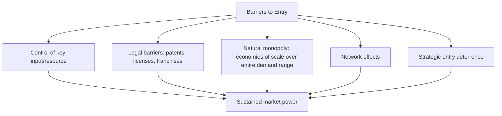

## Monopoly: Sources of Market Power and Price Discrimination

### Overview

A monopoly exists when a single firm is the sole supplier of a good with no close substitutes, giving it market power — the ability to influence price rather than simply accepting a market-determined price as given. This section covers the structural sources of that market power, the resulting output and pricing decisions, and the practice of price discrimination, whereby a monopolist charges different prices to different customers or units to capture additional surplus beyond what uniform pricing allows.

### Sources of Monopoly Power (Barriers to Entry)

Monopoly power persists only where significant **barriers to entry** prevent competitors from entering the market and eroding the incumbent's position. Common sources include:

- **Control of a key input**: exclusive ownership or control of an essential raw material or resource (e.g., historical control of bauxite deposits by Alcoa in aluminum production).
- **Legal barriers**: government-granted exclusive rights, including patents, copyrights, licenses, and franchises — deliberately created to grant temporary monopoly power (e.g., as an incentive for innovation under patent law).
- **Natural monopoly**: a market where the technology exhibits such strong economies of scale (a long-run average cost curve declining over the entire relevant range of market demand) that a single large firm can supply the market more cheaply than multiple competing firms — common in network industries like utility transmission, water distribution, and rail infrastructure.
- **Network effects**: a product's value to each user increases with the number of other users, creating strong incumbency advantages that can deter entry even without formal legal protection.
- **Predatory or strategic behavior**: incumbent actions (e.g., aggressive limit pricing, exclusive contracts) intended specifically to deter entry, distinct from cost-based natural barriers. [Inference: the legality and prevalence of such strategic entry deterrence varies by jurisdiction and is a central subject of antitrust/competition law analysis rather than a purely descriptive economic category.]

### The Monopolist's Demand and Marginal Revenue

Because the monopolist is the sole supplier, it faces the **entire downward-sloping market demand curve** directly, rather than a horizontal demand curve as under perfect competition. Selling an additional unit requires lowering the price on *all* units sold (absent price discrimination), so marginal revenue falls faster than price:

$$MR = P + Q\frac{dP}{dQ} = P\left(1 + \frac{1}{\varepsilon}\right)$$

where $\varepsilon < 0$ is the price elasticity of demand. Since $MR < P$ at every output level beyond the first unit (for a linear demand curve, $MR$ has the same vertical intercept as demand but twice the slope), the monopolist's marginal revenue curve lies strictly below its demand curve.

### Profit Maximization Under Monopoly

Applying the universal $MR = MC$ rule: the monopolist chooses the output level $Q_m$ where marginal revenue equals marginal cost, then charges the highest price the market will bear for that quantity, read off the demand curve:

$$MR(Q_m) = MC(Q_m), \qquad P_m = D(Q_m)$$

Because $MR < P$ throughout, the monopolist's profit-maximizing price exceeds marginal cost: $P_m > MC(Q_m)$ — in contrast to perfect competition, where $P = MC$ exactly.

<svg xmlns="http://www.w3.org/2000/svg" viewBox="0 0 520 400">
<text x="260" y="25" text-anchor="middle" font-size="15" font-weight="bold" fill="#222">Monopoly Profit Maximization (svg_diagram)</text>
<line x1="60" y1="350" x2="60" y2="40" stroke="#333" stroke-width="2" />
<line x1="60" y1="350" x2="470" y2="350" stroke="#333" stroke-width="2" />
<text x="475" y="355" font-size="11" fill="#333">Output (Q)</text>
<text x="30" y="40" font-size="11" fill="#333">P, MR, MC</text>
<line x1="90" y1="80" x2="440" y2="300" stroke="#2ca02c" stroke-width="2.2" />
<text x="445" y="295" font-size="10" fill="#2ca02c">D</text>
<line x1="90" y1="80" x2="270" y2="350" stroke="#1f77b4" stroke-width="2.2" />
<text x="240" y="345" font-size="10" fill="#1f77b4">MR</text>
<line x1="90" y1="330" x2="440" y2="150" stroke="#d62728" stroke-width="2.2" />
<text x="445" y="145" font-size="10" fill="#d62728">MC</text>
<circle cx="200" cy="243" r="4" fill="#000" />
<line x1="200" y1="0" x2="200" y2="350" stroke="#999" stroke-dasharray="3,2" />
<text x="205" y="365" font-size="9" fill="#000">Qm</text>
<line x1="200" y1="243" x2="290" y2="130" stroke="#999" stroke-dasharray="2,2" />
<circle cx="290" cy="130" r="4" fill="#000" />
<line x1="60" y1="130" x2="290" y2="130" stroke="#999" stroke-dasharray="3,2" />
<text x="70" y="125" font-size="9" fill="#000">Pm</text>

<text x="100" y="180" font-size="9" fill="#555">Pm &gt; MC(Qm)</text>

</svg>

### Monopoly and Deadweight Loss

Because the monopolist restricts output below the competitive (allocatively efficient) level to maintain a higher price, monopoly creates a **deadweight loss** — a reduction in total (consumer plus producer) surplus relative to the competitive outcome, representing potential mutually beneficial trades between the monopolist and additional consumers that do not occur.

- **Consumer surplus** shrinks relative to perfect competition, both from the higher price paid on units still purchased and from lost surplus on units no longer produced.
- **Producer surplus (monopoly profit)** typically rises relative to perfect competition, since the firm captures a markup over marginal cost.
- **Deadweight loss** is the triangular area representing surplus that neither party captures, arising purely from the output restriction.

### The Lerner Index: Measuring Market Power

The **Lerner Index** quantifies the degree of monopoly power by measuring the markup of price over marginal cost, relative to price:

$$L = \frac{P - MC}{P} = -\frac{1}{\varepsilon}$$

$L$ ranges from 0 (no market power, as in perfect competition where $P = MC$) to 1 (extreme market power). Firms facing more elastic demand have lower Lerner Index values (less ability to sustain a markup), while firms facing less elastic demand can sustain higher markups.

### Price Discrimination: Overview

**Price discrimination** occurs when a firm charges different prices for the same good that are not justified by differences in the cost of supplying it, allowing the firm to capture some or all of the consumer surplus that would otherwise remain with buyers under uniform (single) pricing. Price discrimination requires three conditions: the firm must have market power, must be able to identify or sort different demand segments, and must be able to prevent resale (arbitrage) between segments.

### First-Degree (Perfect) Price Discrimination

The firm charges each individual consumer exactly their maximum willingness to pay for each unit purchased.

- **Result**: the firm captures the *entire* consumer surplus as producer surplus; output expands to the perfectly competitive (allocatively efficient) level, since the firm is willing to sell any unit for which price exceeds marginal cost, no longer needing to restrict output to protect a single uniform price.
- **Deadweight loss**: eliminated — the same total surplus as perfect competition is achieved, but the *distribution* shifts entirely to the firm rather than being shared with consumers.
- [Inference: perfect first-degree discrimination is a theoretical benchmark rarely achieved exactly in practice, since it requires complete information about each individual buyer's precise willingness to pay; real-world approximations (e.g., individually negotiated contracts, personalized online pricing) are imperfect versions of this idealized case.]

### Second-Degree Price Discrimination

The firm charges different prices based on the **quantity purchased or product version selected**, rather than on the identity of the buyer directly — buyers self-select into different pricing tiers based on their own preferences.

- **Examples**: quantity discounts (bulk pricing), tiered subscription plans (basic/premium/pro), versioning of a product (e.g., a "light" vs. "full-featured" software edition) to induce self-selection.
- Consumers effectively reveal information about their willingness to pay through their choice of quantity or version, without the firm needing to directly observe or verify individual identities.

### Third-Degree Price Discrimination

The firm charges different prices to **different identifiable groups** of consumers, based on some observable characteristic correlated with willingness to pay (e.g., age, student status, geographic location, time of purchase).

**Optimal pricing rule across segments**: the firm should set marginal revenue equal to the common marginal cost in *each* segment separately:

$$MR_1(Q_1) = MR_2(Q_2) = MC$$

This implies the segment with **less elastic demand** is charged a **higher price**, and the segment with **more elastic demand** is charged a **lower price** — following directly from the relationship between markup and elasticity in the Lerner Index formula applied separately to each segment.

$$\frac{P_1 - MC}{P_1} = -\frac{1}{\varepsilon_1}, \qquad \frac{P_2 - MC}{P_2} = -\frac{1}{\varepsilon_2}$$

- **Examples**: student and senior discounts (younger/general population often has less elastic demand for some goods), international price differences for identical pharmaceuticals or software, peak vs. off-peak pricing (electricity, transportation).

<svg xmlns="http://www.w3.org/2000/svg" viewBox="0 0 500 380">
<text x="250" y="25" text-anchor="middle" font-size="14" font-weight="bold" fill="#222">Third-Degree Price Discrimination Across Segments (svg_diagram)</text>
<line x1="60" y1="160" x2="60" y2="50" stroke="#333" stroke-width="2" />
<line x1="60" y1="160" x2="230" y2="160" stroke="#333" stroke-width="2" />
<text x="100" y="45" font-size="10" fill="#333">Less elastic segment</text>
<line x1="80" y1="70" x2="220" y2="150" stroke="#2ca02c" stroke-width="1.8" />
<text x="225" y="150" font-size="9" fill="#2ca02c">D1</text>
<line x1="80" y1="70" x2="150" y2="160" stroke="#1f77b4" stroke-width="1.8" />
<line x1="60" y1="90" x2="200" y2="90" stroke="#555" stroke-width="1.3" stroke-dasharray="4,2" />
<text x="205" y="85" font-size="9" fill="#555">P1 (higher)</text>
<line x1="270" y1="160" x2="270" y2="50" stroke="#333" stroke-width="2" />
<line x1="270" y1="160" x2="460" y2="160" stroke="#333" stroke-width="2" />
<text x="320" y="45" font-size="10" fill="#333">More elastic segment</text>
<line x1="290" y1="70" x2="450" y2="155" stroke="#2ca02c" stroke-width="1.8" />
<text x="455" y="155" font-size="9" fill="#2ca02c">D2</text>
<line x1="290" y1="70" x2="410" y2="160" stroke="#1f77b4" stroke-width="1.8" />
<line x1="270" y1="130" x2="440" y2="130" stroke="#555" stroke-width="1.3" stroke-dasharray="4,2" />
<text x="445" y="125" font-size="9" fill="#555">P2 (lower)</text>

<text x="130" y="200" font-size="10" fill="#333">Same MC applies to both segments;</text>

<text x="130" y="215" font-size="10" fill="#333">MR1(Q1) = MR2(Q2) = MC</text>

</svg>

### Welfare Effects of Price Discrimination

| Type | Output vs. Uniform Monopoly Pricing | Consumer Surplus | Total Welfare / Deadweight Loss |
| --- | --- | --- | --- |
| First-degree | Expands to competitive level | Fully captured by firm (zero remaining) | DWL eliminated (efficient output, but all surplus to firm) |
| Second-degree | Typically expands somewhat | Partially captured, varies by tier | DWL typically reduced relative to uniform pricing |
| Third-degree | Ambiguous overall (depends on segment elasticities) | Redistributed across segments; some segments better off, some worse off | Ambiguous — can increase *or* decrease total welfare depending on whether the practice enables serving segments that would otherwise be priced out entirely |

[Inference: the welfare ambiguity of third-degree price discrimination is a genuinely unresolved general result rather than a simplification — whether it raises or lowers total surplus relative to uniform pricing depends on the specific shapes of demand in each segment, and standard textbook treatments present conditions under which output must expand (a necessary, though not sufficient, condition for welfare improvement) rather than asserting a universal direction of effect.]

### Requirements for Successful Price Discrimination

For any form of price discrimination to be sustainable, three conditions must generally hold:

1. **Market power**: the firm must face a downward-sloping demand curve (some degree of monopoly power), not be a price taker.
2. **Ability to identify or segment demand**: the firm must be able to distinguish buyers by willingness to pay, either directly (observable characteristics) or indirectly (self-selection via quantity/version choice).
3. **Prevention of resale (no arbitrage)**: buyers who pay the lower price must be unable to resell to buyers who would otherwise pay the higher price — otherwise, resale would undermine the price differential and collapse the discrimination scheme toward a single effective price.

### Common Pitfalls

- Assuming monopoly power automatically implies price discrimination is occurring — market power is a *necessary* condition for price discrimination, but a monopolist may still charge a single uniform price if segmentation or resale-prevention conditions are not met.
- Confusing price differences that reflect genuine **cost differences** (e.g., higher shipping cost to a remote location) with true price discrimination, which specifically refers to price differences *not* justified by cost differences.
- Assuming third-degree price discrimination always increases the discriminating firm's profit relative to uniform pricing — while this is generally true for a firm optimizing correctly across segments, it assumes accurate segmentation is achievable at low enough cost that the gains from discrimination are not offset by implementation and enforcement costs.
- Treating deadweight loss as inevitable under any monopoly outcome — first-degree price discrimination specifically eliminates deadweight loss (though it redistributes all surplus to the firm), illustrating that deadweight loss stems from output restriction under *uniform* pricing, not monopoly power per se.

### Related Topics

- Perfect competition: assumptions and equilibrium
- Profit maximization: marginal revenue equals marginal cost
- Natural monopoly and regulation
- Consumer and producer surplus
- Price elasticity of demand
- Antitrust and competition policy
- Monopolistic competition and oligopoly