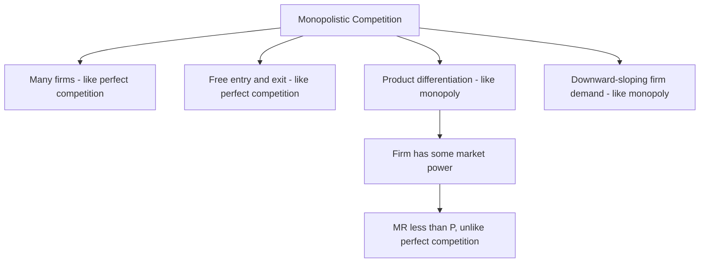
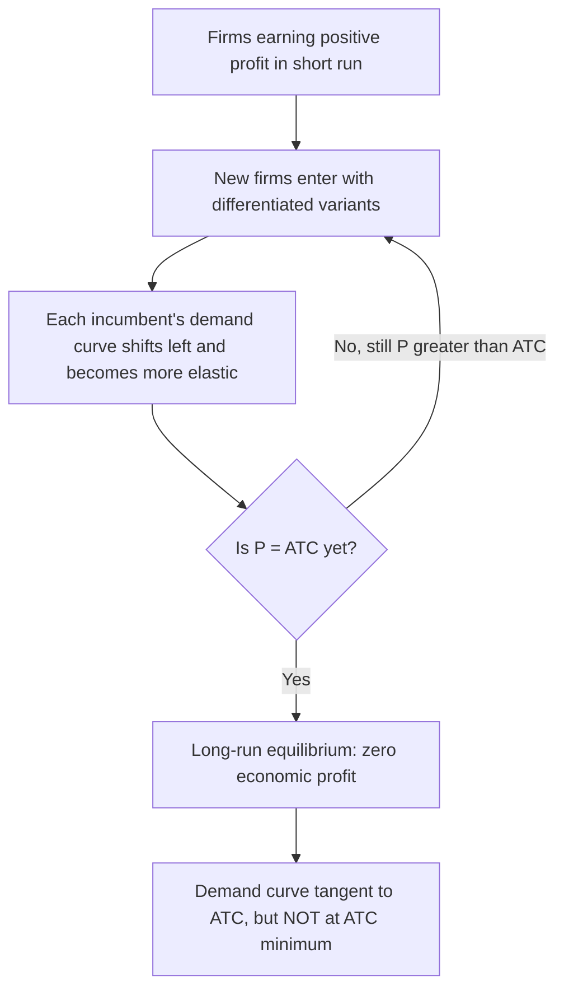

## Monopolistic Competition and Product Differentiation

### Overview

Monopolistic competition is a market structure that blends elements of perfect competition and monopoly: like perfect competition, it features many firms and free entry/exit; like monopoly, each individual firm faces a downward-sloping demand curve and possesses some degree of market power, arising from **product differentiation** rather than being the sole supplier. This structure describes a wide range of real-world markets — restaurants, retail clothing, personal care products, and many consumer goods — where firms compete on variety, branding, and perceived quality rather than solely on price.

### Defining Characteristics

- **Many firms**: a relatively large number of sellers, though typically fewer than the idealized "many" of perfect competition.
- **Product differentiation**: each firm's product is a close, but imperfect, substitute for competitors' products — differentiated by real or perceived characteristics such as brand, location, quality, or design.
- **Free entry and exit**: no significant long-run barriers prevent new firms from entering the market or existing firms from leaving, similar to perfect competition.
- **Downward-sloping firm demand curve**: because products are differentiated, each firm has some ability to raise price without losing all customers — its demand curve is more elastic than a monopolist's (due to close substitutes from competitors) but not perfectly elastic (unlike perfect competition).
- **Non-price competition**: firms actively compete through advertising, branding, product quality, and variety, in addition to (or sometimes instead of) price.

### Short-Run Equilibrium

In the short run, a monopolistically competitive firm behaves like a small-scale monopolist over its own differentiated product: it faces a downward-sloping demand curve and a corresponding marginal revenue curve below it, applying the universal profit-maximization rule:

$$MR = MC$$

The firm sets price by reading off its demand curve at the profit-maximizing quantity: $P = D(Q^*)$, where $P > MR = MC$, mirroring the monopoly pricing structure at the level of the individual firm.

- If $P > ATC$ at this output: the firm earns **positive economic profit** in the short run.
- If $P < ATC$: the firm earns a **short-run loss**, though it continues to produce so long as $P \geq AVC$ (identical shutdown logic to other market structures).

<svg xmlns="http://www.w3.org/2000/svg" viewBox="0 0 520 400">
<text x="260" y="25" text-anchor="middle" font-size="15" font-weight="bold" fill="#222">Short-Run Equilibrium: Monopolistic Competition (svg_diagram)</text>
<line x1="60" y1="350" x2="60" y2="40" stroke="#333" stroke-width="2" />
<line x1="60" y1="350" x2="470" y2="350" stroke="#333" stroke-width="2" />
<text x="475" y="355" font-size="11" fill="#333">Output (Q)</text>
<text x="30" y="40" font-size="11" fill="#333">P, MR, Cost</text>
<line x1="90" y1="90" x2="440" y2="290" stroke="#2ca02c" stroke-width="2.2" />
<text x="445" y="285" font-size="10" fill="#2ca02c">D (firm demand)</text>
<line x1="90" y1="90" x2="290" y2="350" stroke="#1f77b4" stroke-width="2.2" />
<text x="270" y="345" font-size="10" fill="#1f77b4">MR</text>
<path d="M 100,300 C 170,200 240,160 310,170 C 380,180 430,240 460,300" fill="none" stroke="#1f77b4" stroke-width="2" opacity="0.6" />
<text x="400" y="230" font-size="9" fill="#1f77b4" opacity="0.8">ATC</text>
<line x1="90" y1="320" x2="440" y2="140" stroke="#d62728" stroke-width="2.2" />
<text x="445" y="135" font-size="10" fill="#d62728">MC</text>
<circle cx="220" cy="225" r="4" fill="#000" />
<line x1="220" y1="0" x2="220" y2="350" stroke="#999" stroke-dasharray="3,2" />
<text x="225" y="365" font-size="9" fill="#000">Q*</text>
<circle cx="290" cy="160" r="4" fill="#000" />
<line x1="60" y1="160" x2="290" y2="160" stroke="#999" stroke-dasharray="3,2" />
<text x="65" y="155" font-size="9" fill="#000">P</text>
</svg>

### Long-Run Equilibrium: The Zero-Profit Adjustment

The presence of **free entry and exit** — a shared feature with perfect competition — drives the industry toward zero economic profit in the long run, but through a different mechanism than the pure price adjustment seen in perfect competition:

- If firms are earning **positive economic profit**, new firms enter, offering their own differentiated variants. This does not change the market price directly (since products are differentiated), but it **shifts each incumbent firm's demand curve leftward and makes it more elastic**, as the total market is now divided among a larger number of competing varieties, and consumers have more substitute options.
- This process continues until each firm's demand curve has shifted enough that price equals average total cost exactly — **zero economic profit** is reached.

**Long-run equilibrium condition**:

$$P = ATC \quad \text{at the profit-maximizing } Q^*, \text{ where } MR = MC$$

Critically, unlike perfect competition, this **does not** occur at the minimum point of the $ATC$ curve — because the firm's demand curve remains downward sloping (not horizontal) even in long-run equilibrium, the tangency between demand and $ATC$ necessarily occurs to the **left** of $ATC$'s minimum.

<svg xmlns="http://www.w3.org/2000/svg" viewBox="0 0 520 400">
<text x="260" y="25" text-anchor="middle" font-size="15" font-weight="bold" fill="#222">Long-Run Equilibrium: Tangency, Not Minimum ATC (svg_diagram)</text>
<line x1="60" y1="350" x2="60" y2="40" stroke="#333" stroke-width="2" />
<line x1="60" y1="350" x2="470" y2="350" stroke="#333" stroke-width="2" />
<text x="475" y="355" font-size="11" fill="#333">Output (Q)</text>
<text x="30" y="40" font-size="11" fill="#333">P, Cost</text>
<path d="M 100,300 C 170,190 240,150 300,155 C 370,162 420,220 450,300" fill="none" stroke="#1f77b4" stroke-width="2.2" />
<text x="380" y="150" font-size="10" fill="#1f77b4">ATC</text>
<line x1="150" y1="120" x2="380" y2="270" stroke="#2ca02c" stroke-width="2.2" />
<text x="385" y="265" font-size="10" fill="#2ca02c">D (long-run, flatter/shifted)</text>
<line x1="150" y1="120" x2="300" y2="350" stroke="#999" stroke-width="1.8" stroke-dasharray="4,2" />
<text x="280" y="345" font-size="9" fill="#999">MR</text>
<circle cx="230" cy="200" r="5" fill="#d62728" />
<text x="238" y="195" font-size="10" fill="#d62728">Tangency: P = ATC here</text>
<circle cx="300" cy="155" r="4" fill="#000" />
<line x1="300" y1="0" x2="300" y2="350" stroke="#999" stroke-dasharray="2,2" />
<text x="305" y="365" font-size="9" fill="#000">min(ATC) at larger Q</text>

<text x="150" y="380" font-size="10" fill="#555">Excess capacity = gap between Q* and Q at min(ATC)</text>

</svg>

### Excess Capacity

Because the long-run tangency between demand and $ATC$ occurs to the left of $ATC$'s minimum, monopolistically competitive firms in long-run equilibrium operate with **excess capacity**: they produce less output than the quantity that would minimize their average cost, meaning the industry supports more firms, each operating below their most cost-efficient scale, than would be needed if firms produced at minimum $ATC$.

- This is often cited as the primary **inefficiency** associated with monopolistic competition relative to perfect competition: consumers pay a price above marginal cost ($P > MC$, since the firm still sets $MR = MC$ with $MR < P$), and total industry output is produced at a higher average cost than technically necessary.
- **Counterargument**: excess capacity and the resulting proliferation of differentiated varieties may itself be valuable to consumers, who benefit from greater product variety and choice — a trade-off between productive efficiency and the value of variety that is central to normative evaluation of this market structure. [Inference: whether the variety benefit outweighs the productive-efficiency cost is a value judgment and an empirical question specific to each market, not something standard theory resolves definitively.]

### Non-Price Competition and Product Differentiation

Because firms cannot compete purely on price without eroding their differentiated position, monopolistically competitive firms typically invest heavily in:

- **Advertising and branding**: building perceived differentiation and brand loyalty, which can make the firm's own demand curve less elastic (allowing a higher sustainable markup) even absent any change in the physical product itself.
- **Product quality and design variation**: differentiating on tangible attributes (ingredients, materials, features) as well as intangible ones (styling, packaging, reputation).
- **Location and convenience**: particularly relevant in retail and service settings, where geographic proximity itself constitutes a form of product differentiation (a customer's nearest coffee shop is not a perfect substitute for one across town, even if the product itself is identical).

**Types of product differentiation**:

- **Horizontal differentiation**: products differ in characteristics that different consumers value differently, with no single objectively "better" version (e.g., flavor variety, color options) — not all consumers agree on which variant is preferred.
- **Vertical differentiation**: products differ in a quality dimension that (holding price equal) all consumers would agree is objectively better (e.g., higher durability, better materials) — differentiation here is about a quality ranking rather than diverse taste.

### Comparison Across Market Structures

| Feature | Perfect Competition | Monopolistic Competition | Monopoly |
| --- | --- | --- | --- |
| Number of firms | Many | Many | One |
| Product | Homogeneous | Differentiated | Unique (no close substitute) |
| Firm demand curve | Perfectly elastic (horizontal) | Downward sloping, relatively elastic | Downward sloping, entire market demand |
| Long-run economic profit | Zero | Zero | Can be positive (sustained by barriers to entry) |
| $P$ vs. $MC$ | $P = MC$ | $P > MC$ | $P > MC$ |
| Long-run productive efficiency | Yes (produces at min ATC) | No (excess capacity, above min ATC) | No |
| Entry barriers | None | None | Significant |

### Applications

- **Retail and consumer goods markets**: restaurants, clothing brands, and personal care products are commonly cited illustrative examples, where differentiation arises from taste, styling, branding, or location rather than any fundamental production-cost difference. [Inference: these are illustrative textbook categories rather than industries formally certified as satisfying every monopolistic-competition assumption precisely; real markets vary in the degree of true free entry and the extent of genuine versus purely perceived differentiation.]
- **Advertising intensity as a market-structure signal**: industries with higher rates of advertising spending relative to sales are often associated with monopolistically competitive dynamics, since advertising is a primary tool for sustaining perceived product differentiation.
- **Antitrust and consumer-protection considerations**: regulators sometimes scrutinize whether advertising claims in differentiated markets are substantively accurate versus purely image-based, since the welfare case for product differentiation rests partly on whether it reflects genuine value to consumers.

### Common Pitfalls

- Assuming monopolistic competition converges to the same efficient long-run outcome as perfect competition simply because both feature free entry — the persistence of a downward-sloping firm demand curve (from product differentiation) means $P > MC$ and excess capacity remain even after entry drives profit to zero.
- Confusing zero long-run economic profit with "no market power" — a monopolistically competitive firm retains genuine pricing power (a downward-sloping demand curve) even while earning zero economic profit; the two concepts (market power and profit level) are distinct.
- Treating excess capacity as an unambiguous welfare loss without considering the offsetting value of product variety to consumers — the standard efficiency comparison to perfect competition captures the cost side clearly, but the variety benefit is a separate, harder-to-quantify consideration.
- Assuming all forms of product differentiation are horizontal (taste-based) — vertical (quality-based) differentiation follows different competitive dynamics, since all consumers agree on the quality ranking, which can affect market segmentation and pricing patterns differently than pure horizontal variety-seeking.

### Related Topics

- Perfect competition: assumptions and equilibrium
- Monopoly: sources of market power and price discrimination
- Profit maximization: marginal revenue equals marginal cost
- Oligopoly and strategic interaction
- Advertising and non-price competition
- Product differentiation: horizontal vs. vertical models (e.g., Hotelling)