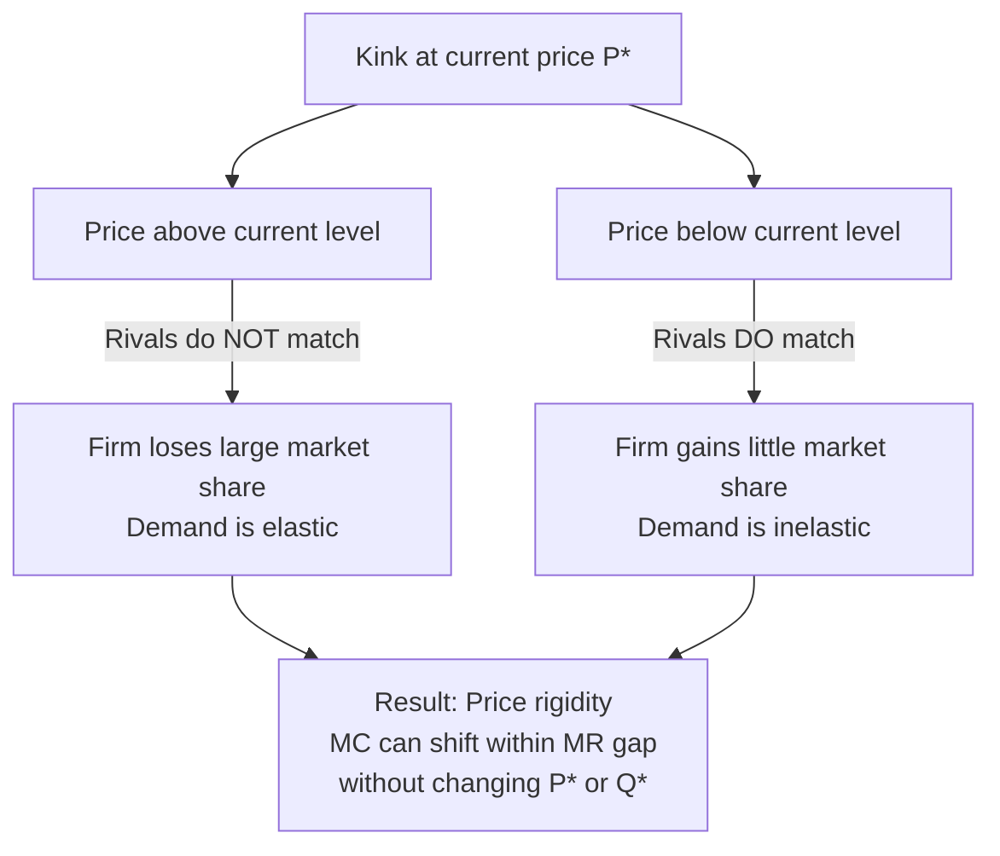
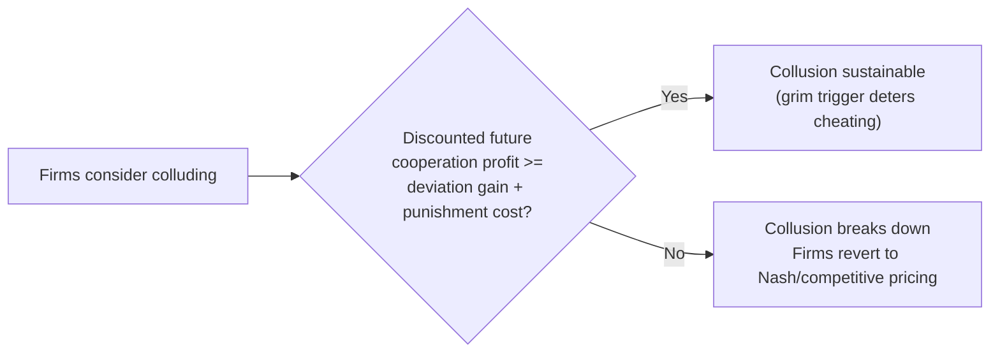

## Oligopoly: Interdependence and Collusion

### Definition and Core Characteristics

An oligopoly is a market structure characterized by a small number of large firms that dominate an industry, such that the actions of any single firm materially affect the profits and strategic decisions of its rivals. This is distinct from perfect competition and monopolistic competition, where individual firms are price takers or face negligible strategic feedback from any one competitor.

**Key Points**

- Few sellers, many buyers: typically ranging from a handful of firms (duopoly being the extreme case of two) up to a dozen or so significant players
- Strategic interdependence: each firm's optimal decision on price, output, or advertising depends explicitly on the anticipated reactions of rivals
- Significant barriers to entry: economies of scale, high capital requirements, control of essential inputs, patents, network effects, or regulatory licensing
- Products may be homogeneous (e.g., steel, cement, crude oil) or differentiated (e.g., automobiles, smartphones, airlines)
- Non-price competition is common: advertising, branding, product differentiation, and quality competition often substitute for price competition
- Market concentration is typically measured using the Concentration Ratio (CR4, CR8) or the Herfindahl-Hirschman Index (HHI)

### Measuring Market Concentration

The Herfindahl-Hirschman Index is the standard quantitative tool for assessing oligopolistic concentration:

$$HHI = \sum_{i=1}^{n} s_i^2$$

where $s_i$ is the market share (expressed as a whole number, e.g., 25 for 25%) of firm $i$, and $n$ is the number of firms in the market.

- HHI below 1500: considered a competitive/unconcentrated market
- HHI between 1500 and 2500: moderately concentrated
- HHI above 2500: highly concentrated, and characteristic of oligopoly

The four-firm concentration ratio is simpler:

$$CR_4 = \sum_{i=1}^{4} s_i$$

A $CR_4$ above roughly 60% is commonly used as an informal threshold suggesting oligopolistic structure, though this varies by industry and regulatory jurisdiction.

**Example**

Consider an industry with five firms holding market shares of 30%, 25%, 20%, 15%, and 10%.

$$HHI = 30^2 + 25^2 + 20^2 + 15^2 + 10^2 = 900 + 625 + 400 + 225 + 100 = 2250$$

This HHI of 2250 falls in the moderately-to-highly concentrated range, consistent with an oligopoly.

### Strategic Interdependence

The defining feature of oligopoly is that firms cannot make decisions in isolation. Because there are only a few players, a price cut, output expansion, or new product launch by Firm A will noticeably shift demand away from Firm B and Firm C, provoking a response. This mutual awareness distinguishes oligopoly analytically from every other market structure and is why game theory, rather than simple marginal-cost pricing, is the primary analytical tool.

#### The Kinked Demand Curve Model

One classical model explaining price rigidity in oligopoly is Paul Sweezy's kinked demand curve.

**Key Points**

- Assumption: if a firm raises its price above the current level, rivals will not follow, so the firm loses substantial market share (demand is elastic above the kink)
- Assumption: if a firm lowers its price, rivals will match the cut to avoid losing customers, so the firm gains little market share (demand is inelastic below the kink)
- This asymmetric reaction produces a demand curve with a kink at the current price, and consequently a discontinuous (vertical gap in the) marginal revenue curve
- Because the MR curve has a gap, marginal cost can shift within that gap without changing the profit-maximizing price or quantity, explaining observed price stability in oligopolistic markets despite fluctuating costs



[Inference] The kinked demand curve is widely taught as a descriptive explanation for observed price stickiness, but it does not explain how the initial price P* was arrived at, and empirical support for the discontinuity itself is mixed; it is best understood as a heuristic model rather than a fully derived equilibrium concept.

### Game Theory Foundations

Since firms in oligopoly must anticipate rivals' reactions, game theory provides the formal apparatus for analyzing outcomes.

#### Nash Equilibrium

A Nash equilibrium in an oligopoly context is a set of strategies (prices, quantities) such that no firm can improve its payoff by unilaterally deviating, given the strategies chosen by all other firms.

**Example: The Prisoner's Dilemma of Collusion**

Two firms (A and B) can each choose to charge a High price (implicitly colluding) or a Low price (competing/cheating). Payoffs represent profits in millions.

|  | B: High Price | B: Low Price |
| --- | --- | --- |
| **A: High Price** | A gets 10, B gets 10 | A gets 2, B gets 12 |
| **A: Low Price** | A gets 12, B gets 2 | A gets 5, B gets 5 |

- If both cooperate (High, High), joint profit is maximized (10, 10)
- Each firm individually has an incentive to defect to Low price, since 12 > 10 regardless of what the rival does
- The dominant strategy for both is Low price, yielding the Nash equilibrium (5, 5) — a jointly inferior outcome compared to (10, 10)
- This illustrates why tacit or explicit collusion is inherently unstable without an enforcement mechanism

#### Cournot Competition (Quantity Competition)

In the Cournot model, firms simultaneously choose output quantities, taking rivals' output as given, and the market price is determined by total industry supply.

For $n$ symmetric firms facing linear demand $P = a - b(Q)$, where $Q = \sum q_i$, and constant marginal cost $c$, each firm's best-response function is derived by maximizing:

$$\pi_i = q_i \left[a - b\left(q_i + \sum_{j \neq i} q_j\right) - c\right]$$

Solving the resulting first-order conditions symmetrically gives each firm's equilibrium output:

$$q_i^* = \frac{a - c}{b(n+1)}$$

**Key Points**

- As $n \to \infty$, the Cournot equilibrium output converges to the perfectly competitive output level, and price converges to marginal cost
- With $n = 1$ (monopoly), the formula collapses to the standard monopoly quantity
- With $n = 2$ (duopoly), each firm produces one-third of the "competitive" quantity gap, and combined output is two-thirds of the competitive level — output is between the monopoly and competitive outcomes

#### Bertrand Competition (Price Competition)

In the Bertrand model, firms compete by simultaneously setting prices rather than quantities, with homogeneous products and consumers buying entirely from the lowest-price seller.

[Inference/Standard Result] Under standard Bertrand assumptions (homogeneous goods, constant and identical marginal cost, no capacity constraints), the Nash equilibrium results in price being driven down to marginal cost ($P = MC$) even with only two firms — a result known as the "Bertrand paradox," since it implies competitive outcomes despite an oligopolistic number of sellers. This paradox is typically resolved in real-world analysis by relaxing one or more assumptions: introducing product differentiation, capacity constraints, or repeated interaction.

#### Stackelberg Model (Sequential Leadership)

In the Stackelberg model, one firm (the leader) commits to an output level first, and the follower observes this and chooses its best response. The leader internalizes the follower's reaction function when optimizing, generally producing a larger output and earning higher profit than under simultaneous Cournot competition, while the follower produces less.

```mermaid
sequenceDiagram
    participant L as Leader Firm
    participant F as Follower Firm
    L->>L: Commits to output q_L first
    L->>F: Output decision is observed
    F->>F: Chooses best response q_F given q_L
    Note over L,F: Leader earns higher profit than Cournot;<br/>Follower earns lower profit than Cournot
```

### Collusion

Collusion occurs when oligopolists coordinate their pricing, output, or market-division decisions to jointly maximize profits, effectively behaving as a single monopolist.

#### Explicit Collusion and Cartels

**Key Points**

- A cartel is a formal agreement among firms to fix prices, restrict output, or divide markets/territories
- The goal is to replicate the monopoly outcome: restrict joint output to the level where industry marginal revenue equals marginal cost, and set the monopoly price
- Cartels are illegal under antitrust/competition law in most jurisdictions (e.g., Section 1 of the Sherman Act in the United States, Article 101 of the Treaty on the Functioning of the European Union)
- OPEC (Organization of the Petroleum Exporting Countries) is the most commonly cited real-world example of a quasi-cartel, though it operates as an international body of sovereign states and is not directly subject to domestic antitrust enforcement in the same way private firms are

**Instability of Cartels**

Cartels face inherent structural incentives to break down:

- Each member has an incentive to "cheat" by secretly producing beyond its quota, since at the cartel price, marginal revenue for the individual defecting firm exceeds marginal cost
- The larger the number of cartel members, the harder monitoring and enforcement become, and the stronger the incentive to defect
- New entrants attracted by supra-competitive profits can undermine the cartel's market share (unless entry barriers are very high)
- Demand or cost asymmetries among members create disagreement over quota allocation

#### Tacit Collusion

Tacit collusion refers to coordinated pricing or output behavior achieved without any explicit communication or formal agreement, often sustained through repeated interaction and mutual understanding of retaliation strategies.

**Key Points**

- Price leadership: a dominant firm sets a price and smaller firms follow, without any direct agreement
- Focal point pricing: firms independently gravitate toward a commonly understood reference price (e.g., round numbers, published list prices)
- Because there is no explicit agreement, tacit collusion is generally much harder to prosecute under competition law than explicit cartels, though certain "facilitating practices" (e.g., advance price announcements, information-sharing on costs) can attract regulatory scrutiny

#### Sustaining Collusion: Repeated Games and the Folk Theorem

Collusion that is unstable in a single-period (one-shot) game can become sustainable when firms interact repeatedly, because the threat of future punishment can outweigh the short-term gain from cheating.

**Trigger Strategies**

- **Grim Trigger**: a firm cooperates as long as rivals cooperate, but reverts permanently to the competitive (Nash) price forever after any observed defection
- **Tit-for-Tat**: a firm mirrors the rival's previous-period action — cooperating if the rival cooperated last period, defecting if the rival defected

Collusion is sustainable under a grim trigger strategy when the discounted value of future cooperation profits exceeds the one-time gain from defecting plus the discounted value of future punishment (competitive) profits:

$$\frac{\pi^{collude}}{1-\delta} \geq \pi^{deviate} + \frac{\delta \cdot \pi^{compete}}{1-\delta}$$

where $\delta$ is the discount factor (reflecting patience and the probability the game continues) and $\pi^{collude} > \pi^{compete}$, and typically $\pi^{deviate} > \pi^{collude}$ (the one-period temptation to cheat).

**Key Points**

- Higher discount factors (more patient firms, or higher probability of future interaction) make collusion easier to sustain
- Factors that facilitate collusion: few firms, homogeneous products, frequent/repeated interactions, symmetric costs and market shares, high market transparency (easy to detect cheating), and stable demand
- Factors that undermine collusion: many firms, product heterogeneity, infrequent interaction, cost asymmetries, low transparency (difficult to detect defection), and volatile or growing demand (increases temptation to grab market share)



### Non-Price Competition and Barriers to Entry

Because direct price competition risks provoking a costly price war, oligopolists frequently compete on non-price dimensions.

**Key Points**

- Advertising and branding to build product differentiation and consumer loyalty, reducing the cross-price elasticity between rivals' products
- Product innovation and quality improvements (e.g., feature races in the smartphone or automobile industries)
- Loyalty programs, warranties, and after-sales service
- Limit pricing: incumbents may deliberately price below the short-run profit-maximizing level to deter entry by signaling low costs or by making entry unprofitable given expected post-entry competition
- Predatory pricing: temporarily pricing below cost to drive out a competitor or new entrant, with the intent of raising prices once the rival exits — illegal in most jurisdictions when proven, though difficult to establish in practice because it can resemble legitimate competitive pricing

### Regulation and Antitrust Policy

Because oligopoly can produce outcomes ranging from near-competitive to near-monopolistic depending on the degree of collusion, competition authorities monitor these markets closely.

**Key Points**

- Merger review: authorities (e.g., the U.S. Federal Trade Commission and Department of Justice, or the European Commission) evaluate proposed mergers partly using projected changes in HHI; a merger that increases HHI significantly in an already concentrated market is more likely to draw scrutiny
- Leniency/whistleblower programs: many jurisdictions offer reduced penalties to cartel members who self-report, exploiting the inherent instability of collusive agreements
- Behavioral remedies vs. structural remedies: regulators may impose conduct restrictions (e.g., banning certain pricing practices) or require divestitures to reduce concentration
- [Unverified] The specific numerical thresholds and enforcement priorities vary across jurisdictions and are periodically revised, so any cited figures should be checked against current regulatory guidelines in the relevant country.

### Diagram: Oligopoly Market Structure Overview (svg_diagram)

<svg xmlns="http://www.w3.org/2000/svg" viewBox="0 0 800 480">
<text x="400" y="30" text-anchor="middle" font-size="18" font-weight="bold" fill="#1a1a1a">Oligopoly: Interdependence and Collusion (svg_diagram)</text>
<rect x="30" y="60" width="220" height="100" rx="8" fill="#e8f0fe" stroke="#4472c4" stroke-width="2" />
<text x="140" y="85" text-anchor="middle" font-size="13" font-weight="bold" fill="#1a1a1a">Few Firms</text>
<text x="140" y="105" text-anchor="middle" font-size="11" fill="#333">High HHI / CR4</text>
<text x="140" y="122" text-anchor="middle" font-size="11" fill="#333">Barriers to entry</text>
<text x="140" y="139" text-anchor="middle" font-size="11" fill="#333">Homogeneous or</text>
<text x="140" y="154" text-anchor="middle" font-size="11" fill="#333">differentiated goods</text>
<rect x="290" y="60" width="220" height="100" rx="8" fill="#fdf2e3" stroke="#d68910" stroke-width="2" />
<text x="400" y="85" text-anchor="middle" font-size="13" font-weight="bold" fill="#1a1a1a">Strategic</text>
<text x="400" y="102" text-anchor="middle" font-size="13" font-weight="bold" fill="#1a1a1a">Interdependence</text>
<text x="400" y="122" text-anchor="middle" font-size="11" fill="#333">Cournot (quantity)</text>
<text x="400" y="139" text-anchor="middle" font-size="11" fill="#333">Bertrand (price)</text>
<text x="400" y="154" text-anchor="middle" font-size="11" fill="#333">Stackelberg (leader-follower)</text>
<rect x="550" y="60" width="220" height="100" rx="8" fill="#eafaf1" stroke="#27ae60" stroke-width="2" />
<text x="660" y="85" text-anchor="middle" font-size="13" font-weight="bold" fill="#1a1a1a">Non-Price</text>
<text x="660" y="102" text-anchor="middle" font-size="13" font-weight="bold" fill="#1a1a1a">Competition</text>
<text x="660" y="122" text-anchor="middle" font-size="11" fill="#333">Advertising / branding</text>
<text x="660" y="139" text-anchor="middle" font-size="11" fill="#333">Product innovation</text>
<text x="660" y="154" text-anchor="middle" font-size="11" fill="#333">Limit pricing</text>
<line x1="140" y1="160" x2="140" y2="200" stroke="#666" stroke-width="1.5" marker-end="url(#arrow)" />
<line x1="400" y1="160" x2="400" y2="200" stroke="#666" stroke-width="1.5" marker-end="url(#arrow)" />
<line x1="660" y1="160" x2="660" y2="200" stroke="#666" stroke-width="1.5" marker-end="url(#arrow)" />
<rect x="150" y="210" width="500" height="90" rx="8" fill="#f4ecf7" stroke="#8e44ad" stroke-width="2" />
<text x="400" y="235" text-anchor="middle" font-size="14" font-weight="bold" fill="#1a1a1a">Collusion Decision</text>
<text x="400" y="257" text-anchor="middle" font-size="11" fill="#333">Joint profit maximization vs. individual incentive to cheat</text>
<text x="400" y="275" text-anchor="middle" font-size="11" fill="#333">Sustained via repeated interaction, trigger strategies, discount factor δ</text>
<text x="400" y="292" text-anchor="middle" font-size="11" fill="#333">(Prisoner's Dilemma structure)</text>
<line x1="270" y1="300" x2="180" y2="340" stroke="#666" stroke-width="1.5" marker-end="url(#arrow)" />
<line x1="530" y1="300" x2="620" y2="340" stroke="#666" stroke-width="1.5" marker-end="url(#arrow)" />
<rect x="60" y="350" width="240" height="90" rx="8" fill="#fdecea" stroke="#c0392b" stroke-width="2" />
<text x="180" y="375" text-anchor="middle" font-size="13" font-weight="bold" fill="#1a1a1a">Explicit Collusion</text>
<text x="180" y="395" text-anchor="middle" font-size="11" fill="#333">Formal cartel agreement</text>
<text x="180" y="412" text-anchor="middle" font-size="11" fill="#333">Illegal under antitrust law</text>
<text x="180" y="429" text-anchor="middle" font-size="11" fill="#333">(e.g., Sherman Act, EU Art. 101)</text>
<rect x="500" y="350" width="240" height="90" rx="8" fill="#eaf2f8" stroke="#2980b9" stroke-width="2" />
<text x="620" y="375" text-anchor="middle" font-size="13" font-weight="bold" fill="#1a1a1a">Tacit Collusion</text>
<text x="620" y="395" text-anchor="middle" font-size="11" fill="#333">Price leadership</text>
<text x="620" y="412" text-anchor="middle" font-size="11" fill="#333">Focal point pricing</text>
<text x="620" y="429" text-anchor="middle" font-size="11" fill="#333">Harder to prosecute legally</text>
</svg>

### Real-World Examples

**Example**

- **OPEC (petroleum)**: attempts to set production quotas among member nations to influence global oil prices, illustrating both the potential price impact of coordinated output restriction and the recurring problem of quota-cheating by individual members
- **Commercial aviation**: a small number of major carriers on many routes, exhibiting price leadership behavior and intense non-price competition (loyalty programs, scheduling, service quality)
- **Smartphone manufacturing**: dominated by a handful of major firms competing heavily on innovation, branding, and ecosystem lock-in rather than primarily on price
- **Retail grocery chains**: in many national markets, a handful of large chains hold the majority of market share, with behavior consistent with tacit price leadership on staple goods

[Inference] The degree to which any specific real-world industry behaves according to Cournot, Bertrand, or collusive models depends on institutional detail (capacity constraints, contract structures, regulatory environment) that varies by country and time period; treat the examples above as illustrative of general oligopoly dynamics rather than as precise empirical characterizations.

**Related Topics**

- Monopolistic competition (contrast with oligopoly's smaller firm count and greater interdependence)
- Monopoly and monopoly pricing (the benchmark outcome collusion attempts to replicate)
- Antitrust and competition policy in depth (merger guidelines, per se vs. rule-of-reason analysis)
- Game theory: mixed strategies, repeated games, and the Folk Theorem in greater formal depth
- Price discrimination strategies as applied within oligopolistic industries
- Contestable markets theory (how potential entry can discipline oligopolists even absent actual competitors)
- Network effects and their role in reinforcing oligopoly/duopoly structures in digital markets