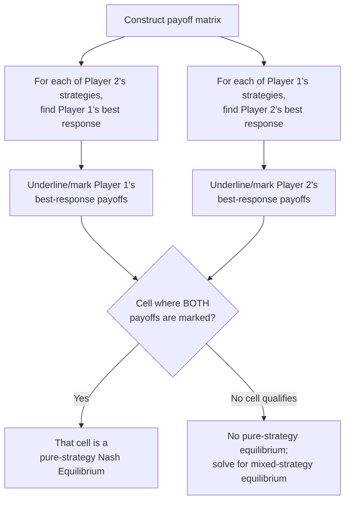
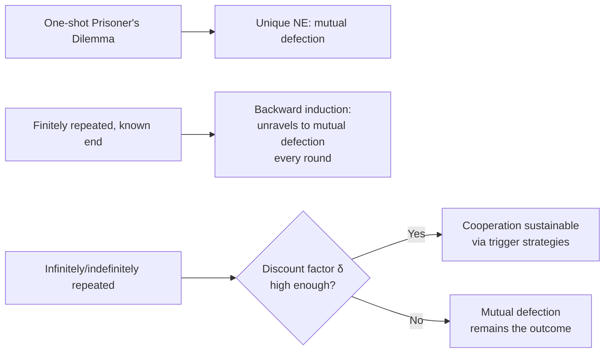

## Game Theory: Nash Equilibrium and the Prisoner's Dilemma

### Definition and Scope

Game theory is the formal analysis of strategic decision-making among rational agents ("players") whose payoffs depend not only on their own actions but on the actions of others. In economics, it provides the primary analytical toolkit for markets where firms are few enough that each one's decisions materially affect its rivals — most notably oligopoly — as well as for auctions, bargaining, public goods provision, and contract design.

**Key Points**

- A game is formally defined by three components: the set of **players**, the set of available **strategies** (actions) for each player, and the **payoff function** mapping every combination of strategies to a numerical payoff (typically profit or utility) for each player
- Games can be classified along several dimensions: simultaneous vs. sequential (do players move at the same time or in turn), one-shot vs. repeated (does the interaction happen once or multiple times), and cooperative vs. non-cooperative (can players make binding agreements)
- The solution concept most central to non-cooperative game theory is the Nash equilibrium

### Nash Equilibrium

#### Formal Definition

A Nash equilibrium is a set of strategies, one for each player, such that no player can improve their own payoff by unilaterally changing their strategy, given the strategies chosen by all other players.

Formally, for players $i = 1, \dots, n$ with strategy sets $S_i$ and payoff functions $u_i$, a strategy profile $(s_1^*, s_2^*, \dots, s_n^*)$ is a Nash equilibrium if for every player $i$:

$$u_i(s_i^*, s_{-i}^*) \geq u_i(s_i, s_{-i}^*) \quad \text{for all } s_i \in S_i$$

where $s_{-i}^*$ denotes the equilibrium strategies of all players other than $i$.

**Key Points**

- Nash equilibrium is a "best response to best responses" — it is a mutually consistent set of strategies, not necessarily the best possible outcome for the players jointly
- A game may have zero, one, or multiple Nash equilibria in pure strategies
- Every finite game (finite players, finite strategies) has at least one Nash equilibrium, provided mixed strategies (probabilistic randomization over pure strategies) are allowed — this existence result was proven by John Nash in 1950
- A Nash equilibrium need not be Pareto efficient; the Prisoner's Dilemma is the canonical illustration of this gap

#### Finding Nash Equilibria: Method

The standard method for identifying pure-strategy Nash equilibria in a normal-form (matrix) game is to identify each player's **best response** to every possible strategy of the other player(s), then find the cell(s) where both players' choices are simultaneous best responses to each other.

### The Prisoner's Dilemma

The Prisoner's Dilemma is the most famous game in economics and social science, illustrating how individually rational decisions can produce a collectively worse outcome than mutual cooperation would.

#### Classic Setup

Two suspects are arrested and interrogated separately. Each can either **Confess** (betray the other) or **Stay Silent** (cooperate with the other). Payoffs are expressed as years in prison (lower is better for the player).

|  | Suspect B: Silent | Suspect B: Confess |
| --- | --- | --- |
| **Suspect A: Silent** | A: 1 yr, B: 1 yr | A: 10 yrs, B: 0 yrs |
| **Suspect A: Confess** | A: 0 yrs, B: 10 yrs | A: 5 yrs, B: 5 yrs |

**Key Points**

- If both stay silent, both receive a light sentence (1 year each) — the jointly best outcome
- If one confesses while the other stays silent, the confessor goes free while the silent suspect receives the harshest sentence (10 years) — this asymmetry creates the temptation to defect
- If both confess, both receive a moderate sentence (5 years each) — worse for both than mutual silence, but this is the Nash equilibrium
- **Dominant strategy**: for each suspect, confessing is strictly better regardless of what the other does — if B stays silent, A prefers confessing (0 < 1); if B confesses, A still prefers confessing (5 < 10). The same logic applies symmetrically to B
- The unique Nash equilibrium is (Confess, Confess), even though (Silent, Silent) would make both players better off — this gap between individual rationality and collective welfare is the defining insight of the game

#### Economic Application: Oligopoly Pricing

The Prisoner's Dilemma structure directly maps onto oligopoly pricing decisions, replacing "Confess/Silent" with "Low Price/High Price."

|  | Firm B: High Price | Firm B: Low Price |
| --- | --- | --- |
| **Firm A: High Price** | A: $10m, B: $10m | A: $2m, B: $12m |
| **Firm A: Low Price** | A: $12m, B: $2m | A: $5m, B: $5m |

**Example**

- Both firms charging High Price (implicit collusion) maximizes joint industry profit at $10m each
- Each firm has a dominant strategy to charge Low Price: regardless of the rival's choice, cutting price yields a higher individual payoff ($12m > $10m if rival stays High; $5m > $2m if rival also goes Low)
- The Nash equilibrium is (Low Price, Low Price), yielding $5m each — both firms would prefer the collusive outcome, but neither can credibly commit to High Price without an enforcement mechanism
- This explains why cartels are inherently unstable absent repeated interaction, monitoring, or external enforcement (see Oligopoly: Interdependence and Collusion)

#### Dominant Strategy vs. Nash Equilibrium

**Key Points**

- A **dominant strategy** is one that yields the highest payoff for a player regardless of what any other player does — it does not require knowledge of the rival's strategy at all
- Not every game has a dominant strategy for every player; Nash equilibrium is a more general concept that applies even when no dominant strategy exists
- When a dominant strategy exists for every player, the resulting outcome (all players playing their dominant strategy) is automatically a Nash equilibrium, but the converse is not true — a Nash equilibrium can exist without any player having a dominant strategy

### Repeated Games and Escaping the Dilemma

The one-shot Prisoner's Dilemma inevitably ends in mutual defection, but real-world oligopolies and other strategic settings typically involve **repeated interaction**, which can sustain cooperation.

**Key Points**

- **Finitely repeated game with a known end date**: backward induction implies that if both players know the exact final round, defection unravels the entire game — in the last round there is no future to protect, so both defect; anticipating this, both defect in the second-to-last round, and so on back to the first round. [Standard Result] This is sometimes called the "chain-store paradox" or "unraveling problem."
- **Infinitely (or indefinitely) repeated game**: when there is no known final round, or a positive probability the game continues each period, cooperation can be sustained as a Nash equilibrium via strategies that punish defection, such as **Grim Trigger** (cooperate until the rival ever defects, then defect forever) or **Tit-for-Tat** (mirror the rival's previous move)
- The condition for cooperation to be sustainable depends on the discount factor $\delta$ (how much players value future payoffs relative to present ones); cooperation is easier to sustain when $\delta$ is high (patient players, frequent interaction, long expected relationship)

### Mixed Strategy Nash Equilibrium

When no pure-strategy Nash equilibrium exists (common in games without a dominant strategy structure, such as matching-pennies-type coordination or competitive sports scenarios), players may randomize over their available strategies.

**Key Points**

- A **mixed strategy** assigns a probability distribution over a player's pure strategies rather than choosing a single action with certainty
- In a mixed-strategy Nash equilibrium, each player's chosen probabilities make the *other* player indifferent between their own pure strategies — this is the standard technique for solving for the equilibrium probabilities
- **Example (general method)**: if Player 1 mixes between strategies with probability $p$ and $(1-p)$, the equilibrium value of $p$ is chosen such that Player 2's expected payoff from each of their own pure strategies is equal, eliminating Player 2's incentive to prefer one pure strategy over another

### Other Foundational Game-Theoretic Concepts

**Key Points**

- **Sequential (extensive-form) games**: represented with a game tree rather than a payoff matrix, solved via **backward induction** — working from the final decision nodes back to the first mover's optimal choice, yielding a **subgame perfect Nash equilibrium**
- **Subgame perfect equilibrium**: a refinement of Nash equilibrium requiring that strategies constitute a Nash equilibrium in every subgame, ruling out non-credible threats that a simple Nash equilibrium might permit
- **Dominant vs. dominated strategies**: a strategy is **strictly dominated** if some other strategy yields a strictly higher payoff regardless of rivals' choices; rational players never play a strictly dominated strategy, and **iterated elimination of dominated strategies** can sometimes narrow down or fully solve a game
- **Zero-sum vs. non-zero-sum games**: in a zero-sum game, one player's gain is exactly the other's loss (e.g., simple wagers); the Prisoner's Dilemma is non-zero-sum, since both players can simultaneously gain or lose relative to other outcomes

### Diagram: Nash Equilibrium Identification Process (svg_diagram)

<svg xmlns="http://www.w3.org/2000/svg" viewBox="0 0 760 380">
<text x="380" y="28" text-anchor="middle" font-size="17" font-weight="bold" fill="#1a1a1a">Nash Equilibrium in the Prisoner's Dilemma (svg_diagram)</text>
<rect x="230" y="60" width="120" height="40" fill="#f4f4f4" stroke="#888" stroke-width="1" />
<rect x="230" y="100" width="120" height="40" fill="#f4f4f4" stroke="#888" stroke-width="1" />
<rect x="350" y="60" width="120" height="40" fill="#f4f4f4" stroke="#888" stroke-width="1" />
<rect x="350" y="100" width="120" height="40" fill="#f4f4f4" stroke="#888" stroke-width="1" />

<text x="290" y="45" text-anchor="middle" font-size="12" fill="#333">B: Silent</text>

<text x="410" y="45" text-anchor="middle" font-size="12" fill="#333">B: Confess</text>

<text x="180" y="80" text-anchor="middle" font-size="12" fill="#333">A: Silent</text>

<text x="180" y="120" text-anchor="middle" font-size="12" fill="#333">A: Confess</text>

<text x="290" y="83" text-anchor="middle" font-size="12" fill="`#1a1a1a`">1, 1</text>

<text x="410" y="83" text-anchor="middle" font-size="12" fill="`#1a1a1a`">10, 0</text>

<text x="290" y="123" text-anchor="middle" font-size="12" fill="`#1a1a1a`">0, 10</text>

<rect x="350" y="100" width="120" height="40" fill="`#eafaf1`" stroke="`#27ae60`" stroke-width="3" />

<text x="410" y="123" text-anchor="middle" font-size="13" font-weight="bold" fill="`#1a1a1a`">5, 5</text>

<text x="410" y="160" text-anchor="middle" font-size="12" font-weight="bold" fill="`#27ae60`">Nash Equilibrium</text>

<text x="410" y="178" text-anchor="middle" font-size="11" fill="#333">(Confess, Confess) — mutual best response</text>

<line x1="140" y1="220" x2="640" y2="220" stroke="#ccc" stroke-width="1" />

<text x="380" y="245" text-anchor="middle" font-size="13" font-weight="bold" fill="`#1a1a1a`">Why (Silent, Silent) is NOT a Nash Equilibrium:</text>

<text x="380" y="268" text-anchor="middle" font-size="11" fill="#333">Given B stays Silent, A can improve payoff from 1 → 0 by switching to Confess</text>

<text x="380" y="288" text-anchor="middle" font-size="11" fill="#333">(and symmetrically for B) — so at least one player has incentive to deviate</text>

<rect x="180" y="315" width="400" height="50" rx="6" fill="#fdf2e3" stroke="#d68910" stroke-width="2" />
<text x="380" y="338" text-anchor="middle" font-size="12" font-weight="bold" fill="#1a1a1a">Result: Nash equilibrium ≠ jointly optimal outcome</text>
<text x="380" y="356" text-anchor="middle" font-size="11" fill="#333">(5,5) is worse for both than (1,1), yet is the stable equilibrium</text>
</svg>

**Related Topics**

- Oligopoly: Interdependence and Collusion (direct application of Prisoner's Dilemma structure to pricing decisions)
- Cournot, Bertrand, and Stackelberg models of oligopoly competition
- Auction theory and mechanism design
- Bargaining theory and the Nash bargaining solution
- Evolutionary game theory and the concept of evolutionarily stable strategies
- Signaling games and asymmetric information (e.g., Spence signaling model)
- Behavioral game theory: deviations from Nash predictions observed in experimental economics