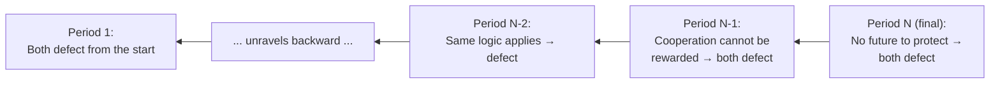
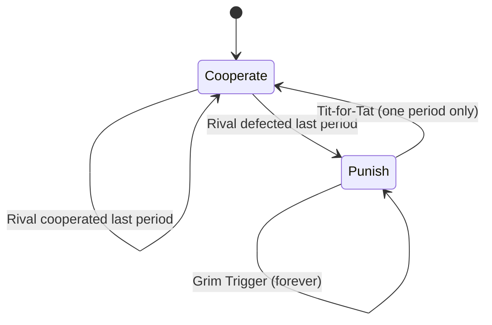

## Repeated Games and Cooperative Strategies

### Definition and Motivation

A repeated game is a game-theoretic structure in which the same set of players interacts through the same stage game (the same strategies and payoff structure) over multiple periods, rather than a single one-shot encounter. The central insight of repeated game theory is that outcomes unattainable in a one-shot game — most importantly, cooperation in a Prisoner's Dilemma — can become sustainable Nash equilibria when players interact repeatedly and can condition future behavior on past observed actions.

**Key Points**

- The single-period interaction is called the **stage game** (e.g., a Prisoner's Dilemma or Cournot duopoly game)
- A repeated game consists of the stage game played across multiple periods, with players observing the outcome of each period before the next begins
- Repetition introduces the possibility of **reputation, reciprocity, and retaliation**, which are absent in a one-shot setting
- This framework is the primary theoretical explanation for why real-world oligopolists sometimes sustain tacit collusion despite the individual incentive to undercut rivals

### Finitely Repeated Games and Backward Induction

#### The Unraveling Problem

When a game is repeated a known, finite number of times, cooperation generally cannot be sustained as a subgame perfect Nash equilibrium, even though it appears intuitive that repetition should help.

**Key Points**

- In the final period, there is no future to protect, so both players play their one-shot Nash equilibrium strategy (e.g., mutual defection in a Prisoner's Dilemma) — there is no incentive to cooperate since no retaliation is possible afterward
- Anticipating defection in the final period, players have no incentive to cooperate in the second-to-last period either, since cooperation there cannot be "rewarded" — the outcome of the last period is already determined regardless
- This logic **unravels backward** through every prior period, all the way to the first, meaning the unique subgame perfect equilibrium of a finitely repeated Prisoner's Dilemma is mutual defection in every single period
- This result is sometimes referred to as the **chain-store paradox**, following Reinhard Selten's original formulation involving a chain-store monopolist facing sequential potential entrants

[Standard Result] This backward-induction unraveling is a well-established theoretical result for the finitely repeated Prisoner's Dilemma with common knowledge of the game's structure and end date. Experimental economics has found that real human subjects frequently cooperate for many rounds even in finitely repeated settings before defecting near the end, indicating a gap between the theoretical prediction and observed behavior — often attributed to factors like bounded rationality, uncertainty about the rival's rationality, or social preferences (see Behavioral Game Theory).

### Infinitely and Indefinitely Repeated Games

#### Why Infinite Repetition Changes the Outcome

When the game has no known final period — either because it is modeled as infinitely repeated, or because there is a constant probability $\beta$ that the game continues into the next period — the backward induction argument fails, since there is no last period from which to unravel. This opens the possibility of sustaining cooperation as a Nash (or subgame perfect Nash) equilibrium.

**Key Points**

- Players evaluate strategies based on the **discounted sum of expected future payoffs**, not just the current period's payoff
- The discount factor $\delta \in (0,1)$ captures both time preference (impatience) and, in the indefinitely repeated interpretation, the probability that the relationship continues
- Cooperation becomes an equilibrium when the threat of future punishment is severe enough, and valued highly enough, to outweigh the short-term gain from defecting today

#### The Folk Theorem

The **Folk Theorem** is the foundational result characterizing which outcomes can be sustained as subgame perfect Nash equilibria in infinitely repeated games.

**Key Points**

- [Standard Result] Informally, the Folk Theorem states that if players are sufficiently patient (the discount factor $\delta$ is close enough to 1), then *any* feasible payoff vector that gives each player at least their **minmax payoff** (the worst payoff a player can be held to by the others acting adversarially) can be supported as a subgame perfect Nash equilibrium outcome of the infinitely repeated game
- This implies a very large multiplicity of possible equilibria — including full cooperation, partial cooperation, and various punishment-based outcomes — which is both the theorem's power and a common criticism, since it offers limited predictive precision about which specific equilibrium will actually emerge
- The name "Folk Theorem" reflects that the result was informally understood and circulated among game theorists before being formally proven and attributed in the literature

### Trigger Strategies

Trigger strategies are the mechanism by which cooperation is enforced in repeated games: a player cooperates conditionally, and punishes deviation if and when it is observed.

#### Grim Trigger Strategy

**Key Points**

- Start by cooperating
- Continue cooperating as long as the rival has never defected in any previous period
- If the rival ever defects, defect in every subsequent period, forever, regardless of the rival's later behavior
- This is the harshest possible punishment (permanent reversion to the stage-game Nash equilibrium) and therefore the easiest strategy to sustain cooperation with, since it maximizes the cost of deviation

**Condition for Sustainability**

Cooperation under grim trigger is a Nash equilibrium when the discounted payoff from perpetual cooperation is at least as large as the payoff from defecting once and then suffering perpetual punishment:

$$\frac{\pi^{C}}{1-\delta} \geq \pi^{D} + \frac{\delta \cdot \pi^{N}}{1-\delta}$$

where $\pi^{C}$ is the per-period cooperative payoff, $\pi^{D}$ is the one-time payoff from defecting while the rival still cooperates, and $\pi^{N}$ is the per-period stage-game Nash (punishment) payoff, with $\pi^{D} > \pi^{C} > \pi^{N}$.

Rearranging gives the **critical discount factor** above which cooperation is sustainable:

$$\delta \geq \frac{\pi^{D} - \pi^{C}}{\pi^{D} - \pi^{N}}$$

**Example**

Using the oligopoly pricing payoffs from the Prisoner's Dilemma (Oligopoly chapter): $\pi^{C} = 10$ (both High Price), $\pi^{D} = 12$ (defect while rival stays High), $\pi^{N} = 5$ (both Low Price, the punishment/Nash payoff).

$$\delta \geq \frac{12 - 10}{12 - 5} = \frac{2}{7} \approx 0.286$$

As long as firms discount future profits at a rate corresponding to $\delta \geq 0.286$ (i.e., they are reasonably patient, or expect the relationship to continue with high enough probability), collusion is sustainable via grim trigger.

#### Tit-for-Tat Strategy

**Key Points**

- Cooperate in the first period
- In every subsequent period, replicate whatever the rival played in the immediately preceding period
- Unlike grim trigger, punishment is temporary and proportionate — a single defection by the rival triggers exactly one period of retaliation, after which cooperation can resume if the rival returns to cooperating
- Tit-for-Tat became famous following Robert Axelrod's computer tournaments (early 1980s), in which it performed strongly against a wide range of competing strategies in repeated Prisoner's Dilemma simulations, credited to four properties: it is **nice** (never defects first), **retaliatory** (punishes defection immediately), **forgiving** (returns to cooperation after a single punishment round), and **clear/simple** (easy for opponents to recognize and adapt to)
- [Inference] Tit-for-Tat's strong tournament performance does not imply it is the theoretically optimal strategy in all repeated game environments; its effectiveness is sensitive to the specific population of competing strategies, noise/error rates in observing actions, and the discount factor, and subsequent research has identified strategies that outperform it under certain conditions (e.g., "Pavlov" or win-stay-lose-shift strategies, particularly in noisy environments)

#### Comparison of Trigger Strategies

| Strategy | Punishment Severity | Forgiveness | Robustness to Noise |
| --- | --- | --- | --- |
| Grim Trigger | Permanent (harshest) | None | Poor — one mistaken signal ends cooperation forever |
| Tit-for-Tat | One period | Immediate after one retaliation | Moderate — a single error can trigger a damaging retaliation cycle |
| Win-Stay-Lose-Shift (Pavlov) | Conditional on own payoff | Adaptive | Better — self-corrects some error patterns |

### Factors Affecting the Sustainability of Cooperation

**Key Points**

- **Discount factor / patience**: higher $\delta$ (more patience, or higher probability the relationship continues) makes cooperation easier to sustain, since future punishment is valued more relative to the immediate gain from defection
- **Number of players**: cooperation is generally harder to sustain as the number of players increases, since monitoring becomes more difficult and the individual share of collusive gains shrinks while the temptation to defect remains
- **Detection lag and monitoring quality**: if defection is not immediately observable (e.g., secret price discounts, delayed reporting of output), the effective punishment is delayed, weakening the deterrent effect
- **Demand and market volatility**: unstable or rapidly growing demand increases the short-term temptation to defect and grab market share, making cooperation harder to sustain; stable, predictable demand supports cooperation
- **Symmetry among players**: firms with similar costs, capacities, and market shares find it easier to agree on and sustain a cooperative outcome than firms with significant asymmetries
- **Multi-market contact**: firms that interact across multiple markets simultaneously can more easily sustain cooperation, since a punishment triggered by defection in one market can be extended across all shared markets, raising the effective cost of cheating

### Application to Oligopoly and Tacit Collusion

Repeated game theory provides the formal underpinning for why tacit collusion can persist in real-world oligopolies without any explicit agreement or communication.

**Example**

- **Price leadership**: a dominant firm sets a price, and rivals follow, understanding implicitly that undercutting will trigger a punishing price war (a real-world analog of a trigger strategy)
- **Facilitating practices**: advance announcement of price changes, most-favored-customer clauses, or public price-matching guarantees can function as mechanisms that make defection easier to detect and therefore easier to punish, sustaining higher discount-adjusted cooperation — competition authorities in many jurisdictions scrutinize such practices precisely because they can facilitate tacit collusion
- **Airline industry route competition**: carriers competing across many overlapping routes exhibit patterns consistent with multi-market contact theory, where aggressive pricing on one route can be met with retaliation on a different, unrelated route

[Unverified] Empirical identification of tacit collusion in specific real-world industries is contested and typically requires detailed econometric analysis of pricing patterns, since price parallelism alone is also consistent with genuine competition under similar cost conditions; specific enforcement conclusions should not be inferred from the theoretical framework alone.

**Related Topics**

- Game Theory: Nash Equilibrium and the Prisoner's Dilemma (the stage game underlying repeated-game analysis)
- Oligopoly: Interdependence and Collusion (real-world market application)
- Subgame perfect equilibrium and backward induction in sequential games
- Behavioral game theory and experimental evidence on cooperation
- Antitrust enforcement against facilitating practices and tacit collusion
- Evolutionary game theory and simulation-based strategy tournaments
- Mechanism design and contract theory as alternatives to repeated-game enforcement