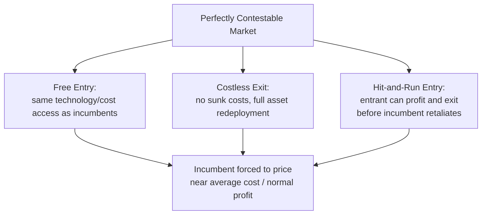

## Contestable Markets Theory

### Definition and Origin

Contestable markets theory holds that the competitive behavior and performance of firms in a market can be disciplined by the *threat* of entry, even when the actual number of firms operating in the market is small (including monopoly or oligopoly). The theory was principally developed by William Baumol, John Panzar, and Robert Willig in their 1982 work, and represented a significant shift in industrial organization economics: it argued that market *structure* (the number of incumbent firms) matters less for competitive outcomes than the *conditions of entry and exit*.

**Key Points**

- A market is **perfectly contestable** if entry is completely free and exit is entirely costless
- Under perfect contestability, incumbent firms are constrained to behave competitively — pricing at or near average cost and earning only normal profit — regardless of how few firms currently operate in the market
- The theory shifts the analytical focus in industrial organization from the traditional **Structure-Conduct-Performance (SCP)** paradigm (where market structure, i.e., firm count, is assumed to directly determine competitive conduct) toward the role of potential competition and entry/exit barriers
- Contestability theory generalizes and extends earlier concepts such as limit pricing and the theory of potential entry

### Core Assumptions

For a market to be perfectly contestable, three conditions must hold simultaneously.

**Key Points**

1. **Free entry**: potential entrants have access to the same production technology and cost structure as incumbents, and face no legal, regulatory, or structural barriers to entering the market
2. **Costless exit / absence of sunk costs**: a firm that enters the market can leave again without incurring any unrecoverable costs — critically, this means capital and other assets must be redeployable elsewhere at their full value, not merely that the firm ceases operating
3. **Hit-and-run entry** is possible: an entrant can come into the market, undercut the incumbent's price, capture sales and profit, and exit again before the incumbent has time to retaliate by lowering its own price

[Standard Result] The absence of sunk costs is the theoretically critical condition; a firm that must sink capital irrecoverably before it can compete faces an asymmetric risk relative to the incumbent, which is precisely what limit pricing and predatory pricing strategies exploit to deter entry even under otherwise low barriers.

### The Hit-and-Run Entry Mechanism

The disciplining force in a contestable market operates through the threat, not necessarily the occurrence, of hit-and-run entry.

**Key Points**

- If an incumbent monopolist (or oligopolist) sets price above average cost, earning supernormal (economic) profit, a potential entrant can enter, charge a slightly lower price, capture the entire market (or a substantial share) at that lower price, earn a profit on the sales made, and then exit before the incumbent has any opportunity to respond with retaliatory pricing
- Because exit is costless (no sunk costs are lost), the entrant faces essentially no downside risk from this strategy if the incumbent does eventually retaliate
- Anticipating this vulnerability, a rational incumbent sets price at (or very close to) the competitive, average-cost level from the outset, deterring entry preemptively — entry never actually needs to occur for the market to exhibit competitive outcomes
- This produces the theory's central and somewhat paradoxical prediction: **a monopoly or oligopoly can produce a perfectly competitive price and output outcome**, provided the market is contestable, even though the number of active firms remains small

### Contestability and Firm Behavior: The Baumol-Panzar-Willig Predictions

**Key Points**

- **Zero economic (supernormal) profit** in long-run equilibrium, even for a monopolist, since any positive economic profit invites hit-and-run entry
- **Productive efficiency**: firms are forced to produce at the point of lowest feasible average cost, since any cost inefficiency (producing above minimum efficient average cost) creates an opportunity for a more efficient entrant to undercut the incumbent
- **Allocative efficiency** can also emerge, since sustained supernormal profit signals an entry opportunity, and competitive pressure from potential entrants pushes price toward the level associated with efficient resource allocation
- Firm behavior is disciplined by **potential** competition rather than requiring **actual** competition from many currently operating rivals — this is the theory's most distinctive departure from traditional oligopoly and monopoly analysis

### Contrast with Traditional Structure-Conduct-Performance Analysis

| Dimension | Traditional SCP View | Contestable Markets View |
| --- | --- | --- |
| Key determinant of competitive outcome | Number of firms currently in the market | Ease of entry and exit (especially absence of sunk costs) |
| Monopoly/oligopoly implication | Presumed to produce above-competitive prices and restricted output | Can produce competitive prices/output if market is contestable |
| Policy focus | Breaking up concentrated firms; limiting market share | Removing barriers to entry and exit; addressing sunk-cost structures |
| Role of actual rival firms | Central — competition requires multiple active competitors | Secondary — the *threat* of entry is what matters |

### Real-World Applicability and Limitations

While theoretically elegant, perfectly contestable markets are rare in practice, and the theory is generally applied as a benchmark or a matter of degree rather than a literal description of most industries.

**Key Points**

- **Sunk costs are pervasive** in most real-world industries — specialized machinery, licenses, brand-building expenditure, and long-term contracts frequently cannot be fully recovered upon exit, undermining the "costless exit" assumption
- **Time lags in entry and price adjustment**: hit-and-run entry requires that entrants can move faster than incumbents can respond; in industries with long lead times for entry (e.g., capital-intensive manufacturing, regulated utilities), incumbents typically have ample time to detect and retaliate against an entrant before it can exit profitably
- **Regulatory and legal barriers**: licensing requirements, patents, and other legal restrictions on entry are common and directly violate the free-entry assumption
- **Airline industry**: historically the most commonly cited real-world approximation of contestability, since aircraft (a major capital input) are highly mobile and can be redeployed to different routes relatively quickly at low cost, allowing carriers to enter and exit specific routes with less sunk-cost exposure than industries requiring route-specific infrastructure. [Inference] Even this application is regarded as only a partial approximation of perfect contestability, since airlines still face costs such as gate access, slot allocation at congested airports, and reputational/brand-loyalty effects that can function as informal barriers to hit-and-run entry on particular routes.

### Policy Implications

**Key Points**

- Contestability theory implies that competition policy and regulation should focus on **lowering barriers to entry and exit** rather than solely on breaking up firms with large market share or high concentration ratios
- This has informed **deregulation movements** in industries such as airlines, trucking, and telecommunications in various countries, on the reasoning that removing licensing and route restrictions could allow potential competition to discipline incumbent pricing even without increasing the actual number of firms
- Critics argue that where genuine sunk costs and time-to-entry barriers exist, deregulation based on contestability assumptions may fail to produce the predicted competitive discipline, since the theoretical preconditions are not actually met in practice
- [Unverified] The empirical success of deregulation policies motivated in part by contestability theory (e.g., U.S. airline deregulation following the Airline Deregulation Act of 1978) remains a subject of ongoing debate among economists regarding the extent to which observed post-deregulation pricing and market entry patterns can be attributed specifically to contestability dynamics versus other factors; conclusions on this point should be checked against current empirical literature rather than assumed.

### Diagram: Contestability Spectrum (svg_diagram)

<svg xmlns="http://www.w3.org/2000/svg" viewBox="0 0 780 320">
<text x="390" y="28" text-anchor="middle" font-size="17" font-weight="bold" fill="#1a1a1a">The Contestability Spectrum (svg_diagram)</text>
<line x1="80" y1="80" x2="700" y2="80" stroke="#333" stroke-width="2" />
<polygon points="700,80 690,74 690,86" fill="#333" />
<circle cx="120" cy="80" r="7" fill="#c0392b" />
<text x="120" y="105" text-anchor="middle" font-size="11" fill="#333">High sunk costs</text>
<text x="120" y="120" text-anchor="middle" font-size="11" fill="#333">Slow entry/exit</text>
<text x="120" y="140" text-anchor="middle" font-size="12" font-weight="bold" fill="#c0392b">Not Contestable</text>
<circle cx="390" cy="80" r="7" fill="#d68910" />
<text x="390" y="105" text-anchor="middle" font-size="11" fill="#333">Moderate sunk costs</text>
<text x="390" y="120" text-anchor="middle" font-size="11" fill="#333">Some entry lags</text>
<text x="390" y="140" text-anchor="middle" font-size="12" font-weight="bold" fill="#d68910">Partially Contestable</text>
<circle cx="660" cy="80" r="7" fill="#27ae60" />
<text x="660" y="105" text-anchor="middle" font-size="11" fill="#333">No sunk costs</text>
<text x="660" y="120" text-anchor="middle" font-size="11" fill="#333">Instant hit-and-run entry</text>
<text x="660" y="140" text-anchor="middle" font-size="12" font-weight="bold" fill="#27ae60">Perfectly Contestable</text>
<rect x="60" y="170" width="200" height="70" rx="6" fill="#fdecea" stroke="#c0392b" stroke-width="2" />
<text x="160" y="192" text-anchor="middle" font-size="11" fill="#333">e.g., utilities with</text>
<text x="160" y="208" text-anchor="middle" font-size="11" fill="#333">specialized infrastructure,</text>
<text x="160" y="224" text-anchor="middle" font-size="11" fill="#333">heavy regulatory licensing</text>
<rect x="330" y="170" width="200" height="70" rx="6" fill="#fdf2e3" stroke="#d68910" stroke-width="2" />
<text x="430" y="192" text-anchor="middle" font-size="11" fill="#333">e.g., airline route</text>
<text x="430" y="208" text-anchor="middle" font-size="11" fill="#333">competition (mobile capital,</text>
<text x="430" y="224" text-anchor="middle" font-size="11" fill="#333">but slot/gate constraints)</text>
<rect x="580" y="170" width="140" height="70" rx="6" fill="#eafaf1" stroke="#27ae60" stroke-width="2" />
<text x="650" y="192" text-anchor="middle" font-size="11" fill="#333">Theoretical</text>
<text x="650" y="208" text-anchor="middle" font-size="11" fill="#333">benchmark case</text>
<text x="650" y="224" text-anchor="middle" font-size="11" fill="#333">(rarely observed)</text>

<text x="390" y="275" text-anchor="middle" font-size="12" fill="#333">Incumbent pricing behavior converges toward average-cost</text>

<text x="390" y="292" text-anchor="middle" font-size="12" fill="#333">pricing as position moves rightward along the spectrum</text>

</svg>

### Summary Comparison: Contestable Monopoly vs. Traditional Monopoly

**Example**

Consider a single incumbent firm (n = 1) in an industry:

- **Traditional monopoly analysis** predicts the firm restricts output to the point where marginal revenue equals marginal cost, charging a price above marginal cost and above average cost, earning positive economic profit, with resulting allocative inefficiency (deadweight loss)
- **Contestable markets analysis** of the same single-firm industry predicts that if entry is free and exit is costless, the same firm will be forced to price at average cost, output at the competitive level, and earn zero economic profit — despite still being the only firm actually operating
- The divergence between these two predictions for an identical firm count illustrates why contestability theory treats entry/exit conditions, not firm count, as the primary determinant of competitive outcomes

**Related Topics**

- Oligopoly: Interdependence and Collusion (contrast between actual and potential competition as disciplining forces)
- Monopoly and monopoly pricing (the baseline outcome contestability theory challenges)
- Sunk costs and their role in barriers to entry
- Structure-Conduct-Performance (SCP) paradigm in industrial organization
- Limit pricing and entry deterrence strategies
- Deregulation case studies (airline, trucking, telecommunications industries)
- Natural monopoly and contestability in network industries