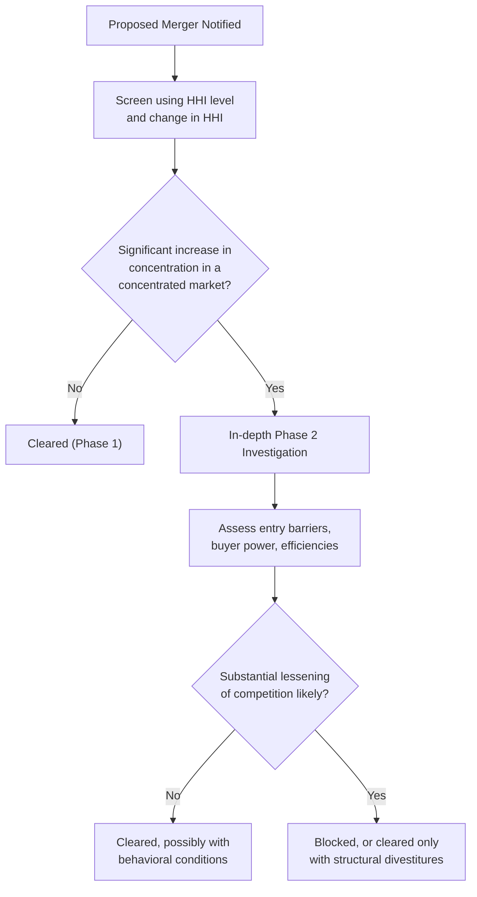

## Antitrust and Competition Policy

### Definition and Objectives

Antitrust and competition policy comprises the body of law, regulation, and government enforcement action aimed at preserving competitive market structures, preventing the abuse of market power, and protecting consumer welfare from anticompetitive conduct such as collusion, monopolization, and anticompetitive mergers. Although "antitrust" is the terminology most associated with United States law, most jurisdictions worldwide maintain analogous "competition law" frameworks with broadly similar objectives.

**Key Points**

- Core objectives typically include: preventing price-fixing and cartels, prohibiting the abuse of dominant market position, reviewing mergers and acquisitions for anticompetitive effects, and in some frameworks, protecting the competitive process itself as distinct from protecting individual competitors
- Competition policy operates as the primary real-world regulatory response to the market failures generated by monopoly and oligopoly market structures
- The stated economic rationale is that competitive markets generally produce lower prices, higher output, greater innovation, and improved allocative efficiency compared to markets with unchecked market power
- [Unverified] The specific weight given to consumer welfare vs. other goals (e.g., protecting smaller competitors, promoting innovation, addressing labor market effects) varies across jurisdictions and has shifted over different historical periods and political administrations; readers should consult current official guidance for the applicable framework in any specific jurisdiction.

### Major Legal Frameworks (Illustrative, Not Exhaustive)

#### United States

**Key Points**

- **Sherman Antitrust Act (1890)**: Section 1 prohibits contracts, combinations, and conspiracies in restraint of trade (the primary basis for prosecuting cartels and price-fixing); Section 2 prohibits monopolization and attempts to monopolize
- **Clayton Act (1914)**: addresses specific practices including certain mergers and acquisitions (Section 7), price discrimination, and exclusive dealing arrangements, supplementing the more general Sherman Act
- **Federal Trade Commission Act (1914)**: created the Federal Trade Commission (FTC) and prohibits "unfair methods of competition"
- Enforcement is shared primarily between the FTC and the Antitrust Division of the U.S. Department of Justice (DOJ), alongside private civil litigation (including treble-damages suits) and state attorneys general

#### European Union

**Key Points**

- **Article 101 of the Treaty on the Functioning of the European Union (TFEU)**: prohibits anticompetitive agreements between undertakings (cartels, price-fixing, market-sharing arrangements) analogous to Sherman Act Section 1
- **Article 102 TFEU**: prohibits the abuse of a dominant market position, analogous to Sherman Act Section 2 but framed around "abuse" of dominance rather than monopolization itself
- The **EU Merger Regulation** provides a centralized process for reviewing large cross-border mergers
- Enforcement is led by the **European Commission's Directorate-General for Competition (DG COMP)**, with fines that can reach a substantial percentage of a firm's global annual turnover for serious infringements
- [Unverified] Specific fine calculation methodologies and percentage caps are periodically updated by Commission guidelines; current figures should be verified against official EU sources rather than assumed static.

**Key Points (General Cross-Jurisdictional Pattern)**

- Most other major economies (e.g., the United Kingdom's Competition and Markets Authority, China's State Administration for Market Regulation, and numerous national competition authorities) maintain broadly analogous frameworks covering: anticompetitive agreements, abuse of dominance, and merger review, often influenced by or converging toward the U.S. and EU models

### Categories of Anticompetitive Conduct

#### Horizontal Restraints (Agreements Among Competitors)

**Key Points**

- **Price fixing**: direct agreement among competitors on prices to charge — generally treated as a **per se illegal** offense in the U.S. framework, meaning no defense based on reasonableness or economic justification is permitted once the agreement is established
- **Market/customer allocation**: competitors agreeing to divide geographic territories or customer segments rather than competing for them
- **Bid rigging**: coordination among bidders in an auction or procurement process to predetermine the winner and suppress genuine competitive bidding
- **Output restriction agreements**: coordinated reduction in industry output to raise prices, functionally equivalent to price fixing in its economic effect

#### Abuse of Dominance / Monopolization

**Key Points**

- **Predatory pricing**: pricing below cost with the intent to eliminate competitors and later recoup losses through higher prices once competition is reduced — courts and agencies generally require evidence both of below-cost pricing and a plausible prospect of recoupment, since low prices alone can also reflect legitimate competition
- **Exclusive dealing**: contractual arrangements that require customers or suppliers to deal exclusively with the dominant firm, potentially foreclosing rivals' access to the market
- **Tying and bundling**: conditioning the sale of one product on the purchase of another, potentially leveraging market power in one market into an adjacent market
- **Refusal to deal**: in certain circumstances, a dominant firm's refusal to supply a competitor or provide access to an essential input can constitute an antitrust violation, though this is treated narrowly and is highly fact-dependent across jurisdictions

#### Merger Review

**Key Points**

- Competition authorities evaluate proposed mergers and acquisitions for their likely effect on competition, typically before the transaction is permitted to close (in jurisdictions with mandatory pre-merger notification, such as the U.S. Hart-Scott-Rodino thresholds)
- The **Herfindahl-Hirschman Index (HHI)** is commonly used as a screening tool: authorities examine both the resulting post-merger HHI level and the *change* in HHI caused by the merger, with larger increases in already-concentrated markets triggering greater scrutiny
- Reviewing agencies assess factors including: ease of entry by new competitors, the presence of countervailing buyer power, efficiencies claimed to result from the merger, and whether the merger would substantially lessen competition or create/enhance a dominant position
- Possible outcomes include unconditional clearance, conditional clearance (requiring divestitures or behavioral commitments), or blocking the merger outright

### Standards of Legal Analysis

#### Per Se Illegality vs. Rule of Reason

**Key Points**

- **Per se illegality**: certain categories of conduct (most notably naked horizontal price-fixing, bid rigging, and market allocation among competitors) are deemed so consistently and predictably anticompetitive that they are condemned automatically, without requiring proof of actual anticompetitive market effects or permitting a procompetitive justification defense
- **Rule of reason**: most other conduct is evaluated under a fact-specific balancing test weighing the conduct's anticompetitive effects against any legitimate procompetitive business justifications, requiring detailed market definition, analysis of market power, and effects evidence
- [Standard Result] The general trend across many jurisdictions in recent decades has been toward expanding the scope of rule-of-reason analysis and narrowing the categories treated as per se illegal, reflecting an economic view that many vertical and some horizontal arrangements can have ambiguous or even procompetitive effects depending on context. [Unverified] The precise current scope and any recent doctrinal shifts should be checked against current case law, as this is an area of active legal development.

#### Market Definition

**Key Points**

- Before assessing market power or the competitive effects of conduct, authorities must define the **relevant market**, comprising both a **product market** (which goods/services are close substitutes from the consumer's perspective) and a **geographic market** (the area within which competition effectively occurs)
- A common analytical tool is the **SSNIP test** ("Small but Significant and Non-transitory Increase in Price"): the relevant market is defined as the smallest set of products/geographic area within which a hypothetical monopolist could profitably impose a small (e.g., 5%) price increase without losing so many sales to substitutes that the price increase becomes unprofitable
- Market definition is often the most contested element of antitrust litigation, since a narrowly defined market makes market power/dominance easier to establish, while a broadly defined market (including more substitutes) makes it harder

### Remedies

**Key Points**

- **Structural remedies**: divestiture of assets, business units, or entire subsidiaries, intended to directly restore competitive market structure — commonly applied in merger cases
- **Behavioral (conduct) remedies**: ongoing restrictions on a firm's conduct (e.g., prohibiting exclusive dealing, mandating licensing of essential technology, price caps) without requiring a change in ownership structure
- **Fines and penalties**: monetary sanctions, which in cartel cases can be calculated based on a percentage of affected commerce or global turnover, depending on jurisdiction
- **Criminal sanctions**: in the United States, hardcore cartel conduct (e.g., price fixing, bid rigging) can result in criminal prosecution of both companies and individual executives, including potential imprisonment — a stronger sanction than in most other jurisdictions, where competition law violations are typically treated as civil/administrative matters
- **Leniency (amnesty) programs**: many jurisdictions offer significantly reduced fines or immunity from prosecution to the first cartel member to report the conspiracy and cooperate with investigators, deliberately exploiting the game-theoretic instability of cartels (see Oligopoly: Interdependence and Collusion) to encourage self-reporting and defection

### Economic Analysis Underlying Competition Policy

**Key Points**

- **Deadweight loss**: monopoly and cartel pricing above marginal cost create a loss of total economic surplus relative to the competitive outcome — this economic inefficiency is a core justification for intervention, independent of any distributional concerns about the transfer of surplus from consumers to producers
- **Consumer welfare standard**: historically the dominant analytical framework in U.S. antitrust enforcement, generally interpreted as focusing on whether conduct raises prices, restricts output, reduces quality, or reduces innovation to the detriment of consumers
- **Total welfare vs. consumer welfare debates**: some economic frameworks would permit conduct that reduces consumer surplus if it generates sufficiently large efficiency gains to producers such that total surplus (consumer plus producer) still rises, while a strict consumer welfare standard would not
- [Unverified] There has been ongoing academic and policy debate in various jurisdictions over whether traditional consumer welfare-focused frameworks adequately address competition concerns arising in digital/platform markets (e.g., network effects, multi-sided platforms, data-driven market power, and non-price competitive dimensions); positions on this debate are contested and evolving, and should not be treated as settled economic consensus.

### Diagram: Antitrust Analysis Decision Framework (svg_diagram)

<svg xmlns="http://www.w3.org/2000/svg" viewBox="0 0 780 400">
<text x="390" y="28" text-anchor="middle" font-size="17" font-weight="bold" fill="#1a1a1a">Antitrust Case Analysis Framework (svg_diagram)</text>
<rect x="300" y="55" width="180" height="45" rx="6" fill="#e8f0fe" stroke="#4472c4" stroke-width="2" />
<text x="390" y="82" text-anchor="middle" font-size="12" font-weight="bold" fill="#1a1a1a">Alleged Conduct</text>
<line x1="390" y1="100" x2="390" y2="130" stroke="#666" stroke-width="1.5" marker-end="url(#arrow2)" />
<rect x="200" y="130" width="180" height="55" rx="6" fill="#fdf2e3" stroke="#d68910" stroke-width="2" />
<text x="290" y="152" text-anchor="middle" font-size="11" font-weight="bold" fill="#1a1a1a">Define Relevant Market</text>
<text x="290" y="170" text-anchor="middle" font-size="10" fill="#333">(Product + Geographic, SSNIP test)</text>
<rect x="400" y="130" width="180" height="55" rx="6" fill="#fdf2e3" stroke="#d68910" stroke-width="2" />
<text x="490" y="152" text-anchor="middle" font-size="11" font-weight="bold" fill="#1a1a1a">Classify Conduct Type</text>
<text x="490" y="170" text-anchor="middle" font-size="10" fill="#333">(Horizontal / Vertical / Merger)</text>
<line x1="290" y1="185" x2="290" y2="215" stroke="#666" stroke-width="1.5" marker-end="url(#arrow2)" />
<line x1="490" y1="185" x2="490" y2="215" stroke="#666" stroke-width="1.5" marker-end="url(#arrow2)" />
<rect x="150" y="215" width="280" height="55" rx="6" fill="#eafaf1" stroke="#27ae60" stroke-width="2" />
<text x="290" y="237" text-anchor="middle" font-size="11" font-weight="bold" fill="#1a1a1a">Per Se Illegal?</text>
<text x="290" y="255" text-anchor="middle" font-size="10" fill="#333">(e.g., naked price-fixing, bid rigging)</text>
<rect x="440" y="215" width="280" height="55" rx="6" fill="#eaf2f8" stroke="#2980b9" stroke-width="2" />
<text x="580" y="237" text-anchor="middle" font-size="11" font-weight="bold" fill="#1a1a1a">Rule of Reason Analysis</text>
<text x="580" y="255" text-anchor="middle" font-size="10" fill="#333">(Weigh anticompetitive vs. procompetitive effects)</text>
<line x1="290" y1="270" x2="290" y2="300" stroke="#666" stroke-width="1.5" marker-end="url(#arrow2)" />
<line x1="580" y1="270" x2="435" y2="300" stroke="#666" stroke-width="1.5" marker-end="url(#arrow2)" />
<rect x="180" y="300" width="450" height="70" rx="6" fill="#fdecea" stroke="#c0392b" stroke-width="2" />
<text x="405" y="322" text-anchor="middle" font-size="12" font-weight="bold" fill="#1a1a1a">Remedy Selection</text>
<text x="405" y="342" text-anchor="middle" font-size="10" fill="#333">Structural (divestiture) | Behavioral (conduct restrictions)</text>
<text x="405" y="358" text-anchor="middle" font-size="10" fill="#333">Fines | Criminal sanctions (jurisdiction-dependent)</text>
</svg>

### Illustrative Case Pattern

**Example**

A hypothetical cartel investigation might proceed as follows: a competition authority receives a leniency application from Firm A, disclosing a price-fixing arrangement with Firms B and C. Because horizontal price-fixing is per se illegal (U.S.) or a clear Article 101 violation (EU), the authority does not need to conduct a full rule-of-reason market-effects analysis — the existence of the agreement itself is generally sufficient for liability. Firm A receives full or substantially reduced penalties under the leniency program for being first to report, while Firms B and C face full fines (and, in U.S. jurisdiction, potential criminal referral for the individuals involved), illustrating how enforcement design leverages the same collusion-instability logic examined in oligopoly game theory.

**Related Topics**

- Oligopoly: Interdependence and Collusion (the market conduct antitrust law targets)
- Game Theory: Nash Equilibrium and the Prisoner's Dilemma (theoretical basis for leniency program design)
- Contestable Markets Theory (alternative policy lens emphasizing entry/exit over structure)
- Monopoly and deadweight loss analysis
- Merger simulation models and HHI-based screening in practice
- Digital markets and platform competition policy debates
- Comparative competition law across jurisdictions (U.S., EU, UK, China)