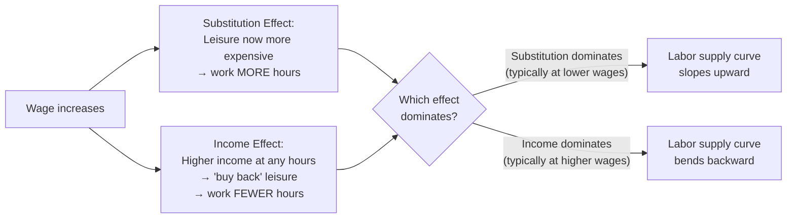
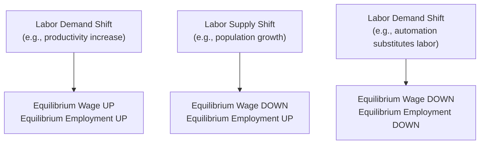

## Labor Market Supply and Demand

### Definition and Scope

The labor market is the factor market in which households supply labor services and firms demand labor as an input to production, with wages functioning as the price that coordinates this exchange. Unlike goods markets, labor supply and demand analysis incorporates the household's simultaneous choice between labor and leisure, and the firm's demand for labor as a **derived demand** stemming from the demand for the goods and services labor helps produce.

**Key Points**

- Labor demand is a **derived demand**: firms do not want labor for its own sake, but because it contributes to producing output that can be sold — a fall in demand for a firm's product will reduce its demand for labor, all else equal
- Labor supply reflects the household's trade-off between the wage-driven benefit of working and the value of leisure/non-market time forgone
- The equilibrium wage and employment level are determined by the intersection of the market labor supply and market labor demand curves, analogous to standard goods-market equilibrium

### Labor Demand

#### Marginal Revenue Product of Labor (MRPL)

In a **perfectly competitive labor market**, a profit-maximizing firm hires labor up to the point where the additional revenue generated by the last unit of labor equals its cost.

**Key Points**

- The **Marginal Product of Labor (MPL)** is the additional output produced by hiring one more unit of labor, holding other inputs constant
- The **Marginal Revenue Product of Labor (MRPL)** converts this into revenue terms:

$$MRPL = MPL \times MR$$

- In a perfectly competitive **output** market, $MR = P$ (price), so:

$$MRPL = MPL \times P$$

- A profit-maximizing firm hires labor up to the point where:

$$MRPL = W$$

where $W$ is the wage rate, since hiring beyond this point would cost more than the additional revenue generated, while stopping short would forgo profitable hiring opportunities

- Because of **diminishing marginal returns to labor** (holding capital fixed in the short run), MPL — and therefore MRPL — declines as more labor is hired, giving the firm's individual labor demand curve its downward slope

#### Labor Demand Under Imperfect Output Market Competition

**Key Points**

- If the firm has market power in its output market (e.g., monopoly or monopolistic competition), marginal revenue $MR < P$ and declines as output rises, so:

$$MRPL = MPL \times MR$$

- This produces a labor demand curve that lies below and is generally steeper (less elastic at any given wage) than it would be under output-market perfect competition, since each additional unit of output sold pushes down the price on all units sold (not just the marginal one)

#### Determinants of Labor Demand (Shifts)

**Key Points**

- **Product demand**: an increase in demand for the firm's output raises $MR$ (or $P$), shifting labor demand outward
- **Productivity/technology**: an increase in MPL (e.g., through technological improvement, better training, or complementary capital investment) shifts labor demand outward
- **Price of complementary/substitute inputs**: a fall in the price of capital that is a **substitute** for labor (e.g., automation equipment) can reduce labor demand; a fall in the price of a **complementary** input (e.g., cheaper software that makes workers more productive) can increase labor demand
- **Number of firms in the industry**: entry of additional firms increases aggregate labor demand at any given wage

#### Elasticity of Labor Demand

**Key Points**

- Labor demand elasticity depends on: the elasticity of demand for the final product (more elastic product demand implies more elastic labor demand, per the "derived demand" principle), the ease of substituting capital for labor, the labor cost share of total production cost (a higher share generally implies more elastic demand), and the elasticity of supply of substitute inputs
- These determinants are formalized in the **Hicks-Marshall laws of derived demand**, a set of standard conditions under which labor demand elasticity tends to be higher

### Labor Supply

#### The Individual Labor Supply Decision

An individual's labor supply decision can be modeled as a choice between labor income (used to purchase consumption goods) and leisure, subject to a time constraint.

**Key Points**

- The **substitution effect** of a wage increase: leisure becomes relatively more expensive (in terms of forgone income) as the wage rises, inducing the individual to substitute away from leisure toward work — this effect alone would predict labor supply increases as wages rise
- The **income effect** of a wage increase: a higher wage increases total income for any given number of hours worked, and if leisure is a normal good, the individual may choose to "buy back" some leisure time, working fewer hours — this effect alone would predict labor supply decreases as wages rise
- At low wage levels, the substitution effect typically dominates, so labor supply increases with the wage; at sufficiently high wage levels, the income effect can dominate, producing a **backward-bending individual labor supply curve**

#### Market Labor Supply Curve

**Key Points**

- The **market** labor supply curve for a given occupation or industry is typically upward sloping even where individual supply curves eventually bend backward, because it aggregates both the hours-decision of existing workers and the **participation decision** of new workers entering that occupation as the wage rises
- Higher wages in a specific occupation attract workers from other occupations, from non-employment, or from other regions, adding a labor-supply response distinct from the pure hours-of-work decision analyzed for a single individual

#### Determinants of Labor Supply (Shifts)

**Key Points**

- **Population and demographic changes**: growth in the working-age population, immigration, or changes in labor force participation rates (e.g., due to social/cultural shifts) shift the market labor supply curve
- **Wages in alternative occupations**: an increase in wages available in a substitute occupation reduces labor supply to the occupation in question
- **Non-wage job characteristics**: working conditions, job security, benefits, and non-pecuniary aspects of a job affect its relative attractiveness and thus labor supply
- **Education and training requirements**: occupations requiring longer or more costly training have supply curves that adjust more slowly to wage changes, since new entrants require time to acquire qualifications
- **Preferences regarding work-leisure trade-offs**: cultural or generational shifts in the valuation of leisure time versus income can shift aggregate labor supply

### Market Equilibrium

**Key Points**

- Equilibrium wage $W^*$ and equilibrium employment $L^*$ occur where market labor supply equals market labor demand
- A shift in labor demand (e.g., due to a productivity improvement) raises both equilibrium wage and equilibrium employment, all else equal
- A shift in labor supply (e.g., due to increased labor force participation) lowers the equilibrium wage while raising equilibrium employment, all else equal
- **Example**: a positive productivity shock in a competitive labor market (e.g., new equipment raising MPL) shifts the labor demand curve rightward; at the original wage, there is now excess demand for labor, bidding the wage up until a new equilibrium is reached at a higher wage and higher employment level than before

### Labor Market Under Imperfect Competition

#### Monopsony

A **monopsony** exists when a single firm (or a small number of firms with coordinated hiring power) is the dominant or sole buyer of labor in a given market, giving it wage-setting power analogous to a monopolist's price-setting power in an output market.

**Key Points**

- Because the monopsonist is the entire market demand for labor, it faces the **upward-sloping market labor supply curve** directly — to hire an additional worker, it must raise the wage, and (in the standard model with a single wage paid to all workers) this higher wage applies to all previously hired workers as well, not just the marginal hire
- This makes the monopsonist's **marginal cost of labor (MCL)** curve lie above the labor supply curve, since hiring one more worker raises the wage bill by more than just that worker's wage
- The profit-maximizing monopsonist hires where $MRPL = MCL$, then pays the wage indicated by the labor **supply** curve at that quantity of labor — this wage is lower than both the marginal revenue product and the wage that would prevail under competitive hiring
- **Result**: monopsony produces a lower wage and lower employment level than a competitive labor market, holding labor demand (MRPL) constant — a labor-market analog to the output restriction seen under output-market monopoly
- [Inference] While monopsony is a standard theoretical benchmark, real-world labor markets more commonly exhibit degrees of employer market power short of a strict single-buyer monopsony (sometimes analyzed as "oligopsony" or via search/frictional models of imperfect labor mobility); the specific empirical extent of employer wage-setting power varies substantially by local labor market, occupation, and is an active area of empirical labor economics research.

#### Minimum Wage in a Monopsony vs. Competitive Market

**Key Points**

- In a **perfectly competitive** labor market, a binding minimum wage set above the equilibrium wage creates a **labor surplus** (unemployment): quantity of labor supplied exceeds quantity demanded at the mandated wage
- In a **monopsony** labor market, a minimum wage set appropriately (between the monopsony wage and the competitive wage) can theoretically **increase both the wage and employment simultaneously**, because it removes the monopsonist's incentive to restrict hiring in order to avoid bidding up wages on inframarginal workers — this is a well-known departure from the standard competitive-market minimum wage prediction
- [Unverified] Which of these two theoretical models (competitive vs. monopsony) better describes conditions in any specific real-world labor market is an empirical question, and has been the subject of extensive and at times contested empirical labor economics research; general conclusions about minimum wage effects on employment should not be drawn from either theoretical model alone without reference to current empirical evidence for the relevant market.

### Labor Unions and Collective Bargaining

**Key Points**

- Labor unions act to increase the **effective bargaining power of workers**, functioning in some models analogous to a labor-supply-side monopoly (a single seller of labor negotiating with employers)
- Common union objectives modeled in economic analysis include: maximizing the total wage bill, maximizing employment subject to a wage floor, or maximizing a weighted combination of wages and employment for existing members
- **Bilateral monopoly**: when a union (sole seller of labor) bargains with a monopsonist employer (sole buyer of labor), the resulting wage and employment outcome is theoretically indeterminate from supply-and-demand curves alone and depends on the relative bargaining power and bargaining process of the two parties
- [Standard Result] Unions can, in principle, raise wages above the competitive level for their members, but in a competitive labor market this generally comes at the cost of reduced employment in the unionized sector (a movement up the labor demand curve), potentially displacing workers into non-unionized sectors and depressing wages there

### Diagram: Monopsony Wage and Employment Outcome (svg_diagram)

<svg xmlns="http://www.w3.org/2000/svg" viewBox="0 0 720 420">
<text x="360" y="28" text-anchor="middle" font-size="17" font-weight="bold" fill="#1a1a1a">Monopsony Labor Market (svg_diagram)</text>
<line x1="80" y1="360" x2="680" y2="360" stroke="#333" stroke-width="1.5" />
<line x1="80" y1="360" x2="80" y2="60" stroke="#333" stroke-width="1.5" />
<text x="680" y="380" text-anchor="middle" font-size="12" fill="#333">Quantity of Labor (L)</text>
<text x="45" y="60" text-anchor="middle" font-size="12" fill="#333" transform="rotate(-90 45 200)">Wage (W)</text>
<line x1="80" y1="340" x2="620" y2="100" stroke="#2980b9" stroke-width="2" />
<text x="630" y="97" font-size="11" fill="#2980b9">Labor Supply (S)</text>
<path d="M 80 320 Q 300 130 620 60" stroke="#8e44ad" stroke-width="2" fill="none" />
<text x="510" y="60" font-size="11" fill="#8e44ad">MCL</text>
<path d="M 80 100 Q 350 250 620 340" stroke="#c0392b" stroke-width="2" fill="none" />
<text x="630" y="340" font-size="11" fill="#c0392b">MRPL (Demand)</text>
<circle cx="330" cy="188" r="4" fill="#1a1a1a" />
<line x1="330" y1="188" x2="330" y2="360" stroke="#666" stroke-width="1" stroke-dasharray="4" />
<line x1="80" y1="188" x2="330" y2="188" stroke="#666" stroke-width="1" stroke-dasharray="4" />
<text x="330" y="378" text-anchor="middle" font-size="11" fill="#1a1a1a">L_m</text>
<circle cx="330" cy="260" r="4" fill="#1a1a1a" />
<line x1="80" y1="260" x2="330" y2="260" stroke="#666" stroke-width="1" stroke-dasharray="4" />
<text x="70" y="264" text-anchor="end" font-size="11" fill="#1a1a1a">W_m</text>
<circle cx="420" cy="150" r="4" fill="#27ae60" />
<line x1="420" y1="150" x2="420" y2="360" stroke="#27ae60" stroke-width="1" stroke-dasharray="2" />
<line x1="80" y1="150" x2="420" y2="150" stroke="#27ae60" stroke-width="1" stroke-dasharray="2" />
<text x="420" y="378" text-anchor="middle" font-size="11" fill="#27ae60">L_c (competitive)</text>
<text x="70" y="154" text-anchor="end" font-size="11" fill="#27ae60">W_c</text>

<text x="360" y="410" text-anchor="middle" font-size="11" fill="#333">Monopsonist hires where MCL = MRPL (L_m), pays wage from Supply curve (W_m) — both below competitive W_c, L_c</text>

</svg>

**Related Topics**

- Wage Determination and Human Capital Theory
- Monopsony and Employer Market Power in Labor Markets
- Minimum Wage Policy: Theory and Empirical Evidence
- Labor Unions and Collective Bargaining Models
- Income Distribution and the Functional Distribution of Income
- Discrimination in Labor Markets (theories and measurement)
- Capital Markets and the Market for Loanable Funds (parallel factor market analysis)