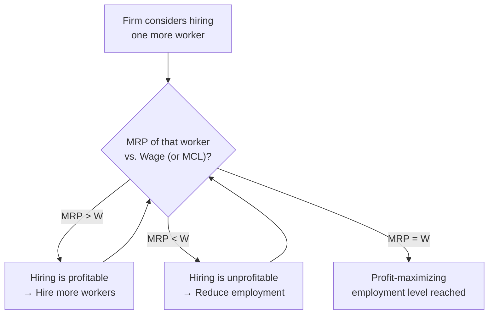
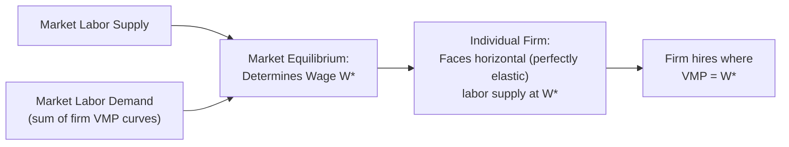

## Marginal Revenue Product and Wage Determination

### Definition and Theoretical Foundation

The theory of Marginal Revenue Product (MRP) provides the neoclassical explanation for how wages and employment levels are determined for a specific factor of production — labor — under the assumption that firms are profit maximizers. This theory forms the demand-side counterpart to labor supply analysis and is the foundational framework linking the value of a worker's output to the wage that worker is paid.

**Key Points**

- The theory rests on the principle that a profit-maximizing firm will hire additional units of any input up to the point where the additional revenue generated by that input equals its additional cost
- MRP theory is a specific application of the more general **marginal productivity theory of factor pricing**, which extends analogously to capital, land, and other factors of production
- The theory provides a **normative benchmark** as well as a positive/descriptive model: under perfectly competitive conditions, it implies that each factor is paid the value of its marginal contribution to output, which is often cited as an efficiency (and sometimes fairness) justification for market-determined factor incomes

### Deriving Marginal Revenue Product

#### Marginal Physical Product (MPP) / Marginal Product of Labor (MPL)

**Key Points**

- The **Marginal Physical Product of Labor (MPPL or MPL)** is the additional physical output (units of the good) produced by employing one additional unit of labor, holding all other inputs constant
- In the short run, with capital fixed, the **Law of Diminishing Marginal Returns** implies that MPL eventually declines as successive units of labor are added, since each additional worker has proportionally less capital and other fixed inputs to work with

#### From MPP to MRP

**Key Points**

- The **Marginal Revenue Product (MRP)** converts the physical output contribution into a monetary revenue contribution by multiplying MPL by the marginal revenue (MR) obtained from selling the additional output:

$$MRP = MPL \times MR$$

- Under **perfect competition in the output market**, the firm is a price taker, so $MR = P$ (price), giving the special case:

$$MRP = MPL \times P$$

This special case is sometimes labeled the **Value of the Marginal Product (VMP)** to distinguish it from the general MRP formula, though the two coincide exactly under output-market perfect competition

- Under **imperfect competition in the output market** (monopoly, monopolistic competition, oligopoly), $MR < P$ and declines as output increases (since the firm must lower price to sell additional units), so:

$$MRP = MPL \times MR < MPL \times P$$

meaning MRP is strictly less than VMP whenever the firm has output-market pricing power

**Example**

Suppose a firm's fourth worker adds 10 units of output (MPL = 10), and the firm sells its product in a perfectly competitive market at $5 per unit ($MR = P = \$5$).

$$MRP_4 = 10 \times \$5 = \$50$$

If instead the firm has some output-market pricing power such that selling the additional 10 units requires a price cut lowering marginal revenue to $3.50 per unit (reflecting the standard result that $MR < P$ under imperfect competition):

$$MRP_4 = 10 \times \$3.50 = \$35$$

### The Firm's Profit-Maximizing Hiring Rule

**Key Points**

- A profit-maximizing firm hires labor up to the point where the **Marginal Revenue Product of Labor equals the Marginal Cost of Labor (MCL)**:

$$MRP = MCL$$

- In a **perfectly competitive labor market**, the firm is a wage taker, and $MCL = W$ (the market wage), so the hiring rule simplifies to:

$$MRP = W$$

- This condition generates the firm's individual **labor demand curve**: it is simply the (declining) MRP curve itself, since at every wage level, the firm's optimal quantity of labor is read directly off the MRP schedule
- If $MRP > W$, the firm profits from hiring an additional worker, since the worker generates more revenue than they cost — the firm should keep hiring
- If $MRP < W$, the last worker hired costs more than the revenue generated — the firm should reduce employment
- Equilibrium hiring occurs precisely where these two forces balance

### Wage Determination Under Perfect Competition in Both Output and Labor Markets

**Key Points**

- Under the "doubly competitive" case — perfect competition in both the labor market and the output market — the equilibrium wage is determined at the market level by aggregate labor supply and aggregate labor demand (the horizontal sum of individual firms' MRP = VMP curves)
- Each individual firm, being a wage taker, faces a **perfectly elastic (horizontal) labor supply curve** at the market-determined wage, and hires labor until its own $VMP = W$
- This produces the classical result: in long-run competitive equilibrium, **each worker is paid a wage equal to the value of their marginal product** — a result central to the marginal productivity theory of income distribution

### Wage Determination Under Imperfect Competition

#### Output Market Power (Monopoly/Monopolistic Competition Selling, Competitive Hiring)

**Key Points**

- When a firm has pricing power in its output market but remains a wage taker in a competitive labor market, it hires according to $MRP = W$, where $MRP < VMP$
- Because $MRP < VMP$, the firm pays workers a wage that is **less than the value of their marginal product** as measured by output price — this gap is sometimes referred to as a form of **monopolistic exploitation** in classical labor economics terminology, distinguishing it from the wage suppression that arises specifically from labor-market monopsony power
- This occurs even though the firm is still paying the full competitive wage rate; the "exploitation" language reflects the fact that consumers, not the firm's wage-setting behavior, ultimately bear the cost of the output-market markup, while workers are paid based on marginal revenue rather than the higher retail value of their output

#### Labor Market Power (Monopsony Hiring)

**Key Points**

- When a firm has wage-setting power in the labor market (monopsony), it faces the **upward-sloping market labor supply curve** directly, meaning it must raise the wage paid to *all* workers (not just the marginal hire) in order to attract additional labor
- This creates a **Marginal Cost of Labor (MCL) curve that lies above the labor supply curve**, since the cost of hiring one more worker includes the higher wage paid to that worker plus the increase in wages paid to all previously-hired inframarginal workers
- The monopsonist hires where $MRP = MCL$ (not $MRP = W$), then pays the wage read off the labor supply curve at that quantity — this wage is **below** both $MRP$ and the wage that would prevail under competitive labor-market hiring
- This wage gap is termed **monopsonistic exploitation**: workers are paid less than their marginal revenue product specifically because of the firm's labor-market wage-setting power, distinct from and additional to any output-market-based gap
- **Combined case**: a firm with both output-market pricing power and labor-market monopsony power will pay a wage below $VMP$ for two independent reasons simultaneously — first because $MRP < VMP$ (output market power), and second because $W < MRP$ (labor market power) — compounding the total gap between wage and the value of marginal product

| Market Structure Combination | Hiring Rule | Wage vs. VMP Relationship |
| --- | --- | --- |
| Competitive output market + competitive labor market | $VMP = W$ | $W = VMP$ (no gap) |
| Imperfect output market + competitive labor market | $MRP = W$ | $W = MRP < VMP$ (output-market gap only) |
| Competitive output market + monopsony labor market | $VMP = MCL$ | $W < VMP = MRP$ (labor-market gap only) |
| Imperfect output market + monopsony labor market | $MRP = MCL$ | $W < MRP < VMP$ (both gaps compound) |

### Aggregation to the Market Level and Income Distribution

**Key Points**

- Summing individual firms' MRP-based (or VMP-based) labor demand curves horizontally yields the **market labor demand curve**, which interacts with market labor supply to determine the market wage, as covered in labor market supply and demand analysis
- The **marginal productivity theory of distribution** extends this framework as a general explanation of factor income shares: under competitive conditions, each factor of production (labor, capital, land) is paid according to its marginal revenue product, and the **functional distribution of income** (the division of national income between wages, profits, rent, and interest) reflects the relative marginal productivities and quantities of each factor employed
- [Inference] While MRP theory provides a coherent framework for factor pricing under idealized competitive conditions, real-world wage determination is also influenced by factors the basic model does not fully capture — including bargaining power, information asymmetries, efficiency wage considerations, institutional wage-setting mechanisms (unions, minimum wage laws), and labor market frictions/search costs — meaning observed wages may diverge from a strict $MRP = W$ prediction to varying degrees depending on the specific labor market studied.

### Diagram: MRP-Based Wage Gaps Across Market Structures (svg_diagram)

<svg xmlns="http://www.w3.org/2000/svg" viewBox="0 0 760 340">
<text x="380" y="26" text-anchor="middle" font-size="16" font-weight="bold" fill="#1a1a1a">Wage vs. Value of Marginal Product Across Market Structures (svg_diagram)</text>
<line x1="70" y1="290" x2="720" y2="290" stroke="#333" stroke-width="1.5" />
<text x="395" y="315" text-anchor="middle" font-size="11" fill="#333">Increasing degree of firm market power (output and/or labor market)</text>
<rect x="90" y="80" width="140" height="45" rx="6" fill="#eafaf1" stroke="#27ae60" stroke-width="2" />
<text x="160" y="102" text-anchor="middle" font-size="10" font-weight="bold" fill="#1a1a1a">Competitive Output</text>
<text x="160" y="117" text-anchor="middle" font-size="10" font-weight="bold" fill="#1a1a1a">+ Competitive Labor</text>
<line x1="160" y1="125" x2="160" y2="290" stroke="#27ae60" stroke-width="2" />
<text x="160" y="270" text-anchor="middle" font-size="10" fill="#27ae60">W = VMP</text>
<rect x="270" y="110" width="140" height="45" rx="6" fill="#fdf2e3" stroke="#d68910" stroke-width="2" />
<text x="340" y="132" text-anchor="middle" font-size="10" font-weight="bold" fill="#1a1a1a">Imperfect Output</text>
<text x="340" y="147" text-anchor="middle" font-size="10" font-weight="bold" fill="#1a1a1a">+ Competitive Labor</text>
<line x1="340" y1="155" x2="340" y2="290" stroke="#d68910" stroke-width="2" />
<text x="340" y="270" text-anchor="middle" font-size="10" fill="#d68910">W = MRP &lt; VMP</text>
<rect x="450" y="140" width="140" height="45" rx="6" fill="#fdecea" stroke="#c0392b" stroke-width="2" />
<text x="520" y="162" text-anchor="middle" font-size="10" font-weight="bold" fill="#1a1a1a">Competitive Output</text>
<text x="520" y="177" text-anchor="middle" font-size="10" font-weight="bold" fill="#1a1a1a">+ Monopsony Labor</text>
<line x1="520" y1="185" x2="520" y2="290" stroke="#c0392b" stroke-width="2" />
<text x="520" y="270" text-anchor="middle" font-size="10" fill="#c0392b">W &lt; MRP = VMP</text>
<rect x="600" y="180" width="140" height="55" rx="6" fill="#f4ecf7" stroke="#8e44ad" stroke-width="2" />
<text x="670" y="202" text-anchor="middle" font-size="10" font-weight="bold" fill="#1a1a1a">Imperfect Output</text>
<text x="670" y="217" text-anchor="middle" font-size="10" font-weight="bold" fill="#1a1a1a">+ Monopsony Labor</text>
<line x1="670" y1="235" x2="670" y2="290" stroke="#8e44ad" stroke-width="2" />
<text x="670" y="270" text-anchor="middle" font-size="9" fill="#8e44ad">W &lt; MRP &lt; VMP</text>
</svg>

**Related Topics**

- Labor Market Supply and Demand (the market-level framework MRP theory feeds into)
- Monopsony and Employer Market Power in Labor Markets
- The Marginal Productivity Theory of Income Distribution
- Diminishing Marginal Returns and Short-Run Production Theory
- Efficiency Wage Theory and Institutional Wage-Setting
- Functional Distribution of Income (wages, profit, rent, interest shares)
- Minimum Wage Policy: Theory and Empirical Evidence