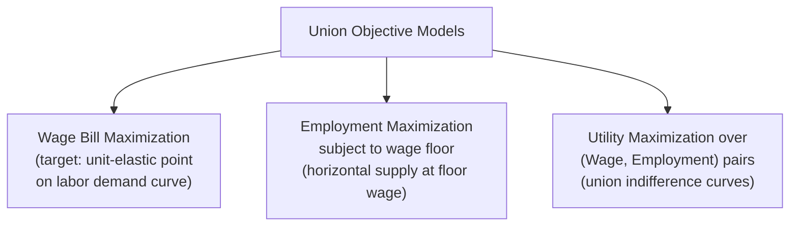
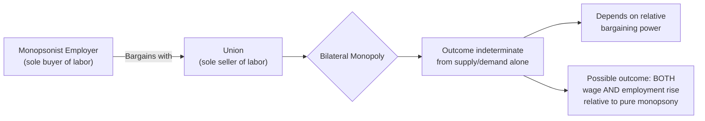

## Labor Unions and Collective Bargaining

### Definition and Economic Role

A labor union is an organization of workers formed to collectively negotiate with employers over wages, benefits, working conditions, and other terms of employment, rather than each worker bargaining individually. Economically, unions function as a mechanism for aggregating the bargaining power of individual workers, who typically have limited leverage in isolated wage negotiations, into a single collective bargaining agent capable of exercising market power on the supply side of the labor market.

**Key Points**

- **Collective bargaining** is the formal process through which a union negotiates a binding contract (collective bargaining agreement, or CBA) with an employer or group of employers, covering wages, hours, benefits, grievance procedures, and workplace rules
- Economically, a union can be modeled as introducing an element of **monopoly power on the supply side** of the labor market — a single seller (the union) negotiating with either many competitive buyers or, in some cases, a single monopsonist buyer of labor
- Union density (the share of the workforce that is unionized) and bargaining structure (firm-level, sector-level, or national-level bargaining) vary substantially across countries and historical periods, materially affecting the applicability of any specific theoretical model to a given labor market

### Union Objectives: Theoretical Models

Because a union represents workers with potentially differing interests (e.g., senior vs. junior members, employed vs. potential members), economists have proposed several stylized models of what a union is assumed to maximize when bargaining.

#### Wage Bill Maximization

**Key Points**

- Under this objective, the union seeks to maximize the total wage bill, $W \times L$ (wage rate multiplied by employment)
- This objective implies the union will push for the wage rate at which the **elasticity of labor demand equals unity** (the point of maximum revenue on the demand curve), analogous to a revenue-maximizing monopolist's output choice
- At wages above this point, demand is elastic, so a further wage increase would reduce total membership employment proportionally more than the wage gain, reducing the wage bill — the union would not push further in that region under this objective

#### Employment Maximization Subject to a Wage Floor

**Key Points**

- Under this objective, the union sets a minimum acceptable wage (often tied to alternative wages available elsewhere, or a politically/socially determined floor) and then seeks to maximize employment subject to that wage floor being met
- This produces a union labor supply curve that is **perfectly elastic (horizontal) at the negotiated wage** up to the point where it intersects the labor demand curve, beyond which the union supply curve reverts to reflecting the underlying market supply conditions

#### Maximizing a Utility Function Over Wages and Employment

**Key Points**

- A more general model treats the union as maximizing a **utility function** that combines both the wage rate and the level of employment (or membership), reflecting that unions typically care about both dimensions rather than purely one or the other
- This can be represented with union indifference curves over the wage-employment space, with the union choosing a point along the labor demand curve that reaches the highest attainable indifference curve — conceptually parallel to standard consumer choice theory, but applied to a collective bargaining agent
- The specific point chosen depends on the relative weight the union places on higher wages for current members versus preserving or expanding employment levels

### Union Wage Effects in a Competitive Labor Market

**Key Points**

- If a union successfully negotiates a wage above the competitive equilibrium wage in an otherwise competitive labor market, the standard supply-and-demand prediction is a **movement along the labor demand curve to a lower employment level** than would prevail competitively — the higher wage benefits workers who remain employed, but at the cost of reduced employment (a labor market analog to a binding minimum wage)
- Workers displaced from the unionized sector may seek employment in the **non-unionized sector**, increasing labor supply there and depressing wages in that sector — this **spillover effect** means the true welfare and distributional impact of unionization must be assessed across the labor market as a whole, not solely within the unionized sector
- [Standard Result] This "monopoly union" prediction of reduced employment in the unionized sector is the standard competitive-market theoretical result; the magnitude of any actual employment effect in practice depends on the elasticity of labor demand in the specific industry and is subject to ongoing empirical research, since real-world outcomes can also reflect efficiency gains or bargaining outcomes not captured in the simplest competitive model.

### Bilateral Monopoly: Union Facing a Monopsonist Employer

A theoretically distinct and important case arises when a union (the sole seller of labor) bargains directly with a monopsonist employer (the sole buyer of labor) — a situation termed **bilateral monopoly**.

**Key Points**

- Unlike the standard competitive-market case, when a union negotiates with a monopsonist, the outcome can potentially **raise both the wage and employment simultaneously** relative to the unconstrained monopsony outcome, because a wage negotiated above the monopsony wage (up to a point) removes the monopsonist's incentive to restrict hiring in order to avoid bidding up wages on all inframarginal workers
- The **wage and employment outcome under bilateral monopoly is theoretically indeterminate** from the supply and demand curves alone — unlike the single-sided monopoly or monopsony cases, there is no unique equilibrium point determined purely by cost and revenue curves; the actual outcome depends on the relative bargaining power, bargaining strategies, and negotiation process of the two parties, which falls into the domain of bargaining theory (e.g., Nash bargaining solutions) rather than standard marginal analysis
- This case is often used to illustrate why unionization in already-monopsonistic labor markets (e.g., historically, a single large employer in an isolated "company town") could in principle improve both wages and employment outcomes relative to the unchecked monopsony outcome, in contrast to the standard competitive-market prediction of a wage-employment trade-off

### Diagram: Union Wage Effect in a Competitive Market vs. Bilateral Monopoly (svg_diagram)

<svg xmlns="http://www.w3.org/2000/svg" viewBox="0 0 780 420">
<text x="390" y="26" text-anchor="middle" font-size="16" font-weight="bold" fill="#1a1a1a">Union Bargaining Outcomes by Market Context (svg_diagram)</text>

<text x="200" y="55" text-anchor="middle" font-size="13" font-weight="bold" fill="`#1a1a1a`">Competitive Labor Market</text>

<line x1="60" y1="330" x2="380" y2="330" stroke="#333" stroke-width="1.5" />

<line x1="60" y1="330" x2="60" y2="80" stroke="#333" stroke-width="1.5" />

<text x="380" y="350" text-anchor="middle" font-size="10" fill="#333">Employment (L)</text>

<line x1="60" y1="300" x2="360" y2="110" stroke="#2980b9" stroke-width="2" />
<text x="365" y="107" font-size="9" fill="#2980b9">Supply</text>
<line x1="60" y1="120" x2="360" y2="310" stroke="#c0392b" stroke-width="2" />
<text x="365" y="315" font-size="9" fill="#c0392b">Demand</text>
<circle cx="210" cy="215" r="4" fill="#1a1a1a" />
<text x="210" y="205" text-anchor="middle" font-size="9" fill="#1a1a1a">W_c, L_c</text>
<line x1="60" y1="150" x2="270" y2="150" stroke="#27ae60" stroke-width="2" stroke-dasharray="4" />
<circle cx="270" cy="150" r="4" fill="#27ae60" />
<text x="270" y="140" text-anchor="middle" font-size="9" fill="#27ae60">W_union &gt; W_c</text>
<line x1="270" y1="150" x2="270" y2="330" stroke="#27ae60" stroke-width="1" stroke-dasharray="2" />
<text x="270" y="345" text-anchor="middle" font-size="9" fill="#27ae60">L_union &lt; L_c</text>

<text x="590" y="55" text-anchor="middle" font-size="13" font-weight="bold" fill="`#1a1a1a`">Bilateral Monopoly</text>

<line x1="450" y1="330" x2="770" y2="330" stroke="#333" stroke-width="1.5" />

<line x1="450" y1="330" x2="450" y2="80" stroke="#333" stroke-width="1.5" />

<text x="770" y="350" text-anchor="middle" font-size="10" fill="#333">Employment (L)</text>

<line x1="450" y1="300" x2="750" y2="110" stroke="#2980b9" stroke-width="2" />
<path d="M 450 280 Q 620 150 750 90" stroke="#8e44ad" stroke-width="2" fill="none" />
<text x="755" y="87" font-size="9" fill="#8e44ad">MCL</text>
<line x1="450" y1="120" x2="750" y2="310" stroke="#c0392b" stroke-width="2" />
<circle cx="590" cy="220" r="4" fill="#1a1a1a" />
<text x="590" y="210" text-anchor="middle" font-size="9" fill="#1a1a1a">Monopsony: W_m, L_m</text>
<circle cx="640" cy="180" r="4" fill="#27ae60" />
<text x="640" y="170" text-anchor="middle" font-size="9" fill="#27ae60">Possible bargained outcome:</text>
<text x="640" y="395" text-anchor="middle" font-size="9" fill="#27ae60">Higher W AND higher L</text>
</svg>

### Determinants of Union Bargaining Power

**Key Points**

- **Elasticity of labor demand**: unions achieve larger wage gains for a given employment cost when labor demand is relatively inelastic (e.g., low substitutability with capital, inelastic product demand, labor being a small share of total cost) — consistent with the derived-demand determinants discussed in labor market analysis
- **Ability to restrict labor supply / strike threat credibility**: a union's bargaining leverage depends on its capacity to withhold labor collectively (strike action) and impose costs on the employer, as well as the employer's ability to withstand or circumvent a work stoppage (e.g., through strikebreaking, automation, or outsourcing)
- **Legal and institutional environment**: labor law governing the right to strike, mandatory bargaining requirements, union recognition procedures, and "right-to-work" provisions materially affect union density and bargaining strength, and vary substantially across jurisdictions
- **Product market conditions**: unions in industries facing less competitive pressure (e.g., protected or regulated industries) may extract larger wage gains, since the employer's ability to pass on higher labor costs to consumers via price increases is greater when product demand is less elastic

### Broader Economic Effects and Empirical Considerations

**Key Points**

- **Wage compression / reduced wage dispersion**: unions have historically been associated with narrowing wage differentials within a workforce (e.g., between skill levels or between union and comparable non-union workers), often cited as a distributional effect independent of the average wage level effect
- **"Voice" versus "monopoly" effects**: some labor economics literature distinguishes a monopoly-type effect (unions raising wages above competitive levels, with associated efficiency costs) from a "voice" effect, wherein unions provide a formal mechanism for workers to communicate grievances and preferences to management, potentially improving productivity, reducing turnover, and improving workplace outcomes independent of the wage-setting function
- [Unverified] The relative empirical magnitude of monopoly-type wage/employment effects versus voice/productivity effects varies across studies, industries, and time periods, and remains a subject of active empirical labor economics research; specific quantitative conclusions should be checked against current empirical literature for the relevant country and sector rather than assumed to generalize.
- **International and sectoral variation**: bargaining structures range from highly centralized, economy-wide bargaining (common historically in several European economies) to decentralized firm-level bargaining, with different theoretical and empirical implications for wage-setting, employment, and macroeconomic outcomes such as wage inflation and unemployment

### Union Formation and Free-Rider Considerations

**Key Points**

- Because the benefits negotiated by a union (e.g., a higher wage or improved workplace safety standards) often extend to all workers in a bargaining unit regardless of individual union membership, unionization can face a **collective action / free-rider problem**, analogous to the public goods provision problem, since individual workers may have an incentive to avoid membership dues while still benefiting from negotiated outcomes
- **Union security arrangements** (such as mandatory membership or agency-fee provisions, where legally permitted) are sometimes analyzed in economic literature as institutional responses to this free-rider problem, though such arrangements are themselves subject to significant legal and political variation and contestation across jurisdictions

**Related Topics**

- Labor Market Supply and Demand (the underlying competitive benchmark unions modify)
- Marginal Revenue Product and Wage Determination
- Monopsony and Employer Market Power in Labor Markets
- Minimum Wage Policy: Theory and Empirical Evidence
- Bargaining Theory and the Nash Bargaining Solution
- Public Goods and the Free-Rider Problem
- Comparative Labor Market Institutions Across Countries