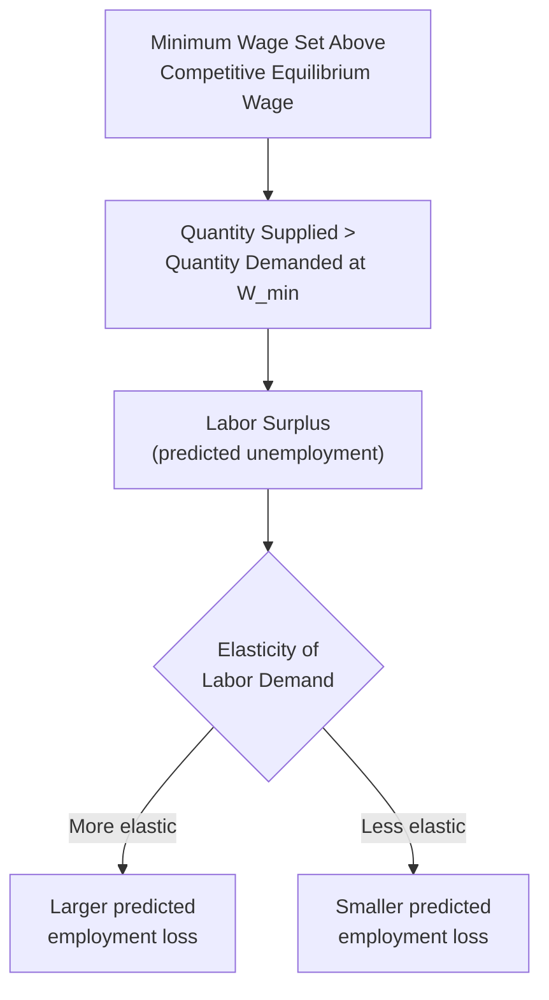
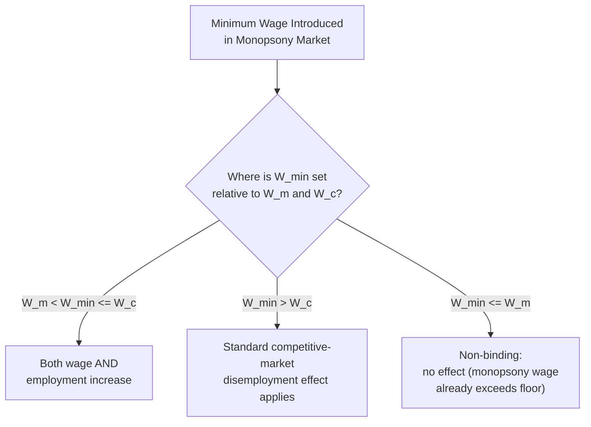

## Minimum Wage Effects and Empirical Debates

### Definition and Scope

A minimum wage is a legally mandated wage floor below which employers are prohibited from paying covered workers. While the basic policy is simple to state, its predicted and observed economic effects depend critically on the underlying structure of the labor market to which it is applied, making minimum wage analysis one of the most theoretically nuanced and empirically contested topics in labor economics.

**Key Points**

- A minimum wage is only **binding** (has any economic effect) if set above the wage that would otherwise prevail in the relevant labor market; a minimum wage set below the prevailing market wage has no direct effect on employment or wages
- The predicted effect of a binding minimum wage differs sharply depending on whether the underlying labor market is modeled as **perfectly competitive** or as exhibiting **employer market power (monopsony)** — this theoretical divergence is central to understanding why the topic remains empirically contested
- Minimum wage policy is frequently justified on distributional/equity grounds (raising incomes for low-wage workers) even where efficiency-based theoretical predictions suggest potential employment costs, creating an explicit equity-efficiency trade-off that is central to the policy debate

### Standard Competitive Market Model

#### Theoretical Prediction

**Key Points**

- In a perfectly competitive labor market, the equilibrium wage $W^*$ equates labor supply and labor demand
- A minimum wage $W_{min}$ set above $W^*$ creates a situation where the quantity of labor supplied at $W_{min}$ exceeds the quantity of labor demanded at $W_{min}$, producing a **labor surplus**, commonly interpreted as unemployment (or underemployment) among workers willing to work at the mandated wage but unable to find employment
- The size of this surplus, and therefore the predicted disemployment effect, depends on the **elasticity of labor demand and labor supply** in the affected market — more elastic demand implies a larger predicted employment reduction for a given wage increase
- This is the standard textbook result and functions as the baseline theoretical prediction against which empirical minimum wage research is typically compared

#### Who Bears the Effects Under the Competitive Model

**Key Points**

- Workers who remain employed after the minimum wage increase receive a higher wage — a clear gain for this group
- Workers who lose employment or cannot find employment at the new wage bear a cost — the standard model does not, by itself, predict who specifically falls into this category, though search and matching frictions in practice often mean job loss falls disproportionately on the least experienced or lowest-productivity workers within the affected group
- Employers face higher labor costs, which may be absorbed through reduced profit margins, passed on to consumers via higher prices, offset through reduced non-wage benefits or hours, or addressed through reduced total employment or hiring

### Monopsony Model

#### Theoretical Prediction

**Key Points**

- In a labor market with a monopsonist employer (or employers with substantial wage-setting power more generally), the unconstrained equilibrium wage $W_m$ and employment level $L_m$ are both **below** the levels that would prevail under perfect competition, because the monopsonist restricts hiring to avoid bidding up wages paid to all inframarginal workers
- A minimum wage introduced into this setting, if set appropriately **between the monopsony wage $W_m$ and the competitive wage $W_c$**, effectively caps the marginal cost of labor at the mandated wage level for the relevant range of employment, removing the monopsonist's incentive to restrict hiring below the competitive level
- This can produce the theoretically distinctive and counterintuitive result that a minimum wage set in this range **increases both the wage and employment simultaneously**, in direct contrast to the competitive-market prediction of a wage-employment trade-off
- If the minimum wage is set **above** the competitive wage $W_c$, the standard competitive-market disemployment logic reasserts itself even in the monopsony case, since the wage floor now exceeds the level that would clear the market even under full competition

### Diagram: Minimum Wage Effects Under Competitive vs. Monopsony Models (svg_diagram)

<svg xmlns="http://www.w3.org/2000/svg" viewBox="0 0 800 420">
<text x="400" y="26" text-anchor="middle" font-size="16" font-weight="bold" fill="#1a1a1a">Minimum Wage: Competitive vs. Monopsony Predictions (svg_diagram)</text>

<text x="200" y="55" text-anchor="middle" font-size="13" font-weight="bold" fill="`#1a1a1a`">Competitive Market</text>

<line x1="60" y1="340" x2="380" y2="340" stroke="#333" stroke-width="1.5" />

<line x1="60" y1="340" x2="60" y2="80" stroke="#333" stroke-width="1.5" />

<text x="380" y="360" text-anchor="middle" font-size="10" fill="#333">Employment (L)</text>

<line x1="60" y1="310" x2="360" y2="110" stroke="#2980b9" stroke-width="2" />
<text x="365" y="107" font-size="9" fill="#2980b9">Supply</text>
<line x1="60" y1="120" x2="360" y2="320" stroke="#c0392b" stroke-width="2" />
<text x="365" y="325" font-size="9" fill="#c0392b">Demand</text>
<circle cx="210" cy="220" r="4" fill="#1a1a1a" />
<line x1="60" y1="220" x2="210" y2="220" stroke="#666" stroke-width="1" stroke-dasharray="3" />
<text x="55" y="224" text-anchor="end" font-size="9" fill="#1a1a1a">W_c</text>
<line x1="60" y1="160" x2="290" y2="160" stroke="#27ae60" stroke-width="2" stroke-dasharray="4" />
<text x="55" y="164" text-anchor="end" font-size="9" fill="#27ae60">W_min</text>
<line x1="150" y1="160" x2="150" y2="340" stroke="#666" stroke-width="1" stroke-dasharray="2" />
<line x1="290" y1="160" x2="290" y2="340" stroke="#666" stroke-width="1" stroke-dasharray="2" />
<text x="150" y="355" text-anchor="middle" font-size="8" fill="#c0392b">Qd (lower)</text>
<text x="290" y="355" text-anchor="middle" font-size="8" fill="#2980b9">Qs (higher)</text>
<line x1="150" y1="160" x2="290" y2="160" stroke="#c0392b" stroke-width="4" />
<text x="220" y="140" text-anchor="middle" font-size="9" fill="#c0392b" font-weight="bold">Surplus (unemployment)</text>

<text x="610" y="55" text-anchor="middle" font-size="13" font-weight="bold" fill="`#1a1a1a`">Monopsony Market</text>

<line x1="460" y1="340" x2="780" y2="340" stroke="#333" stroke-width="1.5" />

<line x1="460" y1="340" x2="460" y2="80" stroke="#333" stroke-width="1.5" />

<text x="780" y="360" text-anchor="middle" font-size="10" fill="#333">Employment (L)</text>

<line x1="460" y1="310" x2="760" y2="110" stroke="#2980b9" stroke-width="2" />
<path d="M 460 290 Q 620 150 760 90" stroke="#8e44ad" stroke-width="2" fill="none" />
<text x="765" y="87" font-size="9" fill="#8e44ad">MCL</text>
<line x1="460" y1="120" x2="760" y2="320" stroke="#c0392b" stroke-width="2" />
<circle cx="580" cy="235" r="4" fill="#1a1a1a" />
<text x="580" y="255" text-anchor="middle" font-size="9" fill="#1a1a1a">Monopsony: W_m, L_m</text>
<circle cx="640" cy="185" r="5" fill="#27ae60" />
<text x="640" y="175" text-anchor="middle" font-size="9" fill="#27ae60" font-weight="bold">W_min set here:</text>
<text x="640" y="400" text-anchor="middle" font-size="9" fill="#27ae60">Wage UP + Employment UP</text>
</svg>

### Empirical Approaches and Key Debates

#### Traditional Approach: Time-Series and Cross-Sectional Studies

**Key Points**

- Early empirical minimum wage research, often based on national time-series data relating aggregate teen or low-wage employment to the minimum wage level, generally found results broadly consistent with the standard competitive-market disemployment prediction
- [Unverified] The precise magnitude of employment elasticities estimated in this earlier literature varied across studies and specifications; specific numerical estimates should be checked against current academic literature rather than treated as a single settled figure.

#### The "New Economics of the Minimum Wage" and Natural Experiments

**Key Points**

- Beginning prominently in the 1990s, researchers including David Card and Alan Krueger employed **natural experiment / difference-in-differences** methodologies, comparing employment outcomes in a jurisdiction that raised its minimum wage against a similar neighboring jurisdiction that did not, in order to control for other confounding economic trends
- [Unverified] Some studies using this methodology, most notably Card and Krueger's research on fast-food employment following a New Jersey minimum wage increase relative to Pennsylvania, reported employment effects that were smaller than the standard competitive model would predict, and in some cases found no statistically significant negative employment effect, or small positive effects — this body of research has been highly influential but has also generated substantial methodological debate, including subsequent studies challenging or reanalyzing the original data and findings
- This line of research is often cited as providing empirical support consistent with monopsony-type models of low-wage labor markets, on the reasoning that if such markets exhibit meaningful employer wage-setting power, moderate minimum wage increases could raise wages without the disemployment effects predicted under pure competition
- [Unverified] The broader empirical literature following this approach has produced a range of estimates across different countries, time periods, minimum wage levels, and industries, and does not represent a fully settled consensus; the applicability of monopsony-consistent findings to any specific labor market, minimum wage level, or time period should be treated as an empirical question requiring reference to current research rather than assumed to generalize universally.

#### Key Sources of Ongoing Debate

**Key Points**

- **Magnitude and non-linearity of effects**: even among researchers broadly persuaded that moderate minimum wage increases have small disemployment effects, there is debate over whether sufficiently **large** minimum wage increases (relative to the local median or prevailing wage) would produce more substantial employment effects, since a minimum wage that is only mildly binding differs economically from one set far above the market-clearing wage
- **Heterogeneity across local labor markets**: because monopsony power (or lack thereof) can vary substantially by local labor market conditions, industry, and worker demographic group, a single national minimum wage may have quite different effects across different regions and sectors, complicating simple generalizations
- **Adjustment margins other than headcount employment**: firms facing a binding minimum wage may adjust along margins other than the number of workers employed, including reduced hours per worker, reduced non-wage benefits, reduced training investment, increased prices passed to consumers, or increased automation over time — meaning "no significant employment (headcount) effect" does not necessarily imply "no economic adjustment cost" from the policy
- **Long-run vs. short-run effects**: some adjustment margins (e.g., automation investment, business location decisions, long-run capital-labor substitution) may only manifest over a longer time horizon than typical natural-experiment study windows capture, raising questions about whether short-run empirical estimates fully reflect eventual long-run effects
- [Unverified] Given the breadth and continued evolution of this empirical literature, general claims about minimum wage effects — whether asserting significant disemployment or asserting negligible employment effects — should be evaluated against current, context-specific empirical research for the relevant jurisdiction, wage level, and time period, rather than treated as a single universally applicable conclusion.

### Distributional and Related Policy Considerations

**Key Points**

- Even setting aside the employment-effect debate, minimum wage increases raise distinct distributional questions: the degree to which benefits accrue to workers in low-income households specifically (as opposed to, for example, secondary earners in higher-income households), and how gains are distributed across demographic groups
- Minimum wage policy is frequently discussed alongside alternative or complementary policy tools aimed at similar distributional goals, such as **earned income tax credits (wage subsidies)**, which raise take-home income for low-wage workers without directly imposing a wage floor on employers, and which some economists argue avoid the potential disemployment effects predicted under the competitive model, though such alternatives carry their own distinct fiscal costs and design trade-offs
- **Indexation**: some jurisdictions index minimum wage levels to inflation or median wage growth to avoid the value of the minimum wage eroding over time in real terms absent periodic legislative action, which introduces its own distinct set of policy design considerations

**Related Topics**

- Labor Market Supply and Demand (the competitive baseline model)
- Monopsony and Employer Market Power in Labor Markets
- Marginal Revenue Product and Wage Determination
- Labor Unions and Collective Bargaining
- Price Floors and Price Ceilings (general market intervention framework)
- Earned Income Tax Credits and Wage Subsidy Policy
- Difference-in-Differences and Natural Experiment Methodology in Applied Economics