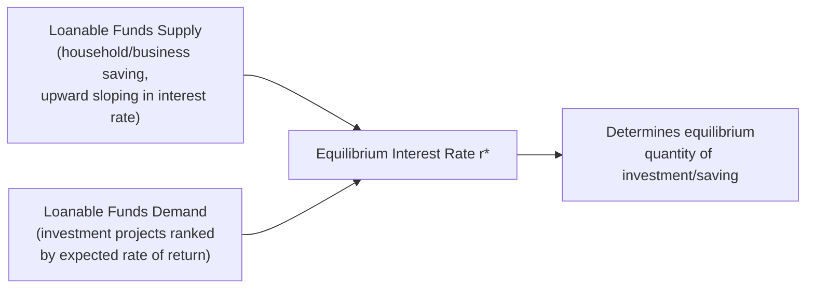
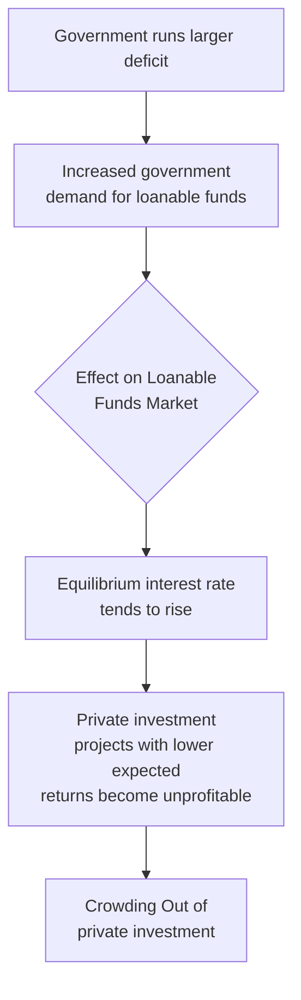

## Capital Markets and the Rate of Return

### Definition and Scope

Capital markets, in the factor-market sense used in economics, refer to the market in which physical and financial capital is supplied by savers/investors and demanded by firms seeking funds to invest in productive assets (machinery, equipment, structures, and other durable inputs). The **rate of return** — commonly represented by the interest rate — functions as the price that equilibrates the supply of loanable funds (savings) with the demand for those funds (investment), analogous to the wage in the labor market.

**Key Points**

- Capital as a factor of production must be distinguished from capital in the financial sense (funds, loans, securities); the **market for loanable funds** is the mechanism through which financial capital is channeled toward physical capital investment
- The demand for capital, like the demand for labor, is a **derived demand**: firms demand capital not for its own sake, but because it contributes to producing output that generates revenue
- The rate of return on capital serves two related roles simultaneously: it is the cost firms pay to acquire investment funds, and it is the return savers receive for deferring consumption

### The Market for Loanable Funds

#### Supply of Loanable Funds

**Key Points**

- The supply of loanable funds is derived primarily from household and business **saving** — the decision to defer consumption to a future period in exchange for a return
- The supply curve is generally modeled as **upward sloping** with respect to the interest rate: a higher interest rate increases the reward for saving (deferring consumption), inducing more saving, though the strength of this response depends on the relative size of substitution and income effects analogous to the labor supply case
- Additional sources of loanable funds supply include foreign capital inflows (savings from abroad seeking investment opportunities domestically) and, in short-run macroeconomic contexts, changes in the money supply via central bank policy, though the latter is more typically analyzed within monetary/macroeconomic frameworks rather than the classical factor-market model

#### Demand for Loanable Funds

**Key Points**

- The demand for loanable funds arises from firms seeking to finance investment projects, as well as government borrowing and, in an open-economy context, foreign borrowers
- Firms undertake an investment project if its expected rate of return exceeds the cost of financing it (the interest rate); as the interest rate rises, fewer investment projects remain profitable, so the **quantity of funds demanded declines** — producing a downward-sloping demand curve
- The demand curve for loanable funds is conceptually equivalent to ranking all available investment projects by their expected rate of return from highest to lowest, since firms will undertake progressively less profitable projects as the cost of capital falls

### The Marginal Efficiency of Capital

#### Deriving the Firm's Demand for Capital

Analogous to the Marginal Revenue Product framework used for labor, a firm's demand for capital reflects the additional revenue generated by employing additional units of capital.

**Key Points**

- The **Marginal Physical Product of Capital (MPPK)** is the additional output produced by employing one more unit of capital, holding labor and other inputs constant, subject to **diminishing marginal returns** in the short run (holding other inputs fixed)
- The **Marginal Revenue Product of Capital (MRPK)** is $MPPK \times MR$, analogous to MRPL in labor market analysis
- A profit-maximizing firm rents/employs capital up to the point where:

$$MRPK = r$$

where $r$ is the rental price of capital (or, more generally in investment decisions, the relevant cost-of-capital rate, which incorporates the interest rate along with depreciation and, where relevant, tax considerations)

- The **Marginal Efficiency of Capital (MEC)**, a concept developed by Keynes, refers to the expected rate of return on an additional unit of investment; firms invest in projects up to the point where the MEC equals the market interest rate (or cost of borrowing), since investing beyond that point would mean financing projects whose expected return is less than their financing cost

#### Net Present Value Framework

**Key Points**

- Investment decisions are frequently formalized using **Net Present Value (NPV)** analysis, comparing the present discounted value of a project's expected future cash flows against its upfront cost:

$$NPV = \sum_{t=1}^{n} \frac{CF_t}{(1+r)^t} - C_0$$

where $CF_t$ is the expected cash flow in period $t$, $r$ is the discount rate (typically the cost of capital or relevant interest rate), $n$ is the project's time horizon, and $C_0$ is the initial investment cost

- A rational firm undertakes an investment project if $NPV > 0$ at the relevant discount rate; as the discount rate (interest rate) rises, the present value of future cash flows falls, reducing the number of projects with positive NPV — this is the microeconomic foundation for the inverse relationship between the interest rate and aggregate investment demand
- The **internal rate of return (IRR)** of a project is the discount rate at which $NPV = 0$; a project is undertaken if its IRR exceeds the market interest rate (cost of capital), providing an equivalent decision rule to the NPV approach for most standard investment comparisons

### Determinants of Capital Demand and Supply (Shifts)

#### Demand-Side Determinants

**Key Points**

- **Technological change**: innovations that increase the marginal product of capital shift capital demand outward, raising the equilibrium interest rate and quantity of investment, all else equal
- **Business expectations and confidence**: optimistic expectations about future product demand or profitability increase the expected return on prospective investment projects, shifting capital demand outward
- **Corporate tax policy**: investment tax credits, depreciation allowances, or changes in the corporate tax rate can alter the after-tax return to investment, shifting capital demand
- **Government borrowing**: increased government deficit spending financed by borrowing adds to the demand for loanable funds, and — absent an offsetting increase in supply — can raise the equilibrium interest rate, a phenomenon commonly termed **crowding out** of private investment

#### Supply-Side Determinants

**Key Points**

- **Household saving preferences**: shifts in time preference (patience) or demographic factors (e.g., an aging population with different saving behavior across life-cycle stages) shift the supply of loanable funds
- **National income levels**: higher aggregate income generally increases the pool of funds available for saving, shifting loanable funds supply outward
- **Capital inflows from abroad**: in an open economy, foreign investors seeking returns can supplement domestic loanable funds supply, and are themselves responsive to relative interest rates and exchange rate expectations across countries
- **Government fiscal policy**: a government budget surplus (public saving) adds to the supply of loanable funds, while a deficit (as noted above) instead adds to demand for funds, illustrating the interconnected effect of fiscal policy on the loanable funds market from both sides

### Diagram: Investment Decision via NPV and the Interest Rate (svg_diagram)

<svg xmlns="http://www.w3.org/2000/svg" viewBox="0 0 760 380">
<text x="380" y="26" text-anchor="middle" font-size="16" font-weight="bold" fill="#1a1a1a">Capital Demand as Ranked Investment Projects (svg_diagram)</text>
<line x1="80" y1="330" x2="700" y2="330" stroke="#333" stroke-width="1.5" />
<line x1="80" y1="330" x2="80" y2="60" stroke="#333" stroke-width="1.5" />
<text x="700" y="350" text-anchor="middle" font-size="11" fill="#333">Quantity of Investment</text>
<text x="45" y="195" text-anchor="middle" font-size="11" fill="#333" transform="rotate(-90 45 195)">Interest Rate / Expected Return</text>
<rect x="100" y="80" width="50" height="250" fill="#27ae60" opacity="0.7" />
<text x="125" y="75" text-anchor="middle" font-size="9" fill="#333">Project A (18%)</text>
<rect x="155" y="140" width="50" height="190" fill="#2ecc71" opacity="0.7" />
<text x="180" y="135" text-anchor="middle" font-size="9" fill="#333">Project B (14%)</text>
<rect x="210" y="190" width="50" height="140" fill="#82e0aa" opacity="0.7" />
<text x="235" y="185" text-anchor="middle" font-size="9" fill="#333">Project C (10%)</text>
<rect x="265" y="230" width="50" height="100" fill="#d5f5e3" opacity="0.9" stroke="#27ae60" />
<text x="290" y="225" text-anchor="middle" font-size="9" fill="#333">Project D (7%)</text>
<rect x="320" y="260" width="50" height="70" fill="#fadbd8" opacity="0.7" />
<text x="345" y="255" text-anchor="middle" font-size="9" fill="#333">Project E (4%)</text>
<line x1="80" y1="240" x2="700" y2="240" stroke="#c0392b" stroke-width="2" stroke-dasharray="6" />
<text x="620" y="232" text-anchor="middle" font-size="11" fill="#c0392b" font-weight="bold">Market Interest Rate r* = 8%</text>

<text x="380" y="365" text-anchor="middle" font-size="11" fill="#333">Projects A, B, C undertaken (return exceeds r*); Projects D, E rejected (return below r*)</text>

</svg>

### Real vs. Nominal Rates of Return

**Key Points**

- The **nominal interest rate** is the observed, stated rate of return before adjusting for inflation, while the **real interest rate** adjusts for expected changes in purchasing power
- The relationship is commonly approximated by the **Fisher equation**:

$$r_{real} \approx r_{nominal} - \pi^e$$

where $\pi^e$ is the expected inflation rate; the more precise (exact) relationship is:

$$(1 + r_{nominal}) = (1 + r_{real})(1 + \pi^e)$$

- Investment and saving decisions are generally modeled as responding to the **real** interest rate, since it reflects the actual purchasing-power return to saving or actual purchasing-power cost of borrowing, net of inflation's erosion of nominal returns
- [Inference] In practice, since expected future inflation is not directly observable and must be estimated by economic agents, real-world investment and saving decisions are influenced by inflation *expectations*, which can diverge from actual subsequently realized inflation, introducing an additional source of variability in observed investment behavior relative to the simplified theoretical model.

### Application to Income Distribution

**Key Points**

- Under the marginal productivity theory of distribution, capital owners (savers/investors) receive **interest and profit** as their factor payment, determined — in a competitive capital market — by the marginal revenue product of capital, mirroring the labor market's wage determination via MRPL
- The **functional distribution of income** (the division of national income between labor income and capital income) reflects, under this framework, the relative quantities and marginal productivities of labor and capital employed in the economy, and can shift over time in response to changes in technology (e.g., capital-biased technological change), capital accumulation, and relative factor scarcity
- [Unverified] The empirical determinants of observed long-run trends in the labor share versus capital share of national income (in any specific country or time period) are a subject of ongoing empirical macroeconomic and labor economics research, involving factors beyond the basic marginal productivity framework, such as market power, bargaining institutions, and international capital mobility; specific claims about these trends should be verified against current research.

**Related Topics**

- Labor Market Supply and Demand (parallel factor market framework)
- Marginal Revenue Product and Wage Determination
- Present Value, Discounting, and Investment Appraisal
- Crowding Out and Fiscal Policy Effects on Investment
- Functional Distribution of Income (labor share vs. capital share)
- Land Markets and Economic Rent
- Monetary Policy and Interest Rate Determination in Macroeconomics