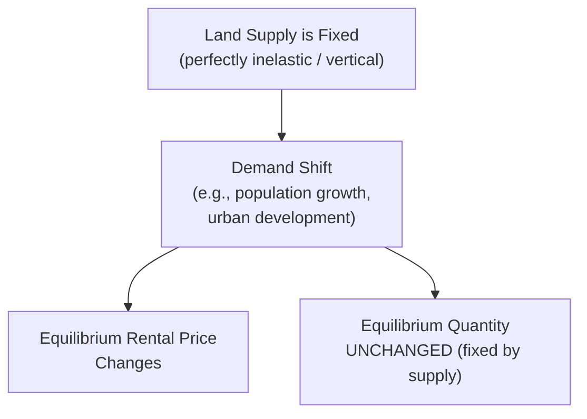
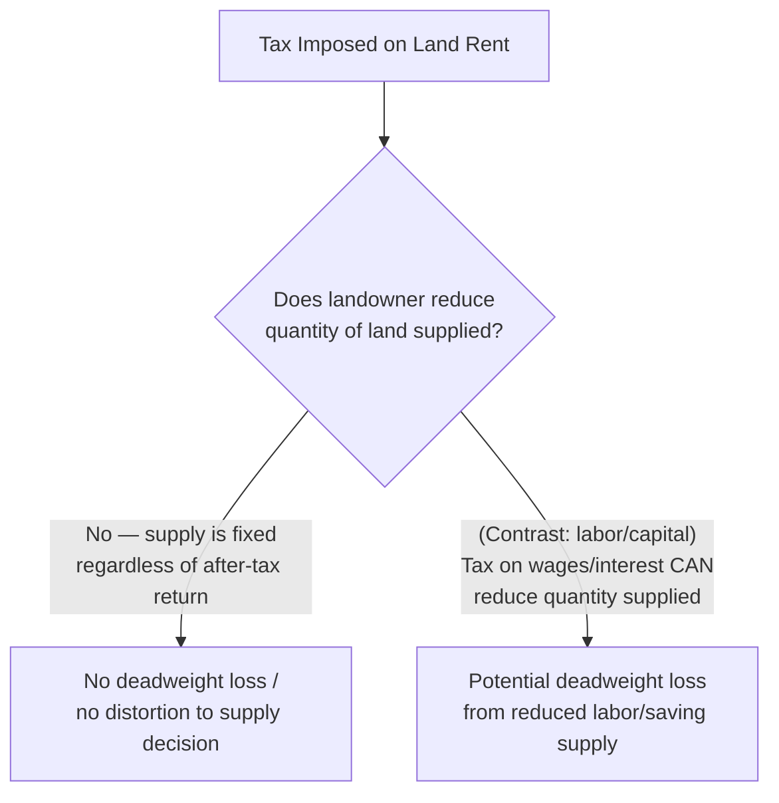

## Land Markets and Economic Rent

### Definition and Scope

Land, in classical and neoclassical economic analysis, refers to a factor of production distinguished by its **fixed supply** — natural resources and location-based assets that cannot be manufactured or reproduced in response to price signals, at least not in the way labor and capital can be. The market for land, and the broader concept of **economic rent** it gives rise to, provides a distinct factor-market model from labor and capital precisely because of this supply inelasticity.

**Key Points**

- In the classical economic tradition (particularly associated with David Ricardo), "land" refers not just to physical land area but more broadly to any factor of production whose total supply is fixed regardless of the price paid for its use
- **Economic rent** is defined as payment to a factor of production **in excess of the minimum amount required to keep that factor in its current use** (its opportunity cost) — this is a technical economic definition distinct from the everyday usage of "rent" as a periodic payment for the use of property
- The land market model serves as the polar-opposite case to a perfectly elastic factor supply, providing a useful theoretical bookend alongside the labor and capital market models

### Perfectly Inelastic Supply and Price Determination

#### The Vertical Supply Curve

**Key Points**

- Under the classical assumption, the total supply of land is **fixed** regardless of the rental price paid for its use, producing a **perfectly inelastic (vertical) supply curve** in a standard price-quantity diagram
- Because supply cannot respond to price, the **entire burden of determining the market price of land falls on demand**: the equilibrium rental rate is determined solely by where the (downward-sloping) demand curve for land intersects the fixed vertical supply
- A shift in demand for land (e.g., due to population growth, agricultural productivity changes, or urban development pressure) changes the equilibrium rental price with **no corresponding change in quantity supplied**, since quantity is fixed by assumption — this is a sharp contrast to labor and capital markets, where both price and quantity typically adjust to demand shifts

#### Economic Rent as Producer Surplus

**Key Points**

- Because land's opportunity cost of supply is effectively zero (or minimal) at the margin — the land exists regardless of whether it is paid for — the **entire payment received by landowners is classified as economic rent**, since none of it is required to induce additional supply
- This makes economic rent, in the case of a perfectly inelastic factor, conceptually equivalent to the entire **producer surplus** in that market: the full triangular area between the (fixed) supply curve and the market price, since there is no marginal cost of production to net out
- This is the foundation of Henry George's historically influential argument for a **"single tax" on land rent**: because land rent arises purely from location and scarcity value rather than from any productive effort or cost incurred by the landowner, a tax on land rent (unlike most other taxes) would not distort the incentive to supply land, since the quantity supplied does not respond to the after-tax return in the first place — a tax on a perfectly inelastically supplied factor is theoretically **non-distortionary**

### Diagram: Economic Rent Under Perfectly Inelastic Supply (svg_diagram)

<svg xmlns="http://www.w3.org/2000/svg" viewBox="0 0 700 400">
<text x="350" y="26" text-anchor="middle" font-size="16" font-weight="bold" fill="#1a1a1a">Economic Rent: Fixed Land Supply (svg_diagram)</text>
<line x1="80" y1="340" x2="620" y2="340" stroke="#333" stroke-width="1.5" />
<line x1="80" y1="340" x2="80" y2="60" stroke="#333" stroke-width="1.5" />
<text x="620" y="360" text-anchor="middle" font-size="11" fill="#333">Quantity of Land</text>
<text x="45" y="200" text-anchor="middle" font-size="11" fill="#333" transform="rotate(-90 45 200)">Rental Price</text>
<line x1="300" y1="70" x2="300" y2="340" stroke="#2980b9" stroke-width="3" />
<text x="310" y="65" font-size="11" fill="#2980b9">Fixed Supply (S)</text>
<line x1="90" y1="120" x2="600" y2="290" stroke="#c0392b" stroke-width="2" />
<text x="605" y="288" font-size="11" fill="#c0392b">Demand (D1)</text>
<line x1="90" y1="80" x2="600" y2="250" stroke="#8e44ad" stroke-width="2" stroke-dasharray="5" />
<text x="605" y="248" font-size="11" fill="#8e44ad">Demand (D2, higher)</text>
<circle cx="300" cy="205" r="4" fill="#1a1a1a" />
<line x1="80" y1="205" x2="300" y2="205" stroke="#666" stroke-width="1" stroke-dasharray="3" />
<text x="70" y="209" text-anchor="end" font-size="10" fill="#1a1a1a">R1</text>
<circle cx="300" cy="140" r="4" fill="#8e44ad" />
<line x1="80" y1="140" x2="300" y2="140" stroke="#666" stroke-width="1" stroke-dasharray="3" />
<text x="70" y="144" text-anchor="end" font-size="10" fill="#8e44ad">R2</text>
<polygon points="300,140 300,205 90,120" fill="#f4ecf7" opacity="0.5" />
<text x="230" y="175" text-anchor="middle" font-size="9" fill="#8e44ad">Rent increases</text>
<text x="230" y="188" text-anchor="middle" font-size="9" fill="#8e44ad">(R1 → R2)</text>

<text x="350" y="380" text-anchor="middle" font-size="11" fill="#333">Demand shift D1 → D2 changes rental price only; quantity remains fixed at Q*</text>

</svg>

### Extension: Quasi-Rent and Rent in Broader Factor Markets

**Key Points**

- The concept of economic rent extends beyond literal land to any factor or resource in **short-run fixed supply**, giving rise to the concept of **quasi-rent**: a payment in excess of opportunity cost that persists only in the short run, because in the long run the supply of the resource in question can adjust (unlike true land, whose supply is fixed even in the long run)
- **Example**: a highly specialized skill possessed by very few workers (e.g., a rare surgical specialty) may command a wage substantially above the opportunity cost of that individual's next-best alternative employment in the short run, since the supply of that specific skill cannot expand quickly — this excess payment is a quasi-rent, since in the long run more individuals may train into that specialty in response to the higher wage, gradually increasing supply and reducing the rent component of the payment
- **Example**: a firm holding a unique patent or a scarce input (e.g., a mine with an exceptionally rich ore deposit) earns economic rent to the extent that its returns exceed what would be needed to keep that specific resource in its current use, reflecting the resource's inherent scarcity value rather than any input cost
- This generalized concept of rent is central to explaining **differential returns to scarce factors** across a wide range of markets beyond literal land, including celebrity earnings, superstar effects in some professions, and returns to unique locational advantages (e.g., prime retail real estate)

### Ricardian Rent Theory: Differential Fertility

**Key Points**

- David Ricardo's original formulation of rent theory, developed in the context of 19th-century agricultural economics, explained rent as arising from **differences in land quality/fertility**, rather than land scarcity alone
- Under this model, as demand for agricultural output rises, production is extended onto progressively less fertile ("marginal") land, which barely covers its cost of cultivation and earns no rent (or minimal rent)
- More fertile land, however, produces the same output at lower cost, and its owner can charge rent equal to the cost advantage that land holds relative to the marginal (least fertile) land currently in cultivation — this is sometimes termed **differential rent**
- [Standard Result] This differential rent framework is historically significant as one of the earliest formal economic rent theories and remains a standard component of the history of economic thought curriculum, though modern land market analysis more commonly emphasizes the general fixed-supply/scarcity framework described above as the primary analytical tool, with differential fertility treated as one specific application or historical antecedent of the broader concept.

### Land Rent and the Functional Distribution of Income

**Key Points**

- In the classical tripartite division of factor incomes — **wages** (labor), **interest/profit** (capital), and **rent** (land) — rent theory provides the historical and conceptual basis for analyzing the income share accruing to landowners specifically, distinct from the returns to labor effort or capital investment
- Because rent (under the strict fixed-supply definition) requires no effort or cost from the recipient to bring the resource into being, this categorization has historically informed distinct **normative and tax-policy arguments**: some economists and policy traditions (e.g., following Henry George) have argued that rent income is a more appropriate target for taxation on both efficiency and equity grounds than income derived from labor effort or capital investment/risk-taking, since taxing rent does not reduce the quantity supplied (as shown above) while taxing wages or capital income can, in principle, distort labor supply or saving/investment decisions
- [Unverified] The practical real-world applicability of a "single tax on land value" as comprehensive tax policy — as opposed to a useful theoretical benchmark for evaluating the relative distortionary costs of different tax bases — remains a subject of ongoing debate in public finance economics and tax policy circles, and specific policy positions on this topic should be treated as contested rather than settled.

**Related Topics**

- Labor Market Supply and Demand (contrast with elastic factor supply)
- Capital Markets and the Rate of Return (contrast with capital market adjustment dynamics)
- Marginal Revenue Product and Wage Determination
- History of Economic Thought: Ricardian Economics
- Public Finance: Tax Incidence and Deadweight Loss
- Functional Distribution of Income (wages, profit, rent, interest shares)
- Urban Economics and Location Rent Theory