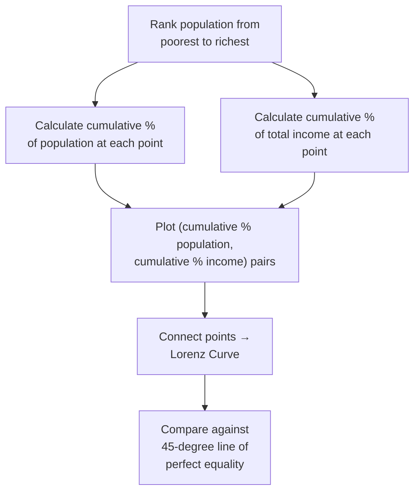

## Personal Income Distribution and the Lorenz Curve

### Definition and Scope

Personal income distribution refers to how total income in an economy is divided among individuals or households, as distinct from the **functional distribution of income**, which divides income by factor of production (wages, rent, interest, profit). The Lorenz curve and its associated summary statistic, the Gini coefficient, are the standard graphical and numerical tools economists use to measure and compare the degree of income inequality within and across populations.

**Key Points**

- **Personal (or size) distribution of income** groups income recipients (individuals or households) by income level, regardless of the source of that income (labor earnings, capital income, transfers, etc.), and asks how income is divided across the population ranked from poorest to richest
- This differs conceptually from the **functional distribution of income**, which asks what share of total income accrues to labor versus capital versus land, without regard to how those factor incomes are distributed across specific individuals or households
- Measuring personal income distribution is central to analyzing poverty, inequality, and the distributional effects of economic policy — including many of the factor-market outcomes examined elsewhere in this chapter (minimum wage effects, union bargaining outcomes, capital income concentration)

### Constructing the Lorenz Curve

**Key Points**

- The Lorenz curve plots the **cumulative percentage of total income** received (vertical axis) against the **cumulative percentage of income recipients**, ranked from lowest to highest income (horizontal axis)
- The **line of perfect equality** is the 45-degree diagonal line, representing a hypothetical distribution in which every percentile of the population receives an exactly proportional share of total income (e.g., the poorest 20% of the population receives exactly 20% of total income, the poorest 50% receives exactly 50%, and so on)
- The actual Lorenz curve for any real economy lies **below** the line of perfect equality (bowing downward and to the right), since in virtually all observed income distributions, the poorest segments of the population receive a smaller cumulative income share than their population share, while the richest segments receive more
- The greater the distance (bow) between the actual Lorenz curve and the line of perfect equality, the **greater the degree of income inequality** in that distribution

**Example**

Consider a stylized population divided into quintiles (fifths) with the following cumulative income shares: poorest 20% of the population receives 5% of total income (cumulative: 5%); poorest 40% receives a cumulative 15%; poorest 60% receives a cumulative 30%; poorest 80% receives a cumulative 55%; and the full 100% of the population receives the full 100% of income by definition. Plotting these five points (20%, 5%), (40%, 15%), (60%, 30%), (80%, 55%), (100%, 100%) and connecting them produces the Lorenz curve for this hypothetical distribution, which bows noticeably below the 45-degree line, particularly in the lower-income quintiles.

### Diagram: The Lorenz Curve (svg_diagram)

<svg xmlns="http://www.w3.org/2000/svg" viewBox="0 0 640 640">
<text x="320" y="28" text-anchor="middle" font-size="16" font-weight="bold" fill="#1a1a1a">The Lorenz Curve (svg_diagram)</text>
<line x1="80" y1="560" x2="580" y2="560" stroke="#333" stroke-width="1.5" />
<line x1="80" y1="560" x2="80" y2="60" stroke="#333" stroke-width="1.5" />
<text x="580" y="585" text-anchor="middle" font-size="12" fill="#333">Cumulative % of Population</text>
<text x="35" y="310" text-anchor="middle" font-size="12" fill="#333" transform="rotate(-90 35 310)">Cumulative % of Income</text>
<line x1="80" y1="560" x2="580" y2="60" stroke="#333" stroke-width="1.5" stroke-dasharray="5" />
<text x="500" y="120" text-anchor="middle" font-size="11" fill="#333">Line of Perfect Equality</text>
<path d="M 80 560 L 180 535 L 280 485 L 380 400 L 480 260 L 580 60" stroke="#c0392b" stroke-width="3" fill="none" />
<text x="230" y="530" text-anchor="middle" font-size="11" fill="#c0392b" font-weight="bold">Lorenz Curve</text>
<path d="M 80 560 L 180 535 L 280 485 L 380 400 L 480 260 L 580 60 L 80 560 Z" fill="#fdecea" opacity="0.5" />
<text x="220" y="440" text-anchor="middle" font-size="11" fill="#c0392b">Area A</text>
<text x="220" y="455" text-anchor="middle" font-size="10" fill="#c0392b">(between line of equality and Lorenz curve)</text>
<path d="M 80 560 L 180 535 L 280 485 L 380 400 L 480 260 L 580 60 L 580 560 Z" fill="#eafaf1" opacity="0.4" />
<text x="480" y="480" text-anchor="middle" font-size="11" fill="#27ae60">Area B</text>
<text x="480" y="495" text-anchor="middle" font-size="10" fill="#27ae60">(below Lorenz curve)</text>

<text x="330" y="615" text-anchor="middle" font-size="12" fill="#333" font-weight="bold">Gini Coefficient = A / (A + B)</text>

</svg>

### The Gini Coefficient

**Key Points**

- The **Gini coefficient** provides a single summary statistic derived from the Lorenz curve, calculated as the ratio of the area between the line of perfect equality and the actual Lorenz curve (Area A) to the total area under the line of perfect equality (Area A + Area B):

$$G = \frac{A}{A + B}$$

- The Gini coefficient ranges from **0 to 1** (or equivalently, 0 to 100 when expressed as a percentage): a value of **0** represents perfect equality (the Lorenz curve coincides exactly with the 45-degree line, meaning Area A = 0), while a value of **1** represents perfect inequality (a single individual or household receives 100% of all income, meaning the Lorenz curve would run along the horizontal axis before jumping vertically at the very end)
- In practice, real-world Gini coefficients for national income distributions fall well within this range, with no economy typically approaching either theoretical extreme
- [Unverified] Specific current Gini coefficient values for any given country or region change over time and are reported periodically by national statistical agencies and international organizations (e.g., the World Bank, OECD); such figures should be looked up from current sources rather than assumed static, since they are subject to methodological differences (e.g., pre-tax vs. post-tax and transfer income, household vs. individual measurement) that can materially affect the reported number.

#### Alternative Computational Formula

**Key Points**

- For discrete data (e.g., income shares by decile or quintile), the Gini coefficient can also be computed using the formula:

$$G = 1 - \sum_{i=1}^{n} (X_i - X_{i-1})(Y_i + Y_{i-1})$$

where $X_i$ is the cumulative proportion of the population up to group $i$, and $Y_i$ is the cumulative proportion of income up to group $i$ — this formula computes the area under the Lorenz curve using the trapezoidal rule and subtracts it from the area under the line of perfect equality (which is exactly 0.5 in the normalized 0-to-1 scale)

### Limitations of the Lorenz Curve and Gini Coefficient

**Key Points**

- **Lorenz curve crossing**: if two Lorenz curves for different populations (or the same population at two different time points) cross one another, it becomes ambiguous which distribution is "more unequal," since one distribution may show greater inequality among lower-income groups while the other shows greater inequality among higher-income groups — the Gini coefficient can still be calculated and compared numerically in this case, but the underlying rankings it implies can mask genuinely different patterns of inequality
- **Insensitivity to where in the distribution inequality occurs**: two very different underlying distributions can, in principle, produce the same Gini coefficient value, since the single summary statistic does not indicate whether inequality is concentrated at the top, middle, or bottom of the distribution
- **Does not capture income mobility**: the Lorenz curve and Gini coefficient are typically calculated from a **snapshot** of income at a single point in time (or over a single period), and do not indicate whether individuals move between income groups over time (income mobility) — a society with high measured cross-sectional inequality but also high income mobility across the life cycle may have quite different normative implications than one with equally high inequality but low mobility
- **Household size and composition adjustments**: raw income comparisons across households of different sizes can be misleading; many empirical studies adjust for household size using **equivalence scales** before constructing Lorenz curves, and the choice of equivalence scale can affect measured inequality
- **Pre-tax/transfer vs. post-tax/transfer measurement**: Lorenz curves and Gini coefficients calculated on market income (before taxes and government transfers) versus disposable income (after taxes and transfers) can differ substantially, and comparing figures calculated on inconsistent bases across countries or time periods can be misleading

### Related Inequality Measures

**Key Points**

- **Decile/quintile ratios**: simpler measures comparing the income share (or income level) of a specific high-income group to a specific low-income group (e.g., the ratio of income received by the top 10% to the bottom 10%), which are easier to interpret intuitively than the Gini coefficient but discard information about the rest of the distribution
- **Theil index**: an alternative inequality measure derived from information theory, which — unlike the Gini coefficient — can be **decomposed** into inequality *within* subgroups (e.g., within a region or demographic group) and inequality *between* subgroups, a useful property for analyzing the sources of overall inequality
- **Poverty rate / headcount ratio**: distinct from inequality measures, poverty measures assess the share of the population falling below an absolute or relative income threshold, capturing a different (though related) dimension of the income distribution than the Lorenz curve's inequality focus
- [Inference] Because each of these measures captures a somewhat different aspect of the income distribution (overall inequality, tail concentration, decomposability, or absolute deprivation), a complete distributional analysis of any economy typically draws on multiple measures together rather than relying on the Gini coefficient in isolation.

### Application to Factor Market Outcomes

**Key Points**

- Changes in factor-market conditions examined elsewhere in this chapter — including minimum wage policy, unionization rates, monopsony power, and the relative returns to labor versus capital — feed directly into the personal income distribution, since personal income for most households is composed substantially of labor earnings, supplemented for some households by capital income (interest, dividends, rent) and government transfers
- Shifts in the **functional distribution of income** (e.g., a rising capital income share relative to the labor income share) can affect the **personal distribution** as well, particularly to the extent that capital ownership is itself unevenly distributed across the population, though the precise personal-distribution effect of any given functional-distribution shift depends on the specific ownership patterns involved
- [Unverified] The empirical relationship between trends in the functional distribution of income and trends in personal income inequality is a subject of active empirical macroeconomic and labor economics research, and specific claims linking the two in any given country or period should be checked against current data and research rather than assumed to follow automatically from theory alone.

**Related Topics**

- Labor Market Supply and Demand (source of most personal income)
- Marginal Revenue Product and Wage Determination
- Minimum Wage Effects and Empirical Debates (distributional policy tool)
- Capital Markets and the Rate of Return (capital income and its distribution)
- Poverty Measurement and Absolute vs. Relative Poverty Lines
- Tax Incidence and Redistributive Fiscal Policy
- Human Capital Theory and Education's Role in Income Distribution