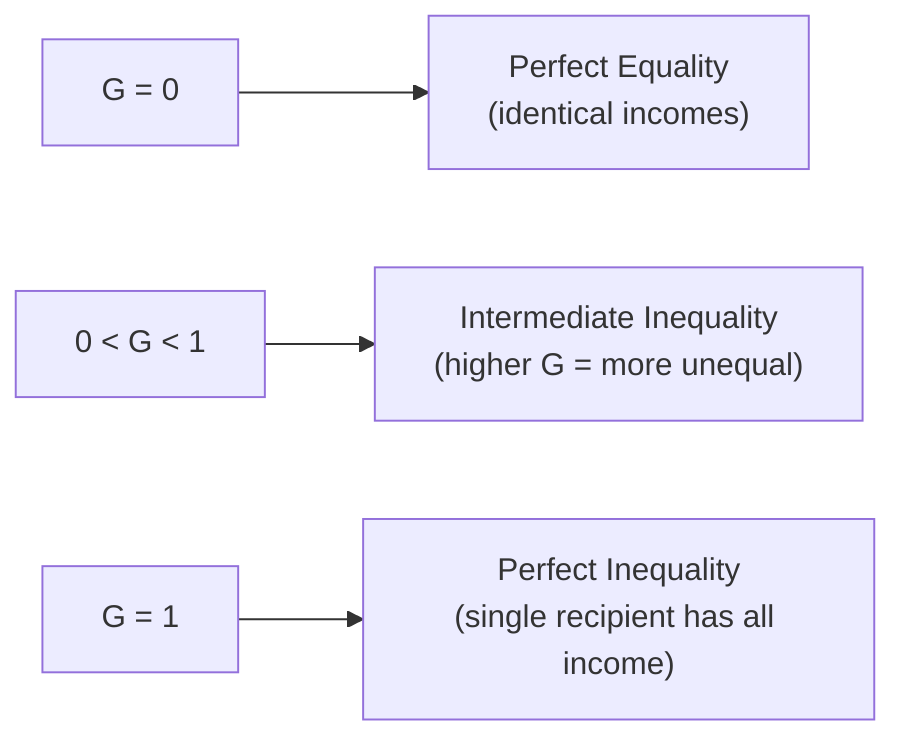

## Gini Coefficient and Measures of Inequality

### Definition and Purpose

The Gini coefficient is the most widely used single summary statistic for quantifying income (or wealth) inequality within a population, derived directly from the Lorenz curve. While the Lorenz curve provides a graphical representation of the full distribution, the Gini coefficient condenses that information into a single number between 0 and 1, enabling straightforward numerical comparison of inequality across countries, regions, or time periods.

**Key Points**

- The Gini coefficient measures the degree to which the actual distribution of income deviates from perfect equality, expressed as a ratio derived from the area between the Lorenz curve and the line of perfect equality
- It is used extensively by national statistical agencies, international organizations, and academic researchers as the standard headline measure of income (and sometimes wealth or consumption) inequality
- Despite its widespread use, the Gini coefficient has specific mathematical properties and limitations that shape how it should be interpreted and when alternative or supplementary measures are more appropriate

### Formal Derivation

#### Geometric Definition

**Key Points**

- Given the Lorenz curve $L(p)$, where $p$ represents the cumulative proportion of the population (ranked from poorest to richest) and $L(p)$ represents the corresponding cumulative proportion of income received, the Gini coefficient is defined as:

$$G = \frac{A}{A+B} = 1 - 2\int_0^1 L(p)\, dp$$

where $A$ is the area between the line of perfect equality and the Lorenz curve, and $A+B$ is the total area under the line of perfect equality (which equals exactly $0.5$ in the normalized unit square)

- This integral form reflects that the total area under the 45-degree line of perfect equality is $0.5$, so $A = 0.5 - \int_0^1 L(p)\,dp$, and dividing by $A+B = 0.5$ yields the compact expression above

#### Discrete Approximation Formula

For empirical data grouped into $n$ intervals (e.g., deciles or quintiles), the Gini coefficient is commonly computed using the trapezoidal approximation:

$$G = 1 - \sum_{i=1}^{n} (X_i - X_{i-1})(Y_i + Y_{i-1})$$

where $X_i$ is the cumulative proportion of the population through group $i$, and $Y_i$ is the cumulative proportion of income through group $i$, with $X_0 = Y_0 = 0$.

**Example**

Using quintile data with cumulative income shares of 5%, 15%, 30%, 55%, and 100% (corresponding to cumulative population shares of 20%, 40%, 60%, 80%, and 100%):

$$G = 1 - \big[(0.2)(0.05+0) + (0.2)(0.15+0.05) + (0.2)(0.30+0.15) + (0.2)(0.55+0.30) + (0.2)(1.00+0.55)\big]$$

$$G = 1 - [0.01 + 0.04 + 0.09 + 0.17 + 0.31] = 1 - 0.62 = 0.38$$

This yields a Gini coefficient of approximately $0.38$ for this hypothetical distribution, reflecting a moderate degree of measured inequality.

#### An Alternative Formulation: Mean Absolute Difference

**Key Points**

- The Gini coefficient can equivalently be expressed in terms of the **mean absolute difference** between all pairs of incomes in the population, normalized by twice the mean income:

$$G = \frac{\sum_{i=1}^{n}\sum_{j=1}^{n} |x_i - x_j|}{2n^2 \bar{x}}$$

where $x_i$ and $x_j$ are the incomes of individuals $i$ and $j$, $n$ is the population size, and $\bar{x}$ is mean income

- [Standard Result] This formulation is mathematically equivalent to the Lorenz-curve-based geometric definition, but it offers an intuitive alternative interpretation: the Gini coefficient reflects the expected relative difference between the incomes of two randomly selected individuals from the population, normalized to lie between 0 and 1

### Interpreting the Gini Coefficient

**Key Points**

- **G = 0**: perfect equality — every individual or household receives an identical income
- **G = 1** (or 100 on a percentage scale): perfect inequality — a single recipient receives the entirety of total income, and all others receive none
- Values in between reflect intermediate degrees of inequality, with **higher values indicating greater inequality**
- The Gini coefficient can be calculated on different income concepts — **market income** (before taxes and transfers), **gross income**, or **disposable income** (after taxes and transfers) — and the choice of concept materially affects the resulting value, since taxes and transfers typically reduce measured inequality relative to market income in most developed economies with progressive fiscal systems
- [Unverified] Specific current Gini coefficient values for particular countries, and cross-country rankings, change over time and depend on the specific income concept and data source used; such figures should be obtained from current official sources (e.g., World Bank, OECD, national statistical offices) rather than assumed static or treated as universally comparable across sources without checking methodology.

### Mathematical Properties and Axioms

Economists evaluate inequality measures against a set of desirable formal properties; the Gini coefficient satisfies most, but not all, commonly proposed axioms.

**Key Points**

- **Anonymity (symmetry)**: the measure should not depend on which specific individuals hold which incomes, only on the distribution of income values itself — the Gini coefficient satisfies this property
- **Scale invariance (mean independence)**: if every individual's income is multiplied by the same positive constant (e.g., due to inflation or uniform economic growth with no distributional change), the Gini coefficient should remain unchanged — the Gini coefficient satisfies this property
- **Population invariance**: replicating the population (e.g., doubling it by creating an identical copy of every individual) should not change the measured inequality — the Gini coefficient satisfies this property
- **Pigou-Dalton transfer principle**: a small income transfer from a richer individual to a poorer individual (that does not reverse their relative ranking) should strictly reduce measured inequality — the Gini coefficient satisfies this property
- **Decomposability**: the Gini coefficient is **not fully decomposable** into a clean sum of "within-group" and "between-group" inequality components when a population is divided into subgroups (e.g., by region or demographic characteristic), unlike some alternative measures such as the Theil index — this is one of the most commonly cited limitations of the Gini coefficient in applied inequality research
- **Sensitivity across the distribution**: the Gini coefficient is most sensitive to transfers occurring near the middle of the income distribution, and comparatively less sensitive to transfers at the extreme tails, a property that distinguishes it from some alternative measures with different sensitivity profiles

### Alternative and Complementary Inequality Measures

#### Theil Index

**Key Points**

- Derived from information theory (specifically, the concept of entropy), the **Theil index** measures inequality based on the divergence between the actual income distribution and a hypothetical perfectly equal distribution
- Its key advantage over the Gini coefficient is **full decomposability**: total inequality can be exactly partitioned into a **within-group** component and a **between-group** component when the population is divided into subgroups, making it particularly useful for analyzing sources of inequality (e.g., how much of national inequality is attributable to differences between regions versus differences within regions)
- The Theil index does not have the same intuitive 0-to-1 bounded interpretation as the Gini coefficient, which can make it somewhat less accessible for general communication of inequality levels to non-technical audiences

#### Atkinson Index

**Key Points**

- The **Atkinson index** explicitly incorporates a parameter $\varepsilon$ representing **society's aversion to inequality**, allowing the measure to be tuned to weight transfers at different points in the distribution differently depending on the value judgment embedded in the chosen parameter
- A higher value of $\varepsilon$ places greater weight on inequality among lower-income individuals, meaning the index becomes more sensitive to changes at the bottom of the distribution as $\varepsilon$ increases
- [Standard Result] This explicit incorporation of a normative inequality-aversion parameter is often cited as a conceptual advantage for policy analysis, since it makes the value judgment underlying the inequality measure transparent and adjustable, rather than embedding an implicit and fixed sensitivity profile as the Gini coefficient does

#### Decile/Percentile Ratios

**Key Points**

- Simple ratio measures compare income at specific points in the distribution, such as the **90/10 ratio** (income at the 90th percentile divided by income at the 10th percentile) or the **80/20 ratio**
- These measures are easy to compute and communicate, but discard substantial information about the shape of the distribution outside the specific percentiles being compared, and are insensitive to changes occurring entirely within the excluded portions of the distribution

#### Top Income Shares

**Key Points**

- Increasingly common in contemporary inequality research (notably associated with work by economists such as Thomas Piketty and collaborators using historical tax record data), this approach directly reports the share of total income (or wealth) accruing to a specific top percentile (e.g., the top 1% or top 10%)
- This measure is particularly well-suited to capturing changes concentrated at the very top of the distribution, which broader measures like the Gini coefficient can understate due to their comparatively lower sensitivity to extreme-tail transfers
- [Unverified] The specific historical and cross-country patterns in top income shares documented in this literature are subject to ongoing data construction and methodological debate (e.g., regarding the treatment of capital gains, tax avoidance, and the comparability of tax-record-based estimates across countries and time periods); specific figures should be verified against current published research.

### Comparison Table

| Measure | Range | Decomposable | Sensitivity | Key Use Case |
| --- | --- | --- | --- | --- |
| Gini Coefficient | 0 to 1 | Not fully | Most sensitive near the middle of the distribution | General-purpose headline inequality comparison |
| Theil Index | 0 to $\ln(n)$ | Fully decomposable | Configurable via index variant | Decomposing inequality into within/between-group components |
| Atkinson Index | 0 to 1 | Not standard | Adjustable via $\varepsilon$ parameter | Policy analysis with explicit inequality-aversion weighting |
| Decile/Percentile Ratios | Unbounded ratio | No | Only at chosen percentiles | Simple, intuitive tail comparisons |
| Top Income Shares | 0% to 100% | No | Concentrated at the top of the distribution | Analyzing top-end wealth/income concentration |

### Diagram: Gini Coefficient Sensitivity Compared to Alternative Measures (svg_diagram)

<svg xmlns="http://www.w3.org/2000/svg" viewBox="0 0 760 380">
<text x="380" y="26" text-anchor="middle" font-size="16" font-weight="bold" fill="#1a1a1a">Where Different Inequality Measures Are Most Sensitive (svg_diagram)</text>
<line x1="80" y1="320" x2="700" y2="320" stroke="#333" stroke-width="1.5" />
<text x="390" y="345" text-anchor="middle" font-size="12" fill="#333">Position in Income Distribution (poorest → richest)</text>

<text x="130" y="80" text-anchor="middle" font-size="12" font-weight="bold" fill="`#2980b9`">Gini Coefficient</text>

<path d="M 90 280 Q 390 130 690 280" stroke="`#2980b9`" stroke-width="3" fill="none" />

<text x="390" y="150" text-anchor="middle" font-size="10" fill="`#2980b9`">Peak sensitivity near the middle</text>

<text x="130" y="380" text-anchor="middle" font-size="12" font-weight="bold" fill="`#c0392b`">Top Income Share</text>

<path d="M 90 300 L 550 300 Q 620 290 690 100" stroke="`#c0392b`" stroke-width="3" fill="none" />

<text x="620" y="180" text-anchor="middle" font-size="10" fill="`#c0392b`">Sensitive only at the top</text>

<line x1="90" y1="200" x2="690" y2="200" stroke="#27ae60" stroke-width="3" stroke-dasharray="6" />
<text x="390" y="195" text-anchor="middle" font-size="10" fill="#27ae60">Decile Ratio (only at fixed percentiles)</text>
</svg>

### Applications and Policy Uses

**Key Points**

- Cross-country comparisons of measured inequality frequently rely on the Gini coefficient as a common baseline metric, though such comparisons require care regarding consistency of the underlying income concept (market vs. disposable income) and data source methodology across countries
- Governments and international organizations often track the Gini coefficient over time as a policy target or evaluation metric for assessing the distributional impact of tax and transfer reforms, since a well-designed progressive tax-and-transfer system will generally reduce the Gini coefficient measured on disposable income relative to the Gini coefficient measured on market income
- Because no single measure fully captures every dimension of inequality, applied research and policy analysis increasingly report **multiple complementary measures together** (e.g., a Gini coefficient alongside a top income share and a poverty rate) to provide a more complete distributional picture than any single statistic can convey alone

**Related Topics**

- Personal Income Distribution and the Lorenz Curve
- Labor Market Supply and Demand
- Capital Markets and the Rate of Return
- Poverty Measurement and Absolute vs. Relative Poverty Lines
- Tax Incidence and Redistributive Fiscal Policy
- Functional Distribution of Income (wages, profit, rent, interest shares)
- Wealth Inequality and Intergenerational Mobility