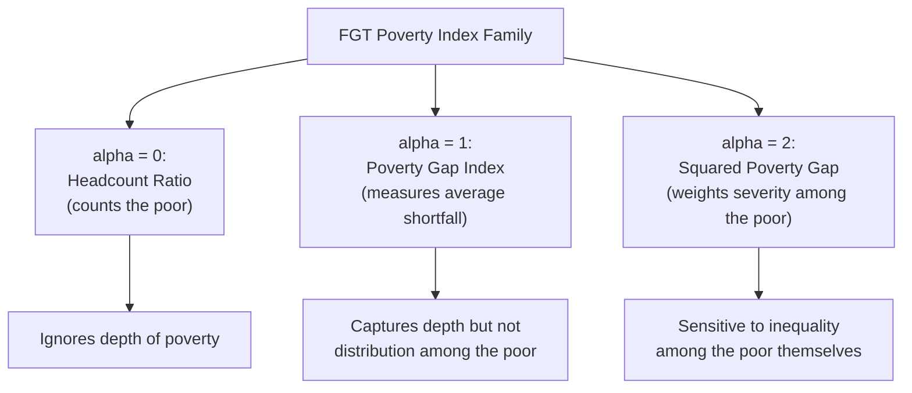
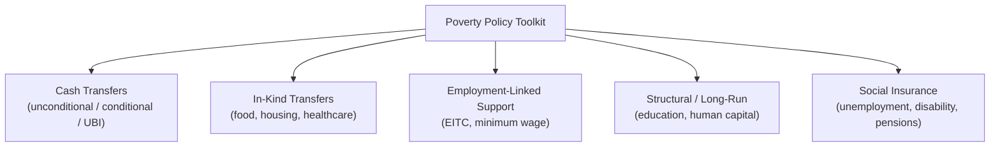

## Poverty Measurement and Policy Responses

### Definition and Conceptual Approaches

Poverty measurement addresses a distinct question from inequality measurement: rather than asking how income is distributed across the population relative to itself, poverty analysis asks how many individuals or households fall below some defined threshold of economic well-being. This distinction matters because a society can experience falling inequality while poverty rises (or vice versa), depending on how the entire distribution shifts.

**Key Points**

- **Absolute poverty** defines a fixed threshold of income or consumption (a "poverty line") representing the minimum resources needed to meet basic needs, typically held constant in real (inflation-adjusted) terms over time, so that the measured poverty rate reflects genuine changes in living standards rather than changes in relative position
- **Relative poverty** defines the threshold as a proportion of a contemporaneous reference point in the income distribution — commonly a fixed percentage (e.g., 50% or 60%) of median household income — so that the poverty line itself moves as the overall income distribution shifts
- The choice between absolute and relative poverty concepts reflects different underlying philosophical views: absolute poverty emphasizes meeting a fixed standard of material need, while relative poverty emphasizes social inclusion and the ability to participate in the norms of a given society at a given time
- [Unverified] Different countries and international organizations adopt different conventions (e.g., certain national statistical offices historically favor absolute measures while EU-style poverty statistics commonly use relative measures); the specific convention and current threshold values in use for any jurisdiction should be verified against current official sources.

### Absolute Poverty Measurement

#### Poverty Line Construction

**Key Points**

- A common approach to constructing an absolute poverty line begins with estimating the cost of a **minimum basic needs basket** — historically often anchored to the cost of a minimally adequate diet, then scaled up by a multiplier to account for non-food necessities (housing, clothing, other essentials)
- Poverty lines are typically adjusted for **household size and composition** using equivalence scales, recognizing that larger households require more total income to achieve the same standard of living per member, though economies of scale within a household (e.g., shared housing costs) mean the required income does not scale exactly proportionally with household size
- Poverty lines are periodically updated for inflation to maintain their real value over time, and in some cases are revised methodologically as consumption patterns and understanding of basic needs evolve
- **International poverty lines**, such as those maintained by the World Bank for cross-country global poverty comparisons, apply a common threshold expressed in a standardized currency unit (typically adjusted using purchasing power parity, or PPP, exchange rates) to enable comparison of extreme poverty across countries with very different price levels and currencies

#### The Headcount Ratio and Its Limitations

**Key Points**

- The most basic poverty statistic is the **headcount ratio**: the proportion of the population with income (or consumption) below the poverty line

$$H = \frac{N_{poor}}{N}$$

where $N_{poor}$ is the number of individuals below the poverty line and $N$ is the total population

- The headcount ratio is easy to calculate and communicate, but has an important limitation: it is **insensitive to the depth of poverty** — a policy that raises the income of someone just below the poverty line to just above it reduces the headcount ratio by exactly the same amount as a policy that raises someone from far below the line to just below it (i.e., leaving them still in poverty), even though the two interventions have very different welfare implications for the poorest individuals
- It is also insensitive to the **distribution of income among the poor** themselves, treating all poor individuals identically regardless of how far below the line they fall

#### The Poverty Gap Index

**Key Points**

- The **poverty gap index** addresses the depth-insensitivity limitation of the headcount ratio by measuring the average shortfall of poor individuals' income from the poverty line, expressed as a proportion of the poverty line, averaged across the entire population (including the non-poor, who contribute a shortfall of zero):

$$PG = \frac{1}{N}\sum_{i=1}^{N} \frac{\max(z - y_i, 0)}{z}$$

where $z$ is the poverty line, $y_i$ is individual $i$'s income, and the numerator is zero for any individual above the poverty line

- This measure captures not just *how many* people are poor, but *how far below* the line they fall on average, providing a more complete picture of poverty severity than the headcount ratio alone
- The poverty gap index can also be interpreted as an estimate of the theoretical minimum total resources that would need to be transferred to eliminate poverty entirely, assuming perfectly targeted transfers with no leakage to the non-poor and no behavioral response

#### The Foster-Greer-Thorbecke (FGT) Class of Measures

**Key Points**

- The **FGT index** generalizes both the headcount ratio and the poverty gap index into a single parametric family:

$$FGT_\alpha = \frac{1}{N}\sum_{i=1}^{N} \left(\frac{\max(z - y_i, 0)}{z}\right)^{\alpha}$$

- Setting $\alpha = 0$ recovers the **headcount ratio** ($FGT_0 = H$), since the term inside the sum becomes 1 for anyone below the line and 0 otherwise
- Setting $\alpha = 1$ recovers the **poverty gap index** ($FGT_1 = PG$)
- Setting $\alpha = 2$ produces the **squared poverty gap** (sometimes called the poverty severity index), which places additional weight on the poorest individuals within the poor population, since squaring the proportional shortfall gives greater weight to larger shortfalls — this satisfies a transfer-sensitivity property (a transfer among the poor toward the very poorest reduces this index, even holding the total poverty gap constant), a property neither $FGT_0$ nor $FGT_1$ possesses
- [Standard Result] The FGT family is widely used in academic and applied development economics precisely because it nests multiple standard poverty measures within a single flexible framework, allowing researchers to select the sensitivity to poverty depth and severity appropriate to their specific analytical question by choosing $\alpha$.

### Relative Poverty Measurement

**Key Points**

- Relative poverty is typically measured using the headcount ratio (or FGT family) applied against a threshold set as a fixed percentage of a distributional statistic, most commonly **median equivalized household income** (e.g., 60% of median income, a convention widely used in European Union statistics)
- Because the threshold moves with the overall distribution, relative poverty can, somewhat counterintuitively, **remain unchanged or even rise during a period of general economic growth**, if the income gains are not broadly shared and median income rises alongside the poverty threshold while low-income households do not experience proportional gains
- Conversely, a broad-based economic downturn that reduces incomes relatively uniformly across the distribution could leave a relative poverty rate largely unchanged, even as material living standards decline for the population as a whole, since the threshold falls in tandem with median income — a scenario absolute poverty measures would capture as a poverty increase
- This divergence in behavior under different economic scenarios is a key reason analysts often examine **both** absolute and relative poverty measures together rather than relying on either exclusively

### Multidimensional Poverty

**Key Points**

- Income-based and consumption-based poverty measures, while foundational, capture only one dimension of deprivation; **multidimensional poverty measures** aim to capture deprivation across multiple domains simultaneously — commonly including health, education, and living standards indicators (e.g., access to clean water, sanitation, housing quality, school attendance)
- The **Multidimensional Poverty Index (MPI)**, developed collaboratively by international research and development institutions, is a widely cited example of this approach, identifying individuals as multidimensionally poor if they are deprived across a sufficient number or weighted combination of specific indicators, then aggregating both the incidence and intensity of deprivation into a single index — conceptually parallel to the FGT approach of combining a headcount measure with a depth/intensity measure
- [Unverified] The specific indicators, weights, and thresholds used in any given multidimensional poverty index are subject to methodological choices that vary across the specific index and institution constructing it, and current specifications should be checked against the relevant primary source rather than assumed fixed.

### Policy Responses to Poverty

#### Cash Transfer Programs

**Key Points**

- **Unconditional cash transfers (UCTs)** provide direct cash payments to eligible households without behavioral requirements, based on the economic rationale that recipients are generally best positioned to know their own most pressing needs, and that cash (versus in-kind assistance) avoids the efficiency losses associated with providing goods that may not match recipient preferences
- **Conditional cash transfers (CCTs)** provide payments contingent on specific behaviors, most commonly school attendance or health check-ups/vaccinations for children, combining an income-support objective with an explicit human-capital-investment objective; several large-scale CCT programs in Latin America have been influential models internationally
- **Universal Basic Income (UBI)** proposals extend the cash transfer concept to unconditional, universal payments to all citizens/residents regardless of income level, motivated variously by poverty elimination, simplification of the existing transfer system, and anticipated labor market disruption from automation; [Unverified] the fiscal cost, labor supply effects, and optimal design of UBI relative to targeted transfer alternatives remain actively debated and researched, with results from various pilot programs interpreted differently across the literature, so specific claims about UBI's effects should be checked against current research rather than treated as settled.

#### In-Kind Transfers and Targeted Programs

**Key Points**

- **In-kind transfers** (food assistance, housing subsidies, healthcare provision) directly provide specific goods or services rather than cash, sometimes justified on paternalistic grounds (ensuring resources are directed toward specific priority needs, such as child nutrition) or on political-economy grounds (in-kind programs may command broader public support than equivalent cash transfers)
- **Means-tested programs** restrict eligibility to households below specified income or asset thresholds, aiming to target limited public resources toward those most in need, but can create **benefit cliffs** or high effective marginal tax rates as benefits phase out with rising income, potentially blunting work incentives near the eligibility threshold — a design trade-off central to the economics of targeted welfare programs
- **Earned income tax credits / wage subsidies** provide income supplements specifically tied to employment earnings, designed to support low-wage workers' income while explicitly preserving (or even strengthening, at least over some income ranges) the incentive to work, in contrast to some means-tested transfer designs

#### Structural and Longer-Run Approaches

**Key Points**

- **Education and human capital investment** policies aim to address poverty's underlying drivers by raising future earning capacity, operating on a longer time horizon than direct transfer programs
- **Minimum wage policy** (see Minimum Wage Effects and Empirical Debates) functions as an alternative or complementary tool aimed at raising incomes for low-wage workers, though as previously discussed its employment effects and net poverty impact depend on the underlying labor market structure and remain an area of active empirical debate
- **Social insurance programs** (unemployment insurance, disability insurance, public pension systems) provide protection against specific income-disrupting events, functioning as much to prevent poverty resulting from adverse shocks as to address pre-existing poverty

### Diagram: Absolute vs. Relative Poverty Line Behavior Over Time (svg_diagram)

<svg xmlns="http://www.w3.org/2000/svg" viewBox="0 0 720 380">
<text x="360" y="26" text-anchor="middle" font-size="16" font-weight="bold" fill="#1a1a1a">Absolute vs. Relative Poverty Line Over Time (svg_diagram)</text>
<line x1="80" y1="330" x2="660" y2="330" stroke="#333" stroke-width="1.5" />
<line x1="80" y1="330" x2="80" y2="60" stroke="#333" stroke-width="1.5" />
<text x="660" y="350" text-anchor="middle" font-size="11" fill="#333">Time</text>
<text x="45" y="195" text-anchor="middle" font-size="11" fill="#333" transform="rotate(-90 45 195)">Income Level</text>
<line x1="100" y1="250" x2="640" y2="250" stroke="#c0392b" stroke-width="2" stroke-dasharray="5" />
<text x="500" y="240" text-anchor="middle" font-size="11" fill="#c0392b">Absolute Poverty Line (fixed real value)</text>
<path d="M 100 290 Q 300 200 640 100" stroke="#2980b9" stroke-width="2" fill="none" />
<text x="580" y="90" text-anchor="middle" font-size="11" fill="#2980b9">Median Income (rising over time)</text>
<path d="M 100 300 Q 300 260 640 165" stroke="#27ae60" stroke-width="2" stroke-dasharray="3" />
<text x="580" y="180" text-anchor="middle" font-size="11" fill="#27ae60">Relative Poverty Line (60% of median)</text>

<text x="360" y="370" text-anchor="middle" font-size="10" fill="#333">Absolute line stays fixed; relative line rises with median income even if low incomes stagnate</text>

</svg>

### Interactions with Inequality Measurement

**Key Points**

- Poverty and inequality are conceptually distinct but empirically related: a redistribution that transfers income from the middle of the distribution to the top (increasing inequality) while leaving the bottom unchanged would not necessarily change measured poverty, whereas a redistribution from the top to the bottom of the distribution could reduce poverty while also reducing measured inequality (e.g., a falling Gini coefficient)
- Because relative poverty thresholds are themselves derived from the income distribution (typically median income), relative poverty measures are more directly connected to overall distributional patterns than absolute poverty measures, which are anchored to a fixed external standard independent of the contemporaneous distribution
- [Inference] Given these conceptual differences, a full assessment of a country's distributional and living-standards situation typically benefits from examining poverty measures (both absolute and relative), inequality measures (such as the Gini coefficient), and measures of income growth across different parts of the distribution together, since no single statistic fully captures every policy-relevant dimension of economic well-being.

**Related Topics**

- Personal Income Distribution and the Lorenz Curve
- Gini Coefficient and Measures of Inequality
- Minimum Wage Effects and Empirical Debates
- Labor Market Supply and Demand
- Tax Incidence and Redistributive Fiscal Policy
- Human Capital Theory and Investment in Education
- Social Insurance and Public Economics