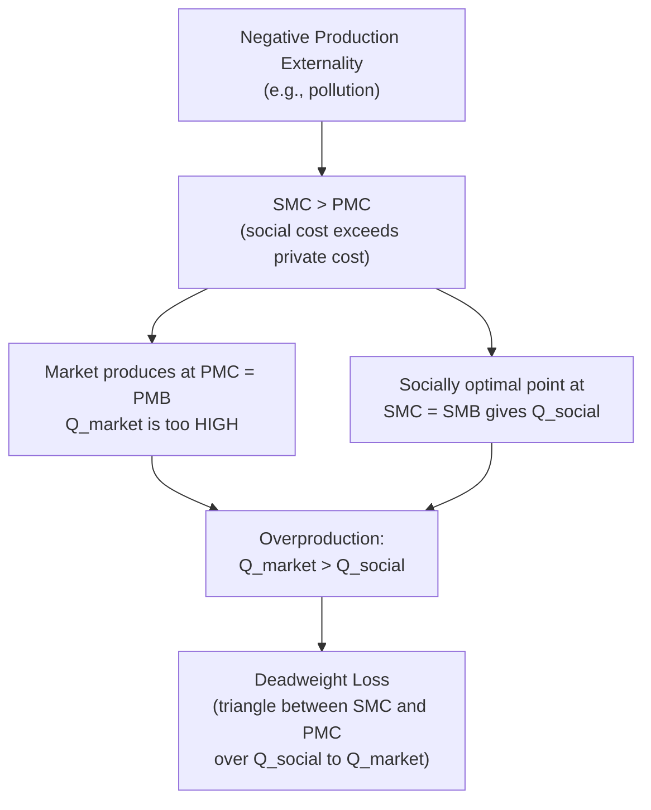
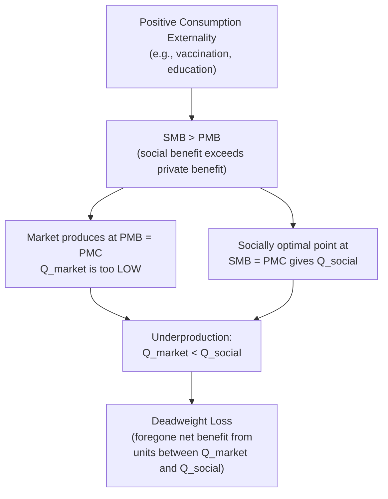
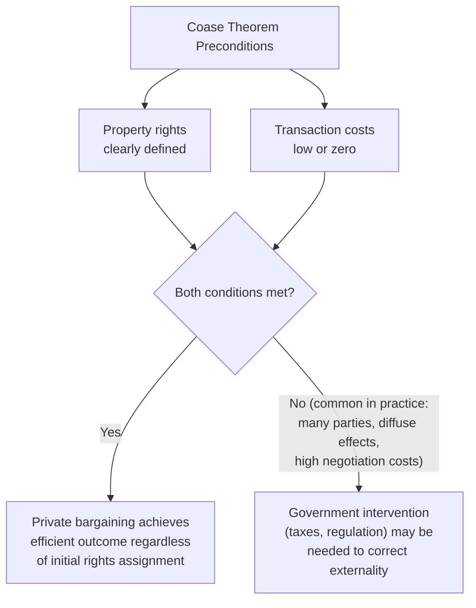

## Externalities: Positive and Negative

### Definition and Core Concept

An externality occurs when the production or consumption of a good generates a cost or benefit that spills over onto a third party who did not consent to and is not directly compensated (or charged) for that effect. Externalities represent a form of market failure because the private decision-maker's costs or benefits diverge from the costs or benefits experienced by society as a whole, causing markets to produce a quantity that is not socially optimal.

**Key Points**

- An externality exists whenever an economic action imposes an effect on a third party **outside the market transaction** between the buyer and seller
- Externalities can be **negative** (imposing an uncompensated cost on third parties) or **positive** (conferring an uncompensated benefit on third parties)
- Externalities can arise from either **production** (e.g., a factory's pollution affecting nearby residents) or **consumption** (e.g., secondhand smoke affecting bystanders)
- The core economic problem is that private decision-makers base their choices on **private costs and benefits** alone, ignoring the **external costs and benefits** imposed on others, leading to a divergence between private and social optimum

### Private Cost/Benefit vs. Social Cost/Benefit

**Key Points**

- **Private Marginal Cost (PMC)**: the cost borne directly by the producer of a good, reflected in standard supply curves
- **External Marginal Cost (EMC)**: the additional cost imposed on third parties not reflected in the producer's private costs
- **Social Marginal Cost (SMC)**: the sum of private and external costs, $SMC = PMC + EMC$, representing the true total cost to society of producing an additional unit
- **Private Marginal Benefit (PMB)**: the benefit received directly by the consumer of a good, reflected in standard demand curves
- **External Marginal Benefit (EMB)**: the additional benefit conferred on third parties not captured in the consumer's private benefit
- **Social Marginal Benefit (SMB)**: the sum of private and external benefits, $SMB = PMB + EMB$

### Negative Externalities

#### Analysis of Negative Production Externalities

**Key Points**

- With a negative production externality, $SMC > PMC$, since the social cost of production exceeds the private cost the firm actually pays
- The market supply curve reflects only $PMC$, so the market equilibrium quantity $Q_{market}$ (where $PMC = PMB$) is **greater** than the socially optimal quantity $Q_{social}$ (where $SMC = SMB$)
- This overproduction relative to the social optimum generates a **deadweight loss**, equal to the area between the SMC and PMC curves, over the output range between $Q_{social}$ and $Q_{market}$ — this triangle represents the excess social cost of units produced beyond the socially efficient level
- **Example**: a factory that pollutes a river as a byproduct of manufacturing imposes cleanup costs, health costs, and lost recreational/fishing value on downstream communities; because the factory does not pay for this damage, its private marginal cost curve lies below the true social marginal cost curve, leading it to produce more output (and pollution) than is socially optimal

### Diagram: Negative Externality and Deadweight Loss (svg_diagram)

<svg xmlns="http://www.w3.org/2000/svg" viewBox="0 0 700 420">
<text x="350" y="26" text-anchor="middle" font-size="16" font-weight="bold" fill="#1a1a1a">Negative Externality: Overproduction (svg_diagram)</text>
<line x1="80" y1="360" x2="640" y2="360" stroke="#333" stroke-width="1.5" />
<line x1="80" y1="360" x2="80" y2="60" stroke="#333" stroke-width="1.5" />
<text x="640" y="380" text-anchor="middle" font-size="11" fill="#333">Quantity</text>
<text x="45" y="210" text-anchor="middle" font-size="11" fill="#333" transform="rotate(-90 45 210)">Price / Cost</text>
<line x1="100" y1="330" x2="580" y2="90" stroke="#2980b9" stroke-width="2" />
<text x="590" y="87" font-size="10" fill="#2980b9">PMC (private marginal cost)</text>
<line x1="100" y1="290" x2="580" y2="50" stroke="#8e44ad" stroke-width="2" />
<text x="590" y="47" font-size="10" fill="#8e44ad">SMC (social marginal cost)</text>
<line x1="100" y1="90" x2="580" y2="330" stroke="#c0392b" stroke-width="2" />
<text x="590" y="335" font-size="10" fill="#c0392b">PMB = SMB (Demand)</text>
<circle cx="420" cy="210" r="4" fill="#2980b9" />
<line x1="420" y1="210" x2="420" y2="360" stroke="#2980b9" stroke-width="1" stroke-dasharray="3" />
<text x="420" y="378" text-anchor="middle" font-size="10" fill="#2980b9">Q_market</text>
<circle cx="330" cy="240" r="4" fill="#8e44ad" />
<line x1="330" y1="240" x2="330" y2="360" stroke="#8e44ad" stroke-width="1" stroke-dasharray="3" />
<text x="330" y="395" text-anchor="middle" font-size="10" fill="#8e44ad">Q_social</text>
<polygon points="330,240 420,210 420,155 330,240" fill="#fdecea" stroke="#c0392b" stroke-width="1" />
<text x="385" y="200" text-anchor="middle" font-size="9" fill="#c0392b" font-weight="bold">DWL</text>

<text x="350" y="410" text-anchor="middle" font-size="10" fill="#333">Deadweight loss arises from units produced between Q_social and Q_market</text>

</svg>

### Positive Externalities

#### Analysis of Positive Consumption Externalities

**Key Points**

- With a positive consumption externality, $SMB > PMB$, since the social benefit of consumption exceeds the private benefit captured by the consumer alone
- The market demand curve reflects only $PMB$, so the market equilibrium quantity $Q_{market}$ (where $PMB = PMC$) is **less** than the socially optimal quantity $Q_{social}$ (where $SMB = PMC$, assuming no production externality)
- This underproduction relative to the social optimum again generates a deadweight loss, this time from the units **not produced** between $Q_{market}$ and $Q_{social}$ that would have generated positive net social value
- **Example**: vaccination against a communicable disease provides a private benefit (immunity) to the vaccinated individual, but also confers an external benefit on the rest of the population through reduced disease transmission (herd immunity effects); because individuals base their vaccination decisions only on private benefit, the market-driven vaccination rate tends to fall short of the socially optimal rate
- **Example**: education generates private benefits to the individual (higher future earnings) but also plausibly generates external benefits to society (a more informed citizenry, lower crime rates, positive spillovers from a more skilled workforce, though the specific magnitude of these effects is a subject of ongoing empirical research), providing a standard economic rationale for public subsidization of education beyond what private markets alone would provide

#### Positive Production Externalities

**Key Points**

- A positive production externality occurs when a firm's production process confers an uncompensated benefit on third parties, such that $SMC < PMC$
- **Example**: a firm investing in research and development may generate knowledge spillovers that benefit other firms and the broader economy beyond what the innovating firm can capture through patents or first-mover advantage, meaning the private return to R&D investment is lower than the social return — this is a standard justification for public R&D subsidies, tax credits, and patent systems designed to help innovators capture a larger share of the social value they create
- **Example**: a beekeeper's hives may pollinate a neighboring farmer's crops as an unintended byproduct of honey production, benefiting the farmer without the beekeeper being compensated for this pollination service — a frequently cited illustrative case in introductory treatments of positive production externalities, though [Inference] the specific magnitude of such an effect in any particular real-world instance depends on local agricultural and ecological conditions rather than being a fixed, universal quantity

### Diagram: Positive Externality and Underproduction (svg_diagram)

<svg xmlns="http://www.w3.org/2000/svg" viewBox="0 0 700 420">
<text x="350" y="26" text-anchor="middle" font-size="16" font-weight="bold" fill="#1a1a1a">Positive Externality: Underproduction (svg_diagram)</text>
<line x1="80" y1="360" x2="640" y2="360" stroke="#333" stroke-width="1.5" />
<line x1="80" y1="360" x2="80" y2="60" stroke="#333" stroke-width="1.5" />
<text x="640" y="380" text-anchor="middle" font-size="11" fill="#333">Quantity</text>
<text x="45" y="210" text-anchor="middle" font-size="11" fill="#333" transform="rotate(-90 45 210)">Price / Value</text>
<line x1="100" y1="90" x2="580" y2="330" stroke="#2980b9" stroke-width="2" />
<text x="590" y="335" font-size="10" fill="#2980b9">PMB (private marginal benefit)</text>
<line x1="100" y1="50" x2="580" y2="290" stroke="#27ae60" stroke-width="2" />
<text x="590" y="287" font-size="10" fill="#27ae60">SMB (social marginal benefit)</text>
<line x1="100" y1="330" x2="580" y2="90" stroke="#c0392b" stroke-width="2" />
<text x="590" y="87" font-size="10" fill="#c0392b">PMC = SMC (Supply)</text>
<circle cx="330" cy="210" r="4" fill="#2980b9" />
<line x1="330" y1="210" x2="330" y2="360" stroke="#2980b9" stroke-width="1" stroke-dasharray="3" />
<text x="330" y="378" text-anchor="middle" font-size="10" fill="#2980b9">Q_market</text>
<circle cx="420" cy="240" r="4" fill="#27ae60" />
<line x1="420" y1="240" x2="420" y2="360" stroke="#27ae60" stroke-width="1" stroke-dasharray="3" />
<text x="420" y="395" text-anchor="middle" font-size="10" fill="#27ae60">Q_social</text>
<polygon points="330,210 420,240 420,180 330,210" fill="#eafaf1" stroke="#27ae60" stroke-width="1" />
<text x="385" y="215" text-anchor="middle" font-size="9" fill="#27ae60" font-weight="bold">Lost benefit</text>

<text x="350" y="410" text-anchor="middle" font-size="10" fill="#333">Deadweight loss from foregone units between Q_market and Q_social</text>

</svg>

### The Coase Theorem

**Key Points**

- The **Coase Theorem**, developed by Ronald Coase, states that if **property rights are clearly defined** and **transaction costs are sufficiently low (or zero)**, private parties can bargain among themselves to reach an efficient allocation of resources regardless of which party is initially assigned the property right, effectively internalizing the externality without government intervention
- Under these idealized conditions, the *specific* assignment of property rights affects the **distribution** of gains between the parties (who ends up paying whom) but not the **efficiency** of the final outcome — the externality-generating activity converges to the socially optimal level either way, because any inefficient outcome leaves unexploited gains from trade that self-interested parties have an incentive to capture through bargaining
- **Example**: if a factory has the legal right to pollute, a downstream fishery harmed by the pollution could, in principle, pay the factory to reduce pollution up to the point where the fishery's willingness to pay equals the factory's cost of reducing pollution — arriving at the efficient pollution level through private negotiation, without any need for government-imposed taxes or regulations
- [Standard Result] In practice, the Coase Theorem's preconditions — well-defined and enforceable property rights, and low transaction costs — are frequently not satisfied in real-world externality problems, particularly those involving diffuse effects on many dispersed parties (e.g., global greenhouse gas emissions affecting the entire world population), free-rider problems in organizing collective bargaining among many affected parties, incomplete information about the true costs and benefits involved, and the practical difficulty of assigning and enforcing property rights over resources such as clean air. These limitations are the primary reason the Coase Theorem is generally treated as a valuable theoretical benchmark illustrating the role of transaction costs, rather than a directly implementable general policy solution for most large-scale externality problems.

### Government Policy Responses to Externalities

#### Pigouvian Taxes and Subsidies

**Key Points**

- A **Pigouvian tax**, named after economist Arthur Pigou, is a tax levied on an activity generating a negative externality, set ideally equal to the external marginal cost at the socially optimal quantity, effectively raising the private marginal cost curve up to meet the social marginal cost curve — this internalizes the externality by making the producer bear the full social cost of production, inducing the market to produce at $Q_{social}$ rather than $Q_{market}$
- Conversely, a **Pigouvian subsidy** applied to an activity generating a positive externality effectively lowers the private cost (or raises the private benefit) of the activity, shifting the market equilibrium toward the socially optimal, higher quantity
- **Example**: a carbon tax levied on greenhouse gas emissions is a commonly cited real-world application of Pigouvian tax logic, aiming to make emitters bear a cost reflecting the broader social/environmental damage caused by their emissions
- [Inference] Correctly calibrating a Pigouvian tax or subsidy in practice requires accurately estimating the external marginal cost or benefit at the relevant quantity, which is frequently difficult in real-world settings involving complex, uncertain, or long-term effects (such as long-run climate damage estimates), meaning actual policy-set tax/subsidy rates are unlikely to correspond exactly to the theoretically optimal Pigouvian level and are instead calibrated using imperfect estimates and judgment.

#### Command-and-Control Regulation

**Key Points**

- Rather than using price incentives, governments may directly mandate specific quantity limits (e.g., emissions caps for individual facilities), technology requirements (e.g., mandated pollution-control equipment), or outright prohibitions on certain activities
- This approach can be more straightforward to implement and enforce in some contexts (particularly where monitoring specific compliance is easier than monitoring aggregate outcomes), but is generally considered less economically efficient than price-based mechanisms when abatement costs differ substantially across firms, since a uniform standard does not allow lower-cost abaters to reduce more while higher-cost abaters reduce less — a flexibility that price-based mechanisms (taxes or tradable permits) naturally provide

#### Tradable Permits (Cap-and-Trade)

**Key Points**

- Under a **cap-and-trade** system, a regulator sets an aggregate cap on total allowable externality-generating activity (e.g., total emissions) and issues a corresponding number of permits, which firms can then buy and sell among themselves
- This mechanism achieves the aggregate cap while allowing the **market to determine which firms reduce their activity** and by how much: firms with lower abatement costs will find it cheaper to reduce their own emissions and sell surplus permits, while firms with higher abatement costs will find it cheaper to buy additional permits rather than reduce their own activity — in theory, this achieves the specified aggregate reduction at the lowest possible total cost across the economy
- [Standard Result] Cap-and-trade systems and Pigouvian taxes are often described as theoretically equivalent under conditions of certainty about costs (a tax set at the right level achieves the same quantity outcome as a cap set at the right level, and vice versa), but they differ in practice under uncertainty: a tax provides certainty about the *price* of the externality-generating activity while leaving the resulting quantity uncertain, whereas a cap-and-trade system provides certainty about the *quantity* while leaving the resulting price uncertain — the choice between the two approaches in a specific policy context often depends on which form of certainty (price or quantity) policymakers consider more important given the nature of the externality involved.

### Comparison of Policy Approaches

| Approach | Mechanism | Efficiency Property | Key Limitation |
| --- | --- | --- | --- |
| Pigouvian Tax/Subsidy | Adjusts private cost/benefit to match social cost/benefit | Cost-effective if correctly calibrated | Requires accurate estimate of external cost/benefit; quantity outcome uncertain |
| Command-and-Control | Direct quantity/technology mandate | Generally less cost-effective across heterogeneous firms | Ignores differences in abatement cost across firms |
| Cap-and-Trade | Aggregate cap with tradable permits | Cost-effective; achieves target quantity | Price of permits uncertain; requires monitoring/enforcement infrastructure |
| Coasian Bargaining | Private negotiation given defined property rights | Efficient if transaction costs are low | Impractical with many dispersed parties or high transaction costs |

**Related Topics**

- Public Goods and the Free-Rider Problem
- Market Failure: An Overview of Causes and Government Responses
- The Coase Theorem and Property Rights
- Environmental Economics and Climate Policy
- Cost-Benefit Analysis in Public Policy
- Behavioral Economics and Deviations from Rational Choice in Externality Contexts
- Common Resource Problems and the Tragedy of the Commons