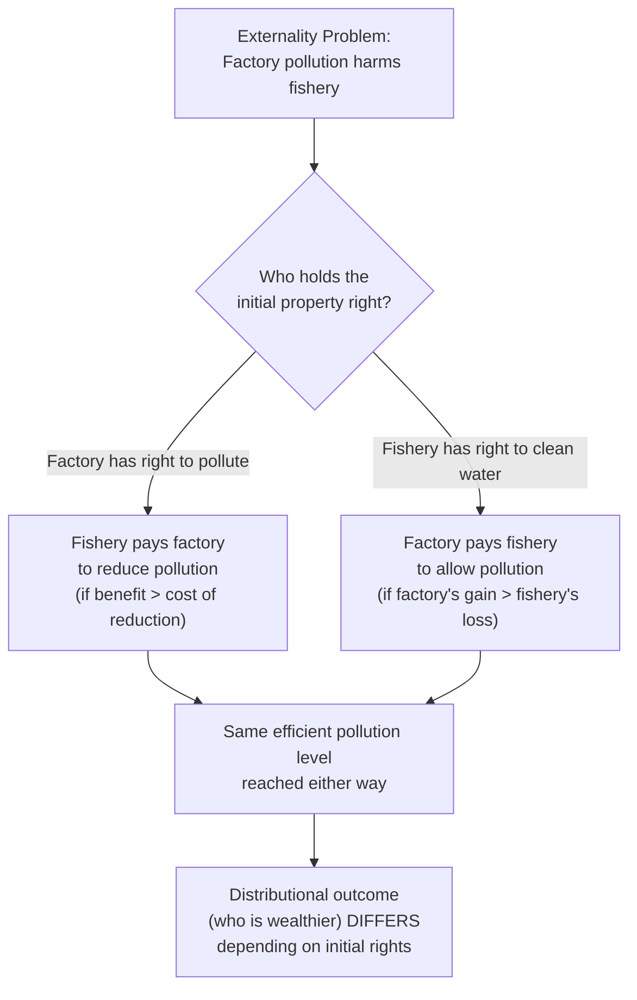
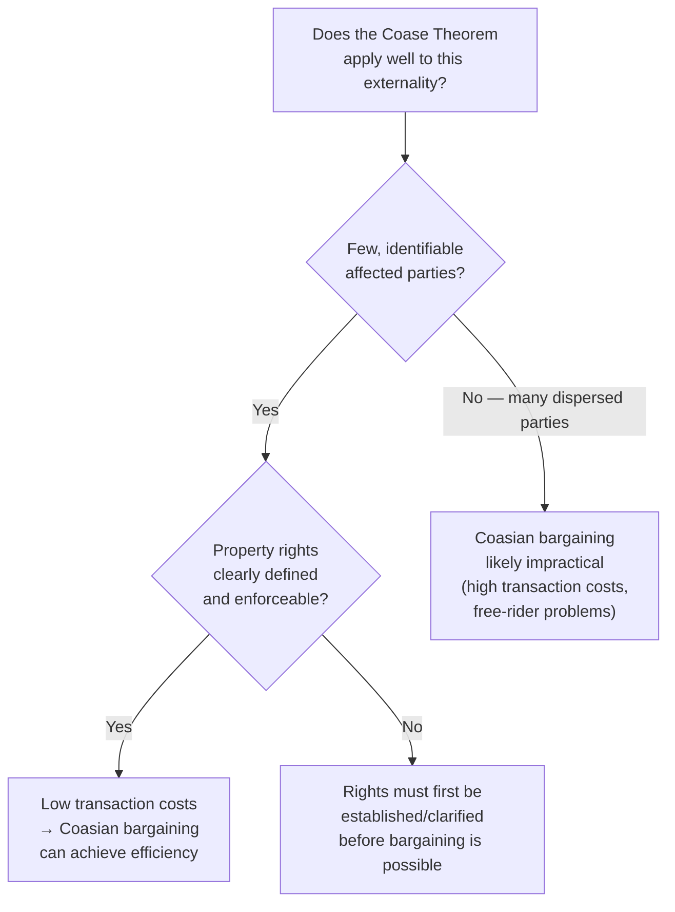

## Coase Theorem and Property Rights Solutions

### Definition and Origin

The Coase Theorem, developed by Ronald Coase in his influential 1960 article "The Problem of Social Cost," proposes that externality problems can, under specific conditions, be resolved efficiently through private bargaining between affected parties, without requiring government intervention such as taxes or regulation. The theorem reframes externality problems as fundamentally a matter of **poorly defined or poorly enforced property rights** and **transaction costs**, rather than an inherent and unavoidable form of market failure.

**Key Points**

- The Coase Theorem states that if **property rights are clearly defined and enforceable**, and **transaction costs of bargaining are sufficiently low**, private parties will negotiate to an economically efficient outcome regardless of which party is initially assigned the property right
- This is a significant departure from the traditional Pigouvian view (see Externalities: Positive and Negative), which frames externalities as requiring corrective government action (taxes, subsidies, or regulation) to align private and social costs
- Coase's core insight was that externality problems are **reciprocal in nature**: a factory's pollution harms a downstream fishery, but preventing the pollution (e.g., by shutting down the factory) harms the factory — the question of who is "at fault" or "causing" the externality is, from a purely economic efficiency standpoint, less relevant than establishing well-defined rights and allowing parties to bargain toward the value-maximizing outcome

### The Core Logic: Bargaining to Efficiency

**Key Points**

- If property rights are well-defined, any inefficient allocation of resources (one where total social value is not maximized) leaves **unexploited gains from trade** available to the parties involved
- Self-interested rational parties have an incentive to identify and capture these gains through mutually beneficial bargaining, moving the allocation toward the efficient outcome — the same logic that drives markets toward efficient outcomes in ordinary trade also applies to bargaining over externality-generating activities, once the relevant right (e.g., the right to pollute, or the right to clean air) is clearly assigned to one party
- The **specific assignment of the initial property right** affects **who pays whom** (the distributional outcome) but, under the theorem's idealized conditions, does not affect the **final efficient quantity** of the externality-generating activity — this is sometimes called the **invariance result**

### Illustrative Example: Factory and Fishery

**Example**

Consider a factory whose production process pollutes a river, harming a downstream fishery. Suppose the factory's profit from producing at its current, unregulated level is $100,000, and reducing pollution to a specific lower level would cost the factory $30,000 in reduced output. Suppose the fishery's losses from the pollution are $50,000 at the current level, but would fall to $10,000 at the reduced pollution level (a benefit to the fishery of $40,000 from the reduction).

- **If the factory holds the right to pollute**: the fishery can offer the factory any payment between $30,000 (the factory's cost of reducing pollution) and $40,000 (the fishery's benefit from the reduction) to voluntarily reduce pollution — both parties gain from any payment in this range, so a mutually beneficial deal is available and rational parties should reach it, achieving the efficient (reduced-pollution) outcome
- **If the fishery holds the right to clean water**: the factory would need to pay the fishery to be allowed to pollute at the higher level; since the value of polluting more to the factory (foregone cost of abatement, $30,000) is less than the fishery's loss from allowing the higher pollution level ($40,000), the factory cannot profitably compensate the fishery to accept the higher-pollution outcome, so the parties instead settle at the same reduced-pollution level
- In both cases, the **efficient level of pollution reduction is reached** — only the direction of the payment (and therefore who ends up better or worse off in absolute terms) differs depending on the initial rights assignment

### Diagram: Coasian Bargaining Outcome (svg_diagram)

<svg xmlns="http://www.w3.org/2000/svg" viewBox="0 0 720 380">
<text x="360" y="26" text-anchor="middle" font-size="16" font-weight="bold" fill="#1a1a1a">Coasian Bargaining: Same Efficiency, Different Distribution (svg_diagram)</text>
<rect x="60" y="70" width="280" height="270" rx="8" fill="#eaf2f8" stroke="#2980b9" stroke-width="2" />
<text x="200" y="100" text-anchor="middle" font-size="13" font-weight="bold" fill="#1a1a1a">Factory Holds Right to Pollute</text>
<text x="200" y="130" text-anchor="middle" font-size="11" fill="#333">Fishery's benefit from</text>
<text x="200" y="147" text-anchor="middle" font-size="11" fill="#333">reduction: \$40,000</text>
<text x="200" y="174" text-anchor="middle" font-size="11" fill="#333">Factory's cost of</text>
<text x="200" y="191" text-anchor="middle" font-size="11" fill="#333">reduction: \$30,000</text>
<line x1="90" y1="210" x2="310" y2="210" stroke="#666" stroke-width="1" />
<text x="200" y="235" text-anchor="middle" font-size="11" font-weight="bold" fill="#2980b9">Fishery pays factory</text>
<text x="200" y="252" text-anchor="middle" font-size="11" fill="#2980b9">(\$30,000 to \$40,000)</text>
<text x="200" y="285" text-anchor="middle" font-size="11" font-weight="bold" fill="#1a1a1a">Result: Reduced pollution</text>
<text x="200" y="302" text-anchor="middle" font-size="11" fill="#1a1a1a">achieved</text>
<text x="200" y="325" text-anchor="middle" font-size="10" fill="#333">Factory ends up net wealthier</text>
<rect x="380" y="70" width="280" height="270" rx="8" fill="#eafaf1" stroke="#27ae60" stroke-width="2" />
<text x="520" y="100" text-anchor="middle" font-size="13" font-weight="bold" fill="#1a1a1a">Fishery Holds Right to Clean Water</text>
<text x="520" y="130" text-anchor="middle" font-size="11" fill="#333">Factory's gain from</text>
<text x="520" y="147" text-anchor="middle" font-size="11" fill="#333">polluting more: \$30,000</text>
<text x="520" y="174" text-anchor="middle" font-size="11" fill="#333">Fishery's loss from</text>
<text x="520" y="191" text-anchor="middle" font-size="11" fill="#333">more pollution: \$40,000</text>
<line x1="410" y1="210" x2="630" y2="210" stroke="#666" stroke-width="1" />
<text x="520" y="235" text-anchor="middle" font-size="11" font-weight="bold" fill="#27ae60">No deal reached</text>
<text x="520" y="252" text-anchor="middle" font-size="11" fill="#27ae60">(factory can't outbid loss)</text>
<text x="520" y="285" text-anchor="middle" font-size="11" font-weight="bold" fill="#1a1a1a">Result: Reduced pollution</text>
<text x="520" y="302" text-anchor="middle" font-size="11" fill="#1a1a1a">achieved (same level)</text>
<text x="520" y="325" text-anchor="middle" font-size="10" fill="#333">Fishery ends up net wealthier</text>
</svg>

### Conditions Required for the Theorem to Hold

**Key Points**

- **Well-defined property rights**: it must be clear, and legally enforceable, who holds the right in question (e.g., the right to emit pollution up to some level, or the right to be free from pollution) — ambiguity about who holds the right undermines the ability of parties to bargain toward it
- **Low (ideally zero) transaction costs**: the process of identifying affected parties, negotiating an agreement, and enforcing that agreement must not itself be so costly that it erodes or eliminates the available gains from trade
- **Rational, self-interested bargaining**: parties must be capable of accurately assessing their own costs and benefits and negotiating in good faith toward a mutually beneficial outcome
- **No significant income effects on valuation**: for the strict invariance result (same efficient quantity regardless of rights assignment) to hold precisely, parties' valuations of the outcome should not be significantly affected by which party ends up wealthier as a result of the initial rights assignment — in practice, if wealth effects are significant, the specific efficient quantity reached could differ somewhat depending on the initial assignment, even though bargaining still moves toward an efficient outcome in each case

### Practical Limitations

While theoretically elegant, the Coase Theorem's applicability to real-world externality problems is constrained by how frequently its idealized conditions fail to hold.

**Key Points**

- **High transaction costs with many affected parties**: externalities affecting large, dispersed populations (e.g., air pollution affecting an entire city or region, or global greenhouse gas emissions affecting the entire world) involve prohibitively high costs of identifying all affected parties, organizing them, and negotiating and enforcing an agreement among potentially millions of individuals
- **Free-rider problems in collective bargaining**: when many parties are affected by an externality, each individual affected party has an incentive to let others bear the cost of organizing and negotiating, while still benefiting from any resulting agreement — this collective action problem can prevent bargaining from occurring at all, even when a mutually beneficial deal theoretically exists
- **Incomplete or asymmetric information**: parties may not have accurate information about their own or others' true costs and benefits, or about the actual magnitude of the externality itself, undermining the ability to negotiate efficiently
- **Ill-defined or unenforceable property rights**: certain resources (e.g., clean air, ocean fisheries, the global atmosphere's capacity to absorb greenhouse gases) have historically lacked clear, enforceable property rights entirely, making it difficult to even establish a starting point for Coasian bargaining
- **Strategic bargaining behavior**: even with few parties, negotiations can fail or be delayed due to strategic posturing, holdout behavior, or disputes over the division of bargaining surplus, particularly under bilateral monopoly-type bargaining situations (see Labor Unions and Collective Bargaining for a parallel bargaining indeterminacy issue)
- [Standard Result] For these reasons, the Coase Theorem's primary use in modern economic analysis is generally as a **theoretical benchmark** illustrating the role transaction costs play in market failure, rather than as a directly implementable policy solution for most large-scale, diffuse externality problems — situations with few, well-organized parties and clear property rights (e.g., a dispute between two specific adjacent property owners) are considerably more amenable to Coasian resolution than diffuse, large-population externalities like climate change or ambient air pollution.

### Property Rights Solutions Beyond Direct Bargaining

**Key Points**

- The broader insight that externality problems often stem from missing or poorly defined property rights has informed policy approaches beyond direct two-party bargaining, including the creation of **tradable permit systems** (cap-and-trade programs), which can be understood as a government-facilitated method of creating a well-defined, tradable property right (the permit) over an activity (e.g., emissions) that previously lacked one, then allowing market-based (Coasian-style) trading among many parties to occur efficiently through an organized exchange rather than requiring costly individual bilateral negotiations
- Similarly, the assignment and enforcement of **water rights**, **fishing quotas** (e.g., individual transferable quotas in fisheries management), and **land use rights** can be understood through a similar lens: creating clear, tradable property rights over a previously open-access or poorly defined resource can facilitate more efficient allocation through subsequent market exchange
- [Inference] Viewed this way, cap-and-trade and similar tradable-rights systems can be seen as a practical policy mechanism for capturing some of the efficiency benefits the Coase Theorem identifies, while addressing the theorem's core practical limitation (the impracticality of direct bilateral bargaining among many dispersed parties) by creating a centralized, low-transaction-cost market mechanism for exchanging the newly defined rights.

### Comparison: Coasian Bargaining vs. Pigouvian Intervention

| Dimension | Coasian Bargaining | Pigouvian Tax/Subsidy |
| --- | --- | --- |
| Information required | Parties' own private cost/benefit information (revealed through negotiation) | Government must estimate the external marginal cost/benefit accurately |
| Government role | Minimal — mainly establishing and enforcing property rights | Active — setting and collecting/distributing the tax or subsidy |
| Best suited to | Few, identifiable parties; low transaction costs | Many dispersed parties; high transaction costs to negotiate directly |
| Efficiency condition | Achieved via voluntary bargaining, given clear rights | Achieved if tax/subsidy correctly set equal to external cost/benefit |
| Key practical risk | Bargaining failure due to transaction costs, free-riding, or strategic behavior | Government sets tax/subsidy at an incorrect level due to estimation error |

**Related Topics**

- Externalities: Positive and Negative
- Public Goods and the Free-Rider Problem
- Common Resource Problems and the Tragedy of the Commons
- Tradable Permits and Cap-and-Trade System Design
- Property Rights and Institutional Economics
- Bargaining Theory and the Nash Bargaining Solution
- Environmental Economics and Climate Policy